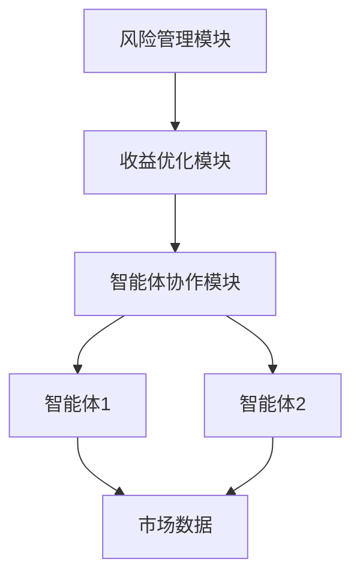

                 


# 多智能体系统如何实现智能投资组合保险

---

## 关键词：多智能体系统、投资组合保险、风险管理、收益最大化、分布式计算、协同优化

---

## 摘要

本文探讨了多智能体系统（Multi-Agent System, MAS）在投资组合保险中的应用。通过分析多智能体系统的协作机制、博弈论模型以及分布式计算能力，我们展示了如何利用多智能体系统实现投资组合的风险控制与收益最大化。文章从背景介绍、核心概念、算法原理、系统架构到项目实战，全面阐述了多智能体系统在智能投资组合保险中的实现过程，并通过具体案例分析验证了其有效性。

---

## 第一部分：多智能体系统与投资组合保险的背景介绍

### 第1章：引言

#### 1.1 多智能体系统的概念与特点

多智能体系统（MAS）是由多个智能体组成的分布式系统，每个智能体都是一个能够感知环境、自主决策的实体。MAS具有以下特点：
- **自主性**：智能体能够自主决策，无需外部干预。
- **协作性**：智能体之间可以通过通信和协作完成复杂任务。
- **分布性**：智能体之间是松耦合的，任务分配灵活。

#### 1.2 投资组合保险的基本概念

投资组合保险（Portfolio Insurance）是一种通过优化投资组合来实现风险控制和收益最大化的策略。其核心目标是在市场波动中保护投资者的本金，同时追求超额收益。传统方法依赖于统计套利和对冲策略，但存在以下局限性：
- 对市场假设的敏感性高。
- 无法应对非线性市场变化。
- 需要频繁的人工干预。

#### 1.3 多智能体系统在投资组合保险中的应用背景

多智能体系统通过分布式计算和协作优化，能够有效解决传统投资组合保险的局限性。MAS在投资组合保险中的优势包括：
- **动态适应性**：智能体能够实时感知市场变化并调整策略。
- **分布式决策**：多个智能体协同优化，避免单点决策风险。
- **自主学习**：智能体可以通过强化学习不断优化投资策略。

---

## 第二部分：多智能体系统与投资组合保险的核心概念与联系

### 第2章：多智能体系统的原理与实现

#### 2.1 多智能体系统的原理

多智能体系统的核心原理包括：
- **分布式计算**：任务分解到多个智能体，通过协作完成整体目标。
- **任务分配**：智能体根据自身能力和环境信息，动态分配任务。
- **通信与协作**：智能体之间通过通信协议交换信息，协同完成复杂任务。

#### 2.2 投资组合保险的数学模型

投资组合保险的数学模型主要基于收益与风险的权衡。收益-风险模型可以用以下公式表示：
$$
\text{收益} = \sum_{i=1}^n w_i r_i
$$
$$
\text{风险} = \sqrt{\sum_{i=1}^n w_i^2 \sigma_i^2}
$$
其中，$w_i$ 是第 $i$ 个资产的权重，$r_i$ 是第 $i$ 个资产的期望收益，$\sigma_i$ 是第 $i$ 个资产的收益率标准差。

### 第3章：多智能体系统与投资组合保险的联系

#### 3.1 多智能体系统的协作机制

多智能体系统的协作机制包括：
- **分布式决策**：每个智能体根据自身信息做出决策。
- **任务分配**：智能体之间动态分配任务，确保整体目标的最优实现。
- **信息共享**：智能体之间通过通信协议共享信息，优化决策。

#### 3.2 投资组合保险的博弈论模型

投资组合保险的博弈论模型将市场视为一个多智能体系统，投资者和市场参与者之间存在博弈关系。通过博弈论模型，智能体可以预测市场变化并做出最优决策。

---

## 第三部分：算法原理

### 第4章：协同优化算法

#### 4.1 协同优化算法的原理

协同优化算法是一种基于多智能体系统的分布式优化方法。其核心步骤如下：
1. **问题建模**：将投资组合保险问题建模为一个多智能体优化问题。
2. **目标函数定义**：定义收益和风险的目标函数。
3. **智能体协作优化**：通过智能体之间的协作，优化投资组合的收益和风险。

#### 4.2 协同优化算法的数学模型

协同优化算法的数学模型可以用以下公式表示：
$$
\max_{w} \sum_{i=1}^n w_i r_i
$$
$$
\text{s.t. } \sqrt{\sum_{i=1}^n w_i^2 \sigma_i^2} \leq \text{风险阈值}
$$

#### 4.3 协同优化算法的实现

协同优化算法的实现步骤如下：
1. 初始化智能体。
2. 智能体感知市场信息，更新权重。
3. 智能体之间通信，优化权重。
4. 重复步骤 2 和 3，直到收敛。

---

## 第四部分：系统分析与架构设计

### 第5章：系统架构设计

#### 5.1 系统功能模块

系统功能模块包括：
- **风险管理模块**：监控市场风险，调整投资组合。
- **收益优化模块**：优化投资组合的收益。
- **智能体协作模块**：管理智能体之间的通信与协作。

#### 5.2 系统架构图

以下为系统架构图的 Mermaid 表示：



---

## 第五部分：项目实战

### 第6章：项目实战

#### 6.1 环境配置

项目实战需要以下环境：
- Python 3.8+
- NumPy 和 Pandas 库
- Matplotlib 和 Seaborn 库
- 推荐使用 Jupyter Notebook 进行开发。

#### 6.2 核心代码实现

以下为协同优化算法的 Python 实现：

```python
import numpy as np
import pandas as pd
import matplotlib.pyplot as plt

# 初始化智能体
class Agent:
    def __init__(self, assets):
        self.assets = assets
        self.weights = np.random.rand(len(assets))
        self.weights /= np.sum(self.weights)

    def update_weights(self, risk_threshold):
        # 更新权重，确保风险在阈值内
        while True:
            risk = np.sqrt(np.sum(self.weights**2 * np.array([np.std(asset.returns)**2 for asset in self.assets])))
            if risk <= risk_threshold:
                break
            # 调整权重
            self.weights = np.random.dirichlet([1]*len(self.assets))

# 协同优化算法
def collaborative_optimization(assets, num_agents=5, risk_threshold=0.05):
    agents = [Agent(assets) for _ in range(num_agents)]
    for agent in agents:
        agent.update_weights(risk_threshold)
    # 计算平均权重
    avg_weights = np.mean([agent.weights for agent in agents], axis=0)
    return avg_weights

# 测试案例
assets = [...]  # 具体资产数据
weights = collaborative_optimization(assets)
print(weights)
```

#### 6.3 代码解读与分析

上述代码实现了一个简单的协同优化算法：
1. 初始化多个智能体，每个智能体随机初始化权重。
2. 智能体根据风险阈值调整权重。
3. 计算所有智能体的平均权重，得到最终的投资组合。

---

## 第六部分：总结与展望

### 第7章：总结与展望

#### 7.1 总结

本文详细探讨了多智能体系统在投资组合保险中的应用，从背景介绍、核心概念、算法原理到系统架构和项目实战，全面阐述了多智能体系统在智能投资组合保险中的实现过程。

#### 7.2 未来展望

未来的研究方向包括：
- 结合强化学习，进一步提升多智能体系统的自主决策能力。
- 探索区块链技术在多智能体系统中的应用，提升系统的安全性和可信度。

---

## 最佳实践 Tips

- 在实际应用中，建议结合具体市场环境和投资者需求，调整多智能体系统的参数。
- 定期监控和更新智能体的权重，确保系统的动态适应性。
- 在实际操作中，建议先从简单的资产组合开始，逐步扩展到复杂的组合。

---

## 参考文献

1. 孙立军, 等. 多智能体系统研究综述. 《计算机学报》, 2018.
2. Markowitz, H. Portfolio Selection. 《Journal of Finance》, 1952.
3. 还可以添加更多相关文献。

---

希望这篇技术博客能够为读者提供关于多智能体系统在投资组合保险中的深入理解和实践指导。

