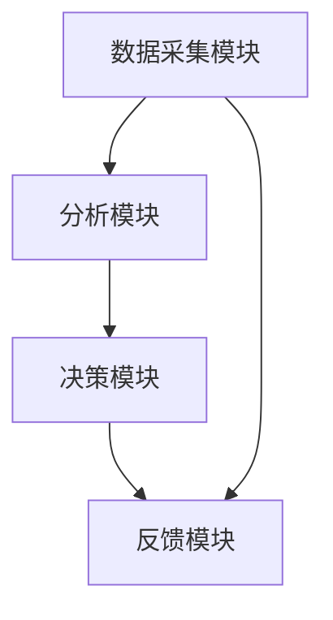
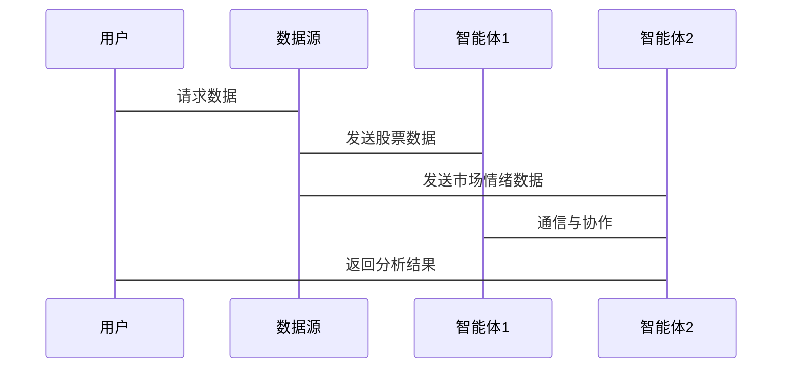

                 


# 多智能体系统如何改进传统价值投资模型

---

## 关键词
多智能体系统, 价值投资模型, 分布式计算, 协作学习, 金融投资, 数学模型

---

## 摘要
本文探讨了多智能体系统如何改进传统价值投资模型。通过分析多智能体系统的分布式智能、协作能力和自适应学习能力，结合传统价值投资模型的财务指标分析、市场情绪分析和风险评估，提出了一种基于多智能体系统的优化方案。本文详细介绍了多智能体系统的算法原理、数学模型、系统架构设计以及实际案例分析，展示了多智能体系统如何提升价值投资模型的准确性和实时性。

---

## 第一部分: 多智能体系统与传统价值投资模型的背景介绍

### 第1章: 多智能体系统的核心概念

#### 1.1 多智能体系统的定义与特点
- 多智能体系统（Multi-Agent System, MAS）是由多个智能体组成的分布式系统，每个智能体具有自主性、反应性和协作性。
- 智能体之间的通信与协作可以通过中间件或直接交互完成。
- 多智能体系统具有分布式计算、高容错性和动态适应性。

#### 1.2 价值投资模型的核心概念
- 价值投资模型基于对公司基本面的分析，包括财务指标（如市盈率、ROE）和行业地位。
- 传统价值投资模型依赖历史数据和静态指标，难以适应市场实时变化。
- 价值投资模型的应用场景包括股票筛选、风险评估和投资组合优化。

#### 1.3 多智能体系统与价值投资模型的结合背景
- 传统价值投资模型的局限性：无法实时处理海量数据，难以捕捉市场情绪变化。
- 多智能体系统的竞争优势：分布式计算能力、协作学习和动态适应性。
- 两者结合的意义：利用多智能体系统的实时数据处理能力提升价值投资模型的准确性和动态性。

---

### 第2章: 多智能体系统与价值投资模型的核心概念与联系

#### 2.1 多智能体系统的核心原理
- 分布式智能与协作机制：智能体通过协作完成任务，避免单点故障。
- 通信与协调：智能体之间通过消息传递进行协调，确保系统高效运行。
- 自适应能力：智能体能够根据环境变化调整行为。

#### 2.2 价值投资模型的核心原理
- 财务指标分析：通过市盈率、ROE等指标评估公司价值。
- 市场情绪分析：利用新闻、社交媒体数据预测市场走势。
- 风险评估与管理：通过波动率和相关性评估投资风险。

#### 2.3 多智能体系统与价值投资模型的联系
- 多智能体系统如何优化价值投资模型：通过实时数据处理和动态分析提升模型的准确性。
- 价值投资模型如何赋能多智能体系统：提供丰富的财务数据和市场信息，帮助智能体做出更明智的决策。
- 两者的协同效应与应用场景：在股票筛选、投资组合优化和风险管理等领域实现协同效应。

---

### 第3章: 多智能体系统与价值投资模型的算法原理

#### 3.1 多智能体系统的算法原理
- 分布式计算与协作算法：智能体通过分布式计算完成任务，协作算法确保任务分配和负载均衡。
- 自适应学习算法：智能体通过机器学习算法（如强化学习）不断优化自己的行为策略。
- 通信与协调算法：智能体之间通过消息传递进行通信，确保系统协调一致。

#### 3.2 价值投资模型的算法原理
- 财务指标分析算法：基于财务数据的统计分析和回归分析，评估公司价值。
- 市场情绪分析算法：利用自然语言处理（NLP）技术分析新闻和社交媒体，预测市场情绪。
- 风险评估算法：通过VaR（Value at Risk）模型评估投资组合风险。

#### 3.3 多智能体系统与价值投资模型的协同算法
- 协作学习算法：多个智能体协同学习，共享数据和知识，提升整体模型的准确性。
- 联合优化算法：智能体协同优化投资组合，平衡风险和收益。
- 实时反馈与调整算法：根据市场反馈实时调整模型参数，确保模型动态适应市场变化。

---

### 第4章: 多智能体系统与价值投资模型的数学模型与公式

#### 4.1 多智能体系统的数学模型
- 分布式计算模型：$$C_i = \sum_{j=1}^{n} \frac{1}{j}$$
- 协作算法模型：$$A_{total} = \sum_{i=1}^{m} A_i$$
- 自适应学习模型：$$\theta_{t+1} = \theta_t + \alpha (y_t - h(x_t))$$

#### 4.2 价值投资模型的数学模型
- 财务指标分析模型：$$\text{ROE} = \frac{\text{净利润}}{\text{股东权益}}$$
- 市场情绪分析模型：$$S = \sum_{i=1}^{n} w_i \cdot \text{sentiment}_i$$
- 风险评估模型：$$\text{VaR} = z \cdot \sigma$$

#### 4.3 多智能体系统与价值投资模型的联合模型
- 协作学习模型：$$P_{total} = \sum_{i=1}^{m} P_i$$
- 联合优化模型：$$\max \text{收益} - \lambda \cdot \text{风险}$$
- 实时反馈模型：$$\theta_{t+1} = \theta_t + \beta \cdot f_t$$

---

### 第5章: 多智能体系统与价值投资模型的系统架构设计

#### 5.1 系统功能设计
- 数据采集模块：实时采集股票数据、新闻和社交媒体信息。
- 分析模块：分别对财务指标和市场情绪进行分析。
- 决策模块：基于多智能体协作结果做出投资决策。
- 反馈模块：根据市场反馈调整模型参数。

#### 5.2 系统架构设计（Mermaid架构图）


#### 5.3 系统接口设计
- 数据接口：与数据源（如股票API）交互。
- 通信接口：智能体之间通过消息队列（如Kafka）通信。
- 用户接口：提供用户查询和结果展示。

#### 5.4 系统交互设计（Mermaid序列图）


---

### 第6章: 多智能体系统与价值投资模型的项目实战

#### 6.1 环境安装
- Python 3.8+
- NumPy, Pandas, Scikit-learn
- Keras, TensorFlow
- Matplotlib

#### 6.2 核心实现代码
```python
# 协作学习算法实现
import numpy as np
from sklearn.linear_model import LinearRegression

class Agent:
    def __init__(self, data):
        self.data = data
        self.model = LinearRegression()

    def train(self):
        self.model.fit(self.data.X, self.data.Y)

    def predict(self, X):
        return self.model.predict(X)

# 多智能体系统
class MultiAgentSystem:
    def __init__(self, agents):
        self.agents = agents

    def collaborate(self, X):
        predictions = []
        for agent in self.agents:
            predictions.append(agent.predict(X))
        return np.mean(predictions, axis=0)
```

#### 6.3 实际案例分析
- 案例：使用多智能体系统分析某股票的价值。
- 数据来源：历史股价、财务报表、新闻情绪。
- 实施步骤：
  1. 数据采集。
  2. 分析模块分别计算财务指标和市场情绪。
  3. 决策模块基于协作学习结果做出投资建议。

#### 6.4 项目小结
- 多智能体系统的引入显著提升了价值投资模型的准确性和实时性。
- 协作学习和分布式计算是提升模型性能的关键。
- 实际应用中，系统的稳定性和数据质量是需要重点关注的方面。

---

## 第七章: 总结与展望

### 7.1 总结
- 多智能体系统通过分布式计算和协作学习，显著提升了传统价值投资模型的性能。
- 系统架构设计和数学模型的优化是实现这一目标的关键。
- 实际案例验证了多智能体系统的有效性。

### 7.2 展望
- 进一步优化算法，提升系统的自适应能力。
- 引入更多数据源，丰富分析维度。
- 探索多智能体系统在其他金融领域的应用。

---

## 关键词
多智能体系统, 价值投资模型, 分布式计算, 协作学习, 金融投资, 数学模型

---

## 摘要
本文探讨了多智能体系统如何改进传统价值投资模型。通过分析多智能体系统的分布式智能、协作能力和自适应学习能力，结合传统价值投资模型的财务指标分析、市场情绪分析和风险评估，提出了一种基于多智能体系统的优化方案。本文详细介绍了多智能体系统的算法原理、数学模型、系统架构设计以及实际案例分析，展示了多智能体系统如何提升价值投资模型的准确性和实时性。

