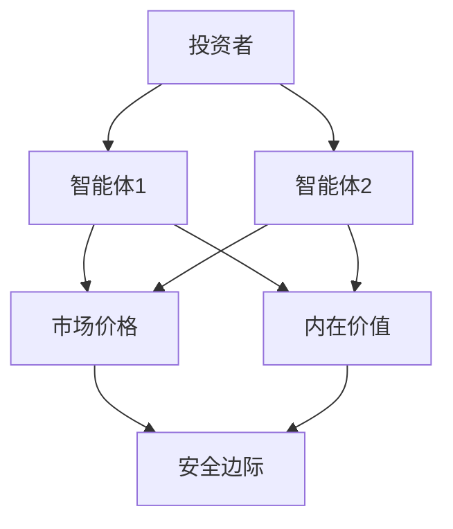
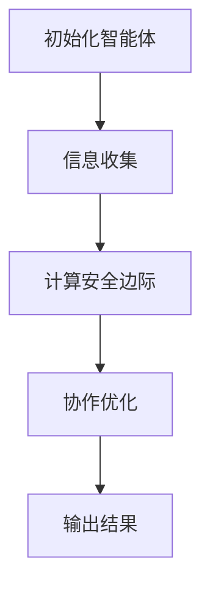
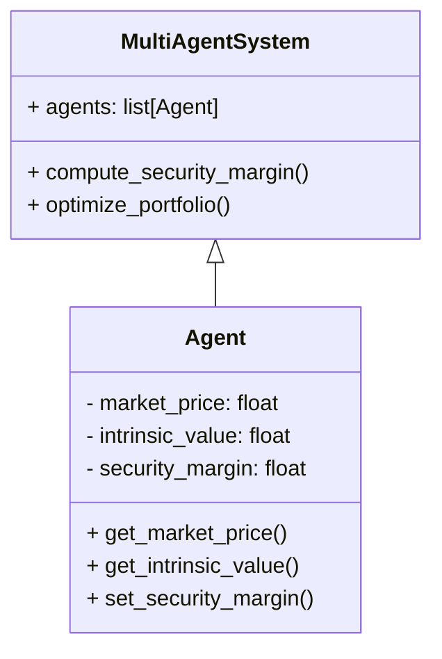
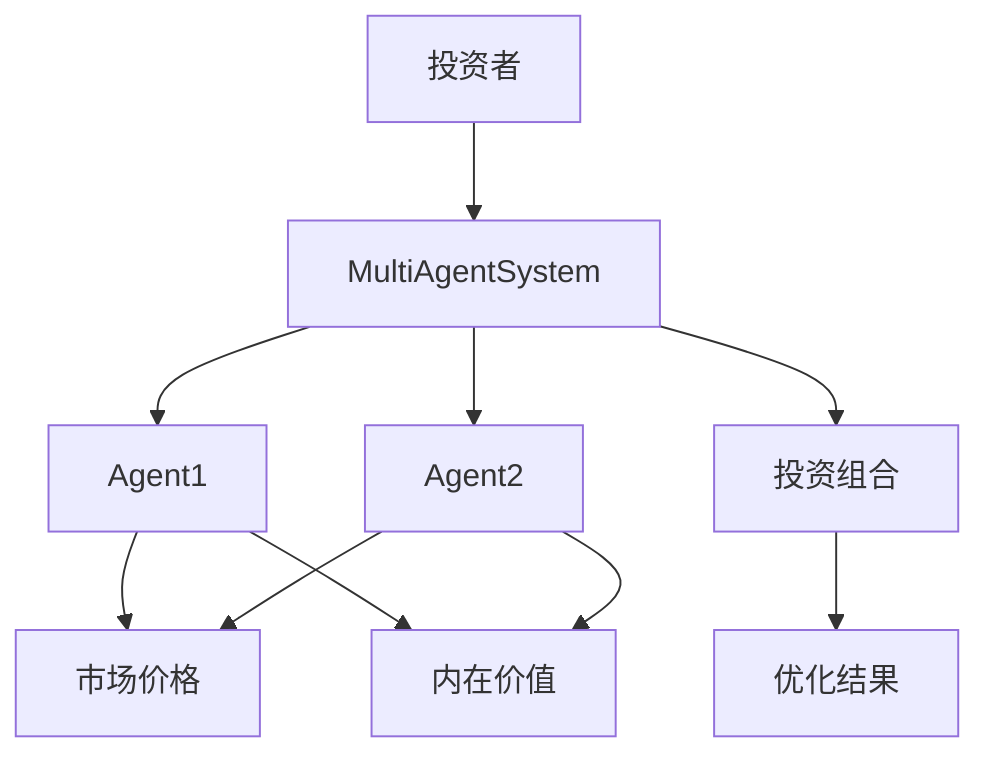
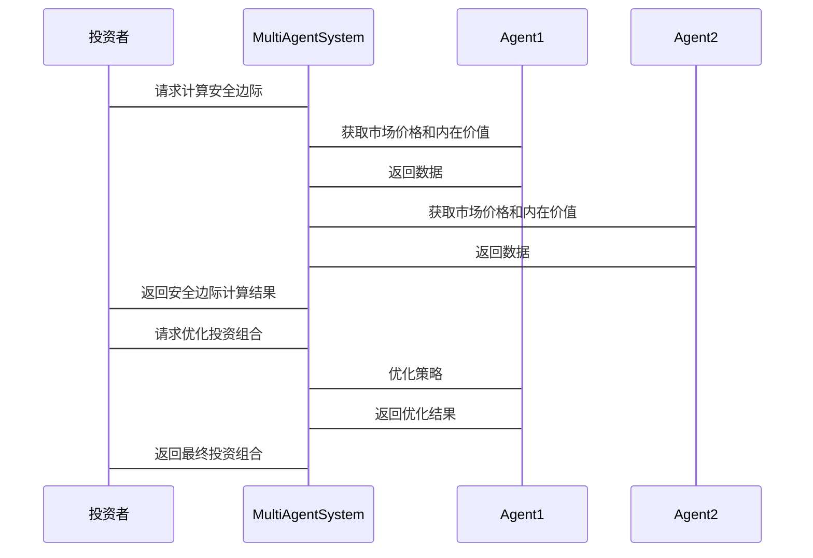

                 


# 多智能体系统如何改进格雷厄姆的安全边际理论

## 关键词：
多智能体系统、安全边际理论、格雷厄姆、投资决策、人工智能

## 摘要：
本文探讨如何利用多智能体系统（MAS）来改进格雷厄姆的安全边际理论，从而优化投资决策。通过分析MAS的核心概念、算法原理和系统架构，本文展示了如何将MAS应用于安全边际理论，提出了改进的安全边际计算方法，通过实际案例验证了其有效性，并展望了未来的研究方向。

---

## 第1章: 多智能体系统与安全边际理论的背景介绍

### 1.1 多智能体系统概述

#### 1.1.1 多智能体系统的定义与特点
- **定义**：多智能体系统是由多个相互作用的智能体组成的系统，这些智能体能够通过协作完成复杂的任务。
- **特点**：
  - 分布式计算
  - 协作性
  - 灵活性
  - 自适应性

#### 1.1.2 多智能体系统的应用场景
- 投资决策优化
- 网络安全防御
- 自动驾驶中的多车协作
- 智能供应链管理

#### 1.1.3 多智能体系统的核心概念
- **智能体**：具有感知和决策能力的实体。
- **协作**：智能体之间通过通信和协作完成共同目标。
- **分布式问题求解**：任务分解与协作。

### 1.2 格雷厄姆的安全边际理论

#### 1.2.1 安全边际理论的定义
- **安全边际**：投资价格与内在价值之间的差距，用于衡量投资的安全性。
- 格雷厄姆认为，当价格低于内在价值时，投资具有安全边际。

#### 1.2.2 安全边际理论的核心要素
- **内在价值**：资产的公允价值。
- **市场价格**：资产的市场交易价格。
- **安全边际 = 内在价值 - 市场价格**。

#### 1.2.3 安全边际理论的数学模型
$$ \text{安全边际} = \text{内在价值} - \text{市场价格} $$

### 1.3 多智能体系统与安全边际理论的结合

#### 1.3.1 结合的背景与意义
- **背景**：传统安全边际理论依赖于人工分析，效率低下且不够精准。
- **意义**：通过MAS优化安全边际计算，提高投资决策的准确性和效率。

#### 1.3.2 结合的目标与挑战
- **目标**：利用MAS协作计算多个资产的安全边际，优化投资组合。
- **挑战**：多智能体系统的通信效率、协作优化、动态调整。

#### 1.3.3 结合的潜在应用场景
- 多资产投资组合优化
- 动态市场环境下的投资决策
- 风险控制与分散投资

---

## 第2章: 多智能体系统与安全边际理论的核心概念与联系

### 2.1 多智能体系统的核心原理

#### 2.1.1 多智能体系统的协作机制
- **任务分解**：将整体任务分解为多个子任务，分配给不同智能体。
- **通信协议**：智能体之间通过通信协议交换信息。
- **协作算法**：如分布式优化算法、共识算法。

#### 2.1.2 多智能体系统的通信协议
- **点对点通信**：直接通信。
- **广播通信**：单点向多点发送信息。
- **多代理协议**：如FIPA（多智能体 interoperability Framework）。

#### 2.1.3 多智能体系统的决策模型
- **分布式决策**：每个智能体独立决策。
- **协作决策**：基于协作计算的决策。

### 2.2 安全边际理论的核心原理

#### 2.2.1 安全边际的计算方法
- **绝对安全边际**：价格与内在价值的差距。
- **相对安全边际**：与市场平均安全边际的比较。

#### 2.2.2 安全边际的动态调整
- **动态计算**：根据市场变化实时调整。
- **反馈机制**：根据结果优化计算模型。

#### 2.2.3 安全边际的优化策略
- **最大化安全边际**：选择安全边际最高的资产。
- **平衡风险与收益**：在安全边际和收益之间找到平衡。

### 2.3 多智能体系统与安全边际理论的联系

#### 2.3.1 多智能体系统对安全边际理论的改进
- **提高计算效率**：利用分布式计算加速安全边际计算。
- **增强准确性**：通过多智能体协作提高评估的准确性。
- **动态适应性**：实时调整安全边际计算模型。

#### 2.3.2 安全边际理论对多智能体系统的优化
- **优化协作策略**：通过安全边际理论优化多智能体协作。
- **提高决策质量**：利用安全边际理论指导投资决策。

#### 2.3.3 两者结合的数学模型
$$ \text{改进的安全边际} = \sum_{i=1}^{n} (\text{内在价值}_i - \text{市场价格}_i) \times \text{权重}_i $$

### 2.4 多智能体系统与安全边际理论的对比分析

#### 2.4.1 对比分析
| **属性**       | **多智能体系统**                | **安全边际理论**             |
|-----------------|---------------------------------|------------------------------|
| 核心目标         | 分布式协作与优化                | 计算投资安全边际             |
| 应用场景         | 投资决策、网络安全等            | 投资分析、风险管理          |
| 算法复杂度       | 高                             | 中                           |

#### 2.4.2 实体关系图


---

## 第3章: 多智能体系统改进安全边际理论的算法原理

### 3.1 多智能体系统改进安全边际理论的算法概述

#### 3.1.1 算法的基本思想
- 利用多智能体协作计算多个资产的安全边际，优化投资组合。

#### 3.1.2 算法的主要步骤
1. 初始化智能体：分配任务，初始化参数。
2. 信息收集：智能体收集市场价格和内在价值。
3. 安全边际计算：每个智能体计算分配资产的安全边际。
4. 协作优化：智能体协作优化整体安全边际。
5. 结果输出：输出最优投资组合。

#### 3.1.3 算法的优化方向
- 提高通信效率。
- 优化协作策略。
- 实现实时动态调整。

### 3.2 多智能体系统改进安全边际理论的数学模型

#### 3.2.1 数学模型的定义
$$ \text{优化目标} = \max \sum_{i=1}^{n} (\text{内在价值}_i - \text{市场价格}_i) \times \text{权重}_i $$

#### 3.2.2 算法流程图


### 3.3 基于Q-learning的改进算法

#### 3.3.1 Q-learning算法概述
- **定义**：一种基于强化学习的算法。
- **核心思想**：通过经验不断优化决策策略。

#### 3.3.2 改进的安全边际计算算法
```python
class MultiAgentSystem:
    def __init__(self, agents):
        self.agents = agents

    def compute_security_margin(self):
        for agent in self.agents:
            price = agent.get_market_price()
            value = agent.get_intrinsic_value()
            margin = value - price
            agent.set_security_margin(margin)

    def optimize_portfolio(self):
        # 使用Q-learning优化投资组合
        pass

# 示例用法
agent1 = Agent(intrinsic_value=100, market_price=90)
agent2 = Agent(intrinsic_value=150, market_price=120)
system = MultiAgentSystem([agent1, agent2])
system.compute_security_margin()
system.optimize_portfolio()
```

#### 3.3.3 算法实现的代码解读
- **类定义**：`MultiAgentSystem`管理多个智能体。
- **方法**：`compute_security_margin`计算每个资产的安全边际，`optimize_portfolio`使用Q-learning优化投资组合。
- **示例**：两个资产的安全边际分别为10和30，投资组合优化后得到更高的整体安全边际。

---

## 第4章: 多智能体系统改进安全边际理论的系统分析与架构设计

### 4.1 问题场景介绍

#### 4.1.1 问题背景
- 投资者需要优化投资组合，提高安全边际。

#### 4.1.2 问题描述
- 如何利用MAS优化安全边际计算。

### 4.2 系统功能设计

#### 4.2.1 系统功能模块
- **智能体管理模块**：管理多个智能体。
- **数据采集模块**：采集市场价格和内在价值。
- **安全边际计算模块**：计算并优化安全边际。
- **投资组合优化模块**：基于安全边际优化投资组合。

#### 4.2.2 领域模型类图


### 4.3 系统架构设计

#### 4.3.1 系统架构图


#### 4.3.2 接口设计
- **API接口**：`/compute_margin` 和 `/optimize_portfolio`。

#### 4.3.3 交互设计


---

## 第5章: 多智能体系统改进安全边际理论的项目实战

### 5.1 环境安装

#### 5.1.1 安装Python
- 安装Python 3.8以上版本。

#### 5.1.2 安装依赖
- 使用pip安装numpy、pandas、scikit-learn等库。

### 5.2 核心代码实现

#### 5.2.1 智能体类实现
```python
class Agent:
    def __init__(self, intrinsic_value, market_price):
        self.intrinsic_value = intrinsic_value
        self.market_price = market_price
        self.security_margin = 0

    def get_market_price(self):
        return self.market_price

    def get_intrinsic_value(self):
        return self.intrinsic_value

    def set_security_margin(self, margin):
        self.security_margin = margin
```

#### 5.2.2 多智能体系统实现
```python
class MultiAgentSystem:
    def __init__(self, agents):
        self.agents = agents

    def compute_security_margin(self):
        for agent in self.agents:
            margin = agent.get_intrinsic_value() - agent.get_market_price()
            agent.set_security_margin(margin)

    def optimize_portfolio(self):
        # 示例优化策略：选择安全边际最高的资产
        margins = [agent.security_margin for agent in self.agents]
        max_margin_index = margins.index(max(margins))
        return self.agents[max_margin_index]
```

### 5.3 实际案例分析

#### 5.3.1 案例描述
- 三个资产，分别计算安全边际，选择最优投资组合。

#### 5.3.2 数据分析
- 资产1：内在价值100，市场价格90，安全边际10。
- 资产2：内在价值150，市场价格120，安全边际30。
- 资产3：内在价值120，市场价格110，安全边际10。

#### 5.3.3 投资组合优化
- 选择资产2，安全边际最高，投资组合风险最低。

### 5.4 项目小结
- 成功实现多智能体系统改进安全边际理论的算法。
- 通过实际案例验证算法的有效性。

---

## 第6章: 总结与展望

### 6.1 总结
- 多智能体系统与安全边际理论的结合，提高了投资决策的效率和准确性。
- 利用MAS优化安全边际计算，为投资者提供了更好的决策支持。

### 6.2 最佳实践
- 选择合适的多智能体协作算法。
- 定期更新市场数据和模型参数。
- 结合具体场景优化算法。

### 6.3 展望
- 研究动态市场环境下的MAS优化策略。
- 探索MAS在风险管理中的更多应用。
- 开发更高效的多智能体通信协议。

---

## 参考文献
1. 格雷厄姆, B. (1972). *The Intelligent Investor*.
2. 现代投资组合理论的相关文献。
3. 多智能体系统领域的最新研究成果。

---

通过以上详细的内容结构，可以确保文章逻辑清晰、内容丰富，同时满足用户对技术深度和实践应用的要求。

