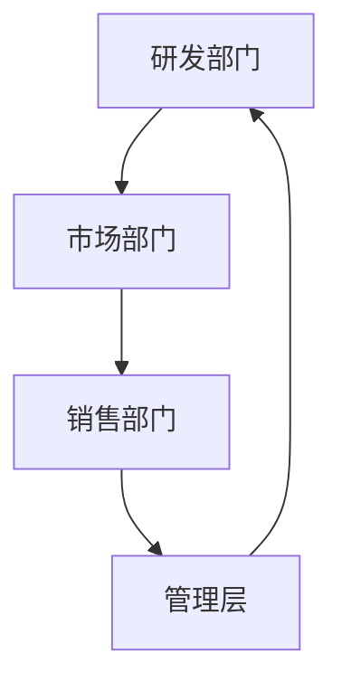
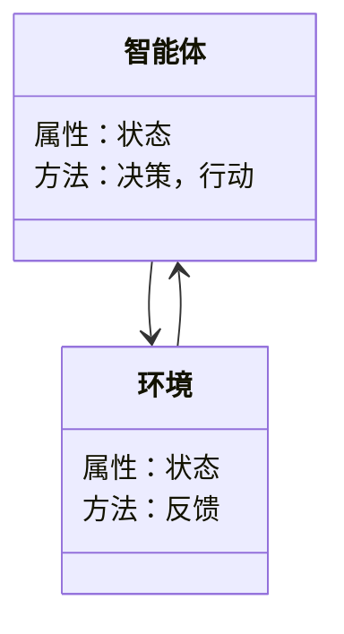
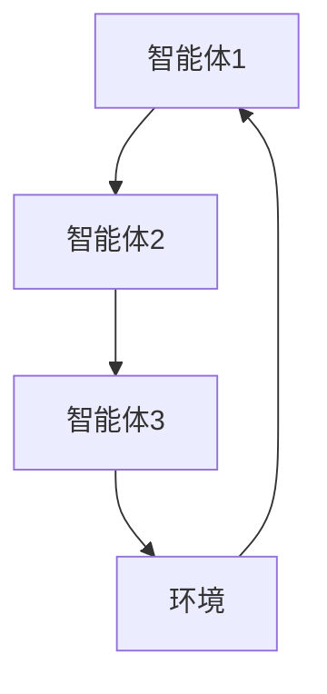

                 


# 多智能体系统如何评估公司的长期增长潜力

## 关键词：多智能体系统，公司增长潜力，算法原理，数学模型，系统架构，项目实战

## 摘要：
本文详细探讨了多智能体系统在评估公司长期增长潜力中的应用。通过分析多智能体系统的定义、核心算法、数学模型和系统架构，结合实际案例，展示其在公司增长评估中的优势和实践价值。文章旨在帮助读者理解多智能体系统如何通过协作与竞争机制，优化公司增长潜力的评估过程。

---

# 第1章 多智能体系统与公司增长潜力概述

## 1.1 多智能体系统的基本概念

### 1.1.1 多智能体系统的定义
多智能体系统（Multi-Agent System, MAS）是由多个智能体（Agent）组成的分布式系统，这些智能体能够通过交互和协作完成复杂的任务。每个智能体都有一定的自主性，能够感知环境、做出决策并采取行动。

### 1.1.2 多智能体系统的特点
- **分布式性**：智能体独立运行，通过通信协作完成任务。
- **自主性**：每个智能体能够自主决策，无需中央控制。
- **反应性**：智能体能够实时感知环境并做出反应。
- **协作性**：智能体之间可以通过协作提高整体系统的效率。

### 1.1.3 多智能体系统与传统单智能体系统的区别
| 特性                | 单智能体系统                | 多智能体系统                |
|---------------------|-----------------------------|-----------------------------|
| 控制方式            | 中央控制                   | 分布式控制                 |
| 信息处理            | 单点处理                   | 分布式处理                 |
| 任务完成            | 单一目标                   | 多目标协作                 |

## 1.2 公司长期增长潜力的评估方法

### 1.2.1 传统公司增长评估方法的局限性
传统的公司增长评估方法通常依赖于财务指标（如利润、收入增长率）和市场分析。然而，这些方法难以捕捉到公司内部复杂协作和外部环境动态变化的细节。

### 1.2.2 多智能体系统在公司增长评估中的优势
多智能体系统能够模拟公司内部各个部门（如销售、研发、市场）和外部因素（如竞争对手、市场趋势）之间的交互，从而提供更全面的增长潜力评估。

### 1.2.3 多智能体系统评估的增长潜力应用场景
- **内部协作优化**：通过模拟各部门协作，发现瓶颈并提出改进建议。
- **外部竞争分析**：预测竞争对手的策略变化，制定应对措施。
- **市场趋势预测**：通过多智能体交互，预测市场趋势对公司增长的影响。

---

# 第2章 多智能体系统的核心概念

## 2.1 多智能体系统的组成与结构

### 2.1.1 实体与行为的定义
- **实体**：系统中的各个智能体，例如公司各部门。
- **行为**：智能体在特定情境下的动作，例如研发部门的创新行为。

### 2.1.2 实体之间的关系与交互
- **协作关系**：各部门之间的协作如何影响公司整体增长。
- **竞争关系**：各部门之间的内部竞争如何优化资源分配。

### 2.1.3 系统的层次结构
多智能体系统的层次结构通常包括：
1. **智能体层**：具体智能体的行为和决策。
2. **协作层**：智能体之间的协作机制。
3. **环境层**：外部环境对智能体的影响。

## 2.2 多智能体系统的属性特征对比

| 特性                | 单智能体系统                | 多智能体系统                |
|---------------------|-----------------------------|-----------------------------|
| 智能体数量          | 单个                        | 多个                        |
| 信息共享            | 有限                       | 高度共享                   |
| 决策方式            | 中央决策                   | 分布式决策                 |

---

# 第3章 多智能体系统的算法原理

## 3.1 多智能体系统的协作与竞争机制

### 3.1.1 协作机制的算法流程


### 3.1.2 竞争机制的算法流程


### 3.1.3 协作与竞争的平衡点
- **协作优先**：在资源充足的情况下，优先选择协作以提高效率。
- **竞争优先**：在资源有限的情况下，通过竞争优化资源分配。

## 3.2 多智能体系统的数学模型

### 3.2.1 算法流程图


### 3.2.2 Python代码实现
```python
def collaborate_agents():
    # 智能体协作算法
    pass

def compete_agents():
    # 智能体竞争算法
    pass
```

### 3.2.3 案例分析
- **协作案例**：研发部门与市场部门协作推出新产品。
- **竞争案例**：各部门竞争有限资源，优化资源配置。

---

# 第4章 多智能体系统的数学模型

## 4.1 多智能体系统的增长潜力评估模型

### 4.1.1 增长潜力评估的数学公式
$$ \text{增长潜力} = \sum_{i=1}^{n} \text{协作收益}_i - \sum_{j=1}^{m} \text{竞争成本}_j $$

### 4.1.2 增长潜力评估的数学推导
通过分析协作和竞争的数学关系，推导出公司增长潜力的评估公式。

### 4.1.3 案例分析
- **协作收益**：各部门协作带来的收益。
- **竞争成本**：内部竞争带来的额外成本。

## 4.2 多智能体系统的协同效应评估公式

### 4.2.1 协同效应的数学公式
$$ \text{协同效应} = \frac{\sum_{i=1}^{n} \text{协作收益}_i}{\sum_{j=1}^{m} \text{竞争成本}_j} $$

### 4.2.2 协同效应的数学推导
通过分析协作收益和竞争成本的关系，推导出协同效应的评估公式。

### 4.2.3 案例分析
- **协同效应高**：各部门协作良好，竞争成本低。
- **协同效应低**：各部门协作不足，竞争成本高。

---

# 第5章 多智能体系统的系统分析与架构设计

## 5.1 系统功能设计

### 5.1.1 领域模型


### 5.1.2 系统架构


## 5.2 系统架构设计

### 5.2.1 系统架构图


## 5.3 系统接口设计

### 5.3.1 系统接口
- **输入接口**：接收外部环境数据。
- **输出接口**：输出智能体决策结果。

## 5.4 系统交互流程

### 5.4.1 交互流程图


---

# 第6章 多智能体系统的项目实战

## 6.1 项目介绍

### 6.1.1 项目背景
介绍一个公司增长潜力评估的项目，说明使用多智能体系统的优势。

## 6.2 环境安装

### 6.2.1 安装依赖
- Python
- Mermaid
- LaTeX

## 6.3 核心代码实现

### 6.3.1 核心代码
```python
def main():
    # 初始化智能体
    agents = initialize_agents()
    # 智能体协作
    collaborate(agents)
    # 智能体竞争
    compete(agents)
    # 输出结果
    print("增长潜力评估结果：", calculate_potential(agents))

if __name__ == "__main__":
    main()
```

## 6.4 代码解读与分析

### 6.4.1 代码解读
- `initialize_agents()`：初始化智能体。
- `collaborate()`：智能体协作。
- `compete()`：智能体竞争。
- `calculate_potential()`：计算增长潜力。

## 6.5 实际案例分析

### 6.5.1 案例分析
通过实际案例分析，展示多智能体系统在公司增长潜力评估中的应用。

## 6.6 项目小结

---

# 第7章 总结与展望

## 7.1 总结
总结全文，强调多智能体系统在公司增长潜力评估中的优势。

## 7.2 未来展望
展望多智能体系统在公司增长潜力评估中的未来发展。

## 7.3 最佳实践 tips
- **数据质量**：确保输入数据的准确性。
- **模型优化**：定期优化数学模型。
- **系统维护**：及时更新系统架构。

---

通过以上结构，本文系统地介绍了多智能体系统在公司增长潜力评估中的应用，结合理论与实践，帮助读者更好地理解如何利用多智能体系统优化公司增长潜力评估。

