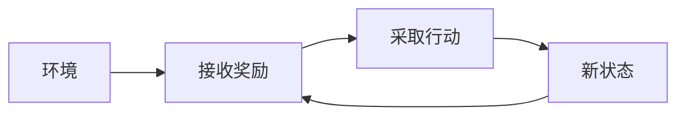

                 


# 多智能体系统模拟投资者心理偏差

> 关键词：多智能体系统、投资者心理偏差、强化学习、博弈论、金融市场模拟

> 摘要：本文探讨了多智能体系统在模拟投资者心理偏差中的应用。通过分析心理偏差的数学模型，结合强化学习和博弈论算法，构建了一个多智能体系统来模拟投资者行为。文章详细介绍了系统的架构设计、实现方法和实际案例，展示了如何利用多智能体系统揭示和预测投资者心理偏差对金融市场的影响。

---

## 第1章：背景介绍

### 1.1 多智能体系统的基本概念
多智能体系统（Multi-Agent System, MAS）是由多个相互作用的智能体组成的系统，每个智能体能够独立感知环境、自主决策并采取行动。智能体之间通过通信和协作完成复杂的任务。

### 1.2 投资者心理偏差的定义
投资者心理偏差是指投资者在决策过程中由于认知偏差或情绪影响，导致非理性决策的现象。常见的心理偏差包括从众心理、过度自信、损失厌恶等。

### 1.3 多智能体系统与心理偏差的联系
- **心理偏差对个体决策的影响**：投资者的非理性决策会影响其投资行为。
- **多智能体系统的模拟能力**：通过模拟多个投资者的决策过程，可以研究心理偏差对金融市场的影响。

---

## 第2章：心理偏差的数学模型

### 2.1 心理偏差的量化方法
心理偏差可以通过概率模型或 utility 函数进行量化。例如，损失厌恶可以用以下公式表示：

$$ U = \begin{cases} 
      -\alpha \cdot \text{损失} & \text{如果损失} \\
      \beta \cdot \text{收益} & \text{如果收益}
   \end{cases} $$

### 2.2 心理偏差的数学表达式
从众心理可以通过群体行为模型进行模拟，假设每个投资者的决策受到其他投资者行为的影响：

$$ d_i = \begin{cases} 
      1 & \text{如果投资者 } i \text{ 跟随大多数人的决策} \\
      0 & \text{否则}
   \end{cases} $$

---

## 第3章：多智能体系统中的心理偏差模拟

### 3.1 强化学习算法的应用
强化学习（Reinforcement Learning）是一种适合模拟投资者决策的算法。以下是强化学习的流程图：



### 3.2 心理偏差对群体行为的影响
通过多智能体系统模拟，可以观察到从众心理如何导致市场的羊群效应：


---

## 第4章：系统架构与实现

### 4.1 系统功能设计
系统功能模块包括：
- **数据采集模块**：采集投资者行为数据。
- **模型训练模块**：训练心理偏差模型。
- **模拟模块**：模拟市场行为。

### 4.2 系统架构设计
以下是系统的架构图：


---

## 第5章：项目实战与案例分析

### 5.1 环境安装
安装所需的库：
```bash
pip install numpy matplotlib seaborn gym
```

### 5.2 核心代码实现
以下是强化学习算法的Python代码：

```python
import numpy as np

class InvestorAgent:
    def __init__(self, alpha=0.1):
        self.alpha = alpha
        self.Q = np.zeros(2)

    def take_action(self, state):
        if np.argmax(self.Q) == 1:
            return 1
        else:
            return 0

    def update_Q(self, state, action, reward):
        self.Q[action] = self.Q[action] + self.alpha * (reward + np.max(self.Q) - self.Q[action])

# 初始化环境
env = MarketEnvironment()
agent = InvestorAgent()

for episode in range(100):
    state = env.reset()
    while not done:
        action = agent.take_action(state)
        next_state, reward, done = env.step(action)
        agent.update_Q(state, action, reward)
```

### 5.3 案例分析
通过模拟从众心理，观察市场行为的变化。假设投资者受到从众心理影响，最终导致市场波动加剧。

---

## 第6章：总结与展望

### 6.1 总结
本文通过多智能体系统模拟了投资者心理偏差，揭示了心理偏差对市场行为的影响。

### 6.2 展望
未来的研究可以进一步结合自然语言处理技术，分析投资者情绪对市场的实时影响。

---

## 参考文献
[此处列出相关文献和资源]

---

通过以上内容，我们详细介绍了多智能体系统模拟投资者心理偏差的理论和实践方法，为金融市场行为分析提供了新的视角。

