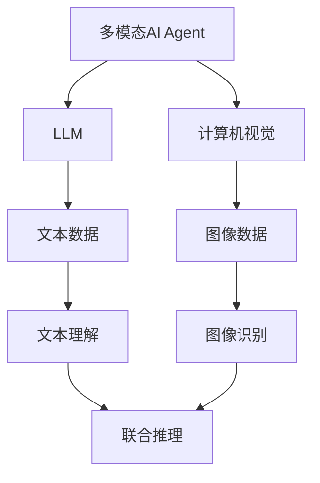
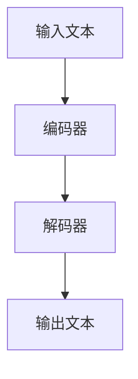
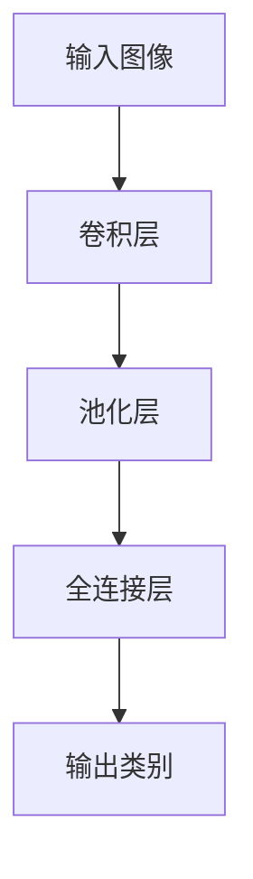
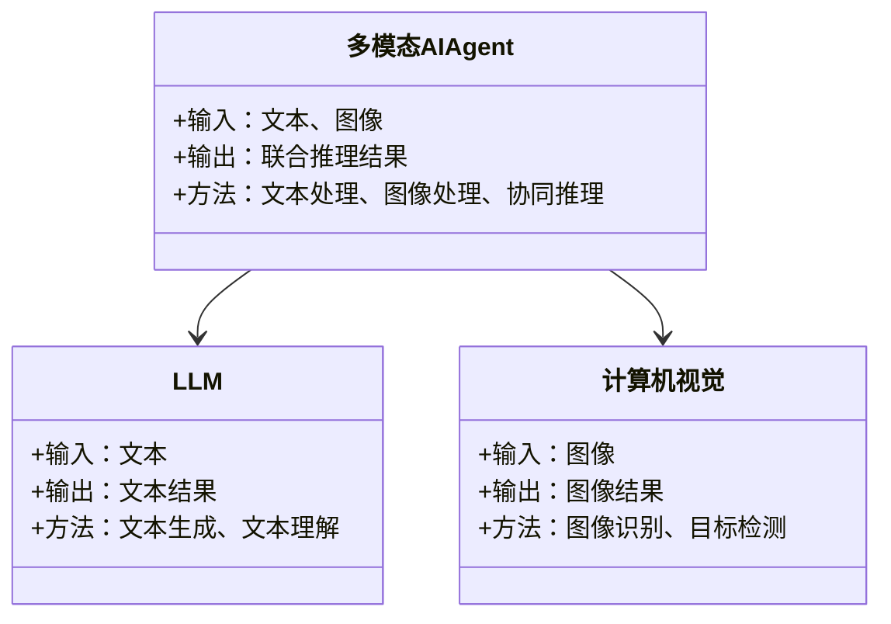
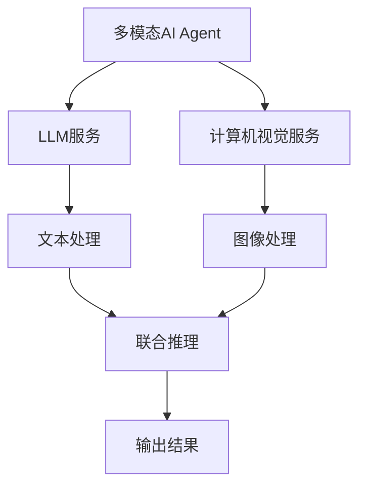
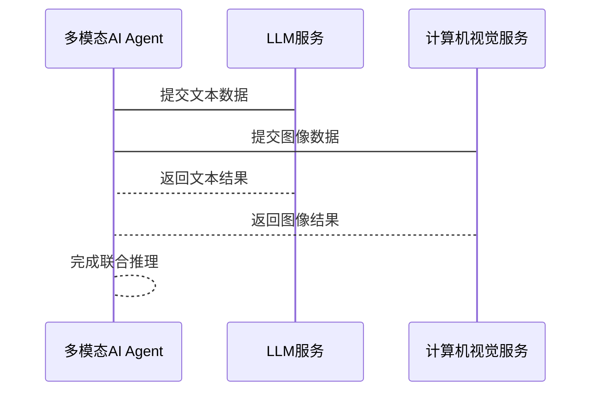

                 


# 多模态AI Agent：整合LLM与计算机视觉的最佳实践

## 关键词：多模态AI Agent，LLM，计算机视觉，人工智能，深度学习

## 摘要：本文系统地介绍多模态AI Agent的概念、技术基础、算法原理、系统架构设计及实际应用案例。通过详细分析LLM与计算机视觉的整合方法，探讨多模态数据融合的技术挑战与解决方案，提供从理论到实践的最佳实践指南。

---

# 第一部分: 多模态AI Agent概述

## 第1章: 多模态AI Agent的背景与概念

### 1.1 多模态AI Agent的定义与特点
#### 1.1.1 多模态AI Agent的定义
多模态AI Agent是一种能够同时处理和理解多种数据形式（如文本、图像、语音等）的智能体，通过整合不同模态的数据，实现更强大的感知和决策能力。

#### 1.1.2 多模态AI Agent的核心特点
- **跨模态理解**：能够同时处理文本、图像等多种数据类型。
- **联合推理**：结合不同模态的信息进行协同推理。
- **实时性**：具备快速响应和实时处理能力。
- **可解释性**：提供透明的决策过程，便于用户理解和信任。

#### 1.1.3 多模态AI Agent与传统AI Agent的区别
| 特性         | 传统AI Agent                | 多模态AI Agent            |
|--------------|-----------------------------|---------------------------|
| 数据处理     | 单一模态（如文本或图像）    | 多模态（文本、图像、语音） |
| 决策能力     | 基于单一模态信息            | 基于多模态信息协同         |
| 适用场景     | 简单任务（如文本分类）      | 复杂任务（如智能监控）     |

### 1.2 LLM与计算机视觉的结合
#### 1.2.1 大语言模型（LLM）的基本概念
- LLM（Large Language Model）：基于深度学习的自然语言处理模型，如GPT、PaLM。
- LLM的核心能力：文本生成、理解、翻译等。

#### 1.2.2 计算机视觉的核心原理
- 计算机视觉：通过算法处理图像或视频，实现对视觉信息的理解和分析。
- 常见技术：图像识别、目标检测、语义分割等。

#### 1.2.3 LLM与计算机视觉的整合优势
- **互补性**：LLM擅长文本处理，计算机视觉擅长图像处理，二者结合实现跨模态任务。
- **协同推理**：通过多模态数据的联合分析，提升任务的准确性和鲁棒性。

### 1.3 多模态AI Agent的应用场景
#### 1.3.1 智能客服
- **场景描述**：结合文本和图像信息，提供更智能的客服交互体验。
- **具体应用**：智能问答、情绪分析、图像识别辅助。

#### 1.3.2 智能监控
- **场景描述**：实时监控视频流，结合LLM进行异常行为分析。
- **具体应用**：人脸识别、行为识别、异常事件预警。

#### 1.3.3 智能医疗
- **场景描述**：结合医疗文本和医学图像，辅助医生进行诊断。
- **具体应用**：医学影像分析、病历理解、诊断建议生成。

#### 1.3.4 智能教育
- **场景描述**：结合教学视频和学生行为数据，提供个性化教学方案。
- **具体应用**：学习行为分析、个性化推荐、智能辅助教学。

---

## 第2章: 多模态AI Agent的核心技术

### 2.1 大语言模型（LLM）技术
#### 2.1.1 常见LLM模型介绍
- **GPT系列**：GPT-3、GPT-4，具备强大的文本生成能力。
- **PaLM**：Google的Pathways LLM，支持多语言和多任务处理。

#### 2.1.2 LLM的训练与推理流程
1. **训练阶段**：
   - 使用大规模文本数据进行预训练。
   - 采用自监督学习，模型预测下一个词。
2. **推理阶段**：
   - 根据输入生成连续的文本输出。
   - 支持多种任务，如问答、翻译、摘要。

#### 2.1.3 LLM的可解释性问题
- **问题**：模型的决策过程难以解释。
- **解决方案**：引入可解释性技术，如注意力权重分析。

### 2.2 计算机视觉技术
#### 2.2.1 常见计算机视觉模型介绍
- **ResNet**：深度残差网络，用于图像分类。
- **YOLO**：目标检测模型，支持实时检测。

#### 2.2.2 图像识别与目标检测原理
- **图像识别**：将图像分类为预定义类别。
- **目标检测**：在图像中定位目标并进行分类。

#### 2.2.3 视频分析与处理技术
- **视频分割**：将视频分为背景和前景。
- **视频理解**：通过时序信息进行视频语义理解。

### 2.3 多模态数据融合技术
#### 2.3.1 多模态数据的表示方法
- **文本表示**：词向量、句向量。
- **图像表示**：特征图、图像向量。

#### 2.3.2 多模态数据融合的算法选择
- **早期融合**：在特征提取阶段进行融合。
- **晚期融合**：在高层语义进行融合。
- **自适应融合**：根据任务需求动态调整融合方式。

#### 2.3.3 数据融合的挑战与解决方案
- **挑战**：不同模态数据的异质性。
- **解决方案**：引入跨模态对齐技术，如对比学习。

---

## 第3章: 多模态AI Agent的核心概念与联系

### 3.1 核心概念原理
#### 3.1.1 LLM的文本生成原理
- **生成机制**：基于Transformer架构的解码器，逐词生成文本。
- **数学模型**：交叉熵损失函数，优化模型生成概率。

#### 3.1.2 计算机视觉的图像理解原理
- **卷积神经网络（CNN）**：提取图像的空间特征。
- **区域建议网络（RPN）**：生成目标候选框。

#### 3.1.3 多模态数据的联合推理机制
- **联合编码**：将多模态数据映射到统一的表示空间。
- **协同推理**：结合不同模态的信息进行联合推理。

### 3.2 核心概念属性特征对比
| 特性         | LLM                          | 计算机视觉                 |
|--------------|-----------------------------|---------------------------|
| 数据类型     | 文本                          | 图像、视频                 |
| 处理目标     | 文本生成、理解                | 图像识别、目标检测         |
| 模型架构     | Transformer                   | CNN、RPN                   |

### 3.3 ER实体关系图架构


---

## 第4章: 多模态AI Agent的算法原理

### 4.1 基于Transformer的LLM算法


#### 4.1.1 LLM的数学模型
- **注意力机制**：
  $$\text{Attention}(Q, K, V) = \text{softmax}\left(\frac{QK^T}{\sqrt{d_k}}\right)V$$
- **损失函数**：交叉熵损失：
  $$\mathcal{L} = -\sum_{i=1}^{n} y_i \log p(y_i)$$

### 4.2 基于CNN的计算机视觉算法


#### 4.2.1 图像分类的数学模型
- **卷积操作**：
  $$f(x) = \sum_{i=1}^{k} w_i \ast x_i$$
- **池化操作**：最大池化、平均池化。

---

## 第5章: 多模态AI Agent的系统分析与架构设计

### 5.1 问题场景介绍
- **目标**：设计一个支持多模态数据处理的AI Agent系统。
- **需求**：实时处理文本、图像数据，具备联合推理能力。

### 5.2 系统功能设计
#### 5.2.1 领域模型设计


### 5.3 系统架构设计
#### 5.3.1 系统架构图


### 5.4 系统接口设计
- **输入接口**：支持文本和图像数据的输入。
- **输出接口**：提供联合推理结果和可解释性报告。

### 5.5 系统交互流程


---

## 第6章: 多模态AI Agent的项目实战

### 6.1 环境安装
- **工具安装**：
  - Python 3.8+
  - PyTorch、Transformers库
  - OpenCV、MMCV库

### 6.2 系统核心实现
#### 6.2.1 多模态数据融合实现
```python
import torch
from transformers import AutoTokenizer, AutoModel
import cv2

# LLM部分
tokenizer = AutoTokenizer.from_pretrained("gpt2")
model = AutoModel.from_pretrained("gpt2")

# 计算机视觉部分
def process_image(image_path):
    img = cv2.imread(image_path)
    return img

# 联合推理
def multimodal_inference(text, image_path):
    text_encoding = tokenizer.encode(text, return_tensors="pt")
    image_feature = process_image(image_path)
    return text_encoding, image_feature
```

#### 6.2.2 代码应用解读
- **文本处理**：使用LLM对文本进行编码和生成。
- **图像处理**：使用OpenCV对图像进行预处理。
- **联合推理**：结合文本和图像特征进行协同推理。

### 6.3 实际案例分析
#### 6.3.1 案例背景
- **任务**：智能客服中的多模态问答系统。
- **数据**：用户输入的文本和表情图像。

#### 6.3.2 案例分析
- **输入**：用户输入文本“我遇到了支付问题”，并附上焦虑的表情图像。
- **处理**：LLM理解文本内容，计算机视觉识别表情，联合推理得出用户情绪和需求。
- **输出**：生成回复：“请提供您的订单号，我将帮助您解决支付问题。”并触发情绪安抚流程。

### 6.4 项目小结
- **实现效果**：成功实现了多模态数据的融合和协同推理。
- **经验总结**：模型的选择和数据的预处理对系统性能影响显著。

---

## 第7章: 多模态AI Agent的最佳实践

### 7.1 小结
- 多模态AI Agent通过整合LLM和计算机视觉，实现了跨模态任务的协同处理。
- 本文详细探讨了多模态数据融合的技术挑战和解决方案。

### 7.2 注意事项
- **数据质量**：确保多模态数据的同步和一致性。
- **模型选择**：根据任务需求选择合适的模型和架构。
- **性能优化**：在资源受限的场景下，需进行模型压缩和优化。

### 7.3 拓展阅读
- **推荐书籍**：《Deep Learning》、《Hands-on Machine Learning with Scikit-Learn, Keras, and TensorFlow》。
- **推荐论文**：多模态学习领域的最新研究论文。

---

## 结语
多模态AI Agent作为人工智能领域的前沿技术，整合了大语言模型和计算机视觉的核心能力，为复杂场景下的智能应用提供了新的可能性。通过本文的系统介绍和实践案例，读者可以深入了解多模态AI Agent的实现细节和最佳实践，为后续的研究和应用提供有力的指导。

