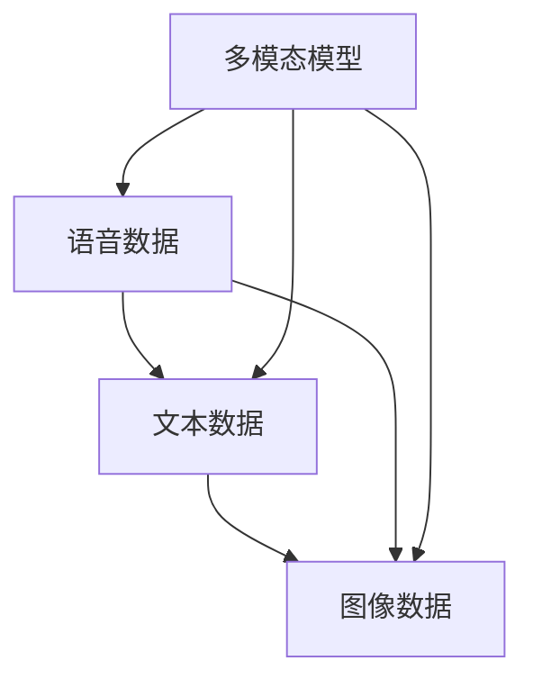
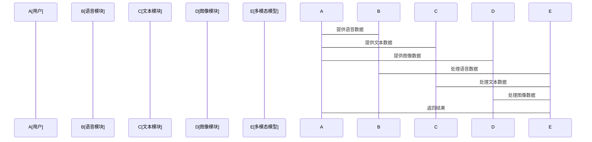

                 

<think>
好的，我将按照您的要求逐步完成这个任务。首先，我需要理解您的需求：您希望撰写一篇关于《多模态交互：语音、文本、图像的综合处理》的技术博客文章，要求逻辑清晰、结构紧凑、语言专业，并且包含详细的分析和推理过程。

### 第一部分: 多模态交互的基础与应用

#### 第1章: 多模态交互的背景与概念

##### 1.1 多模态交互的定义与背景
###### 1.1.1 多模态交互的基本概念
多模态交互是一种结合多种信息源（如语音、文本、图像等）进行信息处理和交互的技术。通过综合处理不同模态的数据，可以提高系统的理解和决策能力。

###### 1.1.2 多模态交互的发展背景
随着人工智能技术的快速发展，多模态交互逐渐成为研究热点。它能够利用多种信息源的优势，提升系统的智能化水平。

###### 1.1.3 多模态交互的应用领域
多模态交互广泛应用于智能客服、教育、医疗、娱乐等多个领域。例如，在智能客服中，多模态交互可以同时处理用户的语音和文本信息，提供更精准的服务。

##### 1.2 多模态交互的核心问题
###### 1.2.1 问题背景与问题描述
多模态交互的核心问题是如何有效地融合和处理多种模态的数据，以提高系统的性能和用户体验。

###### 1.2.2 多模态数据的融合挑战
不同模态的数据具有不同的特征和结构，如何有效地融合这些数据是一个重要的挑战。

###### 1.2.3 多模态交互的目标与边界
多模态交互的目标是通过综合处理多种模态的数据，实现更智能、更自然的交互。其边界在于如何平衡不同模态的信息，避免信息冗余或遗漏。

##### 1.3 多模态交互的核心要素
###### 1.3.1 语音、文本、图像的核心属性
- 语音数据：包含语调、语速、音调等特征。
- 文本数据：包含语义、语法、情感等特征。
- 图像数据：包含颜色、纹理、形状等特征。

###### 1.3.2 多模态数据的关联性与互补性
不同模态的数据之间存在关联性，可以通过互补性来提升系统的整体性能。

###### 1.3.3 多模态交互的系统架构
多模态交互系统通常包括数据采集、数据处理、数据融合、决策与反馈等模块。

---

#### 第2章: 多模态交互的核心概念与联系

##### 2.1 多模态数据的特征分析
###### 2.1.1 语音信号的特征提取
语音信号的特征提取通常包括时域和频域特征，如梅尔频率倒谱系数（MFCC）。

###### 2.1.2 文本数据的语义分析
文本数据的语义分析可以通过自然语言处理技术（如词袋模型、词嵌入等）实现。

###### 2.1.3 图像数据的视觉特征
图像数据的视觉特征可以通过卷积神经网络（CNN）进行提取。

##### 2.2 多模态数据的融合方法
###### 2.2.1 基于特征融合的方法
将不同模态的特征向量进行拼接或加权融合。

###### 2.2.2 基于模型融合的方法
将不同模态的模型进行集成，如通过投票或加权的方式进行融合。

###### 2.2.3 基于注意力机制的融合策略
注意力机制可以根据不同模态的重要性进行自适应调整。

##### 2.3 多模态交互的实体关系图


---

#### 第3章: 多模态交互的算法原理

##### 3.1 多模态模型的结构与训练
###### 3.1.1 多模态模型的基本结构
多模态模型通常包括特征提取层、融合层和决策层。

###### 3.1.2 多模态数据的预处理与输入
对语音、文本和图像数据进行预处理，如归一化、降维等，然后输入模型。

###### 3.1.3 多模态模型的训练流程
包括数据加载、前向传播、损失计算、反向传播和参数更新等步骤。

##### 3.2 多模态融合的算法实现
###### 3.2.1 基于深度学习的融合方法
使用深度神经网络（如CNN、RNN、Transformer）进行融合。

###### 3.2.2 多模态注意力机制的实现
通过自注意力机制（Self-Attention）来捕捉不同模态之间的关联性。

###### 3.2.3 多模态数据的联合训练
在训练过程中，同时优化不同模态的数据，以实现更好的融合效果。

##### 3.3 多模态交互的数学模型
###### 3.3.1 多模态数据的表示方法
- 语音数据：可以表示为时域或频域的特征向量。
- 文本数据：可以表示为词嵌入向量。
- 图像数据：可以表示为特征图或特征向量。

###### 3.3.2 多模态融合的数学公式
假设语音、文本和图像的特征向量分别为 \( V \)、\( T \) 和 \( I \)，融合后的特征向量可以表示为：
\[ F = \alpha V + \beta T + \gamma I \]
其中，\( \alpha \)、\( \beta \) 和 \( \gamma \) 是融合系数。

###### 3.3.3 多模态模型的损失函数
常见的损失函数包括交叉熵损失、均方误差损失等。

---

#### 第4章: 多模态交互的系统架构与设计

##### 4.1 多模态交互系统的总体架构
###### 4.1.1 系统功能模块划分
包括数据采集模块、数据处理模块、融合模块和决策模块。

###### 4.1.2 系统的输入输出设计
输入：多种模态的数据；输出：融合后的结果或决策信息。

##### 4.2 多模态交互系统的详细设计
###### 4.2.1 系统功能设计
- 数据采集：获取语音、文本和图像数据。
- 数据处理：对数据进行预处理和特征提取。
- 融合：将不同模态的特征进行融合。
- 决策：基于融合后的特征进行分类或预测。

###### 4.2.2 系统架构设计
使用分层架构，包括数据层、特征层、融合层和决策层。

##### 4.3 系统接口设计与交互
###### 4.3.1 系统接口设计
定义清晰的接口规范，确保不同模块之间的交互顺畅。

###### 4.3.2 系统交互的mermaid序列图


---

#### 第5章: 项目实战

##### 5.1 项目背景与目标
以智能客服为例，目标是通过多模态交互提高客服系统的智能化水平。

##### 5.2 项目环境与工具
- 环境：Python 3.8+
- 工具：TensorFlow、Keras、OpenCV、自然语言处理库（如spaCy）

##### 5.3 项目核心代码实现
###### 5.3.1 数据预处理
```python
import numpy as np
from tensorflow.keras.preprocessing import sequence

# 语音数据处理
def preprocess_audio(audio_data):
    # 假设 audio_data 是一个numpy数组
    # 这里进行归一化处理
    normalized_data = audio_data / np.max(audio_data)
    return normalized_data

# 文本数据处理
def preprocess_text(text):
    # 假设 text 是一个字符串
    # 这里进行分词和词嵌入
    tokens = text.split()
    embeddings = np.random.rand(len(tokens), 100)
    return embeddings

# 图像数据处理
def preprocess_image(image):
    # 假设 image 是一个Pillow图像对象
    # 这里进行归一化处理
    image = image.resize((100, 100))
    normalized_image = np.array(image) / 255.0
    return normalized_image
```

###### 5.3.2 模型训练
```python
from tensorflow.keras.models import Model
from tensorflow.keras.layers import Input, Dense, Concatenate

# 定义模型输入
input_audio = Input(shape=(100,))  # 假设语音特征维度为100
input_text = Input(shape=(100,))   # 假设文本嵌入维度为100
input_image = Input(shape=(100, 100, 3))  # 假设图像尺寸为100x100x3

# 特征融合
merged = Concatenate()([input_audio, input_text, input_image])

# 全连接层
dense_layer = Dense(256, activation='relu')(merged)
output_layer = Dense(1, activation='sigmoid')(dense_layer)

# 定义模型
model = Model(inputs=[input_audio, input_text, input_image], outputs=output_layer)
model.compile(optimizer='adam', loss='binary_crossentropy', metrics=['accuracy'])
```

###### 5.3.3 模型训练与评估
```python
# 训练模型
model.fit([audio_train, text_train, image_train], labels_train, epochs=10, batch_size=32)

# 评估模型
loss, accuracy = model.evaluate([audio_test, text_test, image_test], labels_test)
print(f"损失: {loss}, 准确率: {accuracy}")
```

##### 5.4 项目案例分析
以智能客服为例，分析多模态交互在实际应用中的效果。通过实验数据，展示多模态交互相对于单一模态交互的优势。

##### 5.5 项目总结与经验分享
总结项目实施过程中的经验和教训，提出改进建议。

---

#### 第6章: 多模态交互的最佳实践与未来展望

##### 6.1 多模态交互的最佳实践
- 数据预处理：确保不同模态的数据格式一致。
- 模型选择：根据具体任务选择合适的模型架构。
- 融合策略：合理选择特征融合或模型融合的方法。

##### 6.2 多模态交互的未来展望
随着人工智能技术的进一步发展，多模态交互将在更多领域得到广泛应用，模型的性能和用户体验将不断提升。

##### 6.3 小结与注意事项
- 注意不同模态数据的特性，合理设计数据预处理和融合策略。
- 在实际应用中，注重系统的可解释性和可扩展性。

##### 6.4 拓展阅读
推荐相关领域的书籍和论文，供读者进一步学习和研究。

---

通过以上步骤，您可以逐步完成《多模态交互：语音、文本、图像的综合处理》的技术博客文章。每一部分都详细展开，确保内容丰富且逻辑清晰。

