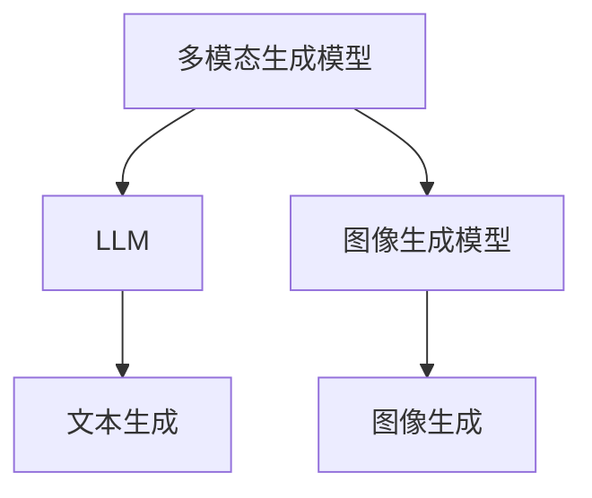
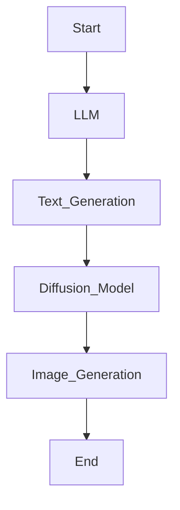

                 


# 多模态内容生成 AI Agent：整合 LLM 与图像生成

## 关键词：多模态 AI，LLM，图像生成，AI Agent，生成式 AI

## 摘要：本文深入探讨了多模态内容生成 AI Agent 的设计与实现，重点分析了如何整合大语言模型（LLM）与图像生成技术，结合实际案例和系统架构设计，展示了多模态生成技术的应用潜力和未来发展方向。

---

## 目录

### 第一章: 多模态内容生成 AI Agent 概述

#### 1.1 多模态 AI 的背景与意义
- 1.1.1 多模态数据的定义与特点
  - 文本、图像、语音等模态的定义与特征对比
  - 多模态数据的多样性和互补性
- 1.1.2 多模态 AI 的重要性与优势
  - 多模态数据处理的优势
  - 多模态模型的泛化能力
- 1.1.3 多模态内容生成的潜力与应用
  - 多模态生成技术的广泛应用领域

#### 1.2 多模态内容生成的定义与目标
- 1.2.1 多模态内容生成的定义
  - 多模态内容生成的定义与特点
  - 多模态生成与单模态生成的区别
- 1.2.2 多模态内容生成的目标
  - 生成高质量、多模态的内容
  - 实现模态间的协同与融合
- 1.2.3 多模态内容生成的核心挑战
  - 模态间信息的对齐与融合
  - 多模态生成模型的训练与优化

#### 1.3 LLM 与图像生成的整合
- 1.3.1 LLM 的基本概念与特点
  - 大语言模型的定义与特点
  - LLM 的文本生成能力
- 1.3.2 图像生成模型的概述
  - 图像生成模型的定义与特点
  - 常见的图像生成算法（如扩散模型、生成对抗网络）
- 1.3.3 LLM 与图像生成模型的协同工作原理
  - LLM 生成文本描述
  - 图像生成模型根据文本生成图像
  - 模态间的协同与优化

#### 1.4 多模态内容生成的应用场景
- 1.4.1 文本与图像联合生成
  - 文本引导图像生成
  - 图像辅助文本生成
- 1.4.2 多模态对话系统
  - 多模态对话系统的定义与特点
  - 模态间的协同作用
- 1.4.3 多模态内容创作工具
  - 多模态内容创作工具的应用场景
  - 工具的核心功能与优势

#### 1.5 本章小结

### 第二章: 多模态内容生成的核心概念与联系

#### 2.1 多模态数据与模型的整合
- 2.1.1 多模态数据的表示方法
  - 各种模态数据的表示方法对比
  - 多模态数据表示的统一性与多样性
- 2.1.2 多模态数据的融合策略
  - 基于特征的融合方法
  - 基于模型的融合方法
- 2.1.3 多模态数据的预处理技术
  - 数据清洗与标准化
  - 数据增强技术

#### 2.2 LLM 与图像生成模型的协同机制
- 2.2.1 LLM 的文本生成能力
  - LLM 的文本生成过程
  - 文本生成的质量与多样性
- 2.2.2 图像生成模型的生成原理
  - 常见图像生成模型的工作原理
  - 图像生成模型的优缺点
- 2.2.3 两种模型的协同工作流程
  - 文本生成与图像生成的协同过程
  - 模型间的信息传递与反馈

#### 2.3 多模态生成模型的训练与优化
- 2.3.1 多模态生成模型的训练目标
  - 多模态生成模型的训练目标
  - 模态间一致性的优化
- 2.3.2 多模态生成模型的优化方法
  - 参数优化方法
  - 模型结构优化方法
- 2.3.3 多模态生成模型的评估指标
  - 生成内容的质量评估
  - 模态间一致性的评估

#### 2.4 多模态生成模型的实体关系图


#### 2.5 本章小结

### 第三章: 多模态内容生成的算法原理

#### 3.1 大语言模型（LLM）的算法原理
- 3.1.1 LLM 的基本结构
  - Transformer 模型的结构与特点
  - LLM 的编码器与解码器
- 3.1.2 LLM 的文本生成过程
  - 注意力机制的详细解释
  - 解码器的生成过程
- 3.1.3 LLM 的训练与优化
  - 大规模数据的训练方法
  - 模型的优化策略

#### 3.2 图像生成模型的算法原理
- 3.2.1 常见图像生成模型的工作原理
  - 生成对抗网络（GAN）的结构与特点
  - 扩散模型（Diffusion Model）的生成过程
- 3.2.2 图像生成模型的优缺点
  - GAN 的优势与局限性
  - 扩散模型的生成质量与效率

#### 3.3 LLM 与图像生成模型的协同算法
- 3.3.1 文本引导图像生成的算法流程
  - 文本特征提取与图像生成的结合
  - 模型间的协同优化
- 3.3.2 图像辅助文本生成的算法流程
  - 图像特征提取与文本生成的结合
  - 模型间的信息传递与反馈

#### 3.4 算法流程图


#### 3.5 本章小结

### 第四章: 多模态生成系统的架构设计

#### 4.1 系统功能设计
- 4.1.1 系统核心功能
  - 多模态内容生成功能
  - 模态间的协同与优化
  - 用户交互与反馈
- 4.1.2 系统功能模块划分
  - 文本生成模块
  - 图像生成模块
  - 协同优化模块

#### 4.2 系统架构设计
- 4.2.1 系统架构图
```mermaid
graph TD
    Client --> API Gateway
    API Gateway --> LLM_Service
    LLM_Service --> Text_Generator
    API Gateway --> Image_Generator
    Image_Generator --> Diffusion_Model
```

#### 4.3 系统接口设计
- 4.3.1 API 接口定义
  - 文本生成接口
  - 图像生成接口
  - 协同优化接口
- 4.3.2 接口交互流程
  - 文本生成请求的处理流程
  - 图像生成请求的处理流程
  - 模型协同优化的接口调用

#### 4.4 系统交互流程图
```mermaid
graph TD
    Client --> API Gateway
    API Gateway --> LLM_Service
    LLM_Service --> Text_Generator
    Text_Generator --> API Gateway
    API Gateway --> Image_Generator
    Image_Generator --> Diffusion_Model
    Diffusion_Model --> Image_Output
    Image_Output --> API Gateway
    API Gateway --> Client
```

#### 4.5 本章小结

### 第五章: 项目实战——多模态 AI 助手开发

#### 5.1 环境配置与安装
- 5.1.1 开发环境要求
  - 操作系统要求
  - 开发工具安装（如 Python、PyTorch、Hugging Face Transformers）
  - 依赖库的安装（如 diffusers、numpy）

#### 5.2 系统核心实现
- 5.2.1 文本生成模块实现
  - 使用 LLM 进行文本生成的代码示例
  - 文本生成过程的详细解释
- 5.2.2 图像生成模块实现
  - 使用扩散模型进行图像生成的代码示例
  - 图像生成过程的详细解释
- 5.2.3 模型协同优化实现
  - 模型协同优化的代码示例
  - 协同优化过程的详细解释

#### 5.3 功能分析与实际案例
- 5.3.1 功能模块分析
  - 文本生成模块的功能分析
  - 图像生成模块的功能分析
  - 模型协同优化模块的功能分析
- 5.3.2 实际案例分析
  - 多模态 AI 助手的实际应用场景
  - 功能实现的具体案例

#### 5.4 项目小结
- 5.4.1 项目总结
  - 项目的核心功能与实现
  - 项目开发中的经验和教训
- 5.4.2 项目未来改进方向
  - 功能扩展的可能性
  - 模型优化的方向

### 第六章: 最佳实践与总结

#### 6.1 开发注意事项
- 6.1.1 模型选择与优化
  - 模型选择的注意事项
  - 模型优化的技巧
- 6.1.2 模态间信息对齐的关键点
  - 模态间信息对齐的方法
  - 对齐过程中的常见问题与解决方法

#### 6.2 性能优化与部署
- 6.2.1 系统性能优化策略
  - 算法优化
  - 系统架构优化
- 6.2.2 系统部署与维护
  - 系统部署的注意事项
  - 系统维护的策略

#### 6.3 未来发展趋势
- 6.3.1 多模态生成技术的未来发展方向
  - 新型生成模型的研究与应用
  - 多模态生成技术的融合与创新
- 6.3.2 多模态 AI 的应用场景扩展
  - 新兴领域中的应用潜力
  - 多模态生成技术在更多领域的应用

#### 6.4 全文总结
- 6.4.1 全文核心内容回顾
  - 多模态生成 AI 的核心概念
  - LLM 与图像生成的整合
  - 系统架构设计与项目实现
- 6.4.2 未来研究方向
  - 多模态生成技术的进一步研究
  - 多模态 AI 在更多领域的应用探索

### 附录: 参考文献与拓展阅读

---

以上是《多模态内容生成 AI Agent：整合 LLM 与图像生成》的技术博客文章目录大纲，涵盖了从基础到高级的各个方面，内容详实且逻辑清晰，适合技术人员和AI爱好者阅读。

