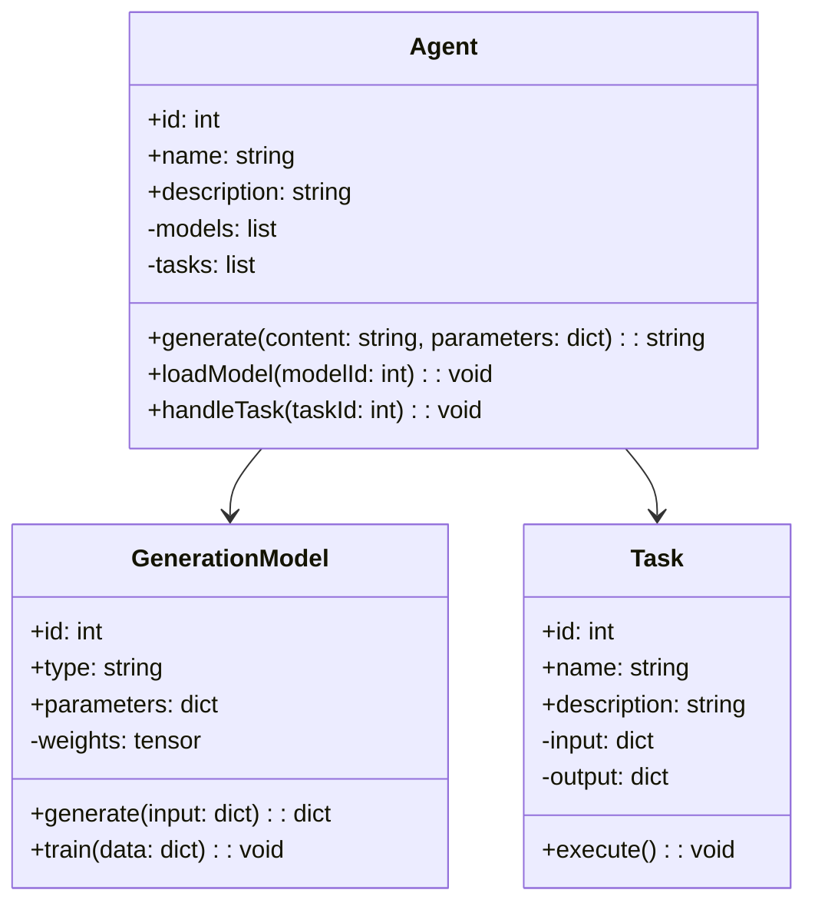
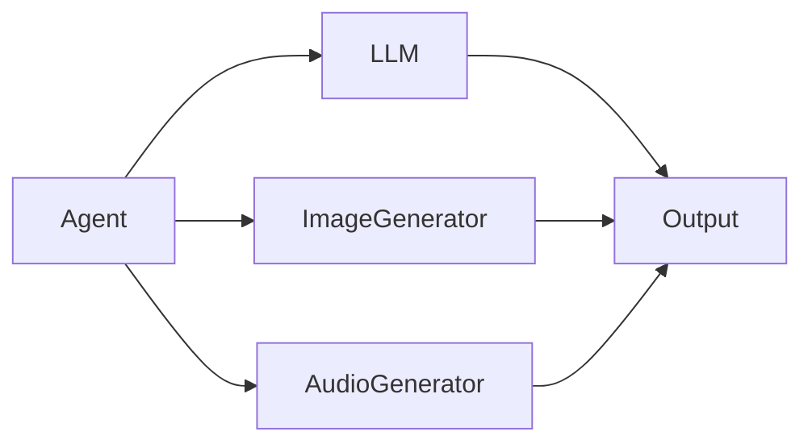
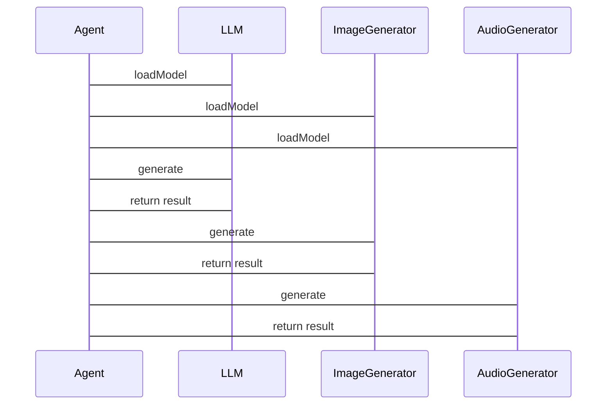

                 


# 多模态内容生成AI Agent：整合LLM与其他生成模型

> 关键词：多模态生成，LLM，AI Agent，生成模型，机器学习

> 摘要：本文详细探讨了多模态内容生成AI Agent的构建过程，重点分析了如何将大语言模型（LLM）与其他生成模型（如图像生成和音频生成模型）进行有效整合。文章从背景介绍、核心概念、算法原理、系统架构设计、项目实战到总结，全面解析了多模态生成AI Agent的技术要点和实现方法。

---

# 第1章: 多模态内容生成AI Agent的背景与问题描述

## 1.1 多模态内容生成的背景

### 1.1.1 多模态数据的定义与特点

多模态数据是指包含多种类型信息的数据，例如文本、图像、音频、视频等。这些数据类型之间的协同作用可以提供更丰富的信息和更强大的表达能力。多模态数据的特点包括多样性、互补性和复杂性。

### 1.1.2 AI Agent的基本概念

AI Agent（人工智能代理）是一种能够感知环境、自主决策并执行任务的智能实体。AI Agent可以通过多种模态的数据进行交互，从而实现复杂的内容生成任务。

### 1.1.3 多模态内容生成的必要性

随着内容生成需求的多样化，单一模态生成模型的局限性日益显现。通过整合多种生成模型，可以充分利用各模型的优势，提升生成内容的质量和多样性。

## 1.2 问题背景与描述

### 1.2.1 当前内容生成技术的局限性

现有内容生成技术主要集中在单一模态（如文本或图像）上，难以满足多模态内容生成的需求。此外，不同生成模型的协同工作也存在技术和实现上的挑战。

### 1.2.2 多模态生成的需求场景

多模态生成的需求场景包括：多语言文本生成、图像与文本协同生成、音频与视频生成等。这些场景需要多种生成模型协同工作，才能实现高质量的内容生成。

### 1.2.3 LLM与其他生成模型的整合挑战

整合LLM与其他生成模型需要解决数据格式转换、模型接口统一、协同生成策略等问题。这些挑战要求我们对生成模型的算法原理、数据处理流程和交互机制有深刻理解。

## 1.3 问题解决与边界

### 1.3.1 多模态生成AI Agent的目标

通过整合多种生成模型，构建一个能够生成高质量多模态内容的AI Agent，满足复杂的生成需求。

### 1.3.2 边界与外延

多模态生成AI Agent的边界在于其生成能力的范围和数据处理能力。外延则包括与外部系统的交互和数据源的扩展。

### 1.3.3 核心要素与组成

多模态生成AI Agent的核心要素包括：输入处理模块、生成模型调用模块、协同生成模块和输出处理模块。这些模块协同工作，实现多模态内容的生成。

---

# 第2章: 多模态生成AI Agent的核心概念与联系

## 2.1 多模态生成模型的原理

### 2.1.1 多模态数据的处理流程

多模态数据的处理流程包括数据预处理、数据融合和生成阶段。数据预处理包括标准化和格式转换；数据融合包括特征提取和模态对齐；生成阶段则根据融合后的数据进行内容生成。

### 2.1.2 AI Agent的决策机制

AI Agent的决策机制包括任务分析、模型选择和生成策略优化。任务分析基于输入数据和生成目标，选择合适的生成模型，并制定生成策略。

### 2.1.3 模型的协同工作原理

多种生成模型协同工作的核心是通过统一的接口进行数据交换和模型调用，确保生成过程的流畅和高效。

## 2.2 核心概念对比与ER实体关系图

### 2.2.1 多模态生成模型与单模态生成模型的对比

| 对比维度         | 单模态生成模型               | 多模态生成模型               |
|------------------|------------------------------|------------------------------|
| 数据输入         | 单一类型                     | 多种类型                     |
| 生成能力         | 单一模态                     | 多模态                       |
| 协同性           | 无需协同                     | 需要协同                     |

### 2.2.2 ER实体关系图

```mermaid
er
    entity(Agent) {
        id
        name
        description
    }
    entity(GenerationModel) {
        id
        type
        parameters
    }
    entity(Task) {
        id
        name
        description
    }
    relation(Has, Agent -> GenerationModel)
    relation(Handles, Agent -> Task)
```

## 2.3 模型间的关系与协作

### 2.3.1 LLM与其他生成模型的协同

LLM与其他生成模型的协同可以通过数据共享、参数调整和生成结果优化等方式实现。

### 2.3.2 模型间的数据流与信息交互

多模态生成模型之间的数据流包括输入数据、生成参数和生成结果。信息交互通过统一接口和中间数据进行。

---

# 第3章: 多模态生成AI Agent的算法原理

## 3.1 大语言模型（LLM）的算法原理

### 3.1.1 LLM的训练过程

LLM的训练过程包括数据预处理、模型构建和模型训练。数据预处理包括清洗和格式转换；模型构建基于Transformer架构；模型训练采用大规模数据进行微调。

### 3.1.2 基于Transformer的架构

```mermaid
graph LR
    E -> T1
    T1 -> T2
    T2 -> T3
```

### 3.1.3 注意力机制的数学模型

$$\text{Attention}(Q, K, V) = \text{softmax}\left(\frac{QK^T}{\sqrt{d_k}}\right)V$$

## 3.2 图像生成模型的算法原理

### 3.2.1 基于GAN的图像生成

```mermaid
graph LR
    Z -> D
    D -> G
    G -> D
```

### 3.2.2 Diffusion模型的原理

Diffusion模型通过逐步生成噪声并逐步去噪实现图像生成。

### 3.2.3 图像生成的数学模型

$$p_{\theta}(x_t|x_{t-1}) = \text{Normal}(x_t; \mu_\theta(x_{t-1}), \sigma_\theta(x_{t-1}))$$

## 3.3 音频生成模型的算法原理

### 3.3.1 基于Wavenet的音频生成

Wavenet通过自回归方式生成音频样本。

### 3.3.2 音频生成的数学模型

$$p_{\theta}(x_t|x_{<t}) = \text{softmax}(\theta(x_{<t}))$$

---

# 第4章: 多模态生成AI Agent的系统分析与架构设计

## 4.1 问题场景介绍

多模态生成AI Agent的目标是实现多种生成模型的协同工作，满足复杂的内容生成需求。

## 4.2 项目介绍

### 4.2.1 项目目标

构建一个多模态生成AI Agent，整合LLM和其他生成模型，实现高质量多模态内容的生成。

### 4.2.2 项目需求

支持多种生成模型的调用，实现生成过程的自动化和高效性。

## 4.3 系统功能设计

### 4.3.1 领域模型类图



## 4.4 系统架构设计

### 4.4.1 系统架构图



## 4.5 系统接口设计

### 4.5.1 接口定义

- 输入接口：`Agent.loadModel(modelId: int)`
- 生成接口：`Agent.generate(content: string, parameters: dict): string`

### 4.5.2 交互设计



---

# 第5章: 多模态生成AI Agent的项目实战

## 5.1 环境安装

### 5.1.1 系统环境要求

- Python 3.8+
- PyTorch 1.9+
- transformers库
- PIL库

### 5.1.2 安装依赖

```bash
pip install torch transformers pillow
```

## 5.2 核心代码实现

### 5.2.1 Agent类实现

```python
class Agent:
    def __init__(self):
        self.models = {}
        self.tasks = {}

    def loadModel(self, modelId: int):
        # 加载模型代码
        pass

    def generate(self, content: str, parameters: dict) -> str:
        # 调用生成模型
        pass

    def handleTask(self, taskId: int):
        # 处理任务
        pass
```

### 5.2.2 GenerationModel类实现

```python
class GenerationModel:
    def __init__(self):
        self.weights = None
        self.parameters = {}

    def generate(self, input: dict) -> dict:
        # 生成代码
        pass

    def train(self, data: dict):
        # 训练代码
        pass
```

## 5.3 代码解读与分析

### 5.3.1 Agent类的实现细节

Agent类负责管理生成模型和任务，提供接口供外部调用。`loadModel`方法用于加载指定模型，`generate`方法用于调用生成模型生成内容，`handleTask`方法用于处理具体任务。

### 5.3.2 GenerationModel类的实现细节

GenerationModel类是具体生成模型的基类，`generate`方法实现内容生成逻辑，`train`方法实现模型训练逻辑。

## 5.4 实际案例分析

### 5.4.1 案例背景

假设我们需要生成一段包含文本、图像和音频的多模态内容。

### 5.4.2 案例实现

```python
agent = Agent()
agent.loadModel(1)  # 加载LLM模型
agent.loadModel(2)  # 加载图像生成模型
agent.loadModel(3)  # 加载音频生成模型
result_text = agent.generate("生成一段关于人工智能的文本", {})  # 生成文本
result_image = agent.generate("生成一张人工智能的图像", {})  # 生成图像
result_audio = agent.generate("生成一段人工智能的音频", {})  # 生成音频
```

## 5.5 项目小结

通过项目实战，我们可以看到多模态生成AI Agent的强大功能和实际应用价值。通过整合多种生成模型，我们可以实现高质量的多模态内容生成。

---

# 第6章: 多模态生成AI Agent的总结与展望

## 6.1 总结

本文详细探讨了多模态生成AI Agent的构建过程，从背景介绍到项目实战，全面解析了其技术要点和实现方法。通过整合LLM和其他生成模型，我们可以实现高质量的多模态内容生成。

## 6.2 最佳实践 tips

- 在实际应用中，需要注意生成模型的调用顺序和参数设置。
- 需要定期对生成模型进行优化和更新，以提升生成效果。

## 6.3 注意事项

- 在整合不同生成模型时，需要注意数据格式和接口的统一。
- 需要对生成结果进行质量评估和优化。

## 6.4 拓展阅读

建议读者进一步阅读相关领域的最新研究成果，如多模态生成模型的优化方法和协同策略。

---

以上是《多模态内容生成AI Agent：整合LLM与其他生成模型》的技术博客文章目录，涵盖了从背景介绍到项目实战的各个方面，内容详实且逻辑清晰，适合技术从业者和研究人员参考阅读。

