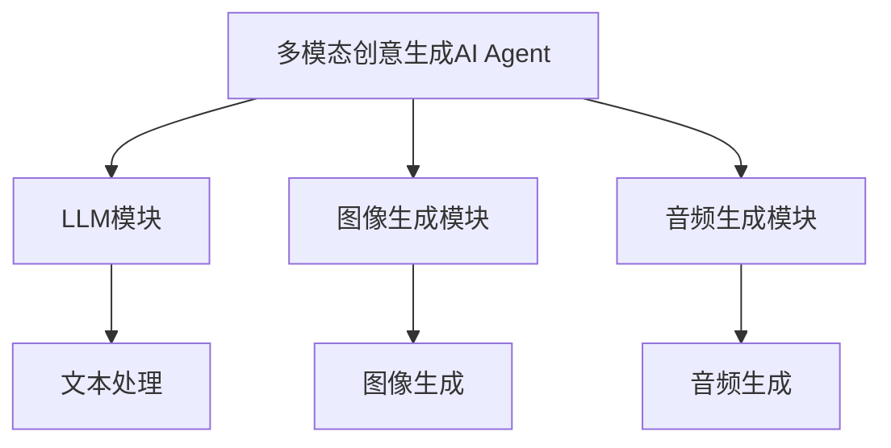
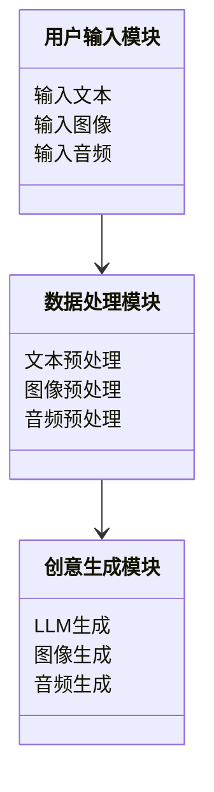
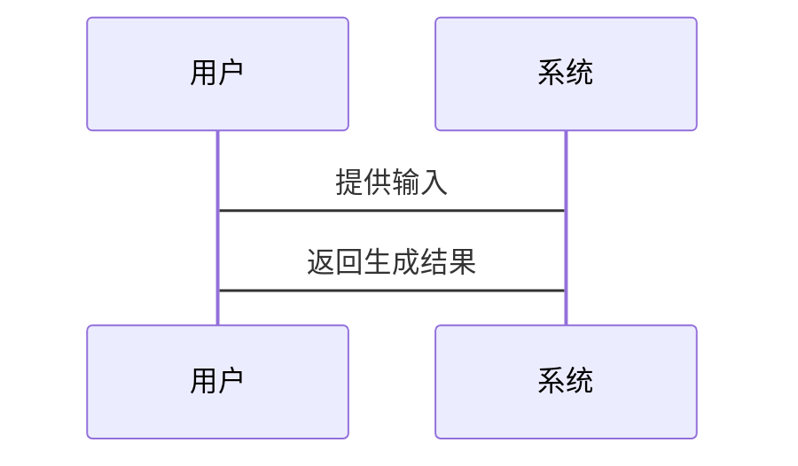

                 


# 多模态创意生成AI Agent：整合LLM与图像、音频生成

## 关键词：多模态AI Agent，LLM，图像生成，音频生成，创意生成，AI系统架构

## 摘要：  
本文深入探讨了多模态创意生成AI Agent的构建与应用，整合大语言模型（LLM）与图像、音频生成技术，分析其核心算法原理、系统架构设计及实际应用场景。通过详细的技术分析与项目实战，展示了如何实现跨模态数据的协同生成，推动AI创意生成技术的发展。

---

## 目录大纲：多模态创意生成AI Agent：整合LLM与图像、音频生成

---

### 第一部分：多模态创意生成AI Agent的背景与概念

#### 第1章：多模态创意生成AI Agent的背景与问题背景

##### 1.1 多模态创意生成的背景  
- 从单模态到多模态的演进  
- 创意生成的需求与挑战  
- AI Agent在创意生成中的作用  

##### 1.2 多模态创意生成的核心问题  
- 多模态数据的整合与协同  
- 创意生成的不确定性与多样性  
- AI Agent的自主性与交互性  

##### 1.3 多模态创意生成的边界与外延  
- 多模态数据的定义与分类  
- 创意生成的范围与限制  
- AI Agent的边界条件与应用场景  

##### 1.4 多模态创意生成的概念结构  
- 核心要素：LLM、图像生成、音频生成  
- 模块化设计：输入、处理、输出  
- 系统架构：单体架构与分布式架构  

---

### 第二部分：多模态创意生成AI Agent的核心概念与联系

#### 第2章：多模态创意生成AI Agent的核心概念

##### 2.1 多模态创意生成AI Agent的定义  
- 多模态数据的整合与处理  
- 创意生成的目标与过程  
- AI Agent的自主决策与交互能力  

##### 2.2 多模态数据的整合与协同  
- LLM与图像生成的协同  
- LLM与音频生成的协同  
- 多模态数据的融合与统一  

##### 2.3 多模态创意生成的系统架构  
- LLM作为核心模块  
- 图像生成与音频生成的模块化设计  
- 多模态数据的输入输出接口  

##### 2.4 多模态创意生成的实体关系图



---

### 第三部分：多模态创意生成AI Agent的算法原理

#### 第3章：LLM与图像生成的算法原理

##### 3.1 LLM的算法原理

###### 3.1.1 Transformer架构
- 编码器-解码器结构  
- 自注意力机制（Self-Attention）  
- 前馈神经网络（FFN）  

###### 3.1.2 交叉注意力机制
- 多模态特征的融合  
- 图像与文本的交互  
- 注意力权重的计算  

###### 3.1.3 LLM的训练与优化
- 预训练目标函数  
- 优化算法（Adam、SGD）  
- 模型收敛与调优  

##### 3.2 图像生成的算法原理

###### 3.2.1 GAN（生成对抗网络）
- 生成器与判别器的博弈  
- WGAN-GP改进  
- 图像生成的多样性与质量  

###### 3.2.2 VAE（变分自编码器）
- 编码器与解码器结构  
- 潜在空间的采样  
- 图像重构与生成  

###### 3.2.3 Diffusion模型
- 逐步去噪过程  
- 倒推采样方法  
- 图像生成的稳定性  

##### 3.3 音频生成的算法原理

###### 3.3.1 Wavenet
- 堆叠残差模块  
- 自回归预测  
- 音频波形的生成  

###### 3.3.2 Parallel WaveNet
- 并行生成策略  
- 时域扩张的改进  
- 高效音频生成  

###### 3.3.3 Diffusion模型在音频生成中的应用
- 音频的逐步生成  
- 声音的质量与多样性  

##### 3.4 多模态生成的协同算法

###### 3.4.1 跨模态特征提取
- 图像与音频的特征对齐  
- 跨模态注意力机制  
- 特征融合策略  

###### 3.4.2 多模态生成网络
- 联合生成模型设计  
- 跨模态约束条件  
- 生成结果的协调性  

---

### 第四部分：多模态创意生成AI Agent的系统分析与架构设计

#### 第4章：多模态创意生成AI Agent的系统架构设计

##### 4.1 问题场景介绍
- 多模态数据的输入与处理  
- 创意生成的目标与要求  
- AI Agent的交互与反馈  

##### 4.2 系统功能设计

###### 4.2.1 领域模型设计
- 用户输入模块  
- 数据处理模块  
- 创意生成模块  



##### 4.3 系统架构设计

###### 4.3.1 系统架构图


##### 4.4 系统接口设计

###### 4.4.1 接口定义
- 输入接口：文本、图像、音频  
- 输出接口：生成的图像、音频、文本  

###### 4.4.2 交互序列图



---

### 第五部分：多模态创意生成AI Agent的项目实战

#### 第5章：项目实战与应用分析

##### 5.1 环境安装与配置
- 安装依赖：Python、TensorFlow、PyTorch、Keras  
- 安装模型库：Hugging Face、Stable Diffusion、OpenAI API  

##### 5.2 核心功能实现

###### 5.2.1 LLM模块实现

```python
import transformers

model = transformers.AutoModelForCausalLM.from_pretrained("gpt2")
tokenizer = transformers.AutoTokenizer.from_pretrained("gpt2")
```

###### 5.2.2 图像生成模块实现

```python
import tensorflow as tf
from tensorflow.keras import layers

# 定义生成器和判别器
def build_generator():
    model = tf.keras.Sequential([
        layers.Dense(256, activation='relu'),
        layers.Dense(128, activation='relu'),
        layers.Dense(784, activation='sigmoid')
    ])
    return model

def build_discriminator():
    model = tf.keras.Sequential([
        layers.Dense(256, activation='relu'),
        layers.Dense(128, activation='relu'),
        layers.Dense(1, activation='sigmoid')
    ])
    return model
```

###### 5.2.3 音频生成模块实现

```python
import torch
import torch.nn as nn

class WaveNet(nn.Module):
    def __init__(self):
        super(WaveNet, self).__init__()
        self.conv = nn.Conv1d(in_channels=1, out_channels=512, kernel_size=15, padding=7)
        self.res_blocks = nn.ModuleList([ResBlock(512) for _ in range(20)])
        self.tdconv = nn.Conv1d(in_channels=512, out_channels=1, kernel_size=1)

    def forward(self, x):
        x = self.conv(x)
        for block in self.res_blocks:
            x = block(x)
        x = self.tdconv(x)
        return x
```

##### 5.3 项目实战与应用分析

###### 5.3.1 实际案例分析
- 生成图像和文本的协同生成  
- 生成音频和文本的协同生成  
- 多模态数据的融合生成  

###### 5.3.2 代码应用解读与分析
- 系统功能模块的实现细节  
- 模型训练与调优过程  
- 应用场景与实际效果  

##### 5.4 项目小结
- 项目实现的关键点总结  
- 系统架构的优势与不足  
- 未来改进的方向与建议  

---

### 第六部分：多模态创意生成AI Agent的最佳实践与拓展

#### 第6章：最佳实践与小结

##### 6.1 最佳实践
- 模型选择与调优策略  
- 数据预处理与增强技巧  
- 多模态生成的性能优化  

##### 6.2 小结
- 全书内容回顾  
- 核心知识点总结  
- 未来研究方向  

##### 6.3 注意事项
- 模型的泛化能力  
- 多模态数据的质量  
- 系统的可扩展性  

##### 6.4 拓展阅读
- 多模态AI的前沿技术  
- 创意生成的最新进展  
- AI Agent的应用场景  

---

### 结语：多模态创意生成AI Agent的未来展望

随着AI技术的不断进步，多模态创意生成AI Agent将更加智能化、多样化。通过整合LLM与图像、音频生成技术，未来的AI Agent将能够更高效地协同多模态数据，为用户提供更加丰富、个性化的创意生成服务。

