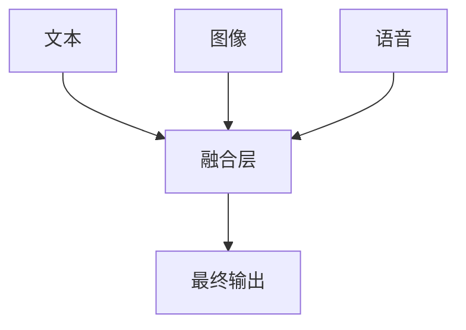
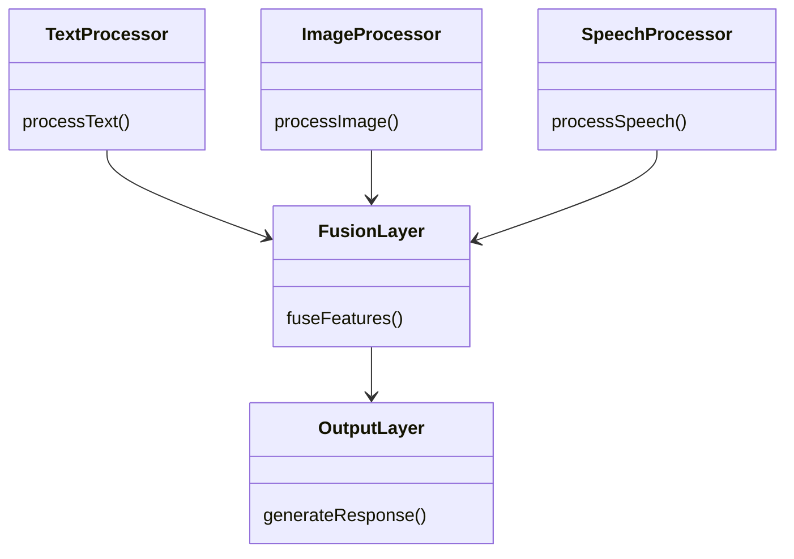
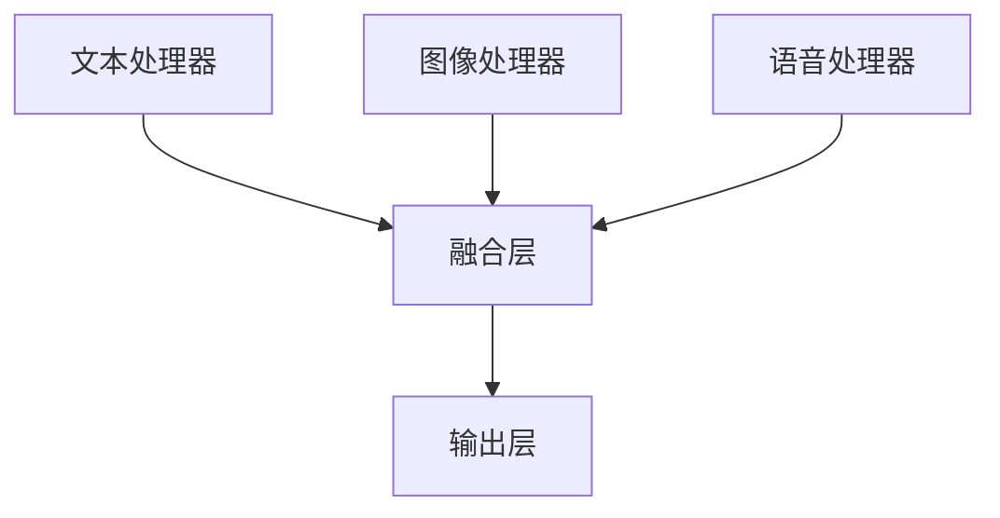
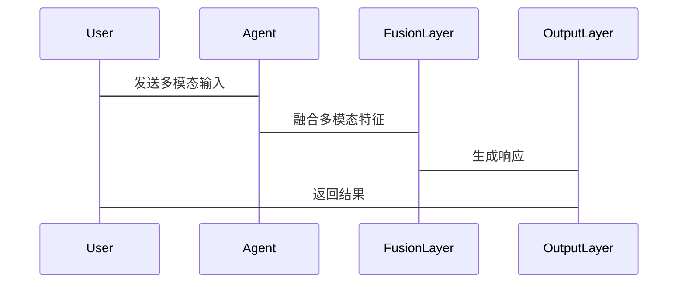

                 


# 多模态融合技术：增强AI Agent的感知与理解能力

> 关键词：多模态融合，AI Agent，感知能力，理解能力，多模态数据，深度学习，注意力机制

> 摘要：多模态融合技术通过整合多种类型的数据（如文本、图像、语音等），显著提升了AI Agent的感知与理解能力。本文将详细探讨多模态融合的核心概念、算法原理、系统架构设计以及实际应用场景，帮助读者全面理解并掌握这一前沿技术。

---

## 第一部分: 多模态融合技术概述

### 第1章: 多模态融合技术的背景与概念

#### 1.1 多模态数据的定义与特点
##### 1.1.1 多模态数据的定义
多模态数据是指来自不同感官渠道（如视觉、听觉、触觉等）的多种数据类型的集合。例如，一段视频可以包含图像数据、语音数据和文本字幕。

##### 1.1.2 各种模态数据的特点对比
| 模态类型 | 数据特点 | 典型应用场景 |
|----------|----------|--------------|
| 文本      | 结构化、可解释性高 | 问答系统、自然语言处理 |
| 图像      | 高维、非结构化 | 图像识别、视频分析 |
| 语音      | 时间序列、情感丰富 | 语音识别、情感分析 |
| 视频      | 包含图像和语音信息 | 视频分析、行为识别 |

##### 1.1.3 多模态数据的典型应用场景
- 跨模态检索：在图像中搜索文本关键词。
- 联合学习：结合文本和图像信息进行分类。
- AI Agent：通过多模态输入提升交互能力。

#### 1.2 多模态融合技术的背景
##### 1.2.1 传统单模态技术的局限性
单模态技术在处理复杂场景时，信息量不足，容易产生歧义。

##### 1.2.2 多模态融合技术的兴起
随着深度学习的发展，多模态融合技术逐渐成为研究热点。

##### 1.2.3 多模态融合技术在AI Agent中的重要性
AI Agent需要处理复杂的现实场景，单模态技术难以满足需求。

#### 1.3 多模态融合的目标与意义
##### 1.3.1 提升AI Agent的感知能力
通过整合多模态信息，AI Agent能够更全面地理解输入。

##### 1.3.2 增强AI Agent的理解能力
多模态融合能够降低歧义，提高理解的准确性。

##### 1.3.3 多模态融合技术的未来发展趋势
向更高效、更自然的融合方式发展，例如基于图神经网络的多模态交互。

---

### 第2章: 多模态融合的核心概念与联系

#### 2.1 多模态数据的融合方式
##### 2.1.1 基于特征的融合方法
在特征层进行融合，例如将文本和图像的特征向量进行拼接。

##### 2.1.2 基于决策的融合方法
在决策层进行融合，例如分别进行分类后再综合结果。

##### 2.1.3 基于模型的融合方法
在模型层进行融合，例如使用多模态注意力机制。

#### 2.2 多模态融合的核心原理
##### 2.2.1 多模态数据的表示方法
- 文本：词嵌入（如Word2Vec）、句嵌入（如BERT）。
- 图像：CNN提取特征图。
- 语音：MFCC特征提取。

##### 2.2.2 多模态数据的对齐技术
- 对齐目标：使不同模态的数据在语义上对齐。
- 对齐方法：基于相似度的对齐、基于深度学习的对齐。

##### 2.2.3 多模态数据的联合学习
- 联合训练：在同一个模型中同时优化多个模态的任务。

#### 2.3 多模态融合的实体关系图


---

### 第3章: 多模态融合的算法原理

#### 3.1 多模态注意力机制
##### 3.1.1 注意力机制的基本原理
注意力机制通过计算不同位置的重要性权重，聚焦于关键信息。

##### 3.1.2 多模态注意力的实现方法
$$\alpha_i = \frac{\exp(s_i)}{\sum_j \exp(s_j)}$$

其中，$\alpha_i$ 是第i个模态的注意力权重，$s_i$ 是打分函数。

##### 3.1.3 多模态注意力的优缺点
优点：能够自动聚焦关键信息；缺点：需要设计合适的打分函数。

#### 3.2 多模态对齐算法
##### 3.2.1 对齐技术的基本概念
对齐技术旨在消除不同模态之间的语义差异。

##### 3.2.2 基于深度学习的对齐方法
- 使用对比损失函数对齐特征。
- 使用自适应变换对齐特征。

##### 3.2.3 对齐技术的数学
$$L_{align} = \sum_{i=1}^n (f(x_i) - f(y_i))^2$$

其中，$f$ 是对齐变换函数，$x_i$ 和 $y_i$ 分别是两个模态的输入。

#### 3.3 多模态融合的数学模型
##### 3.3.1 基于变换的融合模型
$$z = \sigma(W_x x + W_y y + b)$$

其中，$x$ 和 $y$ 是两个模态的输入，$z$ 是融合后的输出。

##### 3.3.2 基于注意力的融合模型
$$z = \sum_{i=1}^n \alpha_i h_i$$

其中，$\alpha_i$ 是注意力权重，$h_i$ 是各模态的特征向量。

---

## 第四部分: 系统分析与架构设计方案

### 第4章: 多模态融合的系统架构设计

#### 4.1 项目介绍
本项目旨在设计一个支持多模态输入的AI Agent系统，能够处理文本、图像和语音等多种数据类型。

#### 4.2 系统功能设计
##### 4.2.1 领域模型设计


##### 4.2.2 系统架构设计


#### 4.3 接口设计与交互流程
##### 4.3.1 系统接口设计
- 输入接口：支持文本、图像、语音等多种格式。
- 输出接口：生成自然语言响应或触发特定动作。

##### 4.3.2 交互流程图


---

## 第五部分: 项目实战

### 第5章: 项目实战与代码实现

#### 5.1 环境安装
安装必要的库：
```bash
pip install numpy matplotlib torch
```

#### 5.2 核心代码实现
##### 5.2.1 多模态注意力机制实现
```python
import torch
import torch.nn as nn

class MultiModalAttention(nn.Module):
    def __init__(self, embed_dim, hidden_dim):
        super().__init__()
        self.W_q = nn.Linear(embed_dim, hidden_dim)
        self.W_k = nn.Linear(embed_dim, hidden_dim)
        self.W_v = nn.Linear(embed_dim, hidden_dim)
        
    def forward(self, x1, x2):
        q = self.W_q(x1)
        k = self.W_k(x2)
        v = self.W_v(x2)
        attn_score = torch.softmax((q @ k.T), dim=-1)
        output = (attn_score @ v)
        return output
```

##### 5.2.2 融合层实现
```python
class FusionLayer(nn.Module):
    def __init__(self, input_size, hidden_size):
        super().__init__()
        self.W = nn.Linear(input_size, hidden_size)
        self.relu = nn.ReLU()
        
    def forward(self, x1, x2):
        fused = torch.cat([x1, x2], dim=1)
        output = self.W(fused)
        output = self.relu(output)
        return output
```

#### 5.3 实际案例分析
以图像和文本联合分类为例，详细分析如何通过多模态融合技术提升分类准确率。

#### 5.4 代码解读与分析
详细解释上述代码的功能，包括输入处理、融合过程和输出生成。

---

## 第六部分: 最佳实践与小结

### 第6章: 最佳实践与小结

#### 6.1 小结
多模态融合技术通过整合多种数据类型，显著提升了AI Agent的感知与理解能力。

#### 6.2 注意事项
- 数据预处理：确保不同模态数据的格式和尺度一致。
- 模型调参：注意各模态之间的权重分配。
- 数据异质性：不同模态数据的特征提取方式可能不同。

#### 6.3 拓展阅读
推荐相关书籍和论文，帮助读者深入理解多模态融合技术。

---

以上是《多模态融合技术：增强AI Agent的感知与理解能力》的技术博客文章的详细大纲和内容。希望对您有所帮助！

