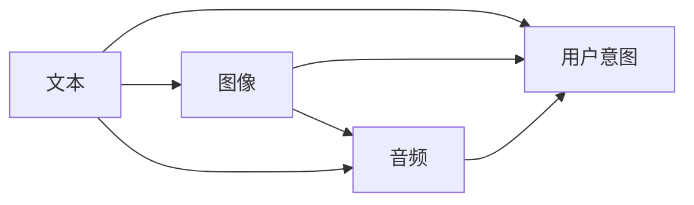
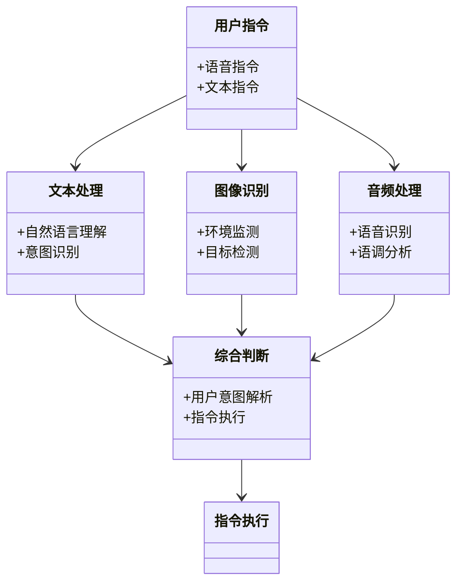
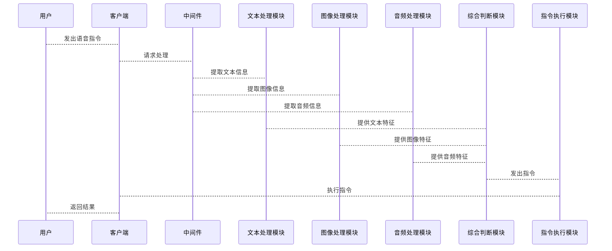

                 


# 多模态输入处理：文本、图像、音频的综合理解

---

## 关键词：
多模态数据，文本处理，图像处理，音频处理，数据融合，多模态模型

---

## 摘要：
多模态输入处理是人工智能领域的核心技术，旨在通过整合文本、图像和音频等多种数据源的信息，提升模型对复杂场景的理解能力。本文从多模态数据的基本概念出发，深入探讨文本、图像和音频的处理方法，分析它们的融合方式，并结合实际案例，详细讲解多模态输入处理的算法原理和系统架构设计。通过本文的学习，读者将能够全面理解多模态输入处理的核心思想和技术实现。

---

# 第一部分: 多模态输入处理概述

## 第1章: 多模态输入处理的背景与概念

### 1.1 多模态数据的定义与特点

#### 1.1.1 多模态数据的定义
多模态数据是指来源于多种感知渠道（如视觉、听觉、触觉等）的数据形式。在人工智能领域，我们主要关注文本、图像和音频这三种模态的数据。每种模态数据都具有独特的信息表示方式和特点：

- **文本**：通过字符、符号和语言结构表示信息，具有语义丰富、易于解析的特点。
- **图像**：通过像素矩阵表示视觉信息，具有空间特征和物体识别能力。
- **音频**：通过波形信号表示声音信息，具有声学特征和语调信息。

#### 1.1.2 多模态数据的核心特点
1. **异构性**：不同模态的数据具有不同的物理表示方式和信息维度。
2. **互补性**：不同模态的数据可以相互补充，共同提供更全面的信息。
3. **多样性**：多模态数据能够覆盖更多的应用场景和用户需求。

#### 1.1.3 多模态数据的分类与应用场景
多模态数据主要分为以下几类：
- **文本+图像**：如图像描述生成、文本驱动的图像生成。
- **文本+音频**：如语音识别与文本理解结合的应用。
- **图像+音频**：如基于视觉和听觉的场景理解。

应用场景包括智能客服、智能家居、自动驾驶、视频分析等领域。

---

### 1.2 多模态输入处理的重要性

#### 1.2.1 多模态数据在人工智能中的地位
人工智能的核心目标是实现对现实世界的全面理解和智能交互。多模态数据的引入使得模型能够更全面地感知和理解环境，从而提升智能系统的实用性和用户体验。

#### 1.2.2 多模态输入处理的现实需求
在实际应用中，单一模态的数据往往无法满足需求。例如，在智能音箱中，用户可能需要通过语音指令结合环境图像来实现复杂的操作。多模态输入处理能够帮助系统更准确地识别用户意图，提高交互的准确性和智能性。

#### 1.2.3 多模态技术的未来发展
随着人工智能技术的不断进步，多模态输入处理将在更多领域得到广泛应用。未来的研究方向将集中在如何更高效地融合多种模态信息，以及如何利用这些信息提升模型的泛化能力和智能水平。

---

### 1.3 多模态输入处理的关键问题

#### 1.3.1 数据融合的挑战
多模态数据的融合需要解决以下问题：
1. **模态间对齐**：不同模态的数据在时间、空间或语义上可能存在对齐问题。
2. **信息冗余与缺失**：某些模态的信息可能在特定场景下冗余或缺失。
3. **模态间关联性**：不同模态之间的信息关联性可能复杂且不明确。

#### 1.3.2 模态间信息关联的难点
不同模态的数据具有不同的信息表示方式，如何建立它们之间的关联关系是多模态输入处理的核心挑战。

#### 1.3.3 多模态模型的构建与优化
多模态模型的构建需要综合考虑多种模态的数据特点，设计高效的融合方法，并通过大量数据进行模型训练和优化。

---

## 第2章: 多模态数据的核心概念与联系

### 2.1 多模态数据的实体关系图



以上关系图展示了文本、图像和音频三种模态之间的相互关联，以及它们如何共同作用于用户意图的识别。

---

### 2.2 多模态数据的属性特征对比

| 属性 | 文本 | 图像 | 音频 |
|------|------|------|------|
| 表示方式 | 文字、符号 | 像素、特征向量 | 频率、时域波形 |
| 信息维度 | 语义、语法 | 视觉特征、物体检测 | 声学特征、语音识别 |
| 处理方式 | NLP技术 | CV技术 | 语音处理技术 |

通过对比不同模态的数据属性，我们可以更好地理解它们的差异和互补性。

---

### 2.3 多模态数据的融合方式

#### 2.3.1 并行融合
并行融合是指同时对多种模态数据进行独立处理，并将结果进行融合。例如，在文本和图像的联合分类任务中，可以分别提取文本和图像的特征，然后通过加权的方式融合这些特征。

#### 2.3.2 串行融合
串行融合是指按顺序对多种模态数据进行处理。例如，先对文本数据进行处理，提取语义信息，再结合图像数据进行目标检测。

#### 2.3.3 混合融合
混合融合是指将并行融合和串行融合结合起来，形成更复杂的融合方式。例如，在智能音箱中，可以先通过语音识别提取关键词，再结合图像数据进行场景识别。

---

## 第3章: 多模态输入处理的算法原理

### 3.1 多模态数据的表示方法

#### 3.1.1 文本表示：词嵌入与句嵌入
文本的表示方法主要依赖于自然语言处理技术。常用的词嵌入方法包括Word2Vec和 GloVe，而句嵌入方法则包括BERT和Sentence-BERT。

#### 3.1.2 图像表示：卷积神经网络与区域表示
图像的表示方法主要依赖于计算机视觉技术。卷积神经网络（CNN）是常用的图像特征提取方法，区域表示（如RPN）用于目标检测和定位。

#### 3.1.3 音频表示：MFCC与神经网络特征提取
音频的表示方法主要依赖于语音信号处理技术。常用的方法包括Mel频率倒谱系数（MFCC）和基于神经网络的特征提取（如CNN或Transformer）。

---

### 3.2 多模态数据融合的算法框架

#### 3.2.1 多模态信息检索模型
多模态信息检索模型主要用于跨模态数据的检索和匹配。例如，给定一段文本，可以检索与之相关的图像或音频数据。

#### 3.2.2 多模态分类模型
多模态分类模型用于对多模态数据进行分类。例如，可以根据文本、图像和音频的综合信息，对视频内容进行分类。

#### 3.2.3 多模态生成模型
多模态生成模型用于生成多种模态的数据。例如，可以根据文本生成图像或音频。

---

### 3.3 多模态数据融合的数学模型

#### 3.3.1 文本-图像融合模型
文本和图像的融合可以通过以下公式表示：
$$ P(text, image) = P(text|image) \times P(image) $$

其中，$P(text|image)$ 表示在给定图像条件下文本的概率，$P(image)$ 是图像的先验概率。

#### 3.3.2 文本-音频融合模型
文本和音频的融合可以通过以下公式表示：
$$ P(text, audio) = P(text|audio) \times P(audio) $$

其中，$P(text|audio)$ 表示在给定音频条件下文本的概率，$P(audio)$ 是音频的先验概率。

---

## 第4章: 多模态输入处理的系统架构设计

### 4.1 问题场景介绍
以智能音箱为例，用户可以通过语音指令与智能音箱进行交互，系统需要同时处理音频和文本数据，实现对用户意图的理解和执行。

### 4.2 系统功能设计

#### 4.2.1 领域模型


---

### 4.3 系统架构设计

#### 4.3.1 系统架构图


---

### 4.4 系统接口设计
系统接口设计需要考虑模块之间的数据传递和交互方式。例如，文本处理模块和音频处理模块需要将处理结果传递给综合判断模块。

---

### 4.5 系统交互设计

#### 4.5.1 序列图


---

## 第5章: 多模态输入处理的项目实战

### 5.1 环境安装
需要安装以下工具和库：
- Python 3.x
- NumPy
- TensorFlow或PyTorch
- OpenCV
- librosa
- transformers

### 5.2 系统核心实现源代码

#### 5.2.1 文本处理代码
```python
from transformers import BertTokenizer, BertModel
import torch

tokenizer = BertTokenizer.from_pretrained('bert-base-uncased')
model = BertModel.from_pretrained('bert-base-uncased')

text = "Hello, how are you?"
inputs = tokenizer(text, return_tensors='pt')
outputs = model(**inputs)
print(outputs.last_hidden_state)
```

#### 5.2.2 图像处理代码
```python
import cv2

image_path = 'image.jpg'
image = cv2.imread(image_path)
gray = cv2.cvtColor(image, cv2.COLOR_BGR2GRAY)
cv2.imwrite('gray_image.jpg', gray)
```

#### 5.2.3 音频处理代码
```python
import librosa

audio_path = 'audio.wav'
audio, sr = librosa.load(audio_path, sr=None)
librosa.display.waveshow(audio, sr=sr)
plt.show()
```

---

### 5.3 代码应用解读与分析
以上代码分别展示了文本、图像和音频的处理过程。文本处理使用了BERT模型提取文本特征，图像处理使用了OpenCV进行图像灰度化，音频处理使用了librosa进行语音信号的可视化。

---

### 5.4 实际案例分析
以智能音箱为例，用户发出语音指令“播放音乐”，系统需要通过语音识别提取指令内容，并结合环境图像进行验证，最终执行播放音乐的操作。

---

## 第6章: 多模态输入处理的总结与展望

### 6.1 总结
多模态输入处理通过整合多种数据源的信息，显著提升了人工智能系统的理解和交互能力。本文从理论到实践，详细讲解了文本、图像和音频的处理方法，以及它们的融合方式。

### 6.2 展望
未来的研究方向将集中在以下方面：
1. 更高效的多模态数据融合方法。
2. 更强大的多模态模型构建技术。
3. 多模态技术在更多领域的应用探索。

---

## 第7章: 最佳实践 tips、小结、注意事项、拓展阅读

### 7.1 最佳实践 tips
1. 在实际应用中，需要根据具体场景选择合适的模态数据和融合方法。
2. 数据预处理和特征提取是多模态输入处理的关键步骤，需要仔细设计和优化。
3. 多模态模型的训练需要大量的多模态数据和高效的计算资源支持。

### 7.2 小结
多模态输入处理是一项复杂但极具潜力的技术，通过本文的学习，读者可以掌握多模态数据的基本概念、处理方法和融合策略。

### 7.3 注意事项
- 多模态数据的融合需要考虑模态间的对齐和关联问题。
- 在实际应用中，需要综合考虑计算资源和模型性能的平衡。

### 7.4 拓展阅读
建议读者进一步阅读以下内容：
- 多模态数据融合的经典论文。
- 最新的多模态模型研究成果。
- 多模态技术在具体领域的应用案例。

---

通过本文的学习，读者将能够全面理解多模态输入处理的核心思想和技术实现，并能够在实际项目中灵活应用这些知识。

