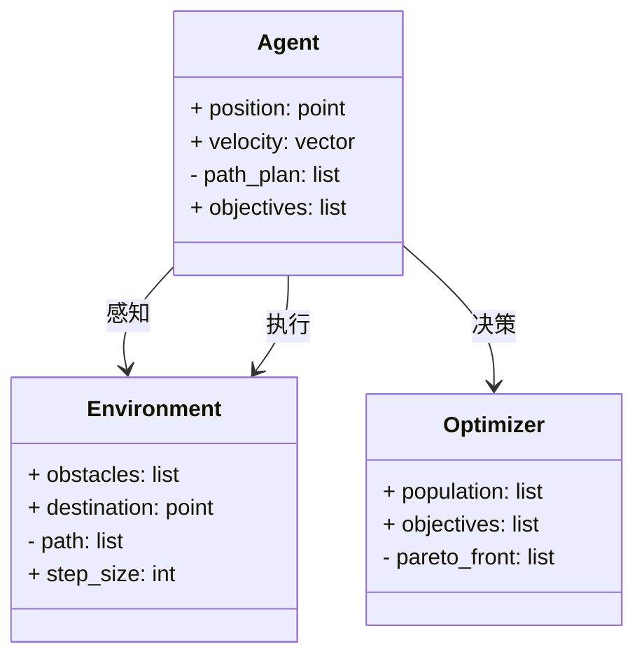
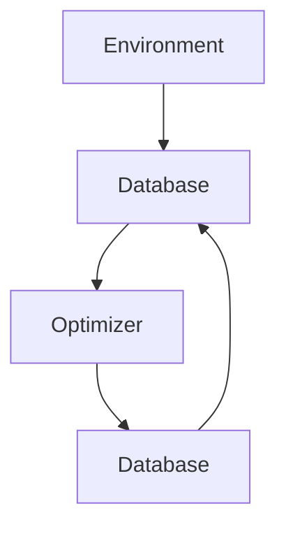
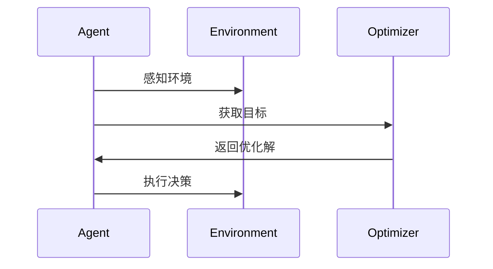

                 


# 多目标优化在AI Agent训练中的应用

> **关键词**：多目标优化、AI Agent、进化算法、Pareto最优解、数学建模、系统架构设计  
> **摘要**：本文详细探讨了多目标优化在AI Agent训练中的应用，从基本概念、算法原理到系统架构设计，结合实际案例分析，深入剖析了多目标优化如何提升AI Agent的性能和复杂问题的解决能力。通过数学建模和代码实现，本文为读者提供了从理论到实践的全面指导。

---

## 第1章：多目标优化与AI Agent的基本概念

### 1.1 多目标优化的定义与特点

#### 1.1.1 什么是多目标优化
多目标优化（Multi-objective Optimization，MOO）是指在优化过程中需要同时考虑多个目标函数的情况。与单目标优化不同，MOO的问题通常涉及多个相互冲突的目标，例如在AI Agent中，可能需要在效率、准确性和计算资源之间进行权衡。

**特点**：
- **多目标性**：同时优化多个目标，而非单一目标。
- **Pareto最优性**：寻找一组最优解，使得在不损害一个目标的情况下，无法改善另一个目标。
- **复杂性**：多个目标之间的权衡使得问题更加复杂，需要综合考虑。

#### 1.1.2 多目标优化的核心特点
多目标优化的核心在于寻找一组Pareto最优解，这些解在不同目标之间达到了平衡。例如，在AI Agent的训练中，可能需要在性能和计算效率之间找到最佳平衡点。

#### 1.1.3 多目标优化与单目标优化的区别
- 单目标优化：只有一个目标函数，优化过程简单直接。
- 多目标优化：多个目标函数，需要权衡和折中，优化过程复杂。

### 1.2 AI Agent的基本概念

#### 1.2.1 什么是AI Agent
AI Agent（人工智能代理）是指能够感知环境、自主决策并执行任务的智能实体。它可以是一个软件程序或物理设备，通过感知和学习来优化其行为。

#### 1.2.2 AI Agent的分类与应用场景
AI Agent可以分为简单反射型、基于模型的反应型、目标驱动型和效用驱动型。应用场景包括自动驾驶、智能推荐系统、游戏AI等。

#### 1.2.3 AI Agent的核心功能与挑战
- **核心功能**：感知、决策、执行。
- **挑战**：在复杂环境中做出最优决策，需要同时考虑多个目标，如效率、准确性和资源消耗。

---

## 第2章：多目标优化在AI Agent训练中的应用背景

### 2.1 AI Agent训练中的问题与挑战

#### 2.1.1 单目标优化的局限性
单目标优化无法应对AI Agent训练中的多个目标冲突，例如在自动驾驶中，可能需要在速度和安全性之间权衡。

#### 2.1.2 多目标优化在AI Agent中的必要性
AI Agent需要在多个目标之间找到平衡，多目标优化是实现这一目标的关键。

#### 2.1.3 多目标优化的应用场景
- 自动驾驶中的路径规划。
- 智能推荐系统中的用户体验优化。
- 游戏AI中的策略选择。

### 2.2 多目标优化与AI Agent的结合

#### 2.2.1 多目标优化在AI Agent训练中的作用
通过多目标优化，AI Agent可以在多个目标之间找到最优解，提升整体性能。

#### 2.2.2 多目标优化如何提升AI Agent的性能
通过Pareto优化，AI Agent可以在多个目标之间找到平衡，避免过度优化单一目标而导致其他目标受损。

#### 2.2.3 多目标优化与AI Agent的未来发展方向
随着AI技术的进步，多目标优化在AI Agent中的应用将更加广泛，特别是在复杂环境中的自主决策。

---

## 第3章：多目标优化的核心概念与原理

### 3.1 多目标优化的核心概念

#### 3.1.1 目标函数的定义与分类
目标函数是多目标优化的核心，通常分为主要目标和次要目标。

#### 3.1.2 Pareto最优解的概念
Pareto最优解是指在不损害一个目标的情况下，无法进一步优化另一个目标的解。

#### 3.1.3 多目标优化的数学模型
多目标优化的数学模型可以表示为：
$$ \min f_1(x), f_2(x), \ldots, f_n(x) $$
其中，$x$是决策变量，$f_i(x)$是目标函数。

### 3.2 多目标优化的算法原理

#### 3.2.1 常见多目标优化算法概述
- NSGA-II：基于Pareto的多目标优化算法。
- MOEA/D：基于分解的多目标优化算法。

#### 3.2.2 基于 Pareto 优化的算法原理
Pareto优化通过逐步逼近Pareto前沿，找到一组最优解。

#### 3.2.3 多目标优化算法的优缺点对比
- NSGA-II：优点是收敛速度快，缺点是计算复杂度高。
- MOEA/D：优点是计算效率高，缺点是收敛速度较慢。

---

## 第4章：多目标优化算法的数学模型与公式

### 4.1 多目标优化的数学模型

#### 4.1.1 多目标优化的数学表达式
$$ \text{minimize } f_1(x), f_2(x), \ldots, f_n(x) $$
$$ \text{subject to } g_i(x) \leq 0, h_j(x) = 0 $$

#### 4.1.2 目标函数的权重分配
目标函数的权重可以通过线性组合来表示：
$$ w_1 f_1(x) + w_2 f_2(x) + \ldots + w_n f_n(x) $$

#### 4.1.3 约束条件的处理方法
约束条件可以通过拉格朗日乘数法来处理。

### 4.2 常见多目标优化算法的数学推导

#### 4.2.1 NSGA-II算法的数学模型
NSGA-II通过生成非支配解集，逐步逼近Pareto前沿。

#### 4.2.2 MOEA/D算法的数学推导
MOEA/D通过分解目标函数，将多目标优化问题转化为单目标优化问题。

#### 4.2.3 基于分解的多目标优化算法公式
$$ f_i(x) = w_i \cdot f_1(x) + (1 - w_i) \cdot f_2(x) $$

---

## 第5章：多目标优化算法的实现与应用

### 5.1 多目标优化算法的实现步骤

#### 5.1.1 算法初始化
初始化种群，随机生成决策变量。

#### 5.1.2 进化过程
包括选择、交叉和变异操作。

#### 5.1.3 适应度评估与 Pareto 优化
评估每个个体的适应度，并筛选出Pareto最优解。

### 5.2 多目标优化算法的Python实现

#### 5.2.1 NSGA-II算法的Python代码实现

```python
import random

class Solution:
    def __init__(self, objectives, constraints):
        self.objectives = objectives
        self.constraints = constraints

def crossover(parent1, parent2):
    # 单点交叉
    point = random.randint(0, len(parent1.objectives))
    return Solution(parent1.objectives[:point] + parent2.objectives[point:], ...)

def mutate(solution):
    # 随机变异
    for i in range(len(solution.objectives)):
        solution.objectives[i] += random.gauss(0, 0.1)
    return solution
```

#### 5.2.2 MOEA/D算法的Python代码实现

```python
import numpy as np

def moead(population_size, objectives, constraints):
    for i in range(population_size):
        # 分解目标函数
        weights = np.random.rand(population_size)
        normalized_weights = weights / np.sum(weights)
        for j in range(population_size):
            if i != j:
                # 计算目标函数的加权和
                weighted_objective = sum(normalized_weights[j] * objectives[j] for j in range(population_size))
                # 更新当前个体的目标函数
                objectives[i] += weighted_objective
```

---

## 第6章：系统分析与架构设计方案

### 6.1 问题场景介绍

#### 6.1.1 项目背景介绍
设计一个基于多目标优化的AI Agent，用于自动驾驶中的路径规划。

### 6.2 系统功能设计

#### 6.2.1 系统功能模块
- 感知模块：感知环境。
- 决策模块：基于多目标优化做出决策。
- 执行模块：执行任务。

#### 6.2.2 领域模型（Mermaid 类图）



### 6.3 系统架构设计

#### 6.3.1 系统架构图（Mermaid架构图）



#### 6.3.2 系统接口设计



---

## 第7章：项目实战

### 7.1 环境安装

#### 7.1.1 安装Python环境
安装Python 3.x及以上版本。

#### 7.1.2 安装依赖库
安装numpy、pymoo等库。

### 7.2 系统核心实现源代码

#### 7.2.1 NSGA-II算法实现

```python
import random

class Solution:
    def __init__(self, objectives):
        self.objectives = objectives

def nsga_ii(population_size, objectives):
    population = [Solution([random.uniform(0, 1) for _ in range(len(objectives))]) for _ in range(population_size)]
    for _ in range(100):
        new_population = []
        for _ in range(population_size):
            parent1 = random.choice(population)
            parent2 = random.choice(population)
            child = crossover(parent1, parent2)
            child = mutate(child)
            new_population.append(child)
        population = new_population
    return population

def crossover(parent1, parent2):
    point = random.randint(0, len(parent1.objectives))
    return Solution(parent1.objectives[:point] + parent2.objectives[point:])

def mutate(solution):
    for i in range(len(solution.objectives)):
        solution.objectives[i] += random.gauss(0, 0.1)
    return solution
```

---

## 第8章：最佳实践、小结、注意事项和拓展阅读

### 8.1 最佳实践

#### 8.1.1 算法选择
根据具体问题选择合适的多目标优化算法。

#### 8.1.2 参数调优
合理设置算法参数，如种群大小、交叉率等。

### 8.2 小结

多目标优化在AI Agent训练中的应用前景广阔，通过合理选择算法和参数，可以显著提升AI Agent的性能。

### 8.3 注意事项

- 确保算法收敛性。
- 处理好约束条件。
- 避免过度优化单一目标。

### 8.4 拓展阅读

推荐阅读相关论文和书籍，深入理解多目标优化的理论和应用。

---

以上是《多目标优化在AI Agent训练中的应用》的技术博客文章目录和部分内容，涵盖了从基础概念到实际应用的各个方面，旨在为读者提供全面而深入的指导。

