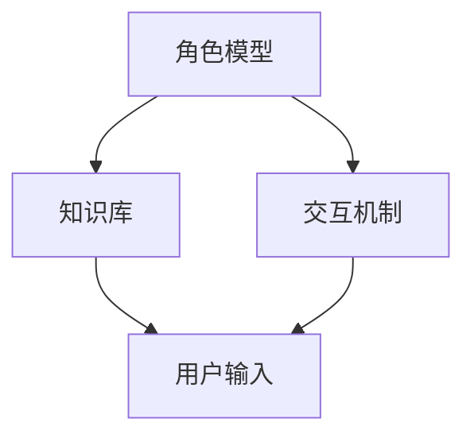
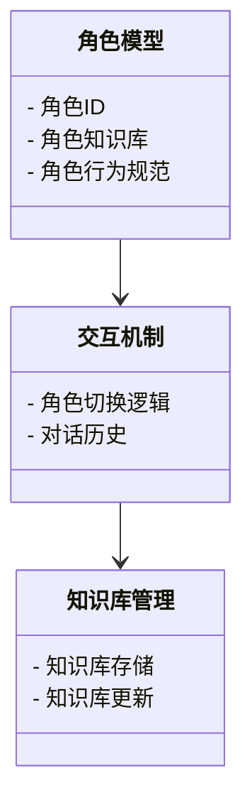
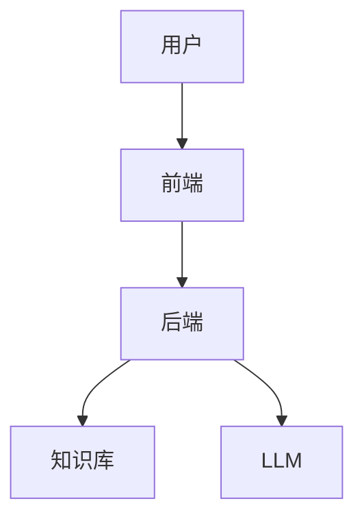
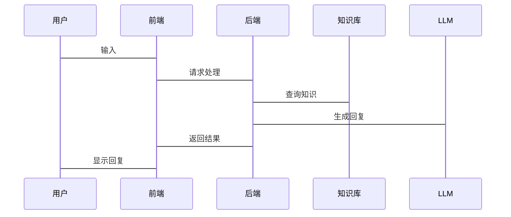

                 


# 多角色AI Agent：基于LLM的虚拟角色扮演系统

> 关键词：多角色AI Agent, LLM, 虚拟角色扮演, 自然语言处理, 人工智能系统

> 摘要：本文将详细探讨多角色AI Agent的设计与实现，基于大语言模型（LLM）构建虚拟角色扮演系统，分析其核心概念、算法原理、系统架构及项目实现。通过本文章，读者将深入了解多角色AI Agent的工作原理，并掌握其实现的关键技术。

---

# 第一部分: 多角色AI Agent概述

## 第1章: 多角色AI Agent的背景与概念

### 1.1 多角色AI Agent的定义与背景

#### 1.1.1 问题背景与问题描述
在现代人工智能系统中，单一角色的AI代理难以满足复杂场景的需求。例如，在客服系统中，AI代理需要同时扮演客户支持、技术咨询和投诉处理等多种角色；在教育领域，AI代理需要模拟教师、学生和家长等不同角色。传统的单角色AI代理在处理这类复杂场景时，缺乏灵活性和适应性，无法满足用户需求。

#### 1.1.2 多角色AI Agent的核心概念
多角色AI Agent是一种能够动态切换和扮演多个角色的智能系统。它通过结合大语言模型（LLM）和知识库管理，实现角色间的无缝切换和信息共享。多角色AI Agent的核心在于其角色模型的设计、交互机制的实现以及知识库的动态管理。

#### 1.1.3 多角色AI Agent的边界与外延
多角色AI Agent的边界包括角色模型的构建、交互机制的设计和知识库的管理。其外延则涉及自然语言处理、机器学习和知识图谱等技术。

### 1.2 多角色AI Agent的核心要素组成

#### 1.2.1 角色模型的构建
角色模型是多角色AI Agent的核心，它定义了每个角色的行为规范、知识库和交互规则。例如，在教育场景中，AI代理可以分别扮演教师、学生和家长，每个角色都有其独特的知识库和行为模式。

#### 1.2.2 交互机制的设计
多角色AI Agent的交互机制需要支持角色间的切换和信息共享。例如，在客服系统中，当用户的问题超出当前角色的知识范围时，AI代理可以自动切换到另一个角色，并调用相关知识库提供解决方案。

#### 1.2.3 知识库的管理
多角色AI Agent需要管理多个角色的知识库，包括每个角色的专用知识和通用知识。知识库的动态更新和管理是实现多角色AI Agent的关键。

---

## 第2章: 多角色AI Agent的核心概念与联系

### 2.1 多角色AI Agent的核心原理

#### 2.1.1 LLM在多角色AI Agent中的作用
大语言模型（LLM）通过其强大的自然语言处理能力，为多角色AI Agent提供了语义理解和生成能力。例如，LLM可以理解用户的输入并生成符合当前角色的回复。

#### 2.1.2 多角色切换的实现机制
多角色切换的实现机制包括角色识别、知识库切换和交互模式调整。例如，在医疗场景中，AI代理需要在医生、患者和护士之间切换，每个角色都有其特定的对话方式和知识库。

#### 2.1.3 知识库的动态更新与管理
多角色AI Agent的知识库需要动态更新，以适应不同场景的需求。例如，当新的医疗知识发布时，AI代理需要更新其医生角色的知识库。

### 2.2 多角色AI Agent的核心概念对比

#### 2.2.1 多角色AI Agent与单角色AI Agent的对比
| 对比维度 | 单角色AI Agent | 多角色AI Agent |
|----------|----------------|-----------------|
| 功能     | 单一角色         | 多个角色         |
| 复杂度   | 较低             | 较高             |
| 应用场景 | 简单场景         | 复杂场景         |

#### 2.2.2 多角色AI Agent与传统对话系统的区别
传统对话系统通常基于预定义的对话树，而多角色AI Agent基于大语言模型，能够动态切换角色并适应不同场景。

#### 2.2.3 多角色AI Agent的优缺点分析
- **优点**：灵活性高、适应性强。
- **缺点**：实现复杂、资源消耗大。

### 2.3 实体关系图（ER图）分析

#### 2.3.1 实体关系图的构建


#### 2.3.2 实体关系图的分析与优化
通过ER图可以看出，角色模型是多角色AI Agent的核心，它与知识库和交互机制密切相关。

---

## 第3章: 多角色AI Agent的算法原理

### 3.1 大语言模型（LLM）的算法原理

#### 3.1.1 LLM的模型结构
大语言模型通常采用Transformer架构，包括编码器和解码器。编码器负责将输入文本转换为向量表示，解码器负责生成输出文本。

#### 3.1.2 LLM的训练过程
大语言模型的训练过程包括数据预处理、模型初始化、正向传播和反向传播。损失函数通常采用交叉熵损失函数：
$$ L = -\sum_{i=1}^{n} \log p(y_i|x_i) $$

#### 3.1.3 LLM的推理机制
推理过程包括解码器的逐步生成，每个步骤都基于之前的输出生成下一个词。

### 3.2 多角色切换的算法实现

#### 3.2.1 角色切换的触发条件
角色切换通常基于用户的输入或系统状态。例如，当用户提到“转接技术部门”时，AI代理会切换到技术支持角色。

#### 3.2.2 角色切换的实现步骤
1. 用户输入：用户输入触发切换的指令。
2. 角色识别：系统识别当前需要切换的角色。
3. 知识库切换：切换到对应角色的知识库。
4. 交互模式调整：调整对话模式以适应新角色。

#### 3.2.3 角色切换的优化策略
- **上下文保留**：保留部分上下文以确保连续性。
- **知识库融合**：将多个角色的知识库进行融合，避免信息冲突。

### 3.3 知识库管理的算法实现

#### 3.3.1 知识库的存储结构
知识库通常采用图结构，节点表示实体，边表示关系。

#### 3.3.2 知识库的查询算法
基于图的最短路径算法，例如Dijkstra算法：
$$ d(s, t) = \min_{p \in P} \sum_{(u,v) \in p} w(u,v) $$

#### 3.3.3 知识库的更新算法
基于增量式更新，例如通过对比新旧知识库的差异进行更新。

---

## 第4章: 多角色AI Agent的系统分析与架构设计方案

### 4.1 系统功能需求分析

#### 4.1.1 用户需求分析
用户需要一个多角色AI Agent系统，能够根据输入切换角色并提供相应的服务。

#### 4.1.2 系统功能模块划分
- 角色模型模块
- 交互机制模块
- 知识库管理模块

#### 4.1.3 系统性

### 4.2 系统功能设计

#### 4.2.1 领域模型


### 4.3 系统架构设计

#### 4.3.1 系统架构图


#### 4.3.2 系统接口设计
- 用户接口：处理用户输入和输出。
- 系统接口：与知识库和LLM进行交互。

### 4.4 系统交互流程

#### 4.4.1 交互流程图


---

## 第5章: 多角色AI Agent的项目实战

### 5.1 环境安装

#### 5.1.1 环境配置
- 安装Python
- 安装LLM框架（如Hugging Face）
- 安装知识库管理工具（如Neo4j）

### 5.2 系统核心实现

#### 5.2.1 核心代码实现
```python
class RoleModel:
    def __init__(self, role_id, knowledge_base):
        self.role_id = role_id
        self.knowledge_base = knowledge_base

class InteractionMechanism:
    def __init__(self, role_model):
        self.role_model = role_model

    def switch_role(self, new_role_id):
        self.role_model.role_id = new_role_id
```

#### 5.2.2 代码应用解读
- `RoleModel`负责管理角色和知识库。
- `InteractionMechanism`负责角色切换和交互逻辑。

### 5.3 实际案例分析

#### 5.3.1 案例分析
- **场景**：医疗咨询
- **角色切换**：从医生到患者
- **知识库更新**：更新医疗知识库

### 5.4 项目总结

---

## 第6章: 多角色AI Agent的最佳实践

### 6.1 小结

### 6.2 注意事项

### 6.3 拓展阅读

---

通过以上步骤，我们逐步构建了多角色AI Agent的理论基础和实现方案。希望本文对读者理解多角色AI Agent的设计与实现有所帮助。

