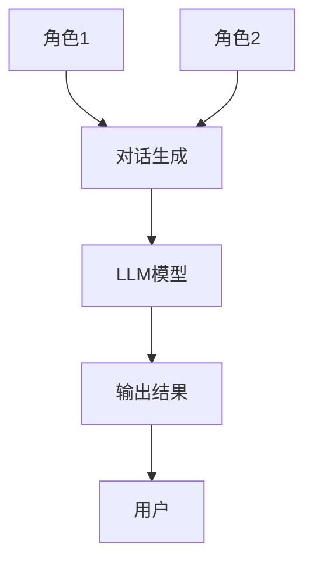
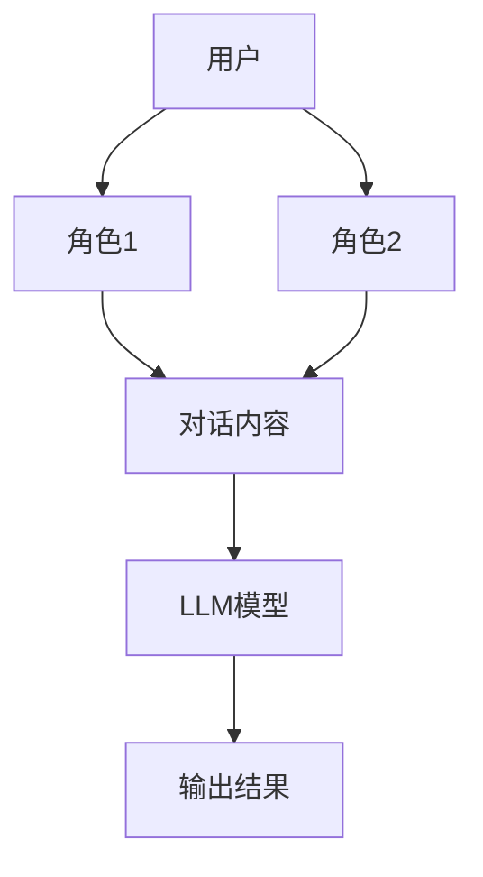
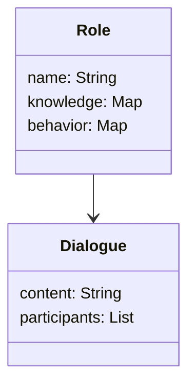
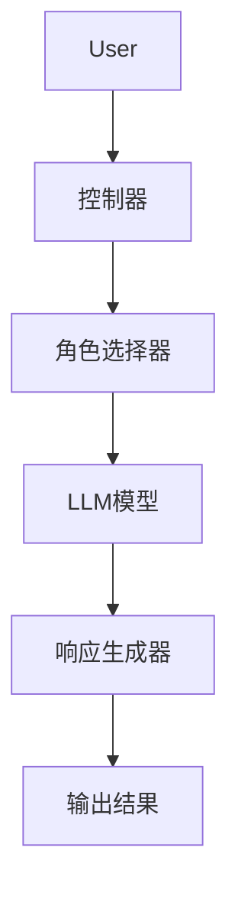
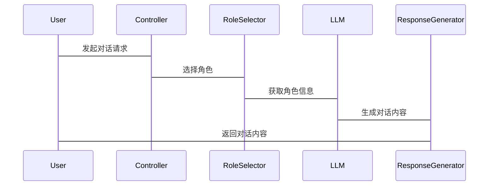

                 


# 多角色扮演AI Agent：基于LLM的复杂场景模拟

> 关键词：多角色AI Agent，LLM，复杂场景模拟，对话生成，系统架构，项目实战

> 摘要：本文深入探讨了多角色扮演AI Agent在复杂场景模拟中的应用，从背景介绍、核心概念到算法原理、系统架构，再到项目实战和最佳实践，详细分析了如何构建和优化多角色协作系统。文章结合理论与实践，提供了丰富的技术细节和案例分析，为读者理解并应用多角色AI Agent提供了全面的指导。

---

## 第一部分: 多角色扮演AI Agent的背景与概念

### 第1章: 多角色扮演AI Agent的背景与概念

#### 1.1 多角色扮演AI Agent的定义与背景

##### 1.1.1 多角色扮演AI Agent的定义
多角色扮演AI Agent（Multi-Role Playing AI Agent，简称MRP Agent）是一种基于大语言模型（Large Language Model，LLM）的人工智能系统，能够模拟多个虚拟角色之间的互动和协作，完成复杂的场景模拟任务。这些角色可以是不同的“人物”，每个角色都有自己的知识、目标和行为模式，通过对话和协作共同完成任务。

##### 1.1.2 多角色扮演AI Agent的发展背景
随着LLM技术的快速发展，AI Agent的应用场景逐渐从单一任务扩展到多角色协作的复杂场景。例如，在教育、游戏、客服等领域，多角色协作能够提供更丰富、更个性化的用户体验。传统的单角色AI Agent难以满足复杂场景中的多样化需求，而MRP Agent通过模拟多个角色的协作，能够更好地应对复杂任务。

##### 1.1.3 多角色扮演AI Agent的应用价值
- **教育领域**：模拟教师、学生、助教等多种角色，提供个性化的学习体验。
- **游戏领域**：创建虚拟角色之间的互动，提升游戏的沉浸感和趣味性。
- **客服领域**：模拟多个角色（如客户、客服代表、技术支持）进行对话，提供更高效的解决方案。
- **培训领域**：模拟真实工作场景中的多种角色，帮助用户进行实战演练。

#### 1.2 多角色扮演AI Agent的核心问题与挑战

##### 1.2.1 多角色协作中的问题描述
在多角色协作中，每个角色都需要独立思考和决策，同时需要与其他角色保持一致，确保任务的顺利进行。这涉及到角色之间的信息传递、决策协调以及冲突处理等问题。

##### 1.2.2 多角色互动中的关键挑战
- **角色一致性**：确保每个角色的行为和决策符合其设定的目标和知识背景。
- **协作效率**：在复杂场景中，角色之间的协作需要高效且有序，避免冗余和冲突。
- **用户体验**：多角色互动需要流畅且自然，避免让用户感到机械或不连贯。

##### 1.2.3 多角色场景模拟的边界与外延
- **边界**：MRP Agent的协作范围通常局限于特定的场景和任务，不会超出预设的框架。
- **外延**：MRP Agent可以通过扩展角色的数量和复杂度，应用于更多领域和场景。

#### 1.3 多角色扮演AI Agent的核心要素与概念结构

##### 1.3.1 核心要素组成
- **角色定义**：每个角色都有明确的职责、知识和行为模式。
- **对话生成**：基于LLM的对话生成技术，确保角色之间的互动自然流畅。
- **协作机制**：角色之间通过信息共享和决策协调完成任务。
- **系统架构**：支持多角色协作的系统架构，确保各角色之间的高效互动。

##### 1.3.2 概念结构与关系分析
通过图1-1，我们可以清晰地看到多角色协作系统中各要素之间的关系：



图1-1展示了多角色协作系统的核心要素及其关系。

##### 1.3.3 多角色协作的系统架构
多角色协作系统通常采用分层架构，包括角色定义层、对话生成层和系统控制层。各层之间通过接口进行交互，确保系统的高效运行。

---

### 第2章: 多角色扮演AI Agent的核心概念与联系

#### 2.1 多角色扮演AI Agent的核心概念原理

##### 2.1.1 多角色协作的原理分析
多角色协作的核心在于角色之间的信息共享和决策协调。每个角色都有自己的知识库和行为规则，通过对话生成技术，角色之间可以共享信息，协调行动，最终完成任务。

##### 2.1.2 基于LLM的对话生成机制
基于LLM的对话生成技术是多角色协作的核心技术之一。通过LLM模型，系统能够生成自然流畅的对话内容，确保角色之间的互动真实可信。

##### 2.1.3 多角色协作的系统架构
多角色协作系统通常采用分布式架构，每个角色作为一个独立的组件，通过通信接口进行交互。系统控制层负责协调角色之间的协作，确保任务的顺利进行。

#### 2.2 多角色扮演AI Agent的概念属性特征对比

##### 2.2.1 多角色协作与单角色AI的区别
| 特性          | 多角色协作 | 单角色AI |
|---------------|------------|----------|
| 角色数量      | 多个       | 单个     |
| 互动复杂度    | 高         | 低       |
| 应用场景      | 多领域     | 单一任务 |

##### 2.2.2 基于LLM的对话生成与传统对话生成的对比
| 特性          | 基于LLM的对话生成 | 传统对话生成 |
|---------------|------------------|--------------|
| 自然性        | 高               | 较低         |
| 可扩展性      | 高               | 较低         |
| 应用领域      | 多领域           | 单一领域     |

##### 2.2.3 多角色协作的系统特征分析
多角色协作系统具有以下特征：
- **分布式架构**：角色之间通过通信接口进行交互。
- **动态协作**：角色可以根据任务需求动态调整协作方式。
- **智能化决策**：每个角色都有一定的自主决策能力，能够根据对话内容调整行为。

#### 2.3 多角色扮演AI Agent的ER实体关系图



图2-1展示了多角色协作系统中用户、角色、对话内容和LLM模型之间的关系。

---

### 第3章: 多角色扮演AI Agent的算法原理

#### 3.1 基于LLM的对话生成算法

##### 3.1.1 对话生成的基本流程
对话生成的基本流程包括以下步骤：
1. **输入处理**：接收用户的输入或系统触发的对话请求。
2. **角色选择**：根据当前场景和任务需求，选择合适的角色。
3. **对话生成**：基于LLM模型生成对话内容。
4. **输出结果**：将生成的对话内容返回给用户或系统。

##### 3.1.2 基于LLM的对话生成模型
基于LLM的对话生成模型通常采用Transformer架构，通过自注意力机制生成自然流畅的对话内容。模型的训练数据包括大量的多角色对话样本，确保生成的对话符合角色设定。

##### 3.1.3 对话生成的数学模型与公式
对话生成模型的数学模型可以表示为：
$$
P(y|x) = \prod_{i=1}^{n} P(y_i|x_{1..i-1}, y_{1..i-1})
$$
其中，$x$ 表示输入序列，$y$ 表示输出序列，$y_i$ 表示第 $i$ 个输出 token。

#### 3.2 多角色协作的算法实现

##### 3.2.1 多角色协作的算法框架
多角色协作的算法框架包括角色选择、对话生成和协作控制三个部分。角色选择模块负责选择合适的角色，对话生成模块生成对话内容，协作控制模块负责协调角色之间的协作。

##### 3.2.2 基于LLM的多角色对话生成流程
基于LLM的多角色对话生成流程包括以下步骤：
1. **角色定义**：为每个角色定义知识库和行为规则。
2. **角色选择**：根据当前任务需求选择合适的角色。
3. **对话生成**：基于LLM模型生成对话内容。
4. **协作控制**：协调角色之间的协作，确保任务的顺利进行。

##### 3.2.3 多角色协作的优化算法
多角色协作的优化算法包括角色选择优化和对话生成优化两个部分。角色选择优化算法通过强化学习优化角色选择策略，对话生成优化算法通过改进LLM模型提升对话生成质量。

#### 3.3 算法实现的Python代码示例

##### 3.3.1 角色选择算法
```python
def select_role(task, roles):
    # 根据任务选择合适的角色
    for role in roles:
        if role['compatible_with'](task):
            return role
    return None
```

##### 3.3.2 对话生成算法
```python
def generate_response(role, input_text):
    # 假设使用GPT-3作为LLM模型
    response = model.generate(input_text, role=role)
    return response
```

##### 3.3.3 协作控制算法
```python
def coordinate_collaboration(roles, responses):
    # 根据对话内容协调角色之间的协作
    for role in roles:
        if role['name'] in responses:
            role['update'](responses[role['name']])
```

---

### 第4章: 多角色扮演AI Agent的系统分析与架构设计

#### 4.1 系统功能设计

##### 4.1.1 领域模型设计


##### 4.1.2 系统架构设计


##### 4.1.3 系统接口设计
- **用户接口**：接收用户的输入或触发对话请求。
- **角色选择器接口**：根据任务需求选择合适的角色。
- **LLM模型接口**：生成对话内容。
- **输出接口**：将生成的对话内容返回给用户或系统。

#### 4.2 系统交互设计

##### 4.2.1 系统交互流程图


---

### 第5章: 多角色扮演AI Agent的项目实战

#### 5.1 环境安装与配置

##### 5.1.1 安装Python环境
```bash
python --version
pip install --upgrade pip
```

##### 5.1.2 安装LLM模型
```bash
pip install transformers
pip install torch
```

#### 5.2 核心代码实现

##### 5.2.1 角色定义代码
```python
class Role:
    def __init__(self, name, knowledge, behavior):
        self.name = name
        self.knowledge = knowledge
        self.behavior = behavior
```

##### 5.2.2 对话生成代码
```python
def generate_response(role, input_text):
    model = AutoModelForCausalLM.from_pretrained('gpt2')
    tokenizer = AutoTokenizer.from_pretrained('gpt2')
    inputs = tokenizer(input_text, return_tensors='np')
    outputs = model.generate(**inputs, max_length=50)
    response = tokenizer.decode(outputs[0].tolist(), skip_special_tokens=True)
    return response
```

##### 5.2.3 协作控制代码
```python
def coordinate_collaboration(roles, responses):
    for role in roles:
        if role.name in responses:
            role.update(responses[role.name])
```

#### 5.3 实际案例分析与代码解读

##### 5.3.1 案例分析
假设我们有一个教育场景，需要模拟教师和学生之间的对话。教师角色负责解答学生的疑问，学生角色负责提出问题。通过MRP Agent，我们可以实现教师和学生的互动，提供个性化的学习体验。

##### 5.3.2 代码解读
- **角色定义**：定义教师和学生两个角色，分别设定其知识库和行为规则。
- **对话生成**：基于LLM模型生成对话内容，确保对话的自然流畅。
- **协作控制**：协调教师和学生之间的协作，确保对话的顺利进行。

#### 5.4 项目总结

##### 5.4.1 项目成功之处
- 实现了多角色协作的系统架构。
- 提供了自然流畅的对话生成能力。
- 在教育场景中实现了个性化的学习体验。

##### 5.4.2 项目不足之处
- 对话生成的质量仍有提升空间。
- 系统的协作控制需要进一步优化。

##### 5.4.3 项目经验总结
多角色协作系统的设计需要综合考虑角色定义、对话生成和协作控制三个方面的内容。在实际应用中，需要根据具体场景需求进行调整和优化，以提升系统的性能和用户体验。

---

## 第六部分: 最佳实践与总结

### 6.1 最佳实践

#### 6.1.1 小结
多角色扮演AI Agent通过模拟多个角色之间的互动和协作，能够实现复杂场景的模拟任务。本文详细探讨了MRP Agent的核心概念、算法原理、系统架构和项目实战，为读者提供了全面的指导。

#### 6.1.2 注意事项
- 在角色定义时，需要确保每个角色的知识库和行为规则清晰明确。
- 对话生成的质量直接影响用户体验，需要不断优化和改进。
- 系统的协作控制需要根据具体场景需求进行调整和优化。

#### 6.1.3 拓展阅读
- 《Large Language Models: A Survey》
- 《Multi-Agent Systems: A Modern Perspective》
- 《对话生成的数学模型与算法优化》

### 6.2 总结

#### 6.2.1 总结
多角色扮演AI Agent的应用前景广阔，随着LLM技术的不断发展，MRP Agent将在更多领域发挥重要作用。通过本文的探讨，我们希望能够为读者提供关于MRP Agent的全面指导，帮助他们在实际应用中更好地设计和优化多角色协作系统。

#### 6.2.2 展望
未来，MRP Agent将朝着以下方向发展：
- 更加智能化的角色协作机制。
- 更加高效和自然的对话生成技术。
- 更广泛的应用场景和领域。

---

通过本文的详细探讨，我们希望能够为读者提供关于多角色扮演AI Agent的全面指导，帮助他们在实际应用中更好地设计和优化多角色协作系统。

