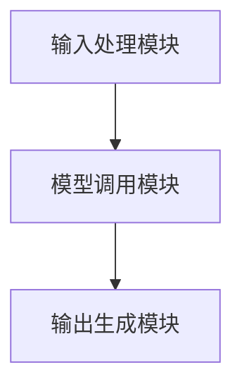
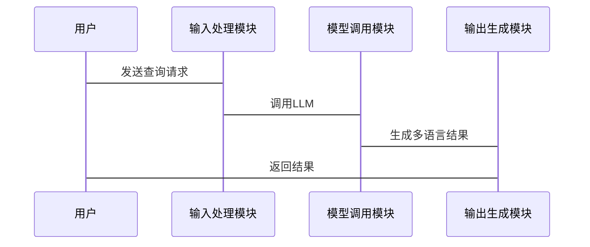

                 


# 多语言AI Agent：LLM在跨语言交流中的应用

## 关键词：多语言AI Agent, 大语言模型, 跨语言交流, 自然语言处理, 人工智能, 机器学习

## 摘要：  
本文深入探讨了多语言AI Agent在跨语言交流中的应用，详细分析了其核心概念、算法原理、系统架构设计以及实际项目实现。通过结合大语言模型（LLM）的技术优势，本文揭示了多语言AI Agent在自然语言处理领域的潜力，并通过具体案例展示了其在实际应用中的优势与挑战。本文适合对AI技术、自然语言处理和跨语言交流感兴趣的读者阅读。

---

# 第1章: 多语言AI Agent的背景与概念

## 1.1 多语言AI Agent的定义与背景  

### 1.1.1 多语言AI Agent的概念  
多语言AI Agent（Multi-language AI Agent）是指能够理解和生成多种语言的智能体。它结合了自然语言处理（NLP）和人工智能（AI）技术，能够在多种语言环境中与用户进行交互。  

### 1.1.2 多语言AI Agent的发展背景  
随着全球化进程的加速，跨语言交流的需求日益增加。传统的单语言AI模型难以满足用户在多语言环境下的多样化需求，因此，多语言AI Agent应运而生。  

### 1.1.3 多语言AI Agent的应用场景  
- **跨语言客服系统**：支持多种语言的客户支持服务。  
- **多语言内容生成**：生成多种语言的文本内容。  
- **教育辅助工具**：帮助学习者进行多语言学习和翻译。  

## 1.2 大语言模型（LLM）的概述  

### 1.2.1 大语言模型的基本概念  
大语言模型（Large Language Model, LLM）是指经过大量多语言数据训练的深度学习模型，具有强大的文本生成和理解能力。  

### 1.2.2 LLM的核心技术特点  
- **多语言支持**：能够理解和生成多种语言。  
- **上下文理解**：能够理解复杂的上下文关系。  
- **生成能力**：能够生成高质量的文本内容。  

### 1.2.3 LLM与传统NLP模型的对比  
| 特性         | LLM                      | 传统NLP模型          |  
|--------------|--------------------------|----------------------|  
| 数据量       | 大规模数据               | 较小规模数据         |  
| 任务支持     | 多任务学习               | 单任务学习           |  
| 性能         | 高性能                   | 性能相对较低          |  

## 1.3 多语言AI Agent的核心技术基础  

### 1.3.1 多语言模型的训练与推理  
- **训练**：使用多语言语料库进行模型训练。  
- **推理**：基于训练好的模型进行跨语言交互。  

### 1.3.2 LLM在多语言处理中的优势  
- **通用性**：能够处理多种语言任务。  
- **高效性**：单模型即可支持多种语言。  

### 1.3.3 多语言AI Agent的实现框架  
- **模型选择**：选择适合多语言任务的LLM。  
- **接口设计**：设计支持多语言交互的API。  

---

# 第2章: 大语言模型（LLM）的算法原理  

## 2.1 大语言模型的数学模型与算法原理  

### 2.1.1 语言模型的基本公式  
语言模型的目标是计算给定文本的概率：  
$$ P(w_1, w_2, ..., w_n) = \prod_{i=1}^{n} P(w_i | w_1, ..., w_{i-1}) $$  

### 2.1.2 概率论基础  
- **条件概率**：$P(w_i | w_1, ..., w_{i-1})$  
- **联合概率**：$P(w_1, w_2, ..., w_n)$  

### 2.1.3 深度学习的基本原理  
- **前向传播**：输入数据通过网络层生成输出。  
- **反向传播**：计算损失函数的梯度并更新参数。  

### 2.1.4 梯度下降优化  
$$ \theta = \theta - \eta \frac{\partial L}{\partial \theta} $$  

### 2.1.5 注意力机制（Attention）  
注意力机制用于计算输入序列中每个位置的重要性：  
$$ \alpha_i = \frac{\exp(e_i)}{\sum_{j} \exp(e_j)} $$  

### 2.1.6 变换器（Transformer）架构  
变换器由编码器和解码器组成，广泛应用于LLM中。  

---

## 2.2 大语言模型的训练算法  

### 2.2.1 前向传播  
1. 输入文本通过编码器生成嵌入。  
2. 解码器根据嵌入生成输出。  

### 2.2.2 反向传播  
1. 计算预测值与真实值的损失。  
2. 使用链式法则计算梯度并更新参数。  

### 2.2.3 参数优化方法  
- **随机梯度下降（SGD）**  
- **Adam优化器**  
- **学习率调度器**  

---

## 2.3 大语言模型的推理过程  

### 2.3.1 解码策略  
- **贪心解码**：每次选择概率最高的词。  
- **采样解码**：基于概率分布进行采样。  

### 2.3.2 生成机制  
- **自动重述**：生成与输入相似的文本。  
- **创造性生成**：生成全新的文本内容。  

### 2.3.3 模型调优  
- **温度参数**：控制生成的随机性。  
- **重复惩罚**：减少重复内容的生成。  

---

# 第3章: 多语言AI Agent的系统架构设计  

## 3.1 系统架构设计  

### 3.1.1 系统功能模块划分  
- **输入处理模块**：接收用户输入。  
- **模型调用模块**：调用LLM进行处理。  
- **输出生成模块**：生成多语言输出。  

### 3.1.2 系统架构图  



### 3.1.3 模块间的交互流程  
1. 用户输入多语言查询。  
2. 输入处理模块解析查询并调用LLM。  
3. LLM生成多语言输出并返回。  

## 3.2 系统功能设计  

### 3.2.1 多语言模型加载模块  
- 加载预训练的多语言模型。  
- 支持动态加载模型。  

### 3.2.2 用户输入处理模块  
- 解析输入语言。  
- 提供多语言支持。  

### 3.2.3 输出结果生成模块  
- 生成多语言输出。  
- 支持多种输出格式。  

## 3.3 系统接口设计  

### 3.3.1 输入接口定义  
- **输入格式**：JSON格式。  
- **输入参数**：`text`, `language`。  

### 3.3.2 输出接口定义  
- **输出格式**：JSON格式。  
- **输出参数**：`result`, `status`。  

## 3.4 系统交互流程  



---

# 第4章: 多语言AI Agent的项目实战  

## 4.1 项目环境搭建  

### 4.1.1 开发环境配置  
- **Python 3.8+**  
- **TensorFlow/PyTorch**  
- **Hugging Face Transformers库**  

### 4.1.2 依赖安装  
```bash
pip install transformers
pip install torch
```

---

## 4.2 核心代码实现  

### 4.2.1 多语言模型加载  
```python
from transformers import AutoTokenizer, AutoModelForSeq2Seq
tokenizer = AutoTokenizer.from_pretrained("facebook/m2m-100")
model = AutoModelForSeq2Seq.from_pretrained("facebook/m2m-100")
```

### 4.2.2 用户输入处理  
```python
def process_input(text, target_lang):
    inputs = tokenizer(text, return_tensors="pt")
    outputs = model.generate(inputs.input_ids, max_length=50, forced_bos_token_id=tokenizer.lang_id[target_lang])
    return tokenizer.decode(outputs[0], skip_special_tokens=True)
```

---

## 4.3 实际案例分析  

### 4.3.1 案例背景  
- 用户输入：中文句子“你好，我需要帮助。”  
- 目标语言：英语  

### 4.3.2 案例实现  
```python
text = "你好，我需要帮助。"
target_lang = "en"
result = process_input(text, target_lang)
print(result)  # 输出："Hello, I need help."
```

---

## 4.4 项目小结  
通过实际案例，展示了多语言AI Agent的实现过程，包括环境搭建、模型加载和代码实现。  

---

# 第5章: 最佳实践与总结  

## 5.1 最佳实践 Tips  
- **模型选择**：选择适合任务的多语言模型。  
- **性能优化**：优化模型推理速度。  
- **用户体验**：提供友好的多语言交互界面。  

## 5.2 总结  
本文深入探讨了多语言AI Agent的实现与应用，通过结合大语言模型的技术优势，展示了其在跨语言交流中的巨大潜力。未来，随着技术的进步，多语言AI Agent将更加智能化和普及化。  

## 5.3 展望  
- **多模态发展**：结合视觉和听觉信息。  
- **实时性提升**：优化模型推理速度。  
- **个性化服务**：提供定制化多语言服务。  

---

# 结语  
多语言AI Agent的实现离不开大语言模型的技术支持，而其应用前景广阔。希望本文能为读者提供有价值的参考，帮助他们在多语言AI Agent领域取得更多的成果。  

--- 

# 参考文献  
[此处列出相关的参考文献和资料。]

