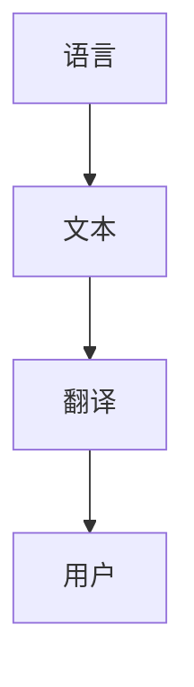
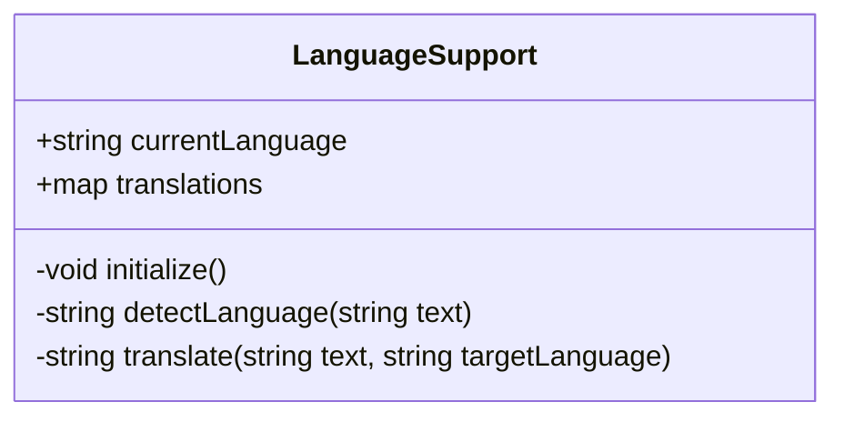
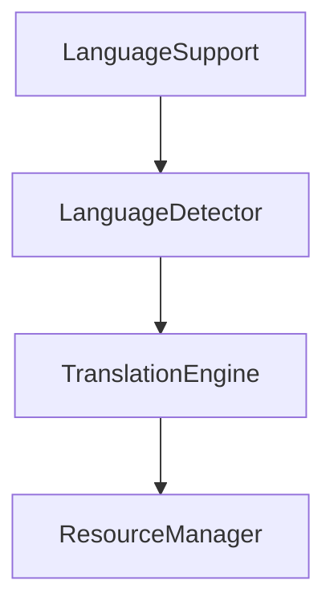
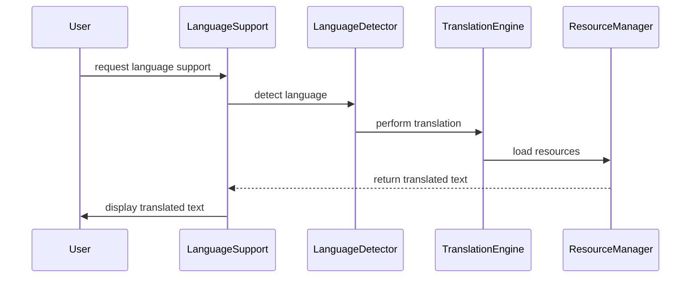

                 


# 《多语言支持》

> 关键词：多语言支持，国际化，本地化，语言处理，算法，系统架构

> 摘要：多语言支持是计算机技术和全球化的重要组成部分，涉及多语言解析、编译和系统架构等多个方面。本文将从背景、核心概念、算法原理、系统架构、项目实战和最佳实践等角度，全面解析多语言支持的实现和应用。

---

# 第一章: 多语言支持的背景与问题背景

## 1.1 多语言支持的基本概念
### 1.1.1 多语言支持的定义
多语言支持是指在计算机系统中，能够处理、显示和交互多种语言文本的能力。它不仅包括对多种语言的解析和显示，还包括语言之间的转换、翻译和本地化。

### 1.1.2 多语言支持的必要性
在国际化和本地化的背景下，企业需要通过支持多种语言来满足不同地区用户的需求，提升用户体验和市场竞争力。

### 1.1.3 多语言支持的实现方式
多语言支持的实现方式包括语言检测、文本翻译、本地化资源管理等。

## 1.2 多语言支持的问题背景
### 1.2.1 全球化背景下的语言多样性
随着全球化的推进，计算机系统需要支持多种语言，以适应不同地区的用户需求。

### 1.2.2 跨平台应用的挑战
跨平台应用需要在不同平台上支持多种语言，增加了实现的复杂性。

### 1.2.3 多语言支持的技术复杂性
多语言支持需要处理语言的语法、编码、字符集等问题，技术实现相对复杂。

## 1.3 多语言支持的技术演进
### 1.3.1 从单语言到多语言的演变
早期的计算机系统仅支持单语言，随着需求的变化，逐渐发展出支持多语言的技术。

### 1.3.2 多语言支持的实现方式对比
通过对比不同的实现方式，如语言扩展、动态加载等，找到最优的实现方案。

### 1.3.3 当前多语言支持的技术趋势
当前技术趋势包括AI辅助翻译、自动化本地化管理等。

## 1.4 多语言支持的应用领域
### 1.4.1 跨平台应用开发
跨平台应用需要在不同平台上支持多种语言，以提供一致的用户体验。

### 1.4.2 国际化（i18n）与本地化（l10n）
国际化和本地化是多语言支持的重要组成部分，涉及语言的转换和适配。

### 1.4.3 企业级系统的多语言需求
企业级系统需要支持多种语言，以满足全球用户的需求。

## 1.5 本章小结
本章介绍了多语言支持的基本概念、问题背景、技术演进和应用领域，为后续内容奠定了基础。

---

# 第二章: 多语言支持的核心概念与联系

## 2.1 多语言支持的核心概念
### 2.1.1 多语言支持的实现原理
多语言支持需要通过语言检测、文本转换和资源管理等步骤，实现对多种语言的支持。

### 2.1.2 多语言支持的关键技术
关键技术包括语言检测算法、文本编码转换、多语言资源管理等。

### 2.1.3 多语言支持的核心要素
核心要素包括语言检测、文本转换、资源管理、用户界面适配等。

## 2.2 多语言支持的核心概念对比
### 2.2.1 不同语言处理方式的对比
通过对比不同的语言处理方式，如静态加载和动态加载，找到最优的实现方式。

### 2.2.2 多语言支持与国际化的区别
国际化关注语言和文化的适应，而多语言支持则关注对多种语言的解析和显示。

### 2.2.3 多语言支持与本地化的联系
本地化是多语言支持的重要组成部分，涉及语言的适配和资源的管理。

## 2.3 多语言支持的ER实体关系图


## 2.4 多语言支持的属性特征对比表
| 属性 | 单语言支持 | 多语言支持 |
|------|-----------|------------|
| 处理方式 | 仅处理一种语言 | 处理多种语言 |
| 资源管理 | 单一语言资源 | 多语言资源 |
| 系统架构 | 简单架构 | 复杂架构 |

## 2.5 本章小结
本章详细讲解了多语言支持的核心概念、实现原理和关键技术，并通过ER图和对比表，清晰展示了多语言支持的内在联系。

---

# 第三章: 多语言支持的算法原理

## 3.1 多语言解析算法
### 3.1.1 多语言解析的基本原理
多语言解析需要对输入文本进行语言检测、分词和语法分析，以确保正确解析。

### 3.1.2 多语言解析的实现步骤
步骤包括语言检测、文本分词、语法分析和语义理解。

### 3.1.3 多语言解析的优化方法
通过优化语言检测算法和分词算法，提升解析效率和准确性。

## 3.2 多语言编译算法
### 3.2.1 多语言编译的基本原理
多语言编译需要将多种语言的代码转换为目标平台的指令。

### 3.2.2 多语言编译的实现步骤
包括语法分析、中间代码生成和目标代码生成。

### 3.2.3 多语言编译的优化方法
通过优化中间代码生成和目标代码生成，提升编译效率和性能。

## 3.3 多语言支持的算法实现
### 3.3.1 多语言解析算法实现
```python
def language_detection(text):
    # 实现语言检测算法
    pass

def text_tokenization(text, language):
    # 根据语言进行分词
    pass

def syntax_analysis(tokens):
    # 进行语法分析
    pass
```

### 3.3.2 多语言编译算法实现
```python
def multi_language_compiler(source_code, target_language):
    # 进行语法分析
    ast = parse(source_code)
    # 生成中间代码
    intermediate_code = generate_intermediate_code(ast)
    # 生成目标代码
    target_code = generate_target_code(intermediate_code, target_language)
    return target_code
```

## 3.4 本章小结
本章通过算法实现，详细讲解了多语言解析和编译的实现步骤和优化方法，为后续的系统设计和项目实现提供了理论基础。

---

# 第四章: 多语言支持的系统架构与设计方案

## 4.1 问题场景介绍
### 4.1.1 多语言支持的系统需求
系统需要支持多种语言的解析、显示和交互。

### 4.1.2 系统的约束条件
包括性能要求、资源限制和平台兼容性等。

## 4.2 系统功能设计
### 4.2.1 领域模型设计


### 4.2.2 系统架构设计


## 4.3 系统接口设计
### 4.3.1 系统接口定义


## 4.4 系统交互设计
### 4.4.1 用户与系统的交互流程
用户请求多语言支持，系统进行语言检测、翻译和资源加载，最终显示翻译结果。

### 4.4.2 系统内部组件交互
系统内部组件通过接口进行交互，确保多语言支持功能的顺利实现。

## 4.5 本章小结
本章通过系统架构设计和接口设计，详细讲解了多语言支持系统的实现方式，为后续的项目实战提供了指导。

---

# 第五章: 多语言支持的项目实战

## 5.1 环境搭建
### 5.1.1 开发工具安装
安装必要的开发工具，如Python、IDE等。

### 5.1.2 依赖库安装
安装多语言支持所需的依赖库，如语言检测库和翻译库。

## 5.2 系统核心实现
### 5.2.1 多语言检测实现
```python
from langdetect import detect
def detect_language(text):
    return detect(text)
```

### 5.2.2 多语言翻译实现
```python
from googletrans import Translator
def translate_text(text, target_language):
    translator = Translator()
    return translator.translate(text, dest=target_language).text
```

### 5.2.3 多语言资源管理
```python
def load_resource(language):
    resources = {
        'en': 'Hello, World!',
        'zh': '你好，世界！'
    }
    return resources.get(language, 'Default text')
```

## 5.3 案例分析与实现
### 5.3.1 实际案例分析
分析一个实际的多语言支持项目，如国际化Web应用。

### 5.3.2 代码实现与解读
通过具体代码实现，展示多语言支持的实现过程。

## 5.4 项目总结
### 5.4.1 项目实现的关键点
总结项目实现中的关键点，如语言检测的准确性、翻译的准确性等。

### 5.4.2 项目实现的经验与教训
分享项目实现中的经验与教训，为后续项目提供参考。

## 5.5 本章小结
本章通过项目实战，详细讲解了多语言支持的实现过程，帮助读者掌握实际操作技能。

---

# 第六章: 多语言支持的最佳实践与小结

## 6.1 最佳实践
### 6.1.1 语言检测的准确性
确保语言检测算法的准确性，避免误判。

### 6.1.2 多语言资源管理
合理管理多语言资源，确保资源的完整性和一致性。

### 6.1.3 系统性能优化
通过优化算法和减少资源消耗，提升系统性能。

## 6.2 小结
### 6.2.1 全文总结
总结全文内容，强调多语言支持的重要性和技术实现的关键点。

### 6.2.2 未来展望
展望多语言支持技术的发展趋势，如AI辅助翻译、自动化本地化管理等。

## 6.3 注意事项
### 6.3.1 开发中的注意事项
包括代码规范、资源管理、异常处理等。

### 6.3.2 部署与维护
部署多语言支持系统时，需要注意平台兼容性和资源更新。

## 6.4 拓展阅读
### 6.4.1 推荐书籍
推荐一些关于多语言支持和国际化的书籍，供读者深入学习。

### 6.4.2 技术博客与开源项目
推荐一些相关的技术博客和开源项目，供读者参考和学习。

## 6.5 本章小结
本章通过总结和展望，帮助读者更好地理解和应用多语言支持技术。

---

# 结语

多语言支持是计算机技术和全球化的重要组成部分，通过本文的详细讲解，读者可以全面掌握多语言支持的实现和应用。希望本文能够为读者在实际项目中提供有价值的参考和指导。

