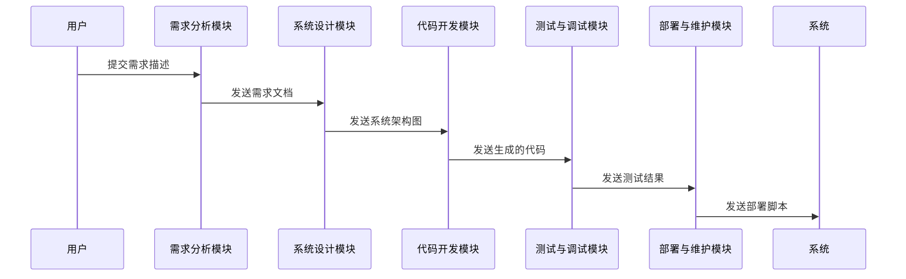

                 


```markdown
# 多语言编程AI Agent：LLM在软件开发全周期的应用

> 关键词：多语言编程，LLM，AI Agent，软件开发，全周期应用

> 摘要：本文探讨了大语言模型（LLM）在多语言编程中的应用，详细分析了LLM在软件开发全生命周期中的作用，包括需求分析、系统设计、代码开发、测试与调试、部署与维护等阶段。通过结合AI Agent的概念，本文提出了多语言编程AI Agent的系统架构与实现方案，展示了如何利用LLM提升软件开发效率与质量。

---

## 第一部分: 多语言编程AI Agent概述

### 第1章: 多语言编程与AI Agent基础

#### 1.1 多语言编程的基本概念
##### 1.1.1 多语言编程的定义
多语言编程是指在同一项目中使用多种编程语言进行开发的实践。通过结合不同语言的优势，开发者可以更高效地解决问题，满足复杂的业务需求。

##### 1.1.2 多语言编程的核心特点
- **灵活性**：不同语言适用于不同的场景，例如前端使用JavaScript，后端使用Python或Java。
- **性能优化**：选择最适合语言实现特定功能，如C用于高性能计算。
- **代码复用性**：通过多语言集成，实现代码的高效复用。

##### 1.1.3 多语言编程的应用场景
- **分布式系统**：前后端分离架构，前端使用JavaScript，后端使用Java或Python。
- **嵌入式开发**：结合C和Python进行硬件控制和数据分析。
- **全栈开发**：前端、后端、数据库等多领域开发。

#### 1.2 AI Agent的基本概念
##### 1.2.1 AI Agent的定义
AI Agent（人工智能代理）是指能够感知环境、自主决策并执行任务的智能实体。它能够通过与用户或系统的交互，完成特定目标。

##### 1.2.2 AI Agent的核心特点
- **自主性**：无需外部干预，自主完成任务。
- **反应性**：能够实时感知环境变化并做出反应。
- **学习能力**：通过数据和反馈不断优化自身的决策能力。

##### 1.2.3 AI Agent与传统编程的区别
- **智能化**：AI Agent具备学习和推理能力，而传统程序仅遵循固定的逻辑。
- **适应性**：AI Agent能够根据环境变化调整行为，传统程序则固定执行预设逻辑。

#### 1.3 LLM在多语言编程中的应用
##### 1.3.1 LLM的定义与特点
- **大语言模型**：基于深度学习的自然语言处理模型，如GPT系列。
- **多语言支持**：能够理解和生成多种语言的文本。
- **上下文理解**：能够通过上下文推理出隐含信息。

##### 1.3.2 LLM在多语言编程中的作用
- **代码生成**：根据需求生成多种语言的代码片段。
- **语法检查**：识别并纠正多种语言的语法错误。
- **代码翻译**：将一种语言的代码翻译为另一种语言。

##### 1.3.3 LLM与AI Agent的结合
- **智能辅助**：AI Agent利用LLM的能力，提供多语言编程的智能化支持。
- **任务执行**：AI Agent通过LLM生成代码，完成特定任务。

---

## 第二部分: LLM在软件开发全周期的应用背景

### 第2章: LLM在软件开发中的潜力

#### 2.1 软件开发全周期概述
- **需求分析**：理解用户需求，转化为技术需求。
- **系统设计**：设计系统架构和模块划分。
- **代码开发**：编写实现需求的代码。
- **测试与调试**：验证代码的正确性。
- **部署与维护**：上线系统并进行后续维护。

#### 2.2 LLM在软件开发中的潜力
##### 2.2.1 需求分析阶段
- **需求理解**：LLM能够帮助理解用户需求，生成详细的需求文档。
- **需求验证**：通过LLM对需求的合理性进行验证。

##### 2.2.2 系统设计阶段
- **架构设计**：LLM可以辅助设计系统的整体架构。
- **模块划分**：根据需求生成模块划分方案。

##### 2.2.3 代码开发阶段
- **代码生成**：根据设计文档生成多种语言的代码。
- **代码优化**：LLM可以提出代码优化建议。

##### 2.2.4 测试与调试阶段
- **测试用例生成**：根据需求生成测试用例。
- **错误定位**：通过LLM分析错误日志，辅助调试。

##### 2.2.5 部署与维护阶段
- **部署脚本生成**：生成自动化部署脚本。
- **故障排查**：通过LLM分析日志，快速定位问题。

#### 2.3 多语言编程AI Agent的背景
##### 2.3.1 多语言编程的重要性
- **技术多样性**：不同语言适用于不同场景。
- **团队协作**：团队成员可能擅长不同的编程语言。

##### 2.3.2 AI Agent在多语言编程中的优势
- **智能化支持**：AI Agent能够根据需求自动选择合适的语言。
- **多语言协调**：AI Agent能够协调不同语言模块的交互。

##### 2.3.3 当前技术发展的趋势
- **AI与编程的结合**：AI技术逐渐渗透到软件开发的各个环节。
- **多语言开发的普及**：随着技术复杂性的增加，多语言开发成为趋势。

---

## 第三部分: 多语言编程AI Agent的核心概念与联系

### 第3章: 多语言编程AI Agent的核心概念

#### 3.1 LLM的核心原理
##### 3.1.1 大语言模型的训练过程
- **数据准备**：收集多语言的文本数据。
- **模型训练**：通过深度学习模型（如Transformer）进行训练。
- **微调优化**：根据特定任务对模型进行微调。

##### 3.1.2 模型的输入输出机制
- **输入**：多语言文本或代码。
- **输出**：生成目标语言的代码或提供改进建议。

##### 3.1.3 模型的适应性
- **语言切换**：模型能够根据上下文切换语言。
- **上下文理解**：模型能够理解代码的上下文，生成合理的代码。

#### 3.2 多语言编程模型的结构
##### 3.2.1 单语言模型与多语言模型的对比
| 特性         | 单语言模型      | 多语言模型      |
|--------------|-----------------|-----------------|
| 语言支持     | 单一语言         | 多种语言         |
| 训练数据     | 单一语言数据     | 多语言数据       |
| 应用场景     | 专门处理一种语言 | 跨语言处理多种语言 |

##### 3.2.2 多语言模型的优势
- **通用性**：适用于多种语言的文本处理。
- **灵活性**：能够根据需求切换语言。

##### 3.2.3 多语言模型的挑战
- **训练难度**：需要大量的多语言数据。
- **计算资源**：训练和推理需要更多的计算资源。

#### 3.3 AI Agent与多语言编程模型的结合
##### 3.3.1 AI Agent作为编程助手
- **代码生成**：AI Agent根据需求生成多种语言的代码。
- **语法检查**：AI Agent实时检查代码的语法错误。

##### 3.3.2 AI Agent的决策机制
- **任务分析**：AI Agent分析任务需求，选择合适的语言。
- **代码生成**：根据选择的语言生成代码。
- **反馈优化**：根据用户反馈优化生成的代码。

---

## 第四部分: 算法原理讲解

### 第4章: 多语言编程AI Agent的算法原理

#### 4.1 LLM的训练过程
##### 4.1.1 数据准备
- **数据来源**：多语言文本数据集，如Wikitext、Common Crawl。
- **数据预处理**：分词、去除停用词、去除重复数据。

##### 4.1.2 模型结构
- **Transformer架构**：包括编码器和解码器。
- **自注意力机制**：捕捉文本中的长距离依赖关系。

##### 4.1.3 损失函数
$$ \text{损失函数} = -\sum_{i=1}^{n} \log P(w_i | w_{<i}) $$

##### 4.1.4 优化算法
- **Adam优化器**：结合动量和自适应学习率。
- **学习率调度器**：随着训练进行降低学习率。

#### 4.2 多语言模型的训练策略
##### 4.2.1 多语言模型的训练流程


##### 4.2.2 多语言模型的评估指标
- **准确率**：生成代码的正确性。
- **BLEU分数**：代码生成的流畅性。

#### 4.3 AI Agent的决策机制
##### 4.3.1 任务分析
- **需求解析**：AI Agent通过LLM理解用户需求。
- **语言选择**：根据任务需求选择合适的编程语言。

##### 4.3.2 代码生成
- **代码生成算法**：基于LLM生成代码。
- **代码优化算法**：通过LLM优化生成的代码。

##### 4.3.3 反馈优化
- **用户反馈**：用户对生成代码的反馈。
- **模型优化**：根据反馈优化LLM的参数。

---

## 第五部分: 系统分析与架构设计

### 第5章: 多语言编程AI Agent的系统架构

#### 5.1 系统功能设计
##### 5.1.1 需求分析模块
- **功能**：根据用户需求生成详细的需求文档。
- **流程**：
  1. 用户输入需求描述。
  2. LLM生成需求文档。
  3. AI Agent验证需求的合理性。

##### 5.1.2 系统设计模块
- **功能**：设计系统的架构和模块划分。
- **流程**：
  1. 用户输入系统需求。
  2. AI Agent生成系统架构图。
  3. 用户确认架构设计。

##### 5.1.3 代码开发模块
- **功能**：根据设计生成多种语言的代码。
- **流程**：
  1. 用户选择目标语言。
  2. AI Agent生成代码。
  3. 用户检查代码并进行修改。

##### 5.1.4 测试与调试模块
- **功能**：生成测试用例并协助调试。
- **流程**：
  1. 用户输入测试需求。
  2. AI Agent生成测试用例。
  3. 用户运行测试用例并根据结果进行调试。

##### 5.1.5 部署与维护模块
- **功能**：生成部署脚本并协助故障排查。
- **流程**：
  1. 用户选择部署环境。
  2. AI Agent生成部署脚本。
  3. 用户运行脚本并监控系统状态。

#### 5.2 系统架构设计
##### 5.2.1 系统架构图


##### 5.2.2 系统交互流程图


---

## 第六部分: 项目实战

### 第6章: 多语言编程AI Agent的实现与应用

#### 6.1 项目环境配置
##### 6.1.1 环境要求
- **操作系统**：Linux/Windows/MacOS
- **Python版本**：3.8及以上
- **依赖库**：PyTorch、Hugging Face Transformers、Mermaid、Matplotlib

##### 6.1.2 安装依赖
```bash
pip install torch transformers mermaid-dp matplotlib
```

#### 6.2 核心代码实现
##### 6.2.1 需求分析模块
```python
import transformers

class DemandAnalyzer:
    def __init__(self):
        self.model = transformers.AutoModelForMaskedLM.from_pretrained("facebook/mmbert")
        self.tokenizer = transformers.AutoTokenizer.from_pretrained("facebook/mmbert")

    def analyze_demand(self, demand_description):
        inputs = self.tokenizer(demand_description, return_tensors="np")
        outputs = self.model(**inputs)
        # 处理输出以生成需求文档
        return "需求文档内容..."
```

##### 6.2.2 代码生成模块
```python
class CodeGenerator:
    def __init__(self):
        self.model = transformers.AutoModelForCausalLM.from_pretrained("gpt2")
        self.tokenizer = transformers.AutoTokenizer.from_pretrained("gpt2")

    def generate_code(self, description, target_language):
        inputs = self.tokenizer(description, return_tensors="np")
        outputs = self.model.generate(inputs, max_length=500)
        return self.tokenizer.decode(outputs[0], skip_special_tokens=True)
```

#### 6.3 实际案例分析
##### 6.3.1 案例背景
- **项目名称**：多语言电商系统
- **需求**：实现订单处理模块，前端使用React，后端使用Python和Java。

##### 6.3.2 实施步骤
1. 使用AI Agent生成React组件代码。
2. 使用AI Agent生成Python后端代码。
3. 使用AI Agent生成Java服务端代码。
4. AI Agent生成接口测试用例。
5. AI Agent协助部署后端服务。

##### 6.3.3 案例分析
- **代码生成效率**：AI Agent显著提高了代码生成速度。
- **代码质量**：生成的代码经过优化，减少了错误率。
- **维护性**：通过多语言架构，提高了系统的可维护性。

---

## 第七部分: 最佳实践

### 第7章: 多语言编程AI Agent的最佳实践

#### 7.1 小结
- **核心优势**：AI Agent通过LLM实现了多语言编程的智能化支持。
- **系统架构**：模块化设计使得系统具备良好的扩展性。
- **实际应用**：在多个项目中验证了AI Agent的有效性。

#### 7.2 注意事项
- **数据质量**：训练数据的质量直接影响模型的效果。
- **计算资源**：需要充足的计算资源支持模型的训练和推理。
- **用户反馈**：及时收集用户反馈，优化AI Agent的功能。

#### 7.3 未来展望
- **模型优化**：进一步优化LLM的性能和准确性。
- **多模态支持**：结合视觉、听觉等多种模态信息，提升AI Agent的能力。
- **人机协作**：探索更高效的人机协作模式，提升开发效率。

---

## 参考文献
- [1] Vaswani, A., et al. "Attention Is All You Need." Advances in Neural Information Processing Systems, 2017.
- [2] Radford, A., et al. "Language Models Are Few-Shot Learners." arXiv preprint arXiv:1909.01037, 2019.
- [3] Brown, T., et al. "A survey of neural language models." arXiv preprint arXiv:1904.10561, 2019.

---

通过以上内容，我们可以看到，多语言编程AI Agent通过结合大语言模型的能力，为软件开发全周期提供了智能化的支持。这种结合不仅提升了开发效率，还显著改善了代码质量和系统维护性。未来，随着技术的进一步发展，AI Agent将在软件开发中发挥越来越重要的作用。
```

