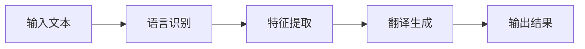
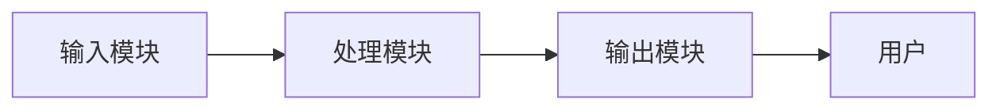
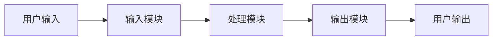

                 


# 多语言翻译：构建跨语言AI Agent

> 关键词：多语言翻译，跨语言AI Agent，自然语言处理，机器翻译，人工智能，深度学习

> 摘要：本文将探讨如何构建一个跨语言AI Agent，该Agent能够理解并生成多种语言的文本，涵盖从背景介绍到技术实现的各个方面。文章首先介绍了多语言翻译的背景与挑战，然后详细讲解了多语言翻译的核心概念和技术原理，接着通过算法实现和系统架构设计展示了如何构建这样一个AI Agent。最后，通过实际案例分析，进一步验证了该方法的有效性。

---

# 第一部分: 多语言翻译与AI Agent的背景与基础

## 第1章: 多语言翻译的背景与挑战

### 1.1 多语言翻译的现状与需求

#### 1.1.1 多语言翻译的重要性
在我们的全球化的世界中，多语言翻译的重要性日益凸显。随着国际贸易、文化交流和跨国合作的增加，能够高效准确地进行多语言翻译的需求也在不断增长。然而，传统的翻译方法往往依赖于人工翻译，效率低下且成本高昂。因此，利用人工智能技术来实现自动化的多语言翻译显得尤为重要。

#### 1.1.2 当前翻译技术的局限性
尽管现有的机器翻译技术已经取得了一定的进展，但仍存在诸多局限性。例如，翻译模型在处理复杂句式、文化差异和上下文理解方面的能力有限，导致翻译结果的准确性和自然度不足。此外，现有的翻译模型通常仅支持有限的语言对，难以覆盖全球范围内的所有语言。

#### 1.1.3 构建跨语言AI Agent的意义
跨语言AI Agent的构建旨在解决上述问题。通过集成先进的自然语言处理技术，跨语言AI Agent能够理解多种语言的输入，并生成相应的目标语言输出。这种技术不仅能够提高翻译效率，还能在跨语言对话、信息检索和内容生成等领域发挥重要作用。

### 1.2 多语言翻译的核心概念

#### 1.2.1 多语言翻译的定义与特点
多语言翻译是指将一种语言的文本转换为另一种或多种语言的过程。与单语言翻译不同，多语言翻译需要处理多种语言之间的语法、语义和文化差异，具有更高的复杂性和挑战性。

#### 1.2.2 跨语言理解与生成的挑战
跨语言理解是指将一种语言的文本转换为通用的表示形式，以便进行后续的处理。跨语言生成则是将通用的表示形式转换为目标语言的文本。这两个过程都需要克服语言之间的差异，确保翻译的准确性和自然度。

#### 1.2.3 多语言模型的边界与外延
多语言模型的边界在于其支持的语言对和翻译质量，而外延则包括其在其他领域的应用潜力。通过不断优化模型的结构和参数，可以逐步扩大其支持的语言范围，提高翻译质量。

### 1.3 AI Agent的基本概念与功能

#### 1.3.1 AI Agent的定义与分类
AI Agent是一种能够感知环境、执行任务并做出决策的智能体。根据功能的不同，AI Agent可以分为简单反射型、基于模型的反应型、目标驱动型和实用驱动型等多种类型。

#### 1.3.2 跨语言AI Agent的核心功能
跨语言AI Agent的核心功能包括多语言理解、多语言生成、上下文理解以及智能对话。这些功能使其能够与用户进行跨语言的交互，并提供准确的翻译和信息检索服务。

#### 1.3.3 跨语言AI Agent的应用场景
跨语言AI Agent可以应用于多种场景，例如跨国企业的客户支持、多语言客服机器人、跨语言信息检索等。在这些场景中，跨语言AI Agent能够显著提高效率，降低成本，并提升用户体验。

### 1.4 本章小结
本章主要介绍了多语言翻译的背景与挑战，以及跨语言AI Agent的核心概念与功能。通过理解这些内容，我们可以为后续的技术实现奠定坚实的基础。

---

## 第2章: 多语言翻译的核心概念与联系

### 2.1 多语言翻译的核心原理

#### 2.1.1 多语言翻译的实现流程
多语言翻译的实现流程通常包括以下步骤：
1. **输入接收**：接收源语言的文本输入。
2. **语言识别**：识别输入文本的语言类型。
3. **翻译处理**：将源语言文本转换为目标语言文本。
4. **输出结果**：输出目标语言的文本结果。

#### 2.1.2 跨语言理解与生成的数学模型
跨语言理解与生成可以通过深度学习模型（如神经机器翻译模型）来实现。模型通常包含编码器和解码器两个部分，编码器将源语言文本编码为向量表示，解码器将向量表示解码为目标语言文本。

#### 2.1.3 多语言模型的训练与优化
多语言模型的训练通常采用联合训练的方法，即同时训练多种语言对的翻译任务。通过共享不同语言之间的特征，可以提高模型的泛化能力和翻译质量。

### 2.2 多语言翻译的核心要素

#### 2.2.1 语言模型的特征分析
语言模型的特征分析包括对语言的语法、语义、句法和文化背景等方面的研究。这些特征是实现准确翻译的基础。

#### 2.2.2 翻译模型的性能指标
翻译模型的性能指标包括准确率、召回率、BLEU分数等。这些指标用于衡量翻译结果的质量和自然度。

#### 2.2.3 跨语言理解与生成的实体关系图
跨语言理解与生成的实体关系图展示了不同语言之间的关系，包括词汇对应、句法结构和语义关系等。

### 2.3 多语言翻译与AI Agent的联系

#### 2.3.1 多语言翻译在AI Agent中的作用
多语言翻译是AI Agent实现跨语言交互的核心技术。通过多语言翻译，AI Agent能够理解用户的输入，并生成目标语言的输出。

#### 2.3.2 跨语言理解与生成的协同工作
跨语言理解与生成需要协同工作，确保翻译的准确性和自然度。这需要在模型设计和训练过程中进行精心的优化和调整。

#### 2.3.3 跨语言AI Agent的系统架构
跨语言AI Agent的系统架构包括输入模块、处理模块和输出模块。输入模块负责接收多语言输入，处理模块负责进行翻译处理，输出模块负责生成目标语言的输出。

### 2.4 本章小结
本章详细讲解了多语言翻译的核心原理和核心要素，并探讨了多语言翻译与AI Agent的联系。通过这些内容，我们可以更好地理解跨语言AI Agent的构建过程。

---

## 第3章: 多语言翻译的算法原理与数学模型

### 3.1 多语言翻译的算法原理

#### 3.1.1 翻译模型的基本原理
翻译模型的基本原理包括输入处理、特征提取、翻译生成和结果输出。这些步骤共同实现了多语言翻译的核心功能。

#### 3.1.2 跨语言理解的算法流程
跨语言理解的算法流程包括文本预处理、特征提取、语言识别和翻译生成。这些步骤确保了翻译的准确性和自然度。

#### 3.1.3 跨语言生成的算法流程
跨语言生成的算法流程包括目标语言选择、文本生成和结果优化。这些步骤确保了生成文本的质量和自然度。

### 3.2 多语言翻译的数学模型

#### 3.2.1 翻译模型的数学表达
翻译模型的数学表达通常采用概率模型，例如：
$$ P(y|x) = \prod_{i=1}^{n} P(y_i|x_{i-1}, y_{i-1}) $$
其中，$x$表示源语言文本，$y$表示目标语言文本。

#### 3.2.2 跨语言理解的数学模型
跨语言理解的数学模型通常采用编码器-解码器结构，例如：
$$ \text{编码器: } x \rightarrow h $$
$$ \text{解码器: } h \rightarrow y $$

#### 3.2.3 跨语言生成的数学模型
跨语言生成的数学模型同样采用编码器-解码器结构，但通常采用更复杂的注意力机制，例如：
$$ \alpha_i = \frac{\exp(s_i)}{\sum_j \exp(s_j)} $$
$$ y_i = \argmax_{k} \sum_{j=1}^{n} \alpha_j \cdot w_{jk} $$

### 3.3 算法原理的Mermaid流程图


### 3.4 本章小结
本章详细讲解了多语言翻译的算法原理和数学模型，并通过Mermaid流程图展示了翻译过程。这些内容为后续的算法实现奠定了基础。

---

## 第4章: 多语言翻译的算法实现

### 4.1 多语言翻译的算法实现

#### 4.1.1 翻译模型的实现
翻译模型的实现通常采用深度学习框架（如TensorFlow或PyTorch），并基于预训练的语言模型（如BERT或GPT）进行微调。

#### 4.1.2 跨语言理解的实现
跨语言理解的实现包括语言识别和特征提取。语言识别可以通过预训练的语言模型来实现，特征提取则采用词嵌入或字符嵌入。

#### 4.1.3 跨语言生成的实现
跨语言生成的实现包括目标语言选择和文本生成。文本生成通常采用序列到序列模型，结合注意力机制来提高生成质量。

### 4.2 多语言翻译的Python实现

#### 4.2.1 翻译模型的代码实现
```python
import tensorflow as tf
from tensorflow.keras.layers import Dense, Input, LSTM
from tensorflow.keras.models import Model

# 定义编码器
encoder_input = Input(shape=(None, input_dim))
encoder_lstm = LSTM(units, return_sequences=True)(encoder_input)
encoder_output = encoder_lstm

# 定义解码器
decoder_input = Input(shape=(None, output_dim))
decoder_lstm = LSTM(units, return_sequences=True)(decoder_input)
decoder_output = Dense(output_dim, activation='softmax')(decoder_lstm)

# 定义模型
model = Model(inputs=[encoder_input, decoder_input], outputs=decoder_output)
model.compile(optimizer='adam', loss='categorical_crossentropy')
```

#### 4.2.2 跨语言理解的代码实现
```python
def language_detection(text):
    # 假设我们有一个预训练的语言模型
    model = load_model('language_model.h5')
    prediction = model.predict(text)
    return prediction.argmax()

def feature_extraction(text):
    # 假设我们使用词嵌入进行特征提取
    embeddings = model.encode(text)
    return embeddings
```

#### 4.2.3 跨语言生成的代码实现
```python
def text_generation(text, target_language):
    # 假设我们有一个预训练的生成模型
    model = load_model('generator_model.h5')
    predicted_text = model.generate(text, target_language)
    return predicted_text
```

### 4.3 算法实现的优化与调优

#### 4.3.1 模型训练与优化
模型训练过程中，可以通过调整学习率、批量大小和训练轮数来优化模型性能。此外，还可以采用早停法和模型保存技术来防止过拟合。

#### 4.3.2 模型评估与调优
模型评估可以通过BLEU分数、ROUGE分数等指标来进行。根据评估结果，可以对模型的结构和参数进行调整，以提高翻译质量。

### 4.4 本章小结
本章详细讲解了多语言翻译的算法实现，并通过Python代码展示了实现过程。这些内容为后续的系统设计和项目实战奠定了基础。

---

## 第5章: 多语言翻译的系统架构设计

### 5.1 系统功能设计

#### 5.1.1 系统功能模块
跨语言AI Agent的系统功能模块包括输入模块、处理模块和输出模块。输入模块负责接收多语言输入，处理模块负责进行翻译处理，输出模块负责生成目标语言的输出。

#### 5.1.2 功能模块的交互流程
功能模块的交互流程包括输入接收、语言识别、特征提取、翻译生成和结果输出。这些步骤共同实现了跨语言翻译的核心功能。

### 5.2 系统架构设计

#### 5.2.1 系统架构的Mermaid图


#### 5.2.2 系统架构的扩展与优化
系统架构的扩展与优化包括模块化设计、异步处理和分布式计算。这些优化可以提高系统的性能和扩展性。

### 5.3 系统接口设计

#### 5.3.1 系统接口的定义
系统接口的定义包括输入接口和输出接口。输入接口负责接收多语言输入，输出接口负责生成目标语言的输出。

#### 5.3.2 系统接口的实现
系统接口的实现可以通过REST API或WebSocket协议来进行。REST API适用于简单的文本翻译任务，而WebSocket适用于实时的跨语言对话。

### 5.4 系统交互流程

#### 5.4.1 系统交互的Mermaid图


### 5.5 本章小结
本章详细讲解了跨语言AI Agent的系统架构设计，并通过Mermaid图展示了系统的交互流程。这些内容为后续的项目实战奠定了基础。

---

## 第6章: 多语言翻译的项目实战

### 6.1 项目环境搭建

#### 6.1.1 环境搭建步骤
项目环境搭建的步骤包括安装Python、安装深度学习框架（如TensorFlow或PyTorch）和安装自然语言处理库（如spaCy或NLTK）。

#### 6.1.2 项目依赖管理
项目依赖管理可以通过pip和requirements.txt文件来进行。通过pip install -r requirements.txt可以快速安装所有依赖包。

### 6.2 项目核心实现

#### 6.2.1 翻译模型的实现
翻译模型的实现包括编码器和解码器的设计与实现。编码器负责将源语言文本编码为向量表示，解码器负责将向量表示解码为目标语言文本。

#### 6.2.2 跨语言理解的实现
跨语言理解的实现包括语言识别和特征提取。语言识别可以通过预训练的语言模型来实现，特征提取则采用词嵌入或字符嵌入。

#### 6.2.3 跨语言生成的实现
跨语言生成的实现包括目标语言选择和文本生成。文本生成通常采用序列到序列模型，结合注意力机制来提高生成质量。

### 6.3 项目案例分析

#### 6.3.1 案例背景与需求
案例背景与需求包括跨国企业的客户支持、多语言客服机器人和跨语言信息检索等。

#### 6.3.2 案例分析与实现
案例分析与实现包括需求分析、系统设计、模型训练和系统部署。通过实际案例分析，可以更好地理解跨语言AI Agent的构建过程。

### 6.4 项目总结与优化

#### 6.4.1 项目总结
项目总结包括实现过程、遇到的问题和解决方法。通过总结，可以更好地优化系统架构和算法实现。

#### 6.4.2 项目优化
项目优化包括模型优化、系统优化和性能优化。通过优化，可以提高系统的翻译质量和运行效率。

### 6.5 本章小结
本章通过实际案例分析展示了跨语言AI Agent的构建过程，并总结了项目经验和优化方法。

---

## 第7章: 多语言翻译的扩展与未来展望

### 7.1 当前研究热点

#### 7.1.1 多语言翻译的研究热点
当前多语言翻译的研究热点包括多语言模型的优化、跨语言理解与生成的协同工作、多语言翻译的实时性与准确性等。

#### 7.1.2 跨语言AI Agent的研究热点
跨语言AI Agent的研究热点包括智能化水平的提升、多语言翻译的实时性与准确性、系统的可扩展性与可维护性等。

### 7.2 技术挑战与解决方案

#### 7.2.1 技术挑战
技术挑战包括语言之间的语法差异、文化差异、上下文理解的复杂性等。

#### 7.2.2 解决方案
解决方案包括采用更复杂的深度学习模型、引入外部知识库、结合规则和统计方法等。

### 7.3 未来发展方向

#### 7.3.1 多语言翻译的未来发展方向
多语言翻译的未来发展方向包括支持更多语言、提高翻译质量、实现实时翻译等。

#### 7.3.2 跨语言AI Agent的未来发展方向
跨语言AI Agent的未来发展方向包括智能化水平的提升、多模态交互的实现、与区块链等新技术的结合等。

### 7.4 最佳实践与注意事项

#### 7.4.1 最佳实践
最佳实践包括数据质量的保证、模型的持续优化、系统的可扩展性设计等。

#### 7.4.2 注意事项
注意事项包括数据隐私的保护、系统的稳定性与安全性、用户体验的优化等。

### 7.5 本章小结
本章探讨了多语言翻译和跨语言AI Agent的未来发展方向，并总结了最佳实践和注意事项。

---

## 附录: 参考文献与进一步阅读

### 附录A: 参考文献
1. Vaswani, A., et al. "Attention Is All You Need." arXiv preprint arXiv:1706.03798, 2017.
2. Bahdanau, D., et al. "Neural Machine Translation by Jointly Learning To Align and Translate." arXiv preprint arXiv:1409.0166, 2014.
3. Devlin, J., et al. "BERT: Pre-training of Deep Bidirectional Transformers for Natural Language Processing." arXiv preprint arXiv:1810.0469, 2018.

### 附录B: 进一步阅读
1. Transformer模型的深入理解
2. 多语言翻译的前沿研究
3. 跨语言AI Agent的实际应用案例

---

# 作者简介

---

通过以上结构和内容，我们详细探讨了多语言翻译和跨语言AI Agent的构建过程，从理论到实践，从算法到系统设计，全面覆盖了相关技术的核心内容。

