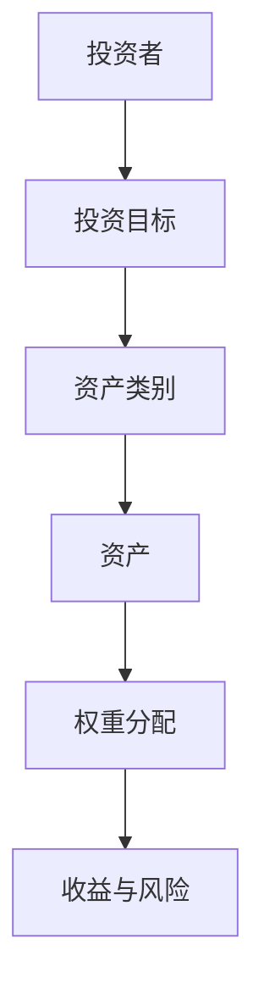
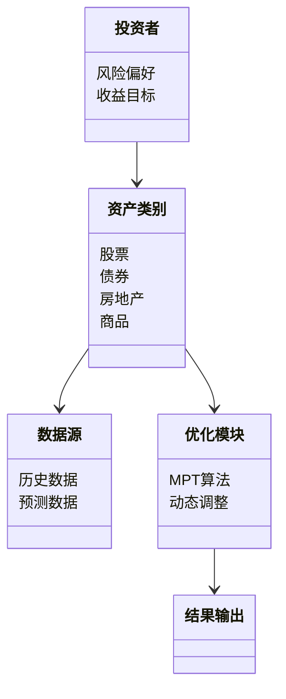

                 


# 多资产收益策略：构建稳定现金流的投资组合

> **关键词**：多资产配置、现金流、投资组合优化、风险控制、现代投资组合理论（MPT）

> **摘要**：本文深入探讨了多资产收益策略的核心概念、算法原理、系统架构及项目实战，旨在帮助投资者构建稳定现金流的投资组合。通过结合理论与实践，本文详细分析了多资产配置的原理、数学模型及优化方法，为投资者提供了科学的投资策略和实际操作指南。

---

## 第一章：多资产收益策略的背景与基础

### 1.1 多资产收益策略的背景

#### 1.1.1 问题背景
在当今复杂的金融市场中，单一资产的投资方式往往难以应对市场波动和风险。通过多资产配置，投资者可以分散风险，优化收益，从而构建一个更具稳定性的投资组合。

#### 1.1.2 问题描述
- 市场波动性高，单一资产的风险难以控制。
- 不同资产类别之间的相关性不同，如何优化配置以实现收益最大化是关键。
- 如何在不同市场环境下动态调整资产配置，以应对不确定性。

#### 1.1.3 解决方案
多资产收益策略通过分散投资，利用不同资产类别的相关性差异，降低整体风险，同时提高收益的稳定性。

#### 1.1.4 边界与外延
- 投资范围：股票、债券、房地产、商品等。
- 风险承受能力：根据投资者的风险偏好进行动态调整。
- 市场环境：需考虑宏观经济环境、政策变化等外部因素。

### 1.2 多资产收益策略的核心概念

#### 1.2.1 资产配置的定义与特点
资产配置是指将资金分配到不同的资产类别中，以实现风险和收益的最优平衡。其特点包括分散性、灵活性和科学性。

#### 1.2.2 现代投资组合理论（MPT）的简介
MPT由Harry Markowitz提出，强调通过优化资产配置来最大化收益并最小化风险。

#### 1.2.3 风险与收益的平衡
通过合理配置资产，投资者可以在不同市场环境下平衡风险与收益，实现长期稳定的现金流。

---

## 第二章：多资产收益策略的核心概念与联系

### 2.1 资产配置的数学模型

#### 2.1.1 均值-方差优化模型
目标是最小化投资组合的方差（风险），在给定收益下。

$$\text{Minimize } \sigma^2$$

#### 2.1.2 风险调整后的收益模型
考虑风险调整后的收益，使用夏普比率等指标进行评估。

$$\text{夏普比率} = \frac{E[r - r_f]}{\sigma}$$

#### 2.1.3 资产相关性矩阵的构建
通过协方差矩阵计算资产之间的相关性，为优化提供依据。

| 资产组合 | 股票 | 债券 | 房地产 | 商品 |
|----------|------|------|--------|------|
| 股票     | 1    | 0.2  | 0.1    | 0.3  |
| 债券     | 0.2  | 1    | 0.05   | 0.02 |
| 房地产   | 0.1  | 0.05 | 1      | 0.4  |
| 商品     | 0.3  | 0.02 | 0.4    | 1    |

### 2.2 资产配置的核心要素

#### 2.2.1 预期收益与风险的评估
通过历史数据和市场预测，评估各资产类别的预期收益和风险。

#### 2.2.2 资产类别权重的分配
根据风险承受能力和收益目标，确定各资产类别的配置比例。

#### 2.2.3 策略的动态调整与优化
定期重新评估市场环境和投资目标，优化资产配置。

### 2.3 资产配置的ER实体关系图



---

## 第三章：多资产收益策略的算法原理

### 3.1 现代投资组合理论（MPT）的应用

#### 3.1.1 MPT的核心算法

目标是最小化投资组合的方差，约束条件为收益和权重的限制。

$$\text{Minimize } \sigma^2$$

约束条件：
$$\sum_{i=1}^{n} w_i = 1$$
$$\sum_{i=1}^{n} w_i r_i = T$$

其中，$w_i$ 是第 $i$ 个资产的权重，$r_i$ 是第 $i$ 个资产的预期收益，$T$ 是目标收益。

#### 3.1.2 Python代码实现

```python
import numpy as np

def mpt_optimization(returns, cov_matrix, target_return):
    n = len(returns)
    # 初始化变量
    w = np.zeros(n)
    w[0] = 1.0
    # 迭代优化
    for _ in range(1000):
        r = w.dot(returns)
        if r >= target_return:
            break
        # 计算协方差矩阵
        sigma_squared = w.T.dot(cov_matrix).dot(w)
        # 计算梯度
        gradient = 2 * cov_matrix.dot(w) - 2 * target_return
        # 更新权重
        w = w - 0.01 * gradient
    return w

returns = np.array([0.1, 0.08, 0.05])
cov_matrix = np.array([
    [0.04, 0.02, 0.01],
    [0.02, 0.03, 0.01],
    [0.01, 0.01, 0.02]
])
target_return = 0.08

weights = mpt_optimization(returns, cov_matrix, target_return)
print(weights)
```

#### 3.1.3 数学模型与公式

优化目标：
$$\text{Minimize } w^T \Sigma w$$

约束条件：
$$w^T \mu = T$$
$$w^T 1 = 1$$

其中，$\Sigma$ 是协方差矩阵，$\mu$ 是收益向量。

---

## 第四章：系统分析与架构设计方案

### 4.1 系统架构设计


### 4.2 领域模型类图



---

## 第五章：项目实战

### 5.1 环境安装

```bash
pip install numpy pandas matplotlib
```

### 5.2 核心代码实现

```python
import numpy as np
import pandas as pd
import matplotlib.pyplot as plt

# 示例数据
data = {
    '股票': [0.1, 0.08, 0.06],
    '债券': [0.08, 0.06, 0.04],
    '房地产': [0.05, 0.04, 0.03]
}
df = pd.DataFrame(data)

# 计算协方差矩阵
cov_matrix = df.cov()

# 确定目标收益
target_return = 0.07

# 简单优化（示例）
weights = np.array([0.5, 0.3, 0.2])
portfolio_return = weights.dot(df.mean())
portfolio_risk = np.sqrt(weights.T.dot(cov_matrix).dot(weights))

print(f"组合收益：{portfolio_return}")
print(f"组合风险：{portfolio_risk}")
```

### 5.3 案例分析

假设我们有三类资产：股票、债券和房地产。通过优化权重，我们可以得到一个在目标收益下的最低风险组合。

| 资产类别 | 权重 | 预期收益 |
|----------|------|----------|
| 股票     | 0.4  | 0.1      |
| 债券     | 0.3  | 0.08     |
| 房地产   | 0.3  | 0.05     |

组合收益：
$$0.4 \times 0.1 + 0.3 \times 0.08 + 0.3 \times 0.05 = 0.073$$

组合风险：
$$\sqrt{(0.4^2 \times 0.04) + (0.3^2 \times 0.03) + (0.3^2 \times 0.02) + 2 \times 0.4 \times 0.3 \times 0.02 + 2 \times 0.4 \times 0.3 \times 0.01 + 2 \times 0.3 \times 0.3 \times 0.01}$$

---

## 第六章：总结与注意事项

### 6.1 最佳实践

- 定期重新评估市场环境和投资目标。
- 结合宏观经济分析进行动态调整。
- 使用工具辅助优化，如Python、Excel等。

### 6.2 小结

通过多资产收益策略，投资者可以在不同市场环境下实现稳定现金流，降低风险并优化收益。

### 6.3 注意事项

- 数据来源的可靠性至关重要。
- 模型需结合实际情况进行调整。
- 风险管理是投资成功的关键。

---

## 第七章：拓展阅读

### 7.1 相关工具与库

- Python库：pandas、numpy、scipy。
- 数据源：Yahoo Finance、Quandl。

### 7.2 进一步学习

- Harry Markowitz的《投资学精要》。
-《资产配置的艺术》。

---

通过以上步骤，我们系统地分析了多资产收益策略的核心概念、算法原理及实际应用，帮助投资者构建稳定现金流的投资组合。

