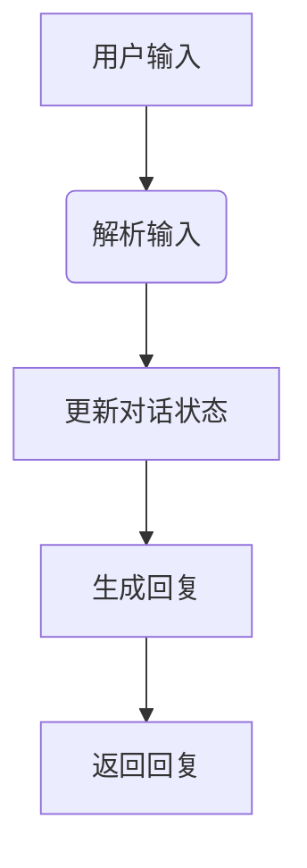
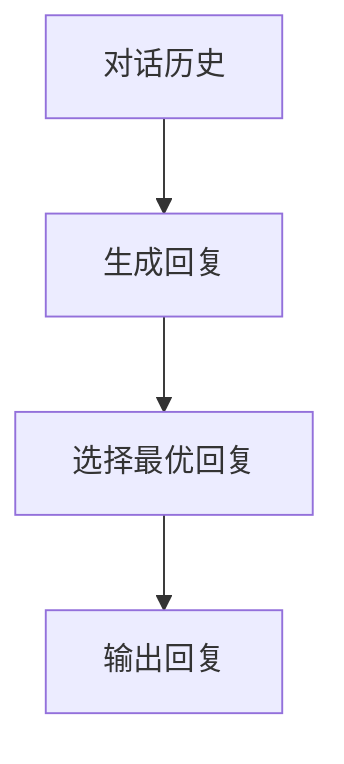
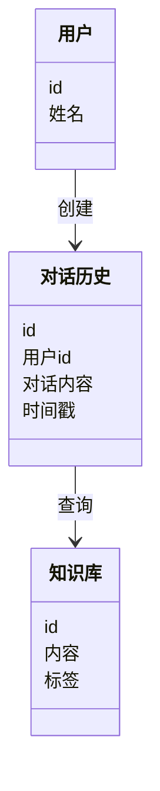
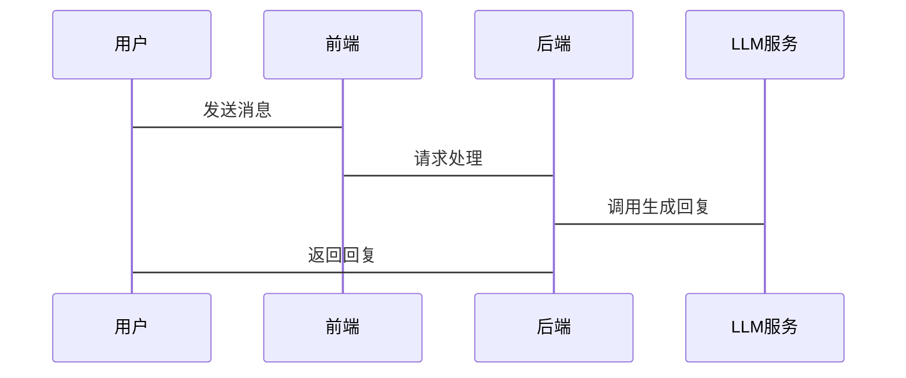

                 


# 多轮对话AI Agent：提升LLM的长期交互能力

> 关键词：多轮对话、AI Agent、LLM、对话系统、长期交互能力  
> 摘要：本文深入探讨了多轮对话AI Agent的核心概念、算法原理、系统架构以及实际应用。通过分析多轮对话中的问题与挑战，结合AI Agent的设计原理和实现方法，本文详细阐述了如何提升大语言模型（LLM）的长期交互能力，为构建高效、智能的对话系统提供了理论与实践指导。

---

## 第一部分：背景与概述

### 第1章：多轮对话AI Agent的背景与问题背景

#### 1.1 多轮对话的必要性

##### 1.1.1 从单轮对话到多轮对话的演变
现代对话系统逐渐从单一的问答模式向多轮对话模式发展，用户需求的复杂性要求系统能够维护上下文信息并进行持续交互。

##### 1.1.2 LLM在对话中的局限性
- LLM在单轮对话中表现出色，但在多轮对话中容易遗忘上下文，导致回复不连贯。
- 缺乏状态管理机制，无法有效处理长期交互中的信息积累。

##### 1.1.3 多轮对话AI Agent的定义与目标
AI Agent通过维护对话历史和上下文信息，实现连续的、连贯的多轮对话交互，目标是提升用户体验和交互效率。

#### 1.2 问题背景与问题描述

##### 1.2.1 当前对话系统的挑战
- 上下文信息丢失：LLM无法有效记忆之前的对话内容。
- 对话连贯性不足：回复缺乏逻辑性和一致性。
- 个性化交互缺失：无法根据对话历史提供定制化服务。

##### 1.2.2 多轮对话中的问题分析
- 对话历史的管理：如何存储和利用多轮对话中的信息？
- 上下文依赖性：如何处理复杂对话中的依赖关系？
- 交互目标的动态变化：如何应对用户需求的变化？

##### 1.2.3 AI Agent在长期交互中的角色
AI Agent作为中间桥梁，负责协调LLM与对话历史、用户需求之间的关系，确保交互的连贯性和一致性。

#### 1.3 问题解决与边界

##### 1.3.1 多轮对话的核心问题
- 对话历史的存储与检索。
- 上下文信息的有效利用。
- 动态交互目标的实现。

##### 1.3.2 AI Agent的边界与限制
- 仅处理对话相关任务，不涉及外部系统调用。
- 对话长度有限，避免信息过载。

##### 1.3.3 长期交互的外延与应用
- 应用场景：智能客服、虚拟助手、教育助手。
- 用户需求：个性化服务、高效交互、连贯体验。

#### 1.4 核心概念结构与组成

##### 1.4.1 多轮对话的结构分析
- 对话轮次：用户输入与系统回复的交替进行。
- 上下文：对话历史中的相关信息。

##### 1.4.2 AI Agent的组成
- 对话管理模块：负责对话流程控制。
- 上下文记忆模块：存储和检索对话历史。
- LLM调用模块：生成回复内容。

---

## 第二部分：核心概念与联系

### 第2章：AI Agent的核心概念与联系

#### 2.1 对话模型的分类与对比

##### 表格：三种对话模型的对比

| 对话模型 | 基于规则 | 基于检索 | 基于生成 |
|----------|----------|----------|----------|
| 原理     | 预定义规则 | 基于预存数据检索 | 基于生成模型自动生成 |
| 优点     | 简单可靠，易于控制 | 结果准确性高 | 创新能力强 |
| 缺点     | 创新性不足，应对复杂场景能力有限 | 生成内容可能不相关 | 计算资源消耗大 |
| 适用场景 | 简单任务 | 大数据场景 | 创意生成场景 |

##### 图形：AI Agent对话模型的实体关系图

```mermaid
erDiagram
    actor 用户
    actor 系统
    actor 对话历史
    actor 知识库
    用户 -> 系统 : 发送消息
    系统 -> 对话历史 : 获取历史
    系统 -> 知识库 : 查询信息
    系统 -> 系统 : 处理逻辑
    系统 -> 用户 : 发送回复
```

---

## 第三部分：算法原理

### 第3章：多轮对话AI Agent的算法原理

#### 3.1 对话状态管理

##### 3.1.1 对话状态表示
- 使用JSON格式存储对话历史和当前状态。

##### 3.1.2 对话上下文记忆机制
- 使用循环神经网络（RNN）或Transformer模型处理对话历史。

##### 3.1.3 状态更新算法
- 基于注意力机制的上下文编码方法。

##### 图形：对话状态管理流程图



#### 3.2 对话生成模型

##### 3.2.1 基于LLM的生成算法
- 使用GPT系列模型生成回复。

##### 3.2.2 回复选择策略
- 基于贝叶斯概率的回复排序。

##### 3.2.3 回复优化方法
- 利用强化学习（RL）优化回复质量。

##### 图形：对话生成流程图



#### 3.3 算法数学模型

##### 3.3.1 对话状态编码
$$
\text{state\_encoding} = \text{transformer}(h_{t-1}, h_{t-2}, \dots, h_1)
$$

##### 3.3.2 回复生成
$$
P(w_t|w_{t-1}, \text{state\_encoding}) = \text{softmax}(W_{w_t} \cdot \text{state\_encoding})
$$

---

## 第四部分：系统分析与架构设计

### 第4章：多轮对话AI Agent的系统分析与架构设计

#### 4.1 系统场景介绍

##### 4.1.1 用户角色
- 用户：发送消息并接收回复。
- 管理员：监控对话过程。

##### 4.1.2 系统功能
- 接收用户输入。
- 维护对话历史。
- 调用LLM生成回复。

##### 4.1.3 系统交互
- 用户与AI Agent之间的对话流程。

#### 4.2 系统架构设计

##### 4.2.1 领域模型设计



##### 4.2.2 系统架构设计

```mermaid
container 系统架构 {
    前端 --> 后端
    后端 --> LLM服务
    后端 --> 知识库
}
```

##### 4.2.3 系统接口设计
- 发送消息接口：`POST /api/send_message`
- 获取回复接口：`GET /api/get_reply`

##### 4.2.4 系统交互流程图



---

## 第五部分：项目实战

### 第5章：多轮对话AI Agent的实现与案例分析

#### 5.1 环境安装

##### 5.1.1 安装Python
```bash
python --version
pip install --upgrade pip
```

##### 5.1.2 安装依赖
```bash
pip install transformers torch
```

#### 5.2 系统核心实现

##### 5.2.1 对话历史存储
```python
class DialogHistory:
    def __init__(self, user_id):
        self.user_id = user_id
        self.history = []
```

##### 5.2.2 LLM调用
```python
from transformers import AutoModelForCausalLM, AutoTokenizer

class LLMCaller:
    def __init__(self, model_name):
        self.model = AutoModelForCausalLM.from_pretrained(model_name)
        self.tokenizer = AutoTokenizer.from_pretrained(model_name)
```

##### 5.2.3 对话管理
```python
class DialogManager:
    def __init__(self):
        self.dialogues = {}  # key: user_id, value: DialogHistory
```

##### 5.2.4 启动服务
```python
from fastapi import FastAPI

app = FastAPI()

@app.post("/api/send_message")
async def send_message(user_id: str, message: str):
    # 实现对话逻辑
    return {"status": "success", "message": "Message received."}
```

#### 5.3 案例分析与详细讲解

##### 5.3.1 案例场景
- 用户咨询：用户向客服咨询产品信息。

##### 5.3.2 对话流程
1. 用户发送初始消息。
2. 系统调用LLM生成回复。
3. 系统维护对话历史。
4. 循环进行多轮对话。

##### 5.3.3 代码实现
```python
# 代码实现部分见上文
```

#### 5.4 项目小结

##### 5.4.1 核心实现总结
- 对话历史管理：存储用户ID和对话内容。
- LLM调用：使用Hugging Face库实现回复生成。
- 系统架构：前后端分离，后端调用LLM服务。

##### 5.4.2 案例分析总结
- 通过案例分析，展示了AI Agent在多轮对话中的实际应用。
- 强调了对话历史管理和LLM调用的重要性。

---

## 第六部分：最佳实践与注意事项

### 第6章：最佳实践与注意事项

#### 6.1 最佳实践

##### 6.1.1 对话历史管理
- 定期清理过期对话记录。
- 使用分布式存储提升性能。

##### 6.1.2 LLM调用优化
- 优化模型参数，降低计算成本。
- 使用缓存技术减少重复计算。

##### 6.1.3 交互流程优化
- 优化对话流程，减少用户等待时间。
- 提供多语言支持，提升用户体验。

#### 6.2 小结

##### 6.2.1 核心内容回顾
- AI Agent在多轮对话中的重要性。
- 对话历史管理与LLM调用的实现方法。

##### 6.2.2 总结与展望
- 当前实现的局限性与未来改进方向。
- 提升LLM长期交互能力的关键技术。

#### 6.3 注意事项

##### 6.3.1 数据隐私
- 确保用户数据的安全性。
- 遵守相关法律法规。

##### 6.3.2 计算资源
- 优化模型大小，降低资源消耗。
- 提供资源使用监控功能。

#### 6.4 拓展阅读

##### 6.4.1 推荐书籍
- 《Effective Python》
- 《Deep Learning》

##### 6.4.2 推荐论文
- "Attention Is All You Need"
- "The BERT Framework"

---

## 附录

### 附录A：参考文献

- [1] Vaswani, A., et al. "Attention Is All You Need." arXiv preprint arXiv:1706.03798, 2017.
- [2] Radford, A., et al. "Language models are few-shot learners." arXiv preprint arXiv:1909.02779, 2019.
- [3] Hochreiter, S., and J. Schmidhuber. "Long short-term memory." Neural computation, 1997.

---

## 作者简介

> 作者：[您的姓名]  
> 职位：[您的职位]  
> 简历：[简要介绍您的技术背景和相关经验]

---

通过以上目录和内容设计，您可以撰写一篇结构清晰、内容详实的关于多轮对话AI Agent的技术博客文章。希望本文对您有所帮助！

