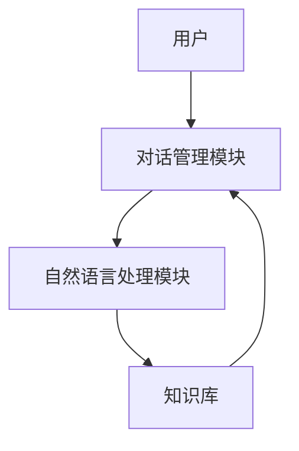
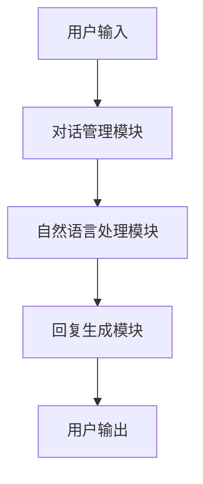
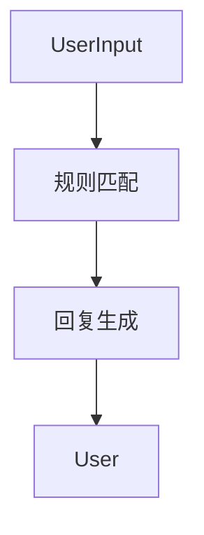
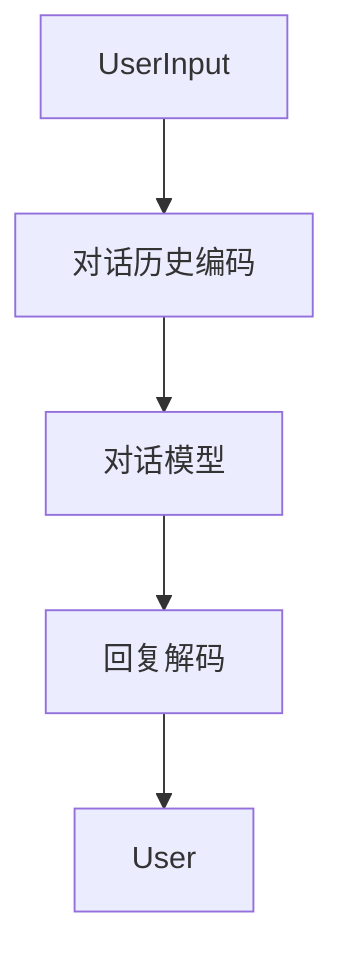
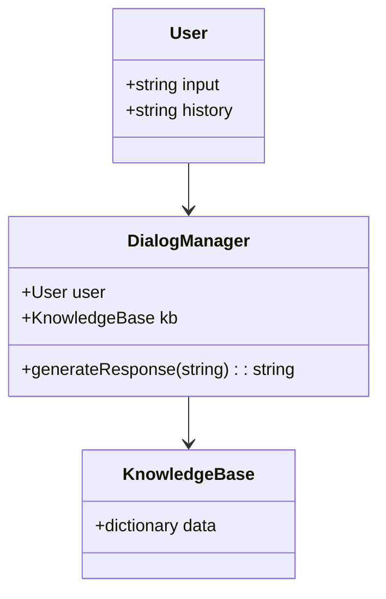
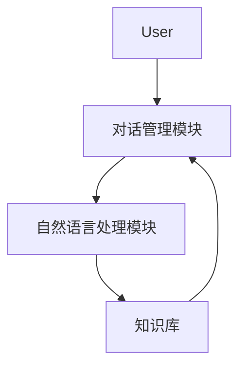
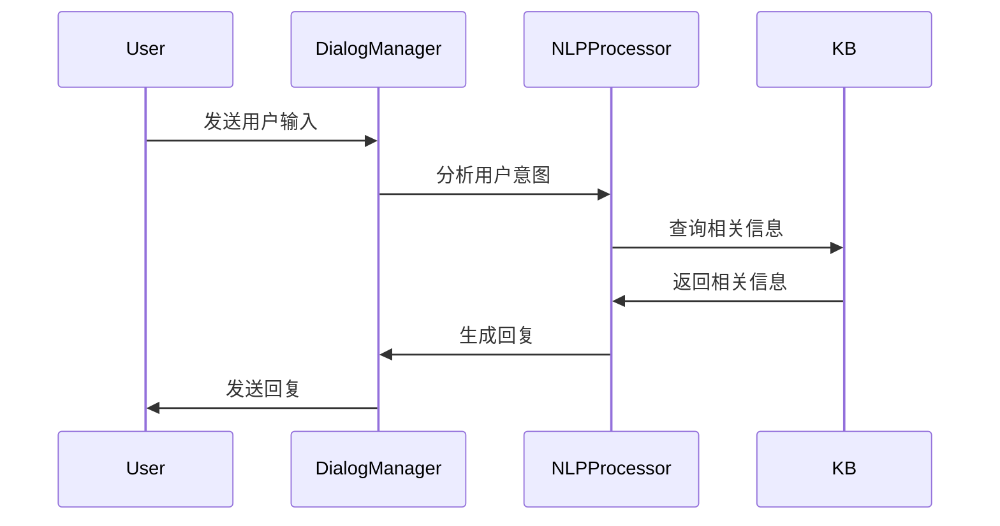

                 


# 多轮对话处理：提高AI Agent的交互质量

## 关键词：多轮对话、AI Agent、对话管理、自然语言处理、系统架构、算法原理、项目实战

## 摘要：本文系统地探讨了多轮对话处理的核心概念、算法原理、系统架构和项目实战。通过详细分析对话系统的组成、流程和优化方法，结合实际案例，深入讲解了如何提高AI Agent的交互质量。文章从背景介绍到最佳实践，全面覆盖多轮对话处理的各个方面，为读者提供了丰富的理论和实践指导。

---

## 第一部分: 多轮对话处理的背景与基础

### 第1章: 多轮对话处理的定义与背景

#### 1.1 多轮对话的定义与特点

##### 1.1.1 多轮对话的定义
多轮对话是指用户与AI Agent之间进行的连续、交互式的交流过程，通常涉及多个回合的输入和输出。与单轮对话（一次输入一次输出）不同，多轮对话能够捕捉上下文信息，从而提供更自然和智能的交互体验。

##### 1.1.2 多轮对话的核心特点
- **连续性**：对话能够保持上下文，逐步推进交流。
- **智能性**：通过理解历史对话内容，AI Agent能够提供更精准的回复。
- **交互性**：用户和AI Agent之间的互动更加自然，接近人类对话。

##### 1.1.3 多轮对话与单轮对话的对比
| 特性       | 单轮对话               | 多轮对话               |
|------------|------------------------|------------------------|
| 交互次数     | 一次输入，一次输出     | 多次输入，多次输出     |
| 上下文依赖   | 无                     | 有                     |
| 对话深度     | 浅层                   | 深层                   |
| 应用场景     | 简单查询（如天气预报）   | 复杂任务（如预约、导航） |

#### 1.2 多轮对话处理的背景与应用

##### 1.2.1 AI Agent的发展现状
AI Agent（智能体）近年来得到了快速发展，广泛应用于聊天机器人、虚拟助手（如Siri、Alexa）等领域。多轮对话处理是提升AI Agent智能化水平的关键技术。

##### 1.2.2 多轮对话在AI Agent中的重要性
- 提高用户体验：通过理解上下文，提供更个性化的服务。
- 处理复杂任务：多轮对话能够分解复杂问题，逐步引导用户完成任务。
- 降低误识别率：通过上下文信息，减少单轮对话中可能出现的歧义。

##### 1.2.3 多轮对话处理的典型应用场景
- 智能客服：帮助用户解决问题，如订单查询、投诉处理。
- 聊天机器人：提供更自然的对话体验。
- 健康咨询：逐步了解用户健康状况，提供个性化的建议。

### 第2章: 多轮对话处理的核心概念

#### 2.1 对话系统的组成与流程

##### 2.1.1 对话系统的组成要素
- **用户输入**：对话的起点，用户的自然语言输入。
- **对话管理模块**：负责解析用户输入，维护对话上下文。
- **自然语言处理模块**：理解用户意图，生成回复内容。
- **知识库**：存储对话所需的知识和信息。
- **回复生成**：将处理后的信息转化为自然语言输出。

##### 2.1.2 对话处理的基本流程
1. 用户输入：用户发送一条消息。
2. 解析意图：分析用户的需求和意图。
3. 维护上下文：记录对话历史，以便后续处理。
4. 生成回复：基于当前输入和上下文，生成合适的回复。
5. 输出回复：将回复返回给用户。

##### 2.1.3 对话系统的输入输出关系
- 输入：用户的自然语言或命令。
- 输出：系统的自然语言回复或操作反馈。

#### 2.2 对话管理与自然语言处理的关系

##### 2.2.1 对话管理的核心功能
- 维护对话上下文。
- 解析用户意图。
- 管理对话流程。
- 处理异常情况。

##### 2.2.2 自然语言处理在对话中的作用
- 分析用户输入，提取关键信息。
- 生成符合上下文的回复。
- 理解用户的深层需求。

##### 2.2.3 对话管理与NLP的协同工作
对话管理模块负责维护对话流程，而NLP模块负责理解和生成语言。两者协同工作，确保对话的流畅性和准确性。

#### 2.3 多轮对话处理的核心概念与联系

##### 2.3.1 对话系统的实体关系图


##### 2.3.2 对话流程的mermaid流程图


##### 2.3.3 对话系统的属性对比表
| 属性         | 描述                               |
|--------------|------------------------------------|
| 输入类型      | 用户的自然语言输入                 |
| 输出类型      | 系统的自然语言回复                 |
| 上下文依赖    | 高                                 |
| 复杂度        | 中等到高                           |

---

## 第三部分: 多轮对话处理的算法原理

### 第3章: 多轮对话处理的算法原理

#### 3.1 基于规则的多轮对话处理算法

##### 3.1.1 算法概述
基于规则的算法通过预定义的规则来处理对话，适用于场景简单、规则明确的任务。

##### 3.1.2 算法实现步骤
1. 分析用户输入，匹配预定义的规则。
2. 根据匹配的规则生成回复。
3. 维护对话上下文，确保规则的连贯性。

##### 3.1.3 算法实现的mermaid流程图


##### 3.1.4 算法实现的代码示例
```python
def generate_response(user_input, context):
    # 匹配预定义规则
    for rule in rules:
        if rule.matches(user_input, context):
            return rule.generate_response()
    # 如果没有匹配规则，生成默认回复
    return "抱歉，我还没有学会回答这类问题。"
```

#### 3.2 基于模型的多轮对话处理算法

##### 3.2.1 算法概述
基于模型的算法利用机器学习或深度学习模型来处理对话，适用于复杂场景。

##### 3.2.2 算法实现步骤
1. 对话历史编码：将对话历史转换为模型可理解的向量。
2. 模型推理：基于对话历史生成回复。
3. 回复解码：将模型生成的向量转换为自然语言回复。

##### 3.2.3 算法实现的mermaid流程图


##### 3.2.4 算法实现的数学公式
对话模型的编码过程可以表示为：
$$
H = f_{\text{encode}}(U, C)
$$
其中，\( H \) 是对话历史的编码，\( U \) 是用户输入，\( C \) 是上下文。

模型生成回复的过程可以表示为：
$$
R = f_{\text{decode}}(H)
$$
其中，\( R \) 是生成的回复。

#### 3.3 基于规则与基于模型算法的对比

##### 3.3.1 对比维度
- **灵活性**：基于规则的算法灵活性较低，基于模型的算法灵活性较高。
- **复杂度**：基于规则的算法复杂度低，基于模型的算法复杂度高。
- **可解释性**：基于规则的算法可解释性高，基于模型的算法可解释性较低。

##### 3.3.2 对比表格
| 特性       | 基于规则的算法       | 基于模型的算法       |
|------------|----------------------|----------------------|
| 灵活性       | 低                   | 高                   |
| 复杂度       | 低                   | 高                   |
| 可解释性     | 高                   | 低                   |

---

## 第四部分: 多轮对话处理的系统架构

### 第4章: 多轮对话处理的系统架构

#### 4.1 对话系统的功能设计

##### 4.1.1 领域模型设计
对话系统的领域模型可以表示为：


##### 4.1.2 系统架构设计
对话系统的整体架构可以表示为：


##### 4.1.3 系统接口设计
- **输入接口**：用户输入接口，接收用户的自然语言输入。
- **输出接口**：系统输出接口，返回对话回复。
- **上下文接口**：维护对话上下文，确保对话的连贯性。

#### 4.2 对话系统的交互设计

##### 4.2.1 对话流程的mermaid序列图


##### 4.2.2 对话系统的交互优化
- **上下文管理**：通过维护对话历史，确保每次回复都基于当前上下文。
- **意图识别**：利用自然语言处理技术，准确识别用户的意图。
- **回复生成**：根据上下文和意图，生成自然流畅的回复。

#### 4.3 对话系统的优化策略

##### 4.3.1 对话历史的存储与管理
- 使用数据结构（如链表或数组）存储对话历史。
- 定期清理过时的对话记录，确保系统性能。

##### 4.3.2 对话上下文的维护
- 使用状态机模型管理对话状态。
- 根据对话状态生成相应的回复。

##### 4.3.3 对话系统的容错机制
- 处理用户输入中的模糊或错误信息。
- 提供多轮确认机制，确保理解用户意图。

---

## 第五部分: 多轮对话处理的项目实战

### 第5章: 多轮对话处理的项目实战

#### 5.1 项目背景与目标

##### 5.1.1 项目背景
本项目旨在开发一个基于多轮对话的智能客服系统，能够处理用户的咨询和问题。

##### 5.1.2 项目目标
- 提供高效的客服支持。
- 提升用户体验。
- 实现多轮对话处理。

#### 5.2 项目核心实现

##### 5.2.1 环境安装
- 安装Python和必要的库（如NLTK、spaCy）。
- 安装对话管理框架（如Rasa）。

##### 5.2.2 核心代码实现

```python
class DialogManager:
    def __init__(self):
        self.history = []
        self.current_context = {}

    def process_input(self, user_input):
        self.history.append(user_input)
        # 分析意图
        intent = self.nlp_processor.predict_intent(user_input)
        # 维护上下文
        self.current_context[intent] = user_input
        # 生成回复
        response = self.nlp_processor.generate_response(intent, self.current_context)
        return response

    def clear_context(self):
        self.history = []
        self.current_context = {}
```

##### 5.2.3 代码实现的详细解读
- **对话管理模块**：负责维护对话历史和上下文。
- **自然语言处理模块**：负责分析用户意图，生成回复。
- **知识库模块**：存储和检索相关知识，辅助生成回复。

#### 5.3 项目案例分析

##### 5.3.1 案例背景
用户咨询购买产品的相关问题，需要多轮对话来完成。

##### 5.3.2 对话流程分析
1. 用户输入：我想要购买产品A。
2. 系统解析意图：查询产品信息。
3. 系统生成回复：请提供产品A的型号和数量。
4. 用户输入：型号是X，数量是5。
5. 系统解析意图：确认订单信息。
6. 系统生成回复：确认订单，将在3个工作日内送达。

##### 5.3.3 案例总结
通过多轮对话，系统能够准确理解用户需求，逐步引导用户完成任务。

#### 5.4 项目小结

##### 5.4.1 项目成果
成功开发了一个基于多轮对话的智能客服系统，能够处理用户的复杂咨询。

##### 5.4.2 经验总结
- 对话管理是多轮对话处理的核心。
- 自然语言处理技术是实现智能对话的关键。
- 系统架构设计需要考虑可扩展性和可维护性。

---

## 第六部分: 最佳实践与小结

### 第6章: 最佳实践与小结

#### 6.1 最佳实践

##### 6.1.1 对话系统的优化建议
- 定期更新知识库，确保信息的准确性。
- 提供多语言支持，扩大用户群体。
- 优化意图识别算法，提高准确率。

##### 6.1.2 对话系统的性能优化
- 使用缓存技术，减少重复计算。
- 优化对话流程，减少不必要的步骤。
- 提高系统响应速度，提升用户体验。

#### 6.2 小结

##### 6.2.1 全文总结
多轮对话处理是提升AI Agent交互质量的关键技术，通过合理设计系统架构、优化算法和提供最佳实践，能够实现高效、智能的对话系统。

##### 6.2.2 未来展望
随着自然语言处理技术的不断发展，多轮对话处理将更加智能化和个性化，为AI Agent的应用带来更广阔的可能性。

---

## 结语

通过本文的详细讲解，读者可以全面理解多轮对话处理的核心概念、算法原理和系统架构，掌握实际项目中的实现方法和优化策略。希望本文能够为AI Agent的开发人员和研究人员提供有价值的参考和启示。

