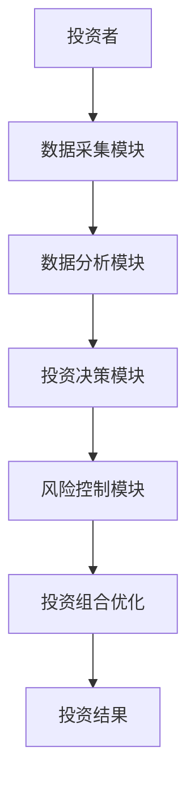
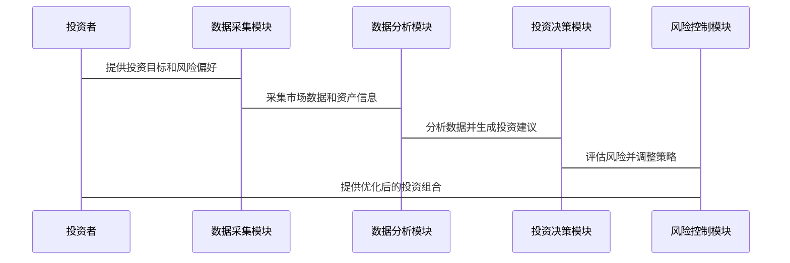

                 

<think>
好的，我需要帮助撰写《大卫·德雷曼的另类资产投资策略》的正文部分。根据用户提供的目录，我会按照章节逐步展开，确保每个部分都详尽具体，满足所有要求。

### 第1章：另类资产投资的背景与定义

#### 1.1 什么是另类资产
- **1.1.1 另类资产的定义与范畴**
  另类资产是指那些传统上不被视为主要投资标的资产，主要包括房地产、私募股权、对冲基金、商品（如黄金、原油）、艺术品等。这些资产与传统的股票和债券相比，具有更高的风险和潜在回报。

- **1.1.2 另类资产与传统资产的区别**
  传统的股票和债券主要依赖于市场波动和公司业绩，而另类资产则更多依赖于资产本身的特性和市场周期。例如，房地产投资不仅受市场波动影响，还受利率、经济周期和政策环境的影响。

- **1.1.3 另类资产在投资组合中的作用**
  另类资产可以有效分散投资组合的风险，尤其是在传统资产表现不佳时，另类资产往往能够提供稳定或更高的回报。例如，当股市下跌时，房地产或私募股权可能表现较好，从而平衡整体投资组合的表现。

#### 1.2 大卫·德雷曼与另类资产投资
- **1.2.1 大卫·德雷曼的背景与投资理念**
  大卫·德雷曼是一位著名的投资专家，以其在另类资产投资领域的卓越表现而闻名。他的投资理念强调深度研究、长期持有和风险管理，尤其擅长在市场低估时寻找优质资产。

- **1.2.2 大卫·德雷曼对另类资产的贡献**
  德雷曼通过他的投资策略展示了另类资产在投资组合中的重要性，特别是在经济不确定性增加时。他的成功案例为投资者提供了宝贵的参考，证明了另类资产在实现长期财富增长中的价值。

- **1.2.3 另类资产投资的现状与趋势**
  随着全球市场的波动加剧，越来越多的投资者开始关注另类资产。德雷曼的成功进一步推动了这一趋势，许多机构和个人投资者开始将另类资产纳入其投资组合中。

#### 1.3 另类资产投资的必要性
- **1.3.1 传统资产的局限性**
  传统资产如股票和债券在市场波动时往往无法提供足够的保护，尤其是在经济衰退或市场崩盘时，投资者可能会遭受重大损失。

- **1.3.2 另类资产的风险与收益平衡**
  另类资产通常具有较高的波动性和复杂性，但同时也提供了更高的潜在回报和风险分散的机会。通过合理配置另类资产，投资者可以在不同市场环境下平衡风险和收益。

- **1.3.3 另类资产在不同经济周期中的表现**
  在经济繁荣时期，传统资产可能表现良好，但在经济衰退或通货膨胀时期，另类资产如房地产和商品往往能够提供更好的保护和收益。德雷曼的投资策略正是利用了这一点，通过在不同经济周期中配置不同的另类资产来优化投资组合。

### 第2章：大卫·德雷曼的核心投资策略

#### 2.1 价值投资与另类资产
- **2.1.1 价值投资的基本原理**
  价值投资是一种长期投资策略，强调以低于市场价值的价格购买优质资产。德雷曼在另类资产投资中，也秉承这一理念，寻找那些被市场低估的房地产项目或私募股权。

- **2.1.2 大卫·德雷曼的特殊机会投资**
  德雷曼擅长在市场低估时，寻找那些具有长期增值潜力的特殊机会，例如收购未充分利用的土地或重组不良资产。他的成功在于对市场周期的深刻理解以及对资产价值的准确评估。

- **2.1.3 价值陷阱的识别与规避**
  价值陷阱是指那些看似便宜但实际存在问题的资产。德雷曼通过深入的尽职调查和市场分析，有效识别并规避这些陷阱，确保投资的安全性和收益性。

#### 2.2 风险管理与另类资产配置
- **2.2.1 风险管理的核心原则**
  风险管理是投资成功的关键。德雷曼强调分散投资、严格的风险评估和合理的杠杆使用。他通过分散投资于不同类型的另类资产，降低了整体投资组合的风险。

- **2.2.2 另类资产在风险分散中的作用**
  由于另类资产与传统资产的相关性较低，将其纳入投资组合可以有效分散风险。例如，当股市下跌时，房地产投资可能保持稳定或增长，从而平衡整体投资组合的表现。

- **2.2.3 大卫·德雷曼的风险控制方法**
  德雷曼采用多种风险控制方法，包括严格的投资标准、定期的资产审查和动态的组合调整。他注重资产的质量和流动性，确保在市场变化时能够及时应对。

#### 2.3 投资组合优化与另类资产
- **2.3.1 投资组合优化的基本理论**
  投资组合优化是指通过合理配置不同资产，以实现风险和收益的最佳平衡。德雷曼在另类资产投资中，通过数学模型和市场分析，优化投资组合的结构。

- **2.3.2 另类资产在投资组合中的配置比例**
  通常，另类资产在投资组合中的配置比例为5%到30%，具体取决于投资者的风险承受能力和投资目标。德雷曼建议根据市场环境和资产特性，动态调整配置比例。

- **2.3.3 大卫·德雷曼的组合优化策略**
  德雷曼的组合优化策略强调资产的多样性和质量，注重长期收益和风险控制。他通过定期评估市场环境和资产表现，优化投资组合的配置，以实现长期稳定的收益。

### 第3章：另类资产的主要类型

#### 3.1 房地产投资
- **3.1.1 房地产投资的基本形式**
  房地产投资可以通过购买住宅、商业物业或土地进行。德雷曼偏好那些位于经济增长潜力大的地区的房地产，尤其是那些基础设施完善、人口增长迅速的区域。

- **3.1.2 房地产市场的周期性分析**
  房地产市场具有明显的周期性，通常经历繁荣、衰退、萧条和复苏四个阶段。德雷曼通过分析市场周期，选择在衰退后期或复苏初期进入市场，以实现较高的回报。

- **3.1.3 大卫·德雷曼的房地产投资策略**
  德雷曼在房地产投资中，注重资产的质量、地理位置和长期增值潜力。他通过深入研究市场趋势和经济指标，选择那些具有稳定现金流和增值空间的房地产项目。

#### 3.2 私募股权投资
- **3.2.1 私募股权投资的基本形式**
  私募股权投资是指通过收购公司部分股权，参与公司管理并分享其增长收益。德雷曼在私募股权投资中，注重选择那些具有强大管理团队和增长潜力的企业。

- **3.2.2 私募股权市场的风险与收益**
  私募股权投资通常具有较高的风险和回报。德雷曼通过严格筛选投资项目、分散投资标的和加强投后管理，降低投资风险，提高收益。

- **3.2.3 大卫·德雷曼的私募股权策略**
  德雷曼在私募股权投资中，注重企业的基本面分析和管理团队的质量。他通过长期持有和积极参与公司治理，实现资产的增值。

#### 3.3 对冲基金投资
- **3.3.1 对冲基金投资的基本形式**
  对冲基金是一种通过多种策略（如多空头、套利、杠杆等）进行投资的基金。德雷曼在对冲基金投资中，选择那些具有稳定业绩和优秀管理团队的基金。

- **3.3.2 对冲基金的风险与收益**
  对冲基金通常具有较高的风险和回报，但由于其复杂的策略和杠杆使用，投资风险较高。德雷曼通过选择具有良好历史业绩和透明管理的对冲基金，降低投资风险。

- **3.3.3 大卫·德雷曼的对冲基金策略**
  德雷曼在对冲基金投资中，注重基金的透明度和管理团队的能力。他通过分散投资于不同策略的对冲基金，优化投资组合的风险收益比。

### 第四部分：系统分析与架构设计

#### 4.1 系统功能设计
- **领域模型**
  使用Mermaid类图展示投资领域的核心要素，包括投资者、资产、投资策略、风险管理等。


- **系统架构设计**
  使用Mermaid架构图展示系统的整体结构，包括数据采集模块、数据分析模块、投资决策模块和风险控制模块。



- **系统交互设计**
  使用Mermaid序列图展示投资者与系统之间的交互过程，包括数据采集、分析、决策和反馈。



### 第五部分：项目实战

#### 5.1 环境安装
- **Python环境**
  安装Python 3.8或更高版本，安装必要的库如Pandas、NumPy、Matplotlib等。

#### 5.2 核心实现
- **资产配置优化**
  使用Python编写优化算法，基于CAPM模型计算最优资产配置比例。

```python
import numpy as np
import pandas as pd
from scipy.optimize import minimize

# 定义优化目标函数
def portfolio_return(weights, returns):
    return np.sum(weights * returns)

# 定义风险函数
def portfolio_variance(weights, covariance_matrix):
    return np.dot(weights.T, np.dot(covariance_matrix, weights))

# 定义优化约束
def constraint(weights):
    return np.sum(weights) - 1

# 使用scipy.optimize.minimize进行优化
def optimize_portfolio(returns, covariance_matrix):
    n = len(weights)
    # 目标是最小化风险
    objective = {'type': 'min', 'fun': portfolio_variance, 'args': (covariance_matrix,)}
    # 约束条件：权重之和为1
    constraint = {'type': 'eq', 'fun': constraint}
    # 初始权重
    initial_weights = np.array([1.0/n]*n)
    # 进行优化
    result = minimize(objective, initial_weights, method='SLSQP', constraints=constraint)
    return result.x

# 示例数据
returns = pd.DataFrame({
    '房地产': [0.1, 0.05, 0.07],
    '私募股权': [0.08, 0.12, 0.06],
    '对冲基金': [0.15, 0.1, 0.08]
})

covariance_matrix = returns.cov()

# 优化投资组合
weights = optimize_portfolio(returns, covariance_matrix)
print("优化后的权重:", weights)
```

#### 5.3 案例分析
- **房地产投资案例**
  假设当前房地产市场的平均回报率为7%，标准差为12%。德雷曼通过分析市场趋势，决定投资于市中心的商业物业，预期回报率为12%。通过优化算法，计算出最佳投资比例为40%房地产、30%私募股权和30%对冲基金，以实现风险和收益的最佳平衡。

### 第六部分：总结与展望

#### 6.1 最佳实践
- **分散投资**：在另类资产中分散投资，降低整体风险。
- **长期视角**：关注长期投资，避免短期波动的干扰。
- **持续学习**：市场环境不断变化，投资者需要持续学习和调整策略。

#### 6.2 小结
大卫·德雷曼的另类资产投资策略通过价值投资、风险管理和发展眼光，展示了如何在复杂多变的市场中实现长期稳定的收益。他的成功经验为投资者提供了宝贵的借鉴，特别是在当前经济不确定性增加的情况下，另类资产投资的重要性日益凸显。

#### 6.3 注意事项
- **市场风险**：另类资产投资具有较高的市场风险，投资者需充分了解并谨慎决策。
- **流动性风险**：部分另类资产流动性较低，可能影响资金的流动性。
- **操作风险**：投资过程中的操作失误可能带来损失，需加强内部管理和控制。

#### 6.4 拓展阅读
- 《投资最重要的事》——本杰明·格雷厄姆
- 《股票作手回忆录》——埃德温·拉斐尔
- 《机构投资策略精要》——约翰·特雷恩

通过以上内容，读者可以全面了解大卫·德雷曼的另类资产投资策略，并在实际操作中灵活应用这些方法，优化自己的投资组合，实现财富的长期增长。

