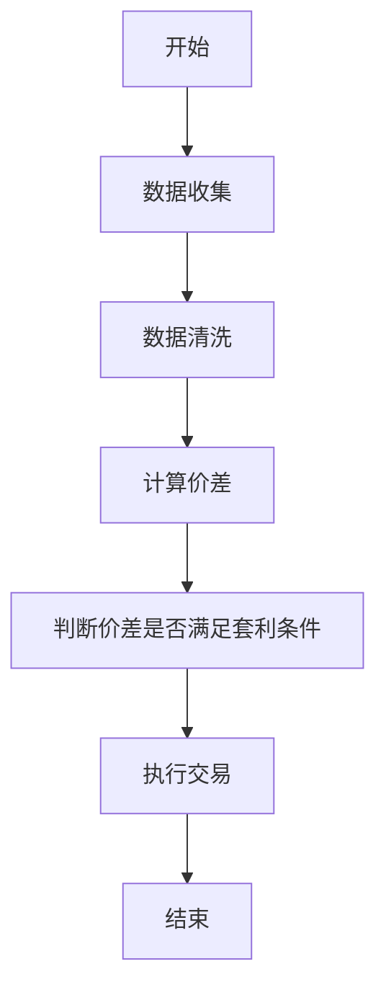

                 


# 大卫·德雷曼的合并套利技巧

> 关键词：合并套利，套利技巧，资产重组，大卫·德雷曼，金融策略，数学模型

> 摘要：本文深入探讨了大卫·德雷曼的合并套利技巧，从套利的基本概念到算法原理，再到系统架构设计，详细解析了套利机会的识别与利用。通过实际案例分析和代码实现，揭示了合并套利在金融领域的应用及其数学模型。最后，总结了套利的最佳实践和注意事项。

---

## 第一部分：合并套利的背景与核心概念

### 第1章：合并套利概述

#### 1.1 合并套利的定义与背景
套利（Arbitrage）是指利用不同市场或资产之间的价格差异，通过同时买入低价资产和卖出高价资产来获取无风险收益的策略。合并套利（Merging Arbitrage）则是一种特殊的套利形式，主要应用于企业并购和资产重组的场景中。

**1.1.1 合并套利的背景**  
随着全球化和金融市场的日益复杂化，企业并购和资产重组成为企业增长的重要手段。大卫·德雷曼通过其独特的套利技巧，帮助企业识别和利用市场中的价格差异，实现资产增值。  

**1.1.2 合并套利的核心要素**  
- 市场价格差异  
- 资产重组机会  
- 风险控制  

#### 1.2 合并套利的主要类型  
套利可以分为无风险套利和风险套利两类：  
- **无风险套利**：利用市场定价错误，通过同时买入低价资产和卖出高价资产，实现无风险收益。  
- **风险套利**：涉及高风险资产，如杠杆收购或复杂资产重组，收益更高，但风险也更大。  

#### 1.3 合并套利的市场环境  
套利机会的存在依赖于市场环境，包括：  
- 市场结构：集中市场和分散市场中的套利机会不同。  
- 信息不对称：掌握内部信息的企业可能获得套利机会。  
- 法律与道德：套利需遵守相关法律法规，避免操纵市场。  

---

### 第2章：合并套利的核心概念与联系

#### 2.1 合并套利的核心原理  
套利的原理基于价格差异，通过同时买入低价资产和卖出高价资产，利用价格回归机制获利。  

**2.1.1 无套利定价原理**  
在无套利的情况下，资产的理论价格应等于其市场价。任何价格差异都将被套利者消除。  

**2.1.2 套利机会的识别**  
套利机会通常存在于以下场景：  
- 股权收购：目标企业被低估时，收购后重新估值。  
- 资产重组：企业通过资产重组优化资产结构，提升市场价值。  

#### 2.2 套利机会的属性对比  
| 属性       | 无风险套利         | 风险套利         |
|------------|------------------|------------------|
| 风险等级   | 低               | 高               |
| 收益潜力   | 稳定             | 高               |
| 操作复杂度 | 简单             | 复杂             |

#### 2.3 合并套利的ER实体关系图  
```mermaid
erDiagram
    投资者 o-< 管理层 : 指导关系
    管理层 o-< 企业 : 控制关系
    企业 o-< 资产 : 拥有关系
    企业 o-< 市场 : 参与关系
```

---

## 第二部分：合并套利的算法原理与数学模型

### 第3章：合并套利的算法原理

#### 3.1 套利机会识别算法  
**3.1.1 套利机会识别的步骤**  
1. 数据收集：获取相关资产的市场价格数据。  
2. 数据清洗：去除异常值和缺失数据。  
3. 计算价差：比较资产间的理论价格与市场价格差异。  
4. 判断套利条件：判断价格差异是否满足套利条件。  
5. 执行交易：根据判断结果执行买入或卖出操作。  

**3.1.2 套利机会识别的流程图**  


**3.1.3 套利机会识别的Python代码实现**  
```python
def calculate_spread(asset1_price, asset2_price):
    spread = asset1_price - asset2_price
    return spread

def is_arbitrage_opportunity(spread, threshold):
    if spread > threshold:
        return True
    else:
        return False

# 示例
asset1 = 100
asset2 = 98
threshold = 2

spread = calculate_spread(asset1, asset2)
opportunity = is_arbitrage_opportunity(spread, threshold)
print(f"套利机会存在: {opportunity}")
```

#### 3.2 套利的数学模型  
套利的数学模型基于价格差异的回归。假设市场中存在两种资产A和B，其理论价格分别为$P_A$和$P_B$，实际价格分别为$P_A^m$和$P_B^m$。套利机会存在于以下情况：  
$$P_A^m - P_B^m \neq P_A - P_B$$  

---

## 第三部分：合并套利的系统分析与架构设计

### 第4章：系统分析与架构设计

#### 4.1 系统功能设计  
- **资产数据采集模块**：从多个市场获取资产价格数据。  
- **套利机会识别模块**：计算资产价格差异，判断套利机会。  
- **交易执行模块**：根据判断结果执行买入或卖出操作。  

#### 4.2 系统架构设计  


#### 4.3 系统接口设计  
- 数据接口：资产数据的输入与输出接口。  
- 交易接口：与交易系统对接，执行买入或卖出操作。  

---

## 第四部分：合并套利的项目实战

### 第5章：项目实战

#### 5.1 环境安装  
- 安装Python和相关库（如Pandas、NumPy）。  

#### 5.2 核心代码实现  
```python
import pandas as pd
import numpy as np

# 示例数据
data = {
    '资产A': [100, 102, 98, 101],
    '资产B': [98, 97, 96, 99]
}

df = pd.DataFrame(data)
df['价差'] = df['资产A'] - df['资产B']

# 判断套利机会
threshold = 2
df['套利机会'] = df['价差'] > threshold

print(df)
```

#### 5.3 实际案例分析  
假设某企业并购案例中，目标企业被低估，套利者通过收购低估资产并重新估值，实现收益。  

---

## 第五部分：合并套利的最佳实践

### 第6章：最佳实践

#### 6.1 小结  
套利是一种有效的投资策略，但需谨慎操作，避免法律和道德风险。  

#### 6.2 注意事项  
- 风险控制：合理配置资产，避免过度杠杆。  
- 信息获取：及时获取市场信息，抓住套利机会。  
- 法律合规：遵守相关法律法规，避免市场操纵。  

#### 6.3 拓展阅读  
推荐阅读《套利与金融市场》、《大卫·德雷曼的金融策略》等书籍。

---

## 结语

大卫·德雷曼的合并套利技巧为金融领域提供了新的视角和方法。通过深入分析套利的原理、算法和系统设计，我们可以更好地理解和应用这一策略。希望本文能为读者提供有价值的见解和实践指导。

