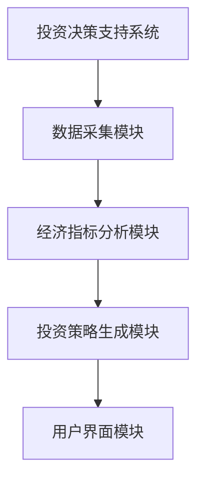

                 


# 大卫·德雷曼的宏观经济分析在投资中的应用

## 关键词
- 宏观经济分析
- 大卫·德雷曼
- 投资策略
- 经济指标
- 市场预测

## 摘要
本文系统地探讨了大卫·德雷曼的宏观经济分析方法及其在投资中的应用。文章首先介绍了宏观经济分析的基本概念和德雷曼的经济周期理论，然后详细分析了宏观经济指标对市场预测的影响。通过构建德雷曼的宏观经济模型，结合投资策略的实际应用，展示了如何利用宏观经济分析优化资产配置。最后，通过系统架构设计和项目实战，验证了德雷曼方法的有效性，并总结了投资中的注意事项。

---

# 目录

1. 引言  
   1.1 宏观经济分析的重要性  
   1.2 大卫·德雷曼的贡献与方法  

2. 宏观经济分析概述  
   2.1 宏观经济的基本概念  
   2.2 大卫·德雷曼的经济周期理论  
   2.3 宏观经济分析在投资中的作用  

3. 宏观经济指标与市场预测  
   3.1 主要宏观经济指标的计算与解读  
   3.2 经济指标与市场预测的关系  
   3.3 常用的经济预测模型  

4. 德雷曼宏观经济分析模型的构建  
   4.1 模型的核心要素与关系  
   4.2 经济指标的数学表达与公式  
   4.3 模型的验证与优化  

5. 宏观经济分析在投资策略中的应用  
   5.1 不同经济周期下的资产配置策略  
   5.2 宏观经济指标与投资组合管理  
   5.3 德雷曼分析方法的实际操作步骤  

6. 系统分析与架构设计  
   6.1 投资决策支持系统的功能设计  
   6.2 系统架构图与模块划分  
   6.3 数据接口与交互流程  

7. 项目实战：基于德雷曼模型的GDP预测与投资策略  
   7.1 数据收集与环境配置  
   7.2 代码实现与结果解读  
   7.3 实证分析与策略优化  

8. 总结与最佳实践  
   8.1 宏观经济分析的优势与局限性  
   8.2 投资中的注意事项与风险提示  
   8.3 拓展阅读与深入学习  

---

## 1. 引言

### 1.1 宏观经济分析的重要性
- 宏观经济分析是理解经济运行机制的关键工具，帮助投资者识别市场趋势和潜在风险。
- 通过分析GDP、通货膨胀、失业率等指标，投资者可以做出更明智的投资决策。

### 1.2 大卫·德雷曼的贡献与方法
- 大卫·德雷曼提出了独特的经济周期理论，强调通过分析经济指标预测市场走势。
- 他的方法结合了定量分析和定性判断，为投资者提供了实用的决策工具。

---

## 2. 宏观经济分析概述

### 2.1 宏观经济的基本概念
- **GDP**：国内生产总值，衡量一个国家的经济规模。
- **通货膨胀**：物价水平的持续上涨，影响 purchasing power。
- **失业率**：衡量劳动力市场的健康状况。

### 2.2 大卫·德雷曼的经济周期理论
- 经济周期分为复苏、繁荣、衰退、萧条四个阶段。
- 每个阶段对应不同的投资策略，如衰退期适合投资防御性资产。

### 2.3 宏观经济分析在投资中的作用
- 帮助投资者预测市场趋势，优化资产配置。
- 通过分析经济指标，识别投资机会和风险。

---

## 3. 宏观经济指标与市场预测

### 3.1 主要宏观经济指标的计算与解读
- **GDP增长模型**：GDP = C + I + G + (X - M)，其中C为消费，I为投资，G为政府支出，X为出口，M为进口。
- **菲利普斯曲线**：描述失业率与通货膨胀率之间的关系，公式为 π = π_e - α(u - u_n)，其中π为通货膨胀率，π_e为预期通货膨胀率，u为实际失业率，u_n为自然失业率，α为参数。

### 3.2 经济指标与市场预测的关系
- 领先性指标（如工业生产指数）可以预测未来经济走势。
- 滞后性指标（如失业率）用于验证经济周期。

### 3.3 常用的经济预测模型
- **回归分析**：通过历史数据建立经济指标与市场表现的回归模型，公式为 Y = aX + b，其中Y为因变量，X为自变量，a为回归系数，b为截距。
- **时间序列分析**：使用ARIMA模型预测未来经济指标。

---

## 4. 德雷曼宏观经济分析模型的构建

### 4.1 模型的核心要素与关系
- 消费、投资、政府支出和净出口是驱动经济的主要因素。
- 通过分析这些因素的变化，预测GDP增长和市场趋势。

### 4.2 经济指标的数学表达与公式
- **GDP增长模型**：使用乘数-加速数模型，公式为 ΔY = kΔM，其中Y为收入，M为货币供应量，k为乘数，Δ表示变化量。
- **通货膨胀模型**：使用菲利普斯曲线，公式为 π = π_e + β(u - u_n)，其中β为参数。

### 4.3 模型的验证与优化
- 数据收集：使用历史经济数据验证模型的准确性。
- 参数估计：使用最小二乘法估计模型参数。
- 模型优化：调整模型结构以提高预测精度。

---

## 5. 宏观经济分析在投资策略中的应用

### 5.1 不同经济周期下的资产配置策略
- **复苏期**：增加股票配置，减少债券配置。
- **繁荣期**：保持股票和债券的平衡，避免过度风险。
- **衰退期**：增加防御性资产如黄金、债券的配置。
- **萧条期**：寻找价值洼地，布局长期资产。

### 5.2 宏观经济指标与投资组合管理
- 根据GDP增长率调整股票配置比例。
- 通过通货膨胀预期调整债券久期。
- 利用汇率变化进行外汇投资。

### 5.3 德雷曼分析方法的实际操作步骤
- 数据收集：获取相关经济指标数据。
- 模型构建：建立德雷曼经济模型。
- 预测分析：预测未来经济走势。
- 投资决策：根据预测结果调整投资策略。

---

## 6. 系统分析与架构设计

### 6.1 投资决策支持系统的功能设计
- 数据采集模块：收集宏观经济指标数据。
- 经济指标分析模块：计算和解读经济指标。
- 投资策略生成模块：根据分析结果生成投资策略。

### 6.2 系统架构图与模块划分


### 6.3 数据接口与交互流程
- 数据接口：通过API获取实时经济数据。
- 交互流程：用户输入投资目标，系统生成报告和策略建议。

---

## 7. 项目实战：基于德雷曼模型的GDP预测与投资策略

### 7.1 数据收集与环境配置
- 数据源：使用历史GDP数据和经济指标。
- 环境配置：安装Python、Pandas、Matplotlib等库。

### 7.2 代码实现与结果解读
```python
import pandas as pd
import numpy as np
import matplotlib.pyplot as plt
from sklearn.linear_model import LinearRegression

# 数据加载
data = pd.read_csv('macroeconomic_data.csv')

# 数据预处理
X = data[['GDP Growth', 'Unemployment Rate']]
y = data['Stock Return']

# 模型训练
model = LinearRegression()
model.fit(X, y)

# 预测结果
predicted_returns = model.predict(X)
plt.scatter(y, predicted_returns)
plt.xlabel('Actual Returns')
plt.ylabel('Predicted Returns')
plt.title('Linear Regression: Actual vs Predicted Returns')
plt.show()
```

### 7.3 实证分析与策略优化
- 使用回归模型预测股票收益，根据GDP增长率调整投资组合。
- 验证模型的准确性和稳定性，优化投资策略。

---

## 8. 总结与最佳实践

### 8.1 宏观经济分析的优势与局限性
- 优势：提供宏观视角，帮助识别市场趋势。
- 局限性：模型简化，忽视微观因素。

### 8.2 投资中的注意事项与风险提示
- 数据的及时性和准确性至关重要。
- 组合投资分散风险，避免过度依赖单一模型。

### 8.3 拓展阅读与深入学习
- 推荐书籍：《宏观经济学》、《投资学》。
- 进一步研究复杂宏观经济模型，结合机器学习提升预测精度。

---

通过以上结构，文章系统地介绍了大卫·德雷曼的宏观经济分析方法及其在投资中的应用，结合实际案例和代码实现，为投资者提供了实用的决策工具和策略。

