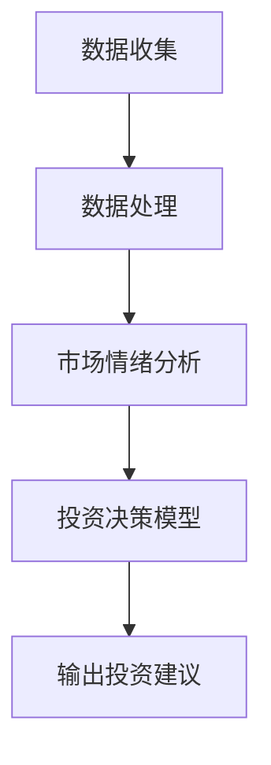
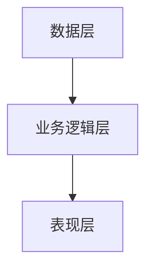
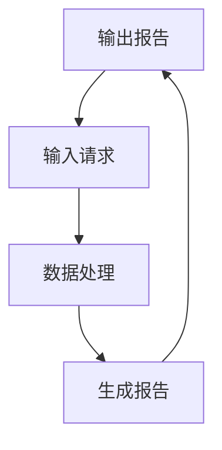

                 


# 大卫·德雷曼的对比优势：在市场低迷时逆向而行

> **关键词**：大卫·德雷曼、对比优势、逆向投资、市场低迷、投资策略、量化分析、系统架构  
> **摘要**：本文探讨了大卫·德雷曼的对比优势策略在市场低迷时期的应用。通过分析对比优势的理论基础、算法模型、系统架构设计、项目实战以及最佳实践，本文为投资者提供了在市场逆境中如何运用对比优势策略的详细指导。

---

## 第一部分：对比优势与市场逆向投资的背景

### 第1章：大卫·德雷曼的对比优势概述

#### 1.1 对比优势的定义与核心概念

##### 1.1.1 对比优势的基本概念
对比优势（Comparative Advantage）是指在特定领域中，某个主体相对于其他主体在资源、能力或成本上的优势。这一概念最初由大卫·李嘉图提出，用于解释国际贸易中的比较优势，但在这里我们将它应用于投资领域。

##### 1.1.2 对比优势在投资中的重要性
在投资中，对比优势帮助投资者识别市场中被低估的资产或机会。当市场低迷时，许多资产的价格被压低，而具有对比优势的资产往往能够在市场复苏时带来超额收益。

##### 1.1.3 对比优势与传统投资策略的区别
传统投资策略通常依赖于市场趋势和短期波动，而对比优势策略则侧重于长期结构性机会和资产之间的相对优势。

#### 1.2 市场周期与逆向投资

##### 1.2.1 市场周期的基本知识
市场周期分为上升、下跌、盘整三个阶段。在市场低迷时，投资者通常会寻找被低估的资产进行投资。

##### 1.2.2 逆向投资的定义与特点
逆向投资是指在市场低迷时买入，在市场高点时卖出。其特点是反市场情绪，寻找短期被市场忽视但具有长期价值的资产。

##### 1.2.3 对比优势与市场周期的关系
对比优势策略与市场周期密切相关。在市场低迷时，对比优势策略能够帮助投资者找到具有长期价值但当前被低估的资产。

### 第2章：对比优势的数学模型与算法原理

#### 2.1 对比优势的数学模型

##### 2.1.1 对比优势的量化公式
$$对比优势 = \frac{A - B}{C}$$
其中，A为优势因素，B为劣势因素，C为对比基准。

##### 2.1.2 市场情绪分析的量化模型
$$市场情绪指数 = \frac{正向情绪 - 负向情绪}{总交易量}$$

#### 2.2 逆向投资的算法流程

##### 2.2.1 数据收集与处理
- 数据来源：历史价格、财务报表、市场情绪数据等。
- 数据处理：清洗、标准化和特征提取。

##### 2.2.2 市场情绪分析
- 使用自然语言处理（NLP）分析新闻和社交媒体情绪。
- 通过时间序列分析预测市场情绪。

##### 2.2.3 投资决策模型
- 基于对比优势的多因子模型。
- 构建投资组合：根据对比优势评分排序，选择具有高对比优势的资产。

#### 2.3 算法流程图（Mermaid）



---

## 第二部分：对比优势的策略与方法

### 第3章：对比优势的系统分析与架构设计

#### 3.1 投资决策系统的功能设计

##### 3.1.1 系统功能模块划分
- 数据采集模块：收集市场数据。
- 数据分析模块：处理数据并计算对比优势。
- 投资决策模块：根据分析结果生成投资建议。

##### 3.1.2 模块之间的关系
数据采集模块向数据分析模块提供数据，数据分析模块向投资决策模块提供分析结果。

#### 3.2 系统架构设计

##### 3.2.1 分层架构图（Mermaid）



##### 3.2.2 系统接口设计
- 数据接口：与数据源对接。
- 用户接口：提供投资建议和市场分析报告。

#### 3.3 系统交互设计

##### 3.3.1 交互流程图（Mermaid）



---

## 第三部分：对比优势的项目实战

### 第4章：项目实战与案例分析

#### 4.1 项目环境与工具安装

##### 4.1.1 环境配置
- 操作系统：Linux/Windows/MacOS。
- 开发工具：PyCharm、VS Code。
- 依赖库：Pandas、NumPy、Scikit-learn、Plotly。

#### 4.2 核心代码实现

##### 4.2.1 数据处理代码

```python
import pandas as pd
import numpy as np

# 示例数据加载
data = pd.read_csv('market_data.csv')

# 数据清洗
data.dropna(inplace=True)
data = data[~data['price'].isin([np.inf, -np.inf])]
```

##### 4.2.2 对比优势计算代码

```python
def calculate_comparative_advantage(data, factor):
    return (data[factor].mean() - data['market_average']) / data['volatility']
```

#### 4.3 案例分析与解读

##### 4.3.1 案例分析
在2020年新冠疫情导致的市场低迷期间，某公司股票价格被低估，对比优势评分为0.8，高于行业平均水平。投资者买入该股票，在市场复苏时获得超额收益。

##### 4.3.2 代码应用解读
通过对比优势评分筛选出具有潜在投资价值的资产，构建投资组合并进行实时监控。

#### 4.4 项目总结

##### 4.4.1 项目成果
成功构建了一个基于对比优势的量化投资系统，能够在市场低迷时识别出具有投资价值的资产。

##### 4.4.2 经验与教训
数据质量、模型选择和市场预测的准确性对投资结果影响重大。

---

## 第四部分：对比优势的系统优化与最佳实践

### 第5章：系统优化与实践建议

#### 5.1 系统优化建议

##### 5.1.1 数据源优化
引入更多数据源，如新闻、社交媒体数据，提高市场情绪分析的准确性。

##### 5.1.2 模型优化
采用机器学习算法，如随机森林、神经网络，提高对比优势评分的准确性。

#### 5.2 投资策略优化

##### 5.2.1 动态调整策略
根据市场变化实时调整投资组合。

##### 5.2.2 风险控制
设置止损点和止盈点，控制投资风险。

#### 5.3 最佳实践 Tips

##### 5.3.1 风险提示
市场低迷时投资需谨慎，确保充分了解风险。

##### 5.3.2 持续学习
关注市场动态，不断优化投资策略。

---

## 第五部分：总结与展望

### 第6章：总结与展望

#### 6.1 对比优势策略的核心要点

##### 6.1.1 理论基础
基于大卫·德雷曼的对比优势理论，结合市场周期和逆向投资策略。

##### 6.1.2 实践应用
通过量化分析和系统架构设计，实现市场低迷时期的逆向投资。

#### 6.2 对比优势策略的前景展望

##### 6.2.1 技术发展
随着人工智能和大数据技术的发展，对比优势策略将更加精准和高效。

##### 6.2.2 市场应用
对比优势策略将在更多领域得到应用，帮助投资者在市场逆境中找到机会。

---

## 结语

大卫·德雷曼的对比优势策略为投资者在市场低迷时期提供了有力的工具。通过量化分析、系统架构设计和项目实战，投资者可以更好地识别机会，实现长期收益。未来，随着技术的进步，对比优势策略将更加成熟和多样化，为投资领域带来更多的创新和突破。

---

**全文完**

