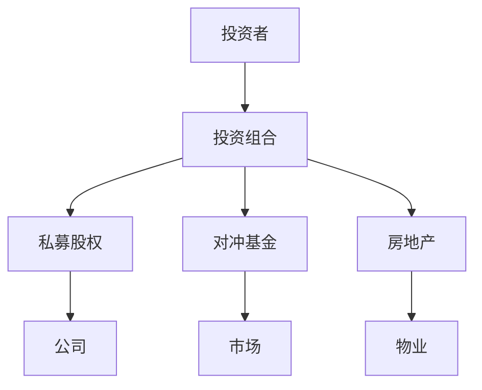
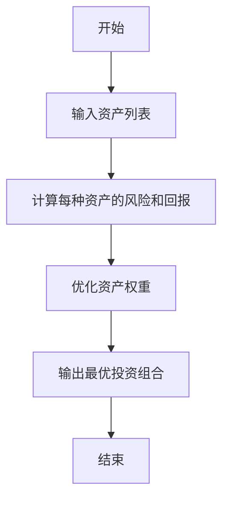
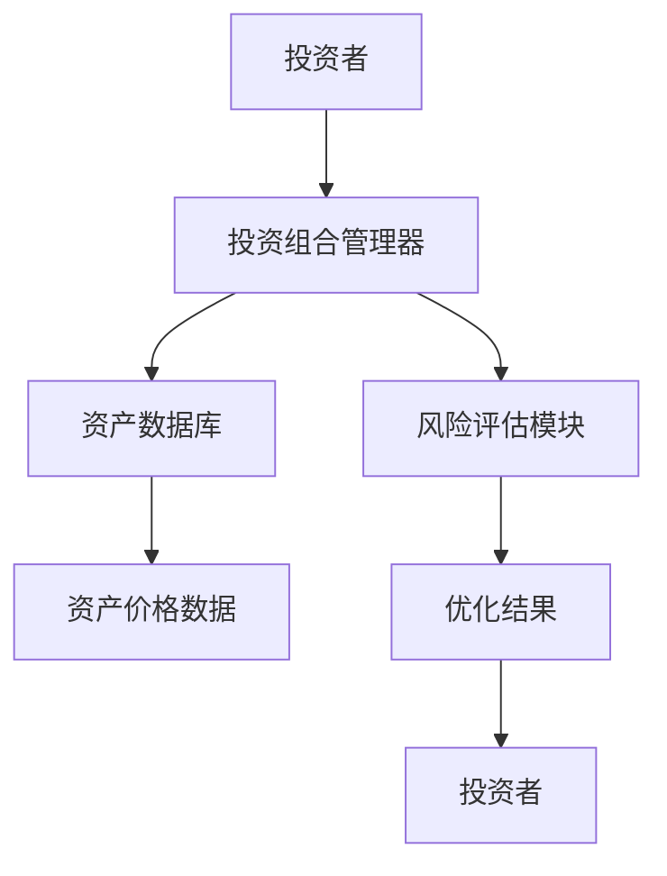

                 


# 大卫·斯文森的另类资产配置策略

## 关键词：大卫·斯文森，另类资产，资产配置，投资策略，私募股权，对冲基金

## 摘要：大卫·斯文森作为耶鲁大学的首席投资官，以其创新的另类资产配置策略闻名。本文深入分析了斯文森策略的核心理念、数学模型、系统架构以及实际应用，为读者提供了全面的视角来理解这种另类资产配置的科学性和实用性。

---

# 第一部分: 大卫·斯文森的另类资产配置策略概述

## 第1章: 大卫·斯文森及其另类资产配置策略背景

### 1.1 大卫·斯文森的背景介绍

#### 1.1.1 大卫·斯文森的教育与职业经历
大卫·斯文森（David Swensen）于1980年加入耶鲁大学，担任首席投资官，从此开启了他的传奇职业生涯。他拥有哈佛大学的物理学学士学位和耶鲁大学的经济学博士学位，这种跨学科的背景为他后来在投资领域的创新奠定了基础。

#### 1.1.2 斯文森在耶鲁大学的资产管理成就
在斯文森的领导下，耶鲁大学的捐赠基金从1980年代初的约1.3亿美元增长到2020年的超过30亿美元。这种增长得益于他对另类资产的大胆配置，尤其是对私募股权、房地产和对冲基金的重视。

#### 1.1.3 斯文森另类资产配置策略的核心理念
斯文森的核心理念是通过分散投资于不同类型的资产来降低风险并提高回报。他主张将部分资金分配给传统资产（如股票和债券），并将大部分资金分配给另类资产，以捕捉更高的超额收益。

---

### 1.2 另类资产配置的兴起

#### 1.2.1 传统资产配置的局限性
传统的资产配置主要依赖于股票和债券，但在市场波动加剧的情况下，这种策略往往难以提供稳定的超额收益。斯文森指出，传统资产配置在面对经济周期变化时表现不佳，尤其是在2008年金融危机期间。

#### 1.2.2 另类资产的定义与分类
另类资产包括私募股权、对冲基金、房地产、大宗商品等。与传统资产相比，另类资产具有较高的波动性和非流动性，但同时也提供了更高的潜在回报。

#### 1.2.3 另类资产配置在现代投资组合中的地位
斯文森认为，另类资产应该成为现代投资组合的核心部分。通过将部分资金分配给另类资产，投资者可以降低整体投资组合的波动性，同时捕捉到更多超额收益。

---

### 1.3 斯文森策略对全球资产管理的影响

#### 1.3.1 斯文森策略的成功案例
耶鲁大学捐赠基金的成功是斯文森策略的典型代表。通过将大量资金配置给私募股权和房地产，该基金在长期时间内实现了显著的超额收益。

#### 1.3.2 全球资产管理行业的变革
斯文森的策略引发了全球资产管理行业的广泛关注。许多机构投资者开始效仿他的做法，将更多资金分配给另类资产。

#### 1.3.3 斯文森策略的争议与挑战
尽管斯文森策略取得了巨大成功，但也面临一些争议。例如，另类资产的高门槛和复杂性使得许多中小投资者难以参与，同时，私募股权和对冲基金的高费用也可能侵蚀部分收益。

---

## 第2章: 另类资产配置的核心概念与联系

### 2.1 另类资产配置的核心概念

#### 2.1.1 另类资产的定义与属性
另类资产是指那些传统上不作为证券的投资标的，包括私募股权、对冲基金、房地产、大宗商品等。这些资产通常具有较高的风险和回报潜力。

#### 2.1.2 斯文森策略中的核心要素
斯文森策略的核心要素包括：
- **私募股权**：通过投资未上市公司获得长期收益。
- **对冲基金**：利用套利和其他策略在市场中获利。
- **房地产**：通过投资商业地产获得稳定的现金流。

#### 2.1.3 另类资产配置的数学模型与公式
斯文森策略的成功离不开其数学模型的支持。以下是其核心公式之一：

$$
\text{投资组合回报} = \sum_{i=1}^{n} w_i \times r_i
$$

其中，$w_i$ 是第$i$种资产的权重，$r_i$ 是第$i$种资产的回报率。

---

### 2.2 核心概念的联系与对比

#### 2.2.1 传统资产与另类资产的对比分析
| 特性         | 传统资产               | 另类资产               |
|--------------|-----------------------|-----------------------|
| 流动性         | 高                    | 低                    |
| 风险           | 中等                   | 高                    |
| 潜在回报       | 较低                   | 较高                  |
| 市场相关性     | 高                    | 低                    |

#### 2.2.2 通过 Mermaid 流程图展示 ER 实体关系


---

## 第3章: 另类资产配置策略的数学模型与算法

### 3.1 数学模型与公式

#### 3.1.1 现代投资组合理论（MPT）的数学模型
现代投资组合理论（MPT）通过优化投资组合的风险和回报，帮助投资者实现最佳投资效果。以下是MPT的核心公式：

$$
\text{最小化风险} = \sum_{i=1}^{n} \sum_{j=1}^{n} w_i w_j \sigma_{ij}
$$

其中，$\sigma_{ij}$ 是第$i$和第$j$种资产之间的协方差。

#### 3.1.2 斯文森策略中的风险调整回报公式
斯文森策略通过调整资产配置来优化风险调整后的回报。以下是其核心公式：

$$
\text{风险调整回报} = \frac{\text{投资组合回报} - \text{无风险利率}}{\text{投资组合标准差}}
$$

---

### 3.2 算法原理的详细讲解

#### 3.2.1 使用 Mermaid 画出算法流程图


#### 3.2.2 通过 Python 代码实现算法核心逻辑
以下是实现斯文森策略的Python代码：

```python
import numpy as np

def calculate_return(weights, returns):
    return np.dot(weights.T, returns)

def calculate_risk(weights, covariance_matrix):
    return np.sqrt(np.dot(weights.T @ covariance_matrix @ weights))

def optimize_portfolio(weights, returns, covariance_matrix):
    return calculate_return(weights, returns) / calculate_risk(weights, covariance_matrix)
```

---

## 第4章: 另类资产配置系统的分析与架构设计

### 4.1 系统分析

#### 4.1.1 问题场景介绍
投资者需要一个系统来优化其资产配置，以实现最大化的风险调整后回报。

#### 4.1.2 项目目标与范围
- 目标：构建一个基于斯文森策略的资产配置系统。
- 范围：包括私募股权、对冲基金和房地产等多种另类资产。

#### 4.1.3 需求分析与系统功能设计
- 需求分析：投资者需要实时监控和调整其资产配置。
- 系统功能设计：包括资产选择、权重优化和风险评估。

---

### 4.2 系统架构设计

#### 4.2.1 使用 Mermaid 类图展示领域模型


#### 4.2.2 使用 Mermaid 架构图展示系统整体架构


---

## 第5章: 另类资产配置策略的项目实战

### 5.1 环境安装与配置

#### 5.1.1 安装 Python 和必要的库
- 安装 Python 3.x
- 安装 numpy 和 pandas 库：
  ```bash
  pip install numpy pandas
  ```

#### 5.1.2 安装 Mermaid 和 LaTeX 工具
- 安装 Mermaid CLI：
  ```bash
  npm install -g mermaid-cli
  ```

---

### 5.2 系统实现与优化

#### 5.2.1 系统实现的关键步骤
1. 数据收集与预处理
2. 资产配置模型的构建
3. 系统优化与性能提升
4. 系统维护与更新

#### 5.2.2 系统优化与性能提升
通过并行计算和缓存机制优化系统的运行效率。

#### 5.2.3 系统维护与更新
定期更新资产数据和优化模型以适应市场变化。

---

## 第6章: 总结与展望

### 6.1 总结
大卫·斯文森的另类资产配置策略通过科学的数学模型和系统的架构设计，为投资者提供了实现超额收益的有效工具。

### 6.2 展望
未来，随着人工智能和大数据技术的发展，另类资产配置策略将进一步优化，为投资者带来更大的收益。

---

### 最佳实践 tips

#### 系统设计 tips
- 在设计系统时，确保数据的安全性和可靠性。
- 定期备份数据以防止数据丢失。

#### 代码实现 tips
- 在编写代码时，注意模块化设计，便于后续维护和扩展。
- 使用版本控制工具（如Git）管理代码。

#### 注意事项
- 在实际应用中，注意市场风险和政策风险。
- 定期评估和调整投资组合以适应市场变化。

#### 拓展阅读
- 阅读大卫·斯文森的《机构投资的创新之路》以深入了解其策略。
- 关注学术期刊和行业报告，获取最新的研究成果和市场动态。

---

希望这篇博客文章能为读者提供关于大卫·斯文森的另类资产配置策略的全面视角，并帮助他们在实际投资中取得成功。

