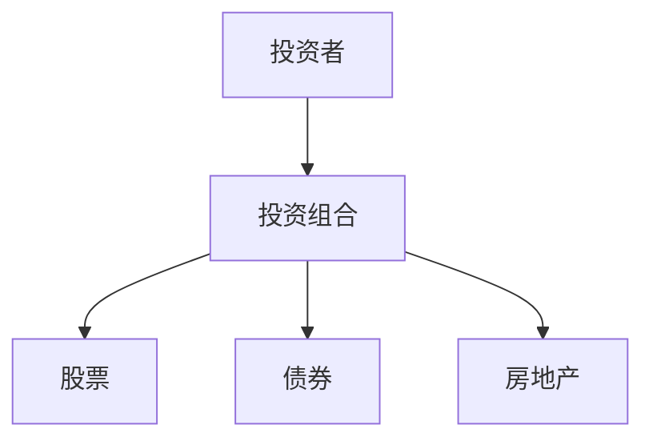
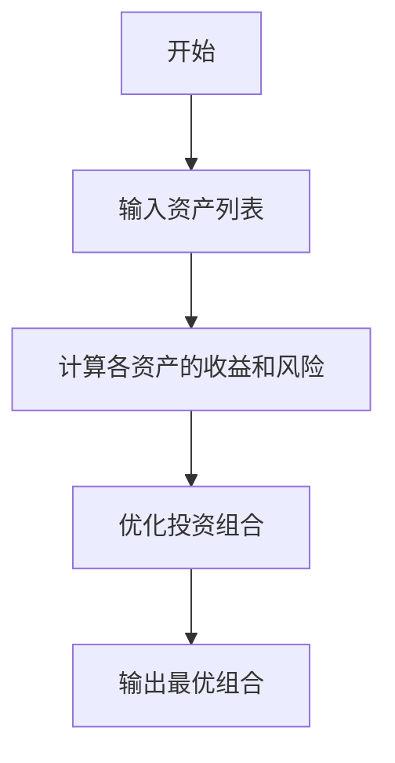
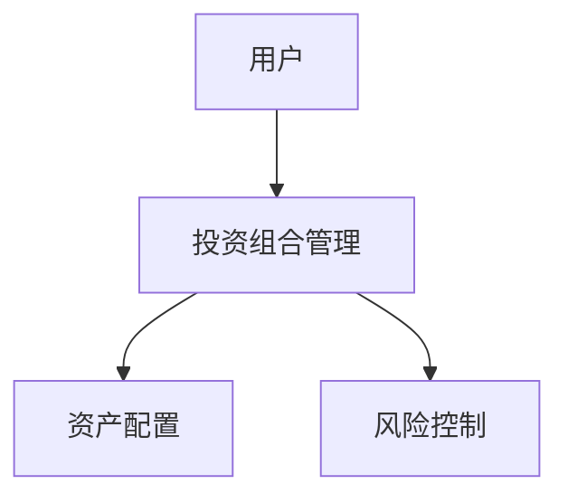

                 


# 大卫·斯文森的机构投资者长期价值创造

## 关键词：
- 机构投资者
- 长期价值创造
- 大卫·斯文森
- 资产配置
- 投资组合管理
- 风险管理

## 摘要：
大卫·斯文森作为耶鲁大学捐赠基金的首席投资官，以其独特的长期价值创造理念闻名。本文将深入分析斯文森的投资策略，探讨其如何通过科学的资产配置和风险管理实现长期收益。文章从背景介绍、核心概念、算法原理、系统架构到项目实战，全面解析机构投资者的长期价值创造过程。

---

## 第1章: 机构投资者与长期价值创造的背景

### 1.1 机构投资者的基本概念
#### 1.1.1 机构投资者的定义与分类
- 机构投资者是指以机构形式存在的投资者，包括养老基金、保险公司、银行、捐赠基金等。
- 分类：根据资金来源和投资目标，机构投资者可以分为养老基金型、保险资金型、银行理财资金型和捐赠基金型。

#### 1.1.2 机构投资者在金融市场的地位与作用
- 机构投资者是金融市场的重要参与者，通过大规模资金配置影响市场走势。
- 机构投资者注重长期投资，有助于市场的稳定性和长期健康发展。

#### 1.1.3 长期价值创造的定义与核心理念
- 长期价值创造是指通过长期持有优质资产，获得超越市场平均水平的收益。
- 核心理念：以基本面分析为基础，寻找具有持续竞争优势的企业，实现资本增值。

### 1.2 大卫·斯文森的投资理念
#### 1.2.1 大卫·斯文森的生平与投资成就
- 斯文森是耶鲁大学捐赠基金的首席投资官，以其卓越的投资业绩闻名。
- 他倡导多元化投资，通过分散投资降低风险，同时追求长期稳定的收益。

#### 1.2.2 斯文森投资策略的核心思想
- 长期持有优质资产，注重企业的内在价值。
- 通过合理的资产配置，平衡风险与收益。

#### 1.2.3 机构投资者的长期价值创造目标
- 机构投资者的目标是通过长期投资实现资产的保值增值，为委托人创造可持续的收益。

### 1.3 机构投资与个人投资的对比
#### 1.3.1 投资目标与时间跨度的差异
- 机构投资者注重长期稳定收益，而个人投资者可能更关注短期收益。

#### 1.3.2 投资策略与风险管理的差异
- 机构投资者采用多元化策略，注重风险控制；个人投资者可能更倾向于单一投资策略，风险承受能力较低。

#### 1.3.3 机构投资者的决策机制与优势
- 机构投资者有专业的投研团队，决策更加科学和系统。

---

## 第2章: 长期价值创造的核心概念与联系

### 2.1 长期价值创造的核心要素
#### 2.1.1 资产配置与投资组合管理
- 资产配置：根据市场环境和个人风险偏好，将资金分配到不同资产类别中。
- 投资组合管理：通过优化资产配置，降低风险，提高收益。

#### 2.1.2 风险管理与收益最大化
- 风险管理是长期价值创造的重要组成部分，通过合理分散投资降低风险。

#### 2.1.3 股票、债券与另类投资
- 股票：提供较高的收益潜力，但也伴随着较高的风险。
- 债券：提供稳定的利息收入，风险较低。
- 另类投资：包括房地产、私募股权等，可以分散投资风险。

### 2.2 核心概念与联系的表格对比
| 概念       | 长期价值创造 | 短期投资 |
|------------|--------------|----------|
| 时间跨度   | 长期（数年） | 短期（数月） |
| 投资目标   | 本金增值    | 本金增值 |
| 风险承受   | 较高         | 较低      |
| 投资策略   | 资产配置     | 技术分析  |

### 2.3 实体关系图


---

## 第3章: 投资组合管理的算法原理

### 3.1 现代投资组合理论
- 由哈里·马科维茨提出，通过优化投资组合的风险和收益。

### 3.2 均值-方差模型
$$ \text{收益} = \mu \times w $$
$$ \text{风险} = \sigma \times w $$
其中，\( w \) 是权重。

### 3.3 投资组合优化算法


### 3.4 Python代码实现
```python
import numpy as np
import pandas as pd

# 假设资产收益和风险数据
returns = np.array([0.1, 0.15, 0.08])
risks = np.array([0.1, 0.12, 0.05])

# 计算最优组合
cov_matrix = np.diag(risks)
weights = np.linalg.solve(cov_matrix, returns) / np.sum(np.linalg.solve(cov_matrix, returns))
```

---

## 第4章: 数学模型与公式

### 4.1 均值-方差模型
$$ \text{目标函数：最小化} \sum_{i=1}^{n} w_i^2 \sigma_i^2 $$
$$ \text{约束条件：} \sum_{i=1}^{n} w_i \mu_i = \text{目标收益} $$
$$ \sum_{i=1}^{n} w_i = 1 $$

### 4.2 实例分析
假设三种资产，计算最优组合权重。

---

## 第5章: 系统架构与设计

### 5.1 系统功能设计
- 用户界面：显示投资组合的收益和风险。
- 数据处理模块：计算资产收益和风险。

### 5.2 系统架构图


### 5.3 接口设计
- 输入接口：接收用户的投资目标。
- 输出接口：显示投资组合建议。

---

## 第6章: 项目实战

### 6.1 环境安装
安装numpy和pandas库：
```bash
pip install numpy pandas
```

### 6.2 核心代码实现
```python
import numpy as np
import pandas as pd

def calculate_portfolio(weights, returns, cov_matrix):
    portfolio_return = np.dot(weights.T, returns)
    portfolio_risk = np.sqrt(np.dot(weights.T, np.dot(cov_matrix, weights)))
    return portfolio_return, portfolio_risk

# 示例数据
returns = pd.Series([0.1, 0.15, 0.08])
cov_matrix = pd.DataFrame(np.diag([0.1, 0.12, 0.05]))

# 计算最优组合
weights = np.array([0.3, 0.5, 0.2])
return_val, risk_val = calculate_portfolio(weights, returns, cov_matrix)
print(f"组合收益：{return_val}\n组合风险：{risk_val}")
```

### 6.3 案例分析
假设三种资产，计算最优组合的收益和风险。

### 6.4 项目总结
通过代码实现投资组合管理，验证长期价值创造的可行性。

---

## 第7章: 最佳实践与总结

### 7.1 小结
- 长期价值创造需要科学的资产配置和风险管理。
- 通过算法优化和系统设计，可以实现投资收益的最大化。

### 7.2 注意事项
- 投资者需根据自身风险承受能力调整投资策略。
- 定期评估和调整投资组合，以适应市场变化。

### 7.3 拓展阅读
- 《机构投资》
- 《投资学原理》

---

通过以上结构，文章详细阐述了大卫·斯文森的长期价值创造理念，结合理论与实践，为读者提供了全面的指导。

