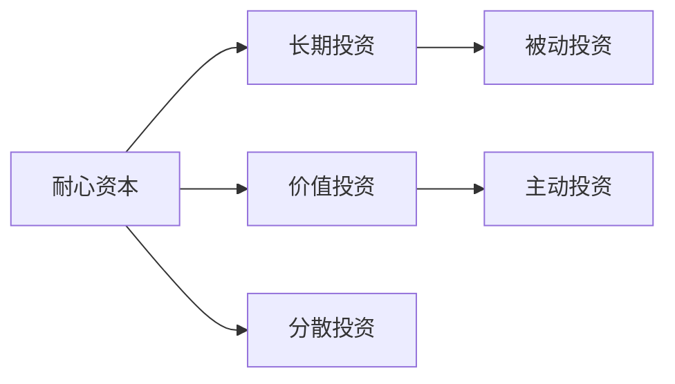

                 


# 大卫·斯文森的耐心资本：长期投资的艺术

## 关键词
- 耐心资本
- 长期投资
- 资产配置
- 投资策略
- 投资系统架构

## 摘要
本文探讨了大卫·斯文森的耐心资本理念，分析其在长期投资中的应用，结合数学模型和系统架构设计，详细讲解了耐心资本的实现和效果，提供了实际案例和最佳实践。

---

# 大卫·斯文森的耐心资本：长期投资的艺术

## 第一部分: 大卫·斯文森的耐心资本概述

### 第1章: 大卫·斯文森与耐心资本的背景

#### 1.1 大卫·斯文森的生平与投资理念

##### 1.1.1 大卫·斯文森的早年经历
大卫·斯文森是耶鲁大学的首席投资官，以其长期投资策略闻名。他在哈佛大学和耶鲁大学学习，后在著名投资机构工作，积累了丰富的投资经验。

##### 1.1.2 耐心资本的定义与核心理念
耐心资本是指投资者在投资中保持长期持有，避免短期波动干扰，实现稳定增长。核心理念是通过分散投资和长期持有，降低风险，提高收益。

##### 1.1.3 耐心资本与长期投资的关系
耐心资本强调长期性，通过长期持有优质资产，避免短期市场波动，实现财富稳步增长。

#### 1.2 耐心资本的背景与现状

##### 1.2.1 当前金融市场的主要挑战
当前市场波动剧烈，短期交易频繁，投资者容易受到市场情绪影响，忽视长期价值。

##### 1.2.2 耐心资本在现代投资中的重要性
耐心资本帮助投资者在波动市场中保持稳定，避免短期亏损，实现长期收益。

##### 1.2.3 耐心资本与机构投资的结合
机构投资者通过耐心资本策略，优化资产配置，提升整体投资回报。

### 第2章: 长期投资的艺术

#### 2.1 长期投资的核心要素

##### 2.1.1 耐心资本的三大支柱
1. **分散投资**：通过多元化配置降低风险。
2. **长期持有**：避免频繁交易，减少费用和税金。
3. **价值投资**：选择具有长期增长潜力的优质资产。

##### 2.1.2 投资组合的构建原则
- **资产配置**：根据风险承受能力和目标，合理分配股票、债券等资产。
- **定期再平衡**：定期调整投资组合，保持目标比例。
- **低成本**：选择费用低的基金或指数基金，减少费用侵蚀收益。

##### 2.1.3 风险管理与长期收益的关系
通过分散投资和风险控制，降低整体投资组合的风险，从而实现长期稳定的收益。

#### 2.2 耐心资本与价值投资的联系

##### 2.2.1 价值投资的起源与发展
价值投资由本杰明·格雷厄姆提出，强调以低于内在价值的价格买入优质股票，长期持有。

##### 2.2.2 耐心资本与价值投资的异同
- **相同点**：都强调长期持有，寻找具有长期增长潜力的资产。
- **不同点**：耐心资本更注重分散投资和资产配置，而价值投资更关注个股选择。

##### 2.2.3 耐心资本在价值投资中的应用
通过耐心资本策略，投资者可以在市场波动中坚持价值投资，避免短期损失，实现长期收益。

---

## 第二部分: 耐心资本的系统性分析

### 第3章: 耐心资本的核心概念与联系

#### 3.1 耐心资本的核心概念

##### 3.1.1 耐心资本的属性特征
| 属性       | 特征描述                                   |
|------------|------------------------------------------|
| 长期性      | 强调长期持有，避免短期交易               |
| 分散性      | 通过多元化配置降低风险                 |
| 低成本      | 选择低费用的基金或指数基金               |
| 价值导向    | 侧重于投资具有长期增长潜力的资产         |

##### 3.1.2 耐心资本与其他投资策略的关系


### 第4章: 耐心资本的数学模型与算法实现

#### 4.1 耐心资本的数学模型

##### 4.1.1 现代投资组合理论（MPT）的实现
现代投资组合理论通过优化资产配置，实现收益最大化和风险最小化。其数学模型为：

$$ \text{收益} = \sum w_i r_i $$
$$ \text{风险} = \sqrt{\sum w_i^2 \sigma_i^2 + \sum w_i w_j \sigma_{ij}} $$

其中，\( w_i \) 是资产i的权重，\( r_i \) 是资产i的预期收益率，\( \sigma_i \) 是资产i的波动率，\( \sigma_{ij} \) 是资产i和j的相关性。

##### 4.1.2 基于Python的MPT代码实现
```python
import numpy as np
import pandas as pd

# 示例数据
returns = pd.DataFrame({
    '资产1': [0.1, 0.05, 0.02, -0.03],
    '资产2': [0.08, 0.04, -0.01, 0.06],
    '资产3': [0.03, 0.07, 0.08, -0.02]
})

# 计算协方差矩阵
cov_matrix = returns.cov()

# 定义优化目标函数
def portfolio_var(weights, cov_matrix):
    return np.sqrt(weights.T @ cov_matrix @ weights)

# 使用优化算法求解最优权重
from scipy.optimize import minimize

# 初始权重
initial_weights = [1/3, 1/3, 1/3]

# 约束条件
constraints = [{'type': 'eq', 'fun': lambda w: sum(w) - 1}]

# 优化问题
result = minimize(portfolio_var, initial_weights, args=cov_matrix, constraints=constraints)

# 最优权重
optimal_weights = result.x

print("最优权重:", optimal_weights)
print("最小方差:", result.fun)
```

##### 4.1.3 算法的优化与改进
在实际应用中，可以通过引入更多资产、调整约束条件或使用更高效的优化算法来优化模型，提高投资组合的收益风险比。

### 第5章: 耐心资本的系统架构设计

#### 5.1 系统功能模块

##### 5.1.1 数据采集与处理模块
负责收集市场数据、分析数据并生成投资建议。

##### 5.1.2 投资策略生成模块
基于分析结果，制定并优化投资策略。

##### 5.1.3 风险评估与预警模块
评估投资风险，设定预警机制，及时调整投资组合。

#### 5.2 系统架构的Mermaid图


### 第6章: 耐心资本的项目实战

#### 6.1 环境安装与配置
安装必要的Python库，如pandas、numpy、scipy等。

#### 6.2 核心代码实现
实现投资组合优化的代码，进行数据处理和策略生成。

#### 6.3 案例分析与解读
通过具体案例，展示耐心资本策略在实际投资中的应用效果。

#### 6.4 项目小结
总结项目成果，分析优势与不足，提出改进建议。

### 第7章: 最佳实践与注意事项

#### 7.1 小结
耐心资本是一种有效的长期投资策略，通过分散投资和长期持有，实现稳定收益。

#### 7.2 注意事项
- **风险控制**：定期评估和调整投资组合，降低风险。
- **费用控制**：选择低成本的投资工具，减少费用侵蚀收益。
- **长期视角**：坚持长期投资，避免短期市场波动影响决策。

#### 7.3 拓展阅读
推荐相关书籍和资源，供读者深入学习耐心资本和其他投资策略。

---

# 结语
大卫·斯文森的耐心资本理念为长期投资提供了新的视角和方法。通过系统性分析和实际案例，我们可以更好地理解和应用这一策略，实现财富的长期稳健增长。

