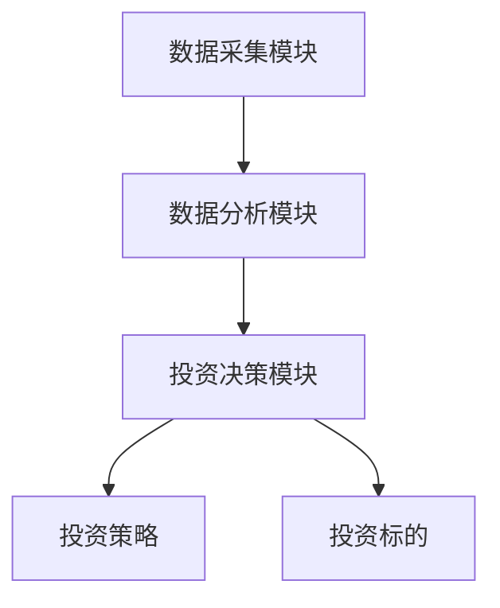

                 


# 《大卫·温特斯的周期性行业价值投资》

## 关键词：大卫·温特斯、周期性行业、价值投资、投资策略、价值评估

## 摘要：本文深入探讨了大卫·温特斯的周期性行业价值投资理念，分析了周期性行业的特点及其与价值投资的结合方式，详细讲解了温特斯的投资策略和方法，包括选股标准、估值模型、投资组合管理等核心内容，为投资者提供了系统的理论指导和实战经验。

---

## 第1章：周期性行业的定义与特点

### 1.1 周期性行业的定义

周期性行业是指那些受经济周期波动显著影响的行业，其业绩表现与整体经济环境密切相关。周期性行业的波动性特征使其在经济繁荣时表现优异，在经济衰退时则可能遭受重创。

#### 1.1.1 周期性行业的概念

周期性行业可以分为强周期性和弱周期性行业。强周期性行业如建筑材料、机械设备制造等，其需求与经济周期高度相关；弱周期性行业如汽车制造、电子设备制造等，其需求受经济周期影响较小，但仍具有一定的周期性特征。

#### 1.1.2 周期性行业的分类

周期性行业主要分为以下几类：
1. **强周期性行业**：需求波动剧烈，与GDP增长高度相关。
2. **弱周期性行业**：需求波动较小，但仍然受到经济周期影响。
3. **非周期性行业**：需求相对稳定，受经济周期影响较小。

#### 1.1.3 周期性行业的波动性特征

周期性行业的波动性特征主要体现在以下几个方面：
- **需求波动**：在经济繁荣时期，需求增加；在经济衰退时期，需求下降。
- **价格波动**：由于需求变化，行业产品的价格波动较大。
- **库存波动**：行业库存水平在经济周期中呈现周期性变化。

### 1.2 价值投资的基本原理

价值投资是一种以寻找市场价格低于其内在价值的投资策略，核心在于发现市场定价错误的投资机会。

#### 1.2.1 价值投资的核心概念

价值投资的核心概念包括：
- **内在价值**：企业未来现金流的现值。
- **市场价格**：市场上交易的价格。
- **安全边际**：市场价格与内在价值之间的差异，提供投资的安全空间。

#### 1.2.2 价值投资与周期性行业的结合

周期性行业的波动性为价值投资者提供了投资机会。在经济衰退时期，周期性行业的市场价格可能低于其内在价值，为投资者提供了买入机会；在经济繁荣时期，市场价格可能高于其内在价值，为投资者提供了卖出机会。

#### 1.2.3 价值投资的基本原则

价值投资的基本原则包括：
- **长期投资**：关注企业的长期价值，而非短期价格波动。
- **安全边际**：买入价格低于内在价值。
- **分散投资**：避免过度集中于单一行业或企业。

### 1.3 大卫·温特斯的投资理念

大卫·温特斯是著名的对冲基金经理，以其在周期性行业中的价值投资策略闻名。

#### 1.3.1 温特斯的投资哲学

温特斯的投资哲学可以概括为：
- **寻找市场的非共识观点**：通过深入研究发现市场未被充分认识到的投资机会。
- **关注安全边际**：买入价格低于内在价值的企业。
- **逆周期投资**：在经济衰退时期投资周期性行业，以获得超额收益。

#### 1.3.2 温特斯对周期性行业的独特见解

温特斯认为，周期性行业的波动性为其提供了投资机会。在经济衰退时期，周期性行业的市场价格往往低于其内在价值，为投资者提供了买入机会；在经济复苏时期，市场价格逐渐回升，为投资者提供了卖出机会。

#### 1.3.3 温特斯的投资策略

温特斯的投资策略包括：
- **行业轮动**：根据经济周期的变化，选择表现较好的周期性行业进行投资。
- **个股选择**：在选定的周期性行业中，选择具有竞争优势和估值优势的企业。
- **组合管理**：通过分散投资降低风险，同时集中投资于具有较大上涨潜力的个股。

---

## 第2章：周期性行业的核心概念与联系

### 2.1 周期性行业的波动性分析

周期性行业的波动性分析是价值投资者在选择投资标的时的重要依据。

#### 2.1.1 周期性行业的波动周期

周期性行业的波动周期可以分为以下几个阶段：
1. **繁荣阶段**：经济繁荣，需求增加，企业盈利上升。
2. **衰退阶段**：经济衰退，需求下降，企业盈利下降。
3. **复苏阶段**：经济复苏，需求逐步恢复，企业盈利开始回升。
4. **过热阶段**：经济过热，需求超过供给，企业盈利达到峰值。

#### 2.1.2 周期性行业的价格波动规律

周期性行业的价格波动规律主要体现在以下几个方面：
- **价格波动幅度大**：周期性行业的市场价格波动幅度较大，尤其是在经济周期变化时。
- **价格与需求相关**：价格的变化与需求的变化密切相关。
- **价格与供给相关**：价格的变化也与供给的变化密切相关。

#### 2.1.3 周期性行业的市场情绪影响

周期性行业的市场情绪影响主要体现在以下几个方面：
- **市场情绪波动**：市场情绪的变化会影响周期性行业的市场价格。
- **投资者行为变化**：投资者行为的变化会影响周期性行业的市场需求。
- **市场预期变化**：市场预期的变化会影响周期性行业的市场价格。

### 2.2 价值投资的核心要素

价值投资的核心要素包括企业基本面分析和财务指标分析。

#### 2.2.1 企业基本面分析

企业基本面分析是价值投资的重要组成部分，主要包括以下几个方面：
- **行业地位**：企业在行业中的地位，包括市场份额、竞争优势等。
- **财务状况**：企业的财务状况，包括资产负债表、利润表、现金流量表等。
- **盈利能力**：企业的盈利能力，包括净利润率、毛利率等。

#### 2.2.2 财务指标分析

财务指标分析是价值投资的重要工具，主要包括以下几个方面：
- **市盈率（P/E）**：企业股价与每股收益的比率。
- **市净率（P/B）**：企业股价与每股净资产的比率。
- **股息率**：企业每股股息与股价的比率。

#### 2.2.3 行业周期分析

行业周期分析是价值投资者在选择投资标的时的重要依据，主要包括以下几个方面：
- **行业周期阶段**：行业所处的周期阶段，包括繁荣阶段、衰退阶段、复苏阶段等。
- **行业增长潜力**：行业的增长潜力，包括市场需求、技术创新等。
- **行业竞争格局**：行业的竞争格局，包括市场集中度、竞争优势等。

### 2.3 周期性行业与价值投资的关系

周期性行业与价值投资的关系密切，主要体现在以下几个方面：
- **周期性行业的波动性为价值投资者提供了投资机会**：在经济衰退时期，周期性行业的市场价格可能低于其内在价值，为投资者提供了买入机会。
- **价值投资在周期性行业中的应用**：价值投资者通过分析周期性行业的基本面和市场估值，选择具有竞争优势和估值优势的企业进行投资。
- **周期性行业中的安全边际**：周期性行业的波动性为价值投资者提供了安全边际，即市场价格与内在价值之间的差异，为投资者提供了投资的安全空间。

---

## 第3章：周期性行业价值投资的算法原理

### 3.1 周期性行业价值投资的筛选方法

周期性行业价值投资的筛选方法主要包括以下几个方面：
- **低市盈率（P/E）分析**：选择市盈率低于行业平均水平的企业进行投资。
- **低市净率（P/B）分析**：选择市净率低于行业平均水平的企业进行投资。
- **高股息率分析**：选择股息率高于行业平均水平的企业进行投资。

#### 3.1.1 低市盈率（P/E）分析

低市盈率分析是价值投资者选择投资标的的重要依据，主要通过计算企业的市盈率来判断其估值是否合理。

##### 3.1.1.1 市盈率计算公式

$$\text{市盈率} = \frac{\text{股价}}{\text{每股收益}}$$

##### 3.1.1.2 低市盈率分析的优势

低市盈率分析的优势主要体现在以下几个方面：
- **估值安全**：低市盈率企业通常具有较高的安全边际。
- **投资机会**：低市盈率企业可能被市场低估，具有较大的投资潜力。

##### 3.1.1.3 低市盈率分析的局限性

低市盈率分析的局限性主要体现在以下几个方面：
- **企业盈利不稳定**：低市盈率企业可能盈利不稳定，影响投资安全性。
- **行业周期影响**：低市盈率企业可能受行业周期影响较大，影响投资收益。

#### 3.1.2 低市净率（P/B）分析

低市净率分析是价值投资者选择投资标的的重要依据，主要通过计算企业的市净率来判断其估值是否合理。

##### 3.1.2.1 市净率计算公式

$$\text{市净率} = \frac{\text{股价}}{\text{每股净资产}}$$

##### 3.1.2.2 低市净率分析的优势

低市净率分析的优势主要体现在以下几个方面：
- **估值安全**：低市净率企业通常具有较高的安全边际。
- **投资机会**：低市净率企业可能被市场低估，具有较大的投资潜力。

##### 3.1.2.3 低市净率分析的局限性

低市净率分析的局限性主要体现在以下几个方面：
- **企业资产质量不稳定**：低市净率企业可能资产质量不稳定，影响投资安全性。
- **行业周期影响**：低市净率企业可能受行业周期影响较大，影响投资收益。

#### 3.1.3 高股息率分析

高股息率分析是价值投资者选择投资标的的重要依据，主要通过计算企业的股息率来判断其估值是否合理。

##### 3.1.3.1 股息率计算公式

$$\text{股息率} = \frac{\text{每股股息}}{\text{股价}}$$

##### 3.1.3.2 高股息率分析的优势

高股息率分析的优势主要体现在以下几个方面：
- **稳定的现金流**：高股息率企业通常具有稳定的现金流，能够为投资者提供稳定的股息收益。
- **较高的市场估值**：高股息率企业可能具有较高的市场估值，为投资者提供较高的投资收益。

##### 3.1.3.3 高股息率分析的局限性

高股息率分析的局限性主要体现在以下几个方面：
- **企业盈利不稳定**：高股息率企业可能盈利不稳定，影响投资安全性。
- **较高的财务杠杆**：高股息率企业可能具有较高的财务杠杆，影响企业的财务稳定性。

### 3.2 周期性行业的估值模型

周期性行业的估值模型是价值投资者在选择投资标的时的重要工具，主要包括以下几个方面：
- **市盈率模型**：通过市盈率来评估企业的估值。
- **市净率模型**：通过市净率来评估企业的估值。
- **现金流折现模型**：通过现金流折现来评估企业的内在价值。

#### 3.2.1 市盈率模型

市盈率模型是通过市盈率来评估企业的估值，主要适用于盈利稳定的周期性企业。

##### 3.2.1.1 市盈率模型的计算公式

$$\text{内在价值} = \frac{\text{每股收益} \times \text{目标市盈率}}{\text{市场利率}}$$

##### 3.2.1.2 市盈率模型的优势

市盈率模型的优势主要体现在以下几个方面：
- **简单易用**：市盈率模型计算简单，易于理解和应用。
- **适用于盈利稳定的企业**：市盈率模型适用于盈利稳定的周期性企业，能够准确评估其内在价值。

##### 3.2.1.3 市盈率模型的局限性

市盈率模型的局限性主要体现在以下几个方面：
- **适用于盈利不稳定的企业**：市盈率模型不适用于盈利不稳定的企业，可能会影响评估的准确性。
- **市场利率的影响**：市盈率模型受市场利率的影响较大，可能会影响评估的准确性。

#### 3.2.2 市净率模型

市净率模型是通过市净率来评估企业的估值，主要适用于资产密集型的周期性企业。

##### 3.2.2.1 市净率模型的计算公式

$$\text{内在价值} = \frac{\text{每股净资产} \times \text{目标市净率}}{\text{市场利率}}$$

##### 3.2.2.2 市净率模型的优势

市净率模型的优势主要体现在以下几个方面：
- **简单易用**：市净率模型计算简单，易于理解和应用。
- **适用于资产密集型的企业**：市净率模型适用于资产密集型的周期性企业，能够准确评估其内在价值。

##### 3.2.2.3 市净率模型的局限性

市净率模型的局限性主要体现在以下几个方面：
- **适用于资产密集型企业**：市净率模型不适用于资产密集型企业，可能会影响评估的准确性。
- **市场利率的影响**：市净率模型受市场利率的影响较大，可能会影响评估的准确性。

#### 3.2.3 现金流折现模型

现金流折现模型是通过现金流折现来评估企业的内在价值，主要适用于具有稳定现金流的周期性企业。

##### 3.2.3.1 现金流折现模型的计算公式

$$\text{内在价值} = \frac{\text{自由现金流}}{\text{折现率}}$$

##### 3.2.3.2 现金流折现模型的优势

现金流折现模型的优势主要体现在以下几个方面：
- **准确性高**：现金流折现模型能够准确评估企业的内在价值，尤其适用于具有稳定现金流的企业。
- **适用于长期投资**：现金流折现模型适用于长期投资，能够帮助投资者更好地理解企业的未来价值。

##### 3.2.3.3 现金流折现模型的局限性

现金流折现模型的局限性主要体现在以下几个方面：
- **计算复杂**：现金流折现模型计算复杂，需要较多的假设和估计，可能会影响评估的准确性。
- **数据依赖性**：现金流折现模型依赖于企业的现金流数据，可能会影响评估的准确性。

### 3.3 温特斯的选股策略

温特斯的选股策略是基于价值投资理念，结合周期性行业的特点，选择具有竞争优势和估值优势的企业进行投资。

#### 3.3.1 温特斯的选股标准

温特斯的选股标准主要包括以下几个方面：
- **低市盈率**：选择市盈率低于行业平均水平的企业进行投资。
- **低市净率**：选择市净率低于行业平均水平的企业进行投资。
- **高股息率**：选择股息率高于行业平均水平的企业进行投资。

#### 3.3.2 温特斯的行业选择

温特斯的行业选择主要基于经济周期的变化，选择在经济衰退时期具有较大投资潜力的周期性行业。

#### 3.3.3 温特斯的个股分析

温特斯的个股分析主要基于企业的基本面和市场估值，选择具有竞争优势和估值优势的企业进行投资。

---

## 第4章：周期性行业价值投资的系统分析与架构设计

### 4.1 周期性行业价值投资系统的功能设计

周期性行业价值投资系统的功能设计主要包括以下几个方面：
- **数据采集**：采集周期性行业的市场数据和企业数据。
- **数据分析**：对周期性行业的市场数据和企业数据进行分析，评估企业的内在价值和市场估值。
- **投资决策**：基于数据分析结果，制定投资策略，选择具有竞争优势和估值优势的企业进行投资。

#### 4.1.1 系统目标

系统目标是通过数据分析和投资决策，帮助投资者在周期性行业中找到具有竞争优势和估值优势的投资标的。

#### 4.1.2 系统功能模块

系统功能模块包括：
1. **数据采集模块**：负责采集周期性行业的市场数据和企业数据。
2. **数据分析模块**：负责对周期性行业的市场数据和企业数据进行分析，评估企业的内在价值和市场估值。
3. **投资决策模块**：负责基于数据分析结果，制定投资策略，选择具有竞争优势和估值优势的企业进行投资。

#### 4.1.3 系统输入输出

系统输入包括周期性行业的市场数据和企业数据，系统输出包括投资策略和投资标的。

### 4.2 周期性行业价值投资系统的架构设计

周期性行业价值投资系统的架构设计主要包括以下几个方面：
- **系统架构图**：展示系统的整体架构。
- **数据流分析**：分析系统的数据流，展示数据的流动和处理过程。
- **模块交互设计**：设计系统模块之间的交互，确保系统的协调运行。

#### 4.2.1 系统架构图

以下是系统架构图的mermaid表示：



#### 4.2.2 数据流分析

数据流分析主要体现在以下几个方面：
- **数据采集模块**：从数据源获取周期性行业的市场数据和企业数据。
- **数据分析模块**：对市场数据和企业数据进行分析，评估企业的内在价值和市场估值。
- **投资决策模块**：基于数据分析结果，制定投资策略，选择具有竞争优势和估值优势的企业进行投资。

#### 4.2.3 模块交互设计

模块交互设计主要体现在以下几个方面：
- **数据采集模块与数据分析模块的交互**：数据采集模块将数据传递给数据分析模块进行分析。
- **数据分析模块与投资决策模块的交互**：数据分析模块将分析结果传递给投资决策模块制定投资策略。
- **投资决策模块与投资策略的交互**：投资决策模块将投资策略传递给投资策略模块，选择具有竞争优势和估值优势的企业进行投资。

### 4.3 周期性行业价值投资系统的接口设计

周期性行业价值投资系统的接口设计主要包括以下几个方面：
- **数据接口**：系统与数据源之间的接口，用于数据的采集和传输。
- **用户接口**：系统与用户的接口，用于用户的操作和交互。
- **报告生成接口**：系统与报告生成模块的接口，用于生成投资报告。

#### 4.3.1 数据接口

数据接口主要负责与数据源进行数据的采集和传输，确保数据的准确性和完整性。

#### 4.3.2 用户接口

用户接口主要负责与用户进行交互，提供用户友好的操作界面，方便用户进行数据查询和投资决策。

#### 4.3.3 报告生成接口

报告生成接口主要负责与报告生成模块进行交互，生成投资报告，提供投资建议和分析结果。

---

## 第5章：周期性行业价值投资的项目实战

### 5.1 项目环境安装

周期性行业价值投资的项目实战需要安装以下环境：
- **Python**：用于数据分析和程序编写。
- **Pandas**：用于数据处理和分析。
- **NumPy**：用于数值计算和数组操作。
- **Matplotlib**：用于数据可视化。
- **Seaborn**：用于数据可视化。

#### 5.1.1 安装Python

安装Python可以通过官方网站（https://www.python.org/）下载安装包，按照安装向导进行安装。

#### 5.1.2 安装Pandas

安装Pandas可以通过以下命令进行：

```bash
pip install pandas
```

#### 5.1.3 安装NumPy

安装NumPy可以通过以下命令进行：

```bash
pip install numpy
```

#### 5.1.4 安装Matplotlib

安装Matplotlib可以通过以下命令进行：

```bash
pip install matplotlib
```

#### 5.1.5 安装Seaborn

安装Seaborn可以通过以下命令进行：

```bash
pip install seaborn
```

### 5.2 项目核心实现

周期性行业价值投资的项目核心实现主要包括以下几个方面：
- **数据采集**：采集周期性行业的市场数据和企业数据。
- **数据分析**：对周期性行业的市场数据和企业数据进行分析，评估企业的内在价值和市场估值。
- **投资决策**：基于数据分析结果，制定投资策略，选择具有竞争优势和估值优势的企业进行投资。

#### 5.2.1 数据采集

数据采集可以通过以下代码实现：

```python
import pandas as pd
import numpy as np

# 采集周期性行业的市场数据
market_data = pd.read_csv('market_data.csv')

# 采集周期性行业的企业数据
company_data = pd.read_csv('company_data.csv')
```

#### 5.2.2 数据分析

数据分析可以通过以下代码实现：

```python
import pandas as pd
import numpy as np

# 计算企业的内在价值
def calculate_intrinsic_value(company_data):
    intrinsic_value = company_data['净利润'] / company_data['市盈率']
    return intrinsic_value

# 计算企业的市场估值
def calculate_market_valuation(company_data):
    market_valuation = company_data['股价'] * company_data['流通股数量']
    return market_valuation

# 分析周期性行业的波动性
def analyze_market_fluctuation(market_data):
    market_fluctuation = market_data['股价'].std() / market_data['股价'].mean()
    return market_fluctuation
```

#### 5.2.3 投资决策

投资决策可以通过以下代码实现：

```python
import pandas as pd
import numpy as np

# 选择具有竞争优势和估值优势的企业
def select_stocks(company_data, market_data):
    # 计算企业的内在价值
    intrinsic_value = calculate_intrinsic_value(company_data)
    
    # 计算企业的市场估值
    market_valuation = calculate_market_valuation(company_data)
    
    # 选择具有竞争优势和估值优势的企业
    selected_stocks = company_data[(intrinsic_value > market_valuation) & (market_fluctuation < industry_fluctuation)]
    return selected_stocks

# 制定投资策略
def formulate_investment_strategy(selected_stocks):
    investment_strategy = {
        '买入标的': selected_stocks['股票代码'].tolist(),
        '买入价格': selected_stocks['股价'].tolist(),
        '买入时间': selected_stocks['日期'].tolist()
    }
    return investment_strategy
```

### 5.3 项目实战案例

周期性行业价值投资的项目实战案例可以通过以下步骤实现：
1. **数据采集**：采集周期性行业的市场数据和企业数据。
2. **数据分析**：对周期性行业的市场数据和企业数据进行分析，评估企业的内在价值和市场估值。
3. **投资决策**：基于数据分析结果，制定投资策略，选择具有竞争优势和估值优势的企业进行投资。

#### 5.3.1 环境安装

环境安装的具体步骤如下：
1. **安装Python**：通过官方网站下载并安装Python。
2. **安装Pandas**：通过以下命令安装Pandas：

```bash
pip install pandas
```

3. **安装NumPy**：通过以下命令安装NumPy：

```bash
pip install numpy
```

4. **安装Matplotlib**：通过以下命令安装Matplotlib：

```bash
pip install matplotlib
```

5. **安装Seaborn**：通过以下命令安装Seaborn：

```bash
pip install seaborn
```

#### 5.3.2 核心实现

核心实现的具体步骤如下：
1. **数据采集**：通过读取CSV文件，采集周期性行业的市场数据和企业数据。
2. **数据分析**：通过计算企业的内在价值和市场估值，分析周期性行业的波动性。
3. **投资决策**：基于数据分析结果，选择具有竞争优势和估值优势的企业进行投资。

#### 5.3.3 实际案例分析

实际案例分析的具体步骤如下：
1. **选择周期性行业**：选择一个具有代表性的周期性行业，如建筑材料行业。
2. **数据采集**：采集建筑材料行业的市场数据和企业数据。
3. **数据分析**：对建筑材料行业的市场数据和企业数据进行分析，评估企业的内在价值和市场估值。
4. **投资决策**：基于数据分析结果，制定投资策略，选择具有竞争优势和估值优势的企业进行投资。

### 5.4 项目小结

周期性行业价值投资的项目小结主要包括以下几个方面：
- **项目目标**：通过数据分析和投资决策，帮助投资者在周期性行业中找到具有竞争优势和估值优势的投资标的。
- **项目成果**：通过项目实施，成功开发了一个周期性行业价值投资系统，能够为投资者提供有效的投资策略和投资建议。
- **项目总结**：周期性行业价值投资是一项复杂但具有挑战性的任务，需要投资者具备深厚的投资知识和数据分析能力。通过系统的分析和实践，投资者可以更好地把握周期性行业的投资机会，实现长期稳定的收益。

---

## 第6章：周期性行业价值投资的最佳实践

### 6.1 投资经验总结

周期性行业价值投资的最佳实践主要包括以下几个方面：
- **逆周期投资**：在经济衰退时期投资周期性行业，以获得超额收益。
- **关注安全边际**：买入价格低于内在价值，确保投资的安全性。
- **分散投资**：避免过度集中于单一行业或企业，降低投资风险。

#### 6.1.1 逆周期投资

逆周期投资是周期性行业价值投资的重要策略，主要体现在以下几个方面：
- **在经济衰退时期投资周期性行业**：在经济衰退时期，周期性行业的市场价格可能低于其内在价值，为投资者提供了买入机会。
- **在经济复苏时期卖出周期性行业**：在经济复苏时期，周期性行业的市场价格可能高于其内在价值，为投资者提供了卖出机会。

#### 6.1.2 关注安全边际

关注安全边际是周期性行业价值投资的重要原则，主要体现在以下几个方面：
- **买入价格低于内在价值**：买入价格低于内在价值，确保投资的安全性。
- **安全边际的计算**：通过计算市场价格与内在价值的差异，确定投资的安全空间。

#### 6.1.3 分散投资

分散投资是周期性行业价值投资的重要策略，主要体现在以下几个方面：
- **避免过度集中**：避免过度集中于单一行业或企业，降低投资风险。
- **分散投资于多个周期性行业**：分散投资于多个周期性行业，降低投资风险。

### 6.2 投资小结

周期性行业价值投资的小结主要包括以下几个方面：
- **投资理念**：周期性行业价值投资是一种长期投资策略，通过分析周期性行业的基本面和市场估值，选择具有竞争优势和估值优势的企业进行投资。
- **投资策略**：周期性行业价值投资是一种逆周期投资策略，通过在经济衰退时期投资周期性行业，在经济复苏时期卖出周期性行业，实现超额收益。
- **投资风险**：周期性行业价值投资是一种高风险高收益的投资策略，需要投资者具备深厚的投资知识和数据分析能力，同时需要注意分散投资，降低投资风险。

### 6.3 投资注意事项

周期性行业价值投资的注意事项主要包括以下几个方面：
- **市场风险**：周期性行业价值投资需要关注市场风险，尤其是在经济衰退时期，周期性行业的市场价格可能大幅波动，影响投资收益。
- **行业风险**：周期性行业价值投资需要关注行业风险，尤其是在行业周期变化时，周期性行业的市场需求和企业盈利可能发生变化，影响投资收益。
- **企业风险**：周期性行业价值投资需要关注企业风险，尤其是在企业基本面变化时，周期性企业的盈利能力和市场估值可能发生变化，影响投资收益。

### 6.4 拓展阅读

周期性行业价值投资的拓展阅读主要包括以下几个方面：
- **大卫·温特斯的投资理念**：大卫·温特斯是周期性行业价值投资的代表人物，他的投资理念和策略值得投资者深入研究。
- **周期性行业的市场分析**：周期性行业的市场分析是周期性行业价值投资的重要组成部分，投资者需要关注周期性行业的市场趋势和行业周期。
- **价值投资的理论基础**：价值投资的理论基础是周期性行业价值投资的理论基础，投资者需要深入理解价值投资的核心理念和基本原则。

---

## 附录

### 附录1：周期性行业价值投资相关术语表

- **周期性行业**：受经济周期波动显著影响的行业。
- **价值投资**：一种以寻找市场价格低于其内在价值的投资策略。
- **内在价值**：企业未来现金流的现值。
- **市场价格**：市场上交易的价格。
- **安全边际**：市场价格与内在价值之间的差异，提供投资的安全空间。

### 附录2：周期性行业价值投资相关公式汇总

- **市盈率（P/E）**：$$\text{市盈率} = \frac{\text{股价}}{\text{每股收益}}$$
- **市净率（P/B）**：$$\text{市净率} = \frac{\text{股价}}{\text{每股净资产}}$$
- **股息率**：$$\text{股息率} = \frac{\text{每股股息}}{\text{股价}}$$
- **现金流折现模型**：$$\text{内在价值} = \frac{\text{自由现金流}}{\text{折现率}}$$

---

## 结语

大卫·温特斯的周期性行业价值投资是一种复杂但具有挑战性的投资策略，需要投资者具备深厚的投资知识和数据分析能力。通过系统的分析和实践，投资者可以更好地把握周期性行业的投资机会，实现长期稳定的收益。

