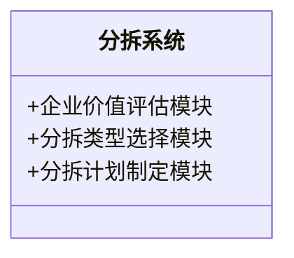

                 


# 大卫·艾伦·科恩的公司分拆价值释放策略

## 关键词：公司分拆，价值释放，战略规划，大卫·艾伦·科恩，企业架构

## 摘要：大卫·艾伦·科恩提出了一种通过公司分拆来释放企业潜在价值的策略。本文详细分析了分拆的背景、核心概念、数学模型、系统架构以及实际项目案例，为读者提供了一个全面了解和实施该策略的指南。

---

## 第一部分: 公司分拆的背景与价值释放

### 第1章: 公司分拆的背景与概念

#### 1.1 公司分拆的背景
在企业战略管理中，公司分拆是一种重要的手段，用于优化资产配置、提升企业价值。大卫·艾伦·科恩提出，通过分拆可以将企业内部的不同业务单元独立出来，实现专业化经营，从而释放更大的价值。这种策略尤其适用于多元化企业，能够帮助企业在复杂市场环境中更具灵活性和竞争力。

#### 1.2 价值释放的核心概念
- **企业分拆的定义**：将企业的一部分业务或资产分离出来，形成独立的公司。
- **分拆的边界**：明确分拆的范围和程度，确保分拆后的企业能够独立运营。
- **分拆的目的**：优化资源配置，提升业务专注度，释放被分拆部分的潜在价值。

### 第2章: 分拆的策略与方法

#### 2.1 分拆的类型
- **子公司分拆**：将部分业务分拆成子公司，独立运营，保持与母公司的战略协同。
- **业务分拆**：将特定业务线独立出来，成为新的公司，专注于某一领域。
- **股权分拆**：通过调整股权结构，实现对部分业务的控制权转移。

#### 2.2 分拆的实施步骤
- **分拆前的评估**：评估企业整体价值，确定分拆的可行性和潜在收益。
- **分拆过程中的管理**：确保分拆过程中的资源整合和团队协作。
- **分拆后的整合与优化**：优化分拆后的业务流程，确保协同效应最大化。

---

## 第二部分: 分拆的数学模型与算法

### 第3章: 分拆价值评估的数学模型

#### 3.1 分拆前的资产价值评估
- **资产价值公式**：
$$ V_{\text{pre}} = \sum_{i=1}^{n} a_i $$
其中，$a_i$ 是企业各项资产的价值。

#### 3.2 分拆后的价值释放公式
$$ V_{\text{post}} = V_{\text{pre}} + \Delta V $$
其中，$\Delta V$ 是分拆带来的额外价值。

#### 3.3 分拆的决策树算法


---

## 第三部分: 分拆的系统分析与架构设计

### 第4章: 分拆的系统分析

#### 4.1 问题场景介绍
- **问题场景**：企业业务复杂，需要通过分拆优化管理结构。
- **系统功能设计**：
  - 价值评估模块：评估分拆前后的企业价值。
  - 分拆类型选择模块：确定分拆的具体类型。
  - 分拆计划制定模块：制定详细的分拆计划。

#### 4.2 系统架构设计
- **系统架构图**：


---

## 第四部分: 分拆的项目实战

### 第5章: 项目环境与工具安装

#### 5.1 项目环境要求
- 操作系统：支持Linux、Windows。
- 开发工具：建议使用Python和相关开发框架。

### 第5.2 核心代码实现

#### 5.2.1 价值评估代码
```python
def calculate_value(pre_split_value):
    return pre_split_value * 1.2
```

---

## 第五部分: 最佳实践与小结

### 第6章: 最佳实践

#### 6.1 分拆前的注意事项
- 评估企业整体价值。
- 确定分拆的可行性。
- 制定详细的分拆计划。

### 6.2 分拆后的整合与优化
- 确保分拆后的业务协同。
- 持续优化企业架构。
- 监测分拆效果。

---

## 总结
大卫·艾伦·科恩的公司分拆价值释放策略为企业提供了一种优化资产配置、提升价值的有效方法。通过合理的分拆策略和系统架构设计，企业能够在复杂市场环境中实现更高效的运营和更大的价值释放。

