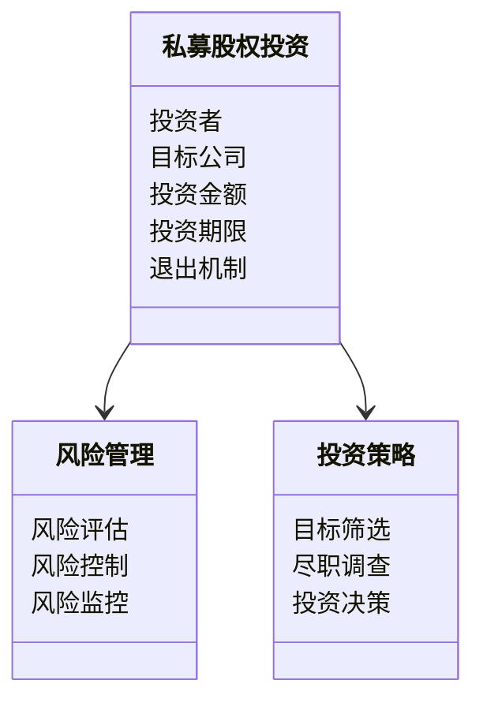
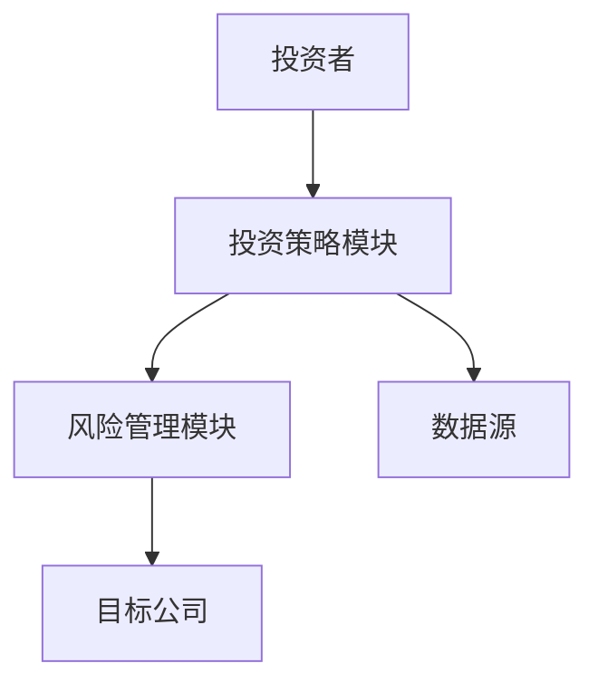
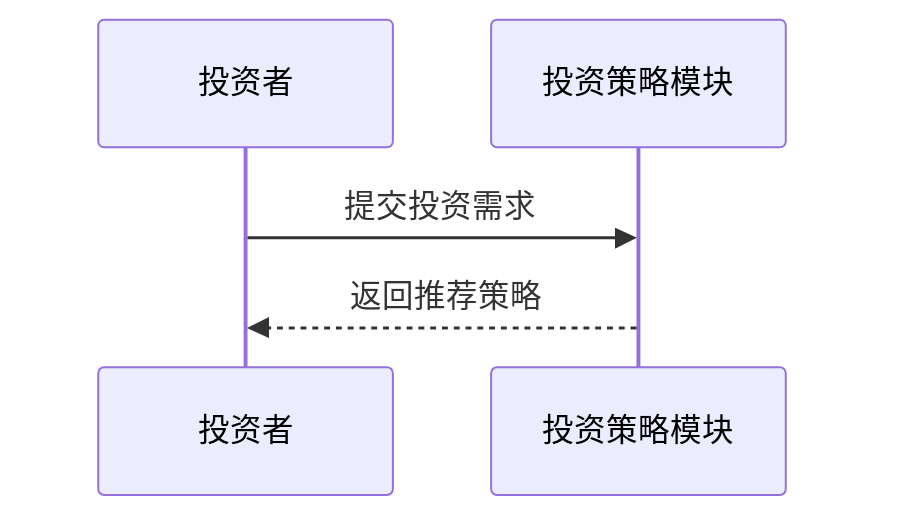

                 


# 大卫·艾伦·科恩的私募股权投资策略

> **关键词**：大卫·艾伦·科恩，私募股权投资，投资策略，风险评估，市场分析，案例分析

> **摘要**：本文系统地分析了大卫·艾伦·科恩的私募股权投资策略，涵盖从市场分析到投资实施的全链条。通过详细阐述其投资理念、策略制定、风险管理及经典案例，揭示了其成功的内在逻辑。文章结合实际操作步骤和系统架构设计，为读者提供深度的理论与实践指导。

---

## 第1章: 私募股权投资的背景与核心概念

### 1.1 私募股权投资的基本定义

#### 1.1.1 私募股权的定义与特点
私募股权投资是指通过非公开市场进行的股权投资，其特点包括：
- **私募性**：仅面向特定合格投资者。
- **高门槛**：通常要求较高的投资金额。
- **高风险高回报**：通过杠杆收购、重组等方式实现收益。
- **长期性**：投资周期较长，通常为3-7年。

#### 1.1.2 大卫·艾伦·科恩的背景与投资理念
大卫·艾伦·科恩（David Alan Cohn）是全球知名的私募股权投资者，其投资理念以“价值发现”为核心，注重基本面分析和长期持有。

#### 1.1.3 私募股权投资的核心要素
包括目标公司选择、投资金额、退出策略和风险管理。

### 1.2 私募股权投资的市场背景

#### 1.2.1 全球私募股权市场的现状
全球私募股权市场规模持续增长，主要集中在科技、医疗和能源行业。

#### 1.2.2 中国私募股权市场的特点
中国私募股权市场发展迅速，政府政策支持和产业升级推动了市场的繁荣。

#### 1.2.3 大卫·艾伦·科恩的投资环境分析
科恩通过宏观经济分析和行业趋势预测，选择具备长期增长潜力的领域。

### 1.3 私募股权投资的核心目标与策略

#### 1.3.1 股权投资的主要目标
包括资本增值、控制权获取和财务重组。

#### 1.3.2 科恩的投资策略概述
科恩采用“价值投资”策略，注重公司基本面和管理团队。

#### 1.3.3 私募股权的长期与短期目标
长期目标为资本增值，短期目标为优化公司治理和提升运营效率。

---

## 第2章: 私募股权投资的市场分析与行业研究

### 2.1 市场分析的基本方法

#### 2.1.1 宏观经济分析
通过GDP增长率、利率和通货膨胀率等指标评估经济环境。

#### 2.1.2 行业生命周期分析
分析行业所处阶段（导入期、成长期、成熟期、衰退期）。

#### 2.1.3 市场趋势预测
结合历史数据和专家意见预测未来市场走势。

### 2.2 行业研究的核心要素

#### 2.2.1 行业竞争格局
分析主要竞争对手、市场份额和市场集中度。

#### 2.2.2 行业关键成功因素
包括成本控制、技术创新和市场拓展能力。

#### 2.2.3 行业风险评估
识别行业特有的风险，如政策风险和市场波动风险。

### 2.3 科恩的市场分析方法

#### 2.3.1 数据驱动的市场分析
利用大数据技术分析市场趋势和消费者行为。

#### 2.3.2 行业专家访谈
通过访谈获取行业洞察和潜在投资机会。

#### 2.3.3 财务数据分析
分析目标公司的财务报表，评估其盈利能力和成长性。

---

## 第3章: 私募股权投资的策略制定与实施

### 3.1 投资策略的核心要素

#### 3.1.1 投资目标的明确
确定投资目标行业的市场规模和增长潜力。

#### 3.1.2 投资范围的界定
明确投资的地理区域、行业和金额规模。

#### 3.1.3 投资期限的规划
制定合理的投资周期，平衡短期收益和长期价值。

### 3.2 科恩的投资策略分析

#### 3.2.1 价值投资策略
寻找被低估的公司，通过长期持有实现价值回归。

#### 3.2.2 成长型投资策略
投资于高成长性的公司，预期未来收益增长。

#### 3.2.3 战术性投资策略
根据市场波动进行短期调整，规避系统性风险。

### 3.3 投资策略的实施步骤

#### 3.3.1 目标公司的筛选
通过财务指标、行业地位和管理团队进行初步筛选。

#### 3.3.2 尽职调查的开展
包括财务尽调、法律尽调和管理团队访谈。

#### 3.3.3 投资协议的签订
明确投资金额、股权比例和退出机制。

---

## 第4章: 私募股权投资的风险评估与管理

### 4.1 风险评估的基本方法

#### 4.1.1 风险识别
列出可能影响投资的各类风险，如市场风险、流动性风险。

#### 4.1.2 风险量化
通过概率-影响矩阵评估风险的严重程度。

#### 4.1.3 风险排序
根据风险的优先级制定应对策略。

### 4.2 私募股权投资的主要风险

#### 4.2.1 市场风险
市场波动可能导致投资价值下降。

#### 4.2.2 信用风险
目标公司无法偿还债务的风险。

#### 4.2.3 流动性风险
难以在短时间内将资产变现的风险。

### 4.3 科恩的风险管理策略

#### 4.3.1 风险分散
通过多元化投资降低单一风险的影响。

#### 4.3.2 风险对冲
利用金融衍生工具对冲市场波动风险。

#### 4.3.3 风险监控
定期评估风险敞口，及时调整投资组合。

---

## 第5章: 私募股权投资的经典案例分析

### 5.1 科恩的经典投资案例

#### 5.1.1 某知名企业的投资案例
分析科恩如何通过价值发现和长期持有实现收益。

#### 5.1.2 投资决策的关键点
包括对公司基本面、管理团队和行业前景的深入分析。

#### 5.1.3 投资后的管理与退出
通过优化管理和适时退出实现投资收益。

---

## 第6章: 私募股权投资的系统架构与实现

### 6.1 系统功能设计

#### 6.1.1 领域模型设计
使用Mermaid绘制领域模型类图，展示核心实体及其关系。



### 6.2 系统架构设计

#### 6.2.1 系统架构图
使用Mermaid绘制系统架构图，展示模块划分和交互流程。



### 6.3 系统接口设计

#### 6.3.1 投资策略接口
```python
def get_investment_strategy(investor_profile):
    # 根据投资者的财务状况和风险偏好推荐投资策略
    return strategy
```

### 6.4 系统交互流程

#### 6.4.1 交互流程图
使用Mermaid绘制系统交互流程图，展示投资者与系统之间的互动。



---

## 第7章: 项目实战与最佳实践

### 7.1 项目实战

#### 7.1.1 环境安装
安装必要的工具和库，如Python、Pandas和Matplotlib。

#### 7.1.2 核心实现

```python
import pandas as pd

def analyze_market(data):
    # 数据分析函数
    return pd.DataFrame(data).describe()

# 示例数据
data = {
    'year': [2018, 2019, 2020, 2021, 2022],
    'revenue': [100, 120, 150, 180, 200]
}
result = analyze_market(data)
print(result)
```

### 7.2 最佳实践

#### 7.2.1 风险管理 tips
定期审查投资组合，及时调整风险敞口。

#### 7.2.2 系统架构 tips
采用模块化设计，便于功能扩展和维护。

#### 7.2.3 案例分析 tips
结合实际案例，深入分析投资决策背后的逻辑。

### 7.3 小结
通过本文的系统分析和实际案例，读者可以全面理解大卫·艾伦·科恩的私募股权投资策略，并将其应用于实际投资中。

---

## 第8章: 总结与展望

### 8.1 总结
本文系统地分析了大卫·艾伦·科恩的私募股权投资策略，涵盖从市场分析到投资实施的全链条。

### 8.2 展望
未来，随着科技的发展和市场的变化，私募股权投资策略将更加多元化和智能化。

---

通过本文的系统分析和实际案例，读者可以全面理解大卫·艾伦·科恩的私募股权投资策略，并将其应用于实际投资中。

