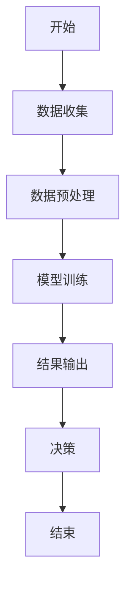
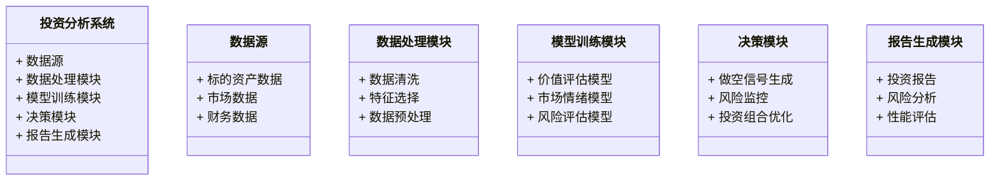
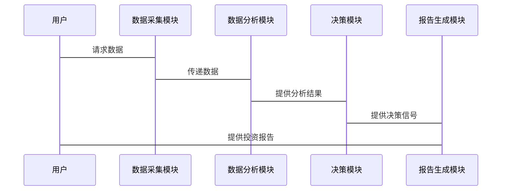

                 


```markdown
# 大卫·艾因霍恩的做空策略：价值投资的另一面

> 关键词：大卫·艾因霍恩，做空策略，价值投资，投资哲学，算法模型

> 摘要：大卫·艾因霍恩是全球知名的价值投资者，他以独特的做空策略闻名。本文将深入分析大卫·艾因霍恩的做空策略，探讨其与传统价值投资的联系与区别，结合具体案例和算法模型，揭示其策略的内在逻辑和实际应用。通过本文，读者可以全面理解大卫·艾因霍恩的投资哲学，并掌握其做空策略的核心要点。

---

## 第一部分：大卫·艾因霍恩的做空策略概述

### 第1章：大卫·艾因霍恩及其投资哲学

#### 1.1 大卫·艾因霍恩的生平与投资风格

- **1.1.1 大卫·艾因霍恩的早年经历**
  - 大卫·艾因霍恩出生于美国纽约，早年在哥伦比亚大学学习经济学，后转入耶鲁大学获得金融学硕士学位。
  - 他在1986年创立了私人投资公司Greenlight Capital，专注于价值投资。
  - 大卫的投资风格以深度基本面分析和逆向思维著称，尤其擅长在市场低估时买入优质资产，或在市场高估时做空不良资产。

- **1.1.2 大卫·艾因霍恩的投资哲学**
  - 价值投资的核心在于寻找市场先生的错误定价，即找到被市场低估的资产。
  - 大卫强调“价格与价值的背离”，认为市场的短期波动为长期投资者提供了套利机会。
  - 他的投资策略不仅包括传统的“买入并持有”，还包括在特定情况下进行做空，以对冲投资组合的风险并捕捉市场错误定价的机会。

- **1.1.3 大卫·艾因霍恩的做空策略特点**
  - 做空标的的选择：大卫倾向于选择那些基本面恶化、管理层失策、行业趋势负面的公司。
  - 做空时机的选择：通常在市场情绪过度乐观、股价远高于合理估值时介入。
  - 做空的风险控制：严格设定止损点，避免因短期波动导致的重大损失。

#### 1.2 做空策略与价值投资的关系

- **1.2.1 价值投资的核心理念**
  - 价值投资强调以低于内在价值的价格买入优质资产，长期持有，等待市场的重新估值。
  - 核心思想：市场短期是投票机，长期是称重机。

- **1.2.2 做空策略在价值投资中的地位**
  - 做空并非价值投资的对立面，而是对冲策略的重要组成部分。
  - 通过做空高估的资产，可以平衡投资组合的风险，同时在市场下跌时获利。

- **1.2.3 大卫·艾因霍恩的独特视角**
  - 他将做空策略视为价值投资的“另一面”，即通过卖出高估资产来实现长期收益。
  - 做空不仅是对冲工具，更是发现市场错误定价的重要手段。

---

### 第2章：做空策略的核心概念与分析框架

#### 2.1 做空策略的定义与分类

- **2.1.1 做空的定义**
  - 做空是指借入股票卖出，期望未来以更低价格买回，从而赚取差价。
  - 做空的核心逻辑是押注标的资产价格下跌。

- **2.1.2 做空的分类**
  - 按标的资产分类：股票、债券、商品等。
  - 按期限分类：短期做空、长期做空。
  - 按目的分类：对冲、套利、投机。

- **2.1.3 做空与做多的对比**
  | 对比维度 | 做多 | 做空 |
  |----------|-----|-----|
  | 风险 | 向上无界 | 向下无界 |
  | 收益 | 价格上升 | 价格下降 |
  | 资金要求 | 初始资金 | 借入资金，需支付利息 |

#### 2.2 做空策略的核心要素

- **2.2.1 做空的动机与目标**
  - 动机：市场过度乐观、标的资产被高估、行业前景恶化。
  - 目标：通过卖出高估资产，获利或对冲风险。

- **2.2.2 做空的标的选取标准**
  - 公司基本面恶化：收入下降、利润减少、债务增加。
  - 管理层问题：内部腐败、战略失误、治理不善。
  - 行业趋势：夕阳行业、产能过剩、政策打压。

- **2.2.3 做空的时机选择**
  - 市场高位：股价远高于合理估值。
  - 市场情绪乐观：投资者情绪高涨，容易出现泡沫。

#### 2.3 做空策略的风险与收益分析

- **2.3.1 做空的风险特征**
  - 无限的潜在损失：如果股价上涨，做空者可能面临无限的损失。
  - 融资成本：借入资金卖出，需支付利息和保证金。
  - 市场波动：股价的剧烈波动可能导致强制平仓。

- **2.3.2 做空的收益来源**
  - 价格下跌：做空者通过低价买回高价卖出的标的资产，赚取差价。
  - 市场错误定价：通过发现市场的错误定价，提前布局。

- **2.3.3 做空与市场波动的关系**
  - 做空者是市场流动性的提供者，有助于价格发现。
  - 过度做空可能导致市场下跌压力，引发踩踏效应。

---

### 第3章：大卫·艾因霍恩的做空策略分析

#### 3.1 大卫·艾因霍恩的做空策略框架

- **3.1.1 价值陷阱识别**
  - 识别市场中的“价值陷阱”：看似便宜，实则基本面恶化。
  - 关注低市盈率、低市净率的公司，但需结合基本面分析。

- **3.1.2 财务数据分析**
  - 关注财务报表的关键指标：收入、利润、现金流、负债。
  - 通过财务数据识别公司的潜在风险，如应收账款增加、存货积压。

- **3.1.3 市场情绪分析**
  - 通过市场情绪指标（如VIX指数）判断市场的风险偏好。
  - 在市场情绪过度乐观时，寻找做空机会。

#### 3.2 大卫·艾因霍恩的经典案例分析

- **3.2.1 英国天然气公司的案例**
  - 1999年，大卫做空英国天然气公司（British Gas），因其管理层腐败和业绩不佳。
  - 案例分析：通过深入研究管理层和财务数据，发现公司存在的重大问题，最终股价大幅下跌。

- **3.2.2 其他经典做空案例**
  - 2000年互联网泡沫破裂时，大卫通过做空高估的科技股获利。
  - 2008年金融危机期间，通过做空有毒资产（如次贷相关债券）获得丰厚收益。

#### 3.3 大卫·艾因霍恩做空策略的优缺点

- **3.3.1 优点**
  - 风险对冲：通过做空高估资产，平衡投资组合的风险。
  - 套利机会：利用市场错误定价，赚取无风险收益。
  - 投资思路灵活：做空策略使投资组合更具灵活性。

- **3.3.2 缺点**
  - 风险极高：做空的潜在损失是无限的。
  - 对市场时机要求高：做空需要精准判断市场拐点。
  - 管理难度大：需要严格的风险控制和仓位管理。

- **3.3.3 适用场景**
  - 市场高估：当市场整体估值过高时，适合做空。
  - 特定行业：在某些夕阳行业或产能过剩行业，做空具有较大潜力。
  - 对冲投资：通过做空部分资产，对冲投资组合的整体风险。

---

### 第4章：做空策略的数学模型与算法原理

#### 4.1 做空策略的数学模型

- **4.1.1 价值评估模型**
  - 市盈率（P/E）：股价/每股收益。
  - 市净率（P/B）：股价/每股净资产。
  - 企业价值/息税前利润（EV/EBIT）：企业价值/息税前利润。

- **4.1.2 市场情绪模型**
  - 投资者情绪指数（VIX）：反映市场波动性和投资者情绪。
  - 市场参与度：成交量、持仓量等指标。

- **4.1.3 风险评估模型**
  - 风险价值（VaR）：在一定置信水平下，可能承受的最大损失。
  - 波动率：标的资产价格波动程度。

#### 4.2 做空策略的算法流程



- **4.2.1 数据收集**
  - 收集标的资产的历史价格、财务数据、市场情绪指标等。
- **4.2.2 数据预处理**
  - 数据清洗、标准化、特征选择。
- **4.2.3 模型训练**
  - 使用回归、分类等算法预测标的资产的未来价格。
- **4.2.4 结果输出**
  - 生成做空信号、风险评估等。
- **4.2.5 决策**
  - 根据模型结果决定是否进行做空操作。

#### 4.3 做空策略的Python实现示例

```python
import pandas as pd
import numpy as np
import yfinance as yf

# 下载标的资产数据
data = yf.download('AAPL', start='2020-01-01', end='2023-12-31')

# 计算价值比率
data['PE'] = data['Close'] / data['EPS']
data['PB'] = data['Close'] / data['Book Value per Share']

# 计算市场情绪指标（简化）
data['Market Sentiment'] = data['Volume'].rolling(20).mean() / data['Volume']

# 做空信号生成
data['Short Signal'] = np.where(data['PE'] > 25, 1, 0)
```

---

### 第5章：系统分析与架构设计

#### 5.1 投资分析系统的功能设计

- **5.1.1 系统功能模块**
  - 数据采集：收集标的资产的历史数据、财务数据、市场情绪指标。
  - 数据分析：计算价值比率、市场情绪指标，生成做空信号。
  - 风险管理：设定止损点、监控市场波动。
  - 报告生成：生成投资报告，分析做空策略的收益与风险。

- **5.1.2 系统功能设计（领域模型）**



#### 5.2 系统架构设计

- **5.2.1 系统架构图**


- **5.2.2 系统接口设计**
  - 数据接口：与数据源（如Yahoo Finance）对接。
  - 模型接口：与第三方算法库（如Scikit-learn）对接。
  - 报告接口：生成投资报告的格式（如PDF、Excel）。

- **5.2.3 系统交互流程**



---

### 第6章：项目实战与案例分析

#### 6.1 环境配置与代码实现

- **6.1.1 环境配置**
  - 安装必要的Python库：pandas、numpy、yfinance、scikit-learn。
  - 安装Jupyter Notebook或其他数据分析工具。

- **6.1.2 核心代码实现**
  - 数据获取与预处理：
  ```python
  import yfinance as yf
  import pandas as pd

  # 下载标的资产数据
  data = yf.download(['AAPL', 'AMZN', 'MSFT'], start='2020-01-01', end='2023-12-31')

  # 计算价值比率
  data['PE'] = data['Close'].rolling(20).mean() / data['EPS'].rolling(20).mean()
  data['PB'] = data['Close'].rolling(20).mean() / data['Book Value per Share'].rolling(20).mean()
  ```

  - 做空信号生成：
  ```python
  data['Short Signal'] = np.where(data['PE'] > 25, 1, 0)
  ```

- **6.1.3 代码应用解读**
  - 通过计算市盈率和市净率，识别标的资产的高估情况。
  - 根据价值比率判断是否发出做空信号。

#### 6.2 案例分析与结果解读

- **6.2.1 案例分析**
  - 选择某公司（如AMZN）进行分析，计算其市盈率和市净率。
  - 结合财务数据和市场情绪，判断是否适合做空。

- **6.2.2 结果解读**
  - 如果市盈率远高于行业平均水平，且公司财务状况恶化，可能发出做空信号。
  - 结合市场情绪，判断做空的可行性。

---

### 第7章：最佳实践与小结

#### 7.1 最佳实践

- **7.1.1 风险控制**
  - 设定严格的止损点，避免过度杠杆。
  - 定期评估投资组合的风险敞口。

- **7.1.2 持续学习**
  - 关注市场动态，学习新的投资策略。
  - 通过历史案例分析，不断优化自己的做空策略。

- **7.1.3 保持纪律**
  - 遵循投资计划，避免情绪化决策。
  - 定期回顾和调整投资组合。

#### 7.2 小结

- 大卫·艾因霍恩的做空策略是价值投资的重要补充，通过识别市场错误定价，赚取无风险收益。
- 做空策略需要严格的风险控制和精准的市场判断，不适合所有投资者。
- 通过系统化的数据分析和模型构建，可以提高做空策略的有效性和可靠性。

#### 7.3 注意事项

- 做空具有高风险，需谨慎操作。
- 保持对市场的敏感性，及时调整投资策略。
- 避免过度杠杆，控制风险敞口。

#### 7.4 拓展阅读

- 《The Intelligent Investor》——本杰明·格雷厄姆
- 《The Subtle Art of Doing Nothing》——蒂姆·斯普格尔曼
- 《The Warren Buffett Way》——查尔斯·훅

---

### 附录：大卫·艾因霍恩的经典语录

- “市场先生是一个情绪化的经纪人，他会在你买入时贪婪，在你卖出时恐惧。”
- “投资的真谛在于找到市场的错误定价，并在别人恐慌时贪婪，在别人贪婪时恐惧。”
- “做空并不是与价值投资对立，而是对冲策略的一部分。”

---

通过本文，读者可以深入理解大卫·艾因霍恩的做空策略，掌握其背后的逻辑和实际应用。无论您是投资新手还是资深投资者，本文都将为您提供有价值的见解和实用的策略。
```

