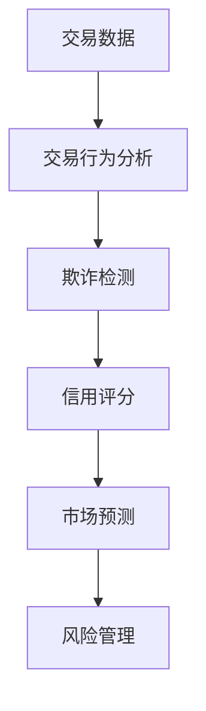
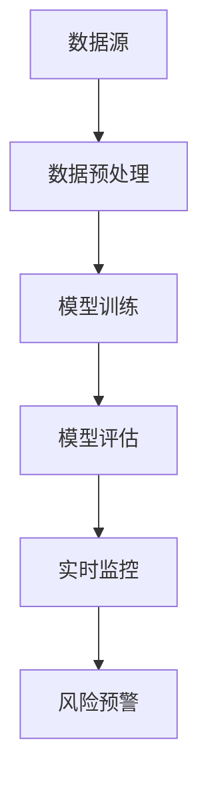
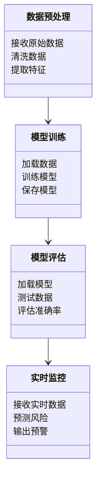
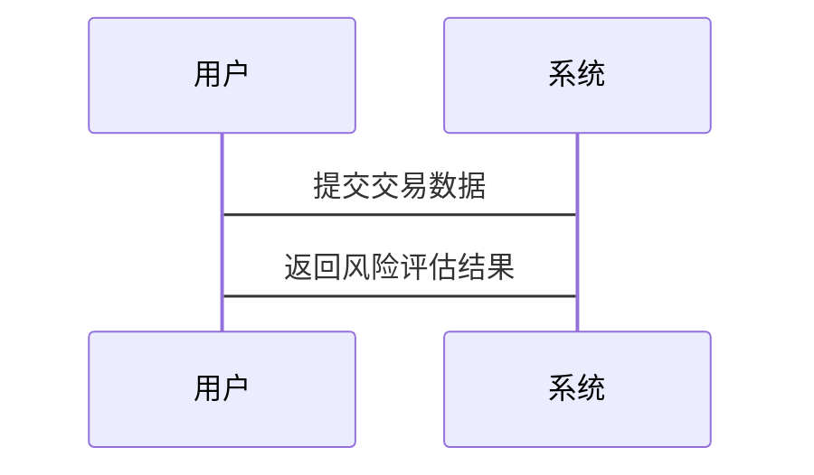

                 


# 大模型在金融风险控制中的创新应用案例

**关键词**：大模型，金融风险控制，自然语言处理，深度学习，实时监控，欺诈检测，信用评分

**摘要**：随着金融市场的日益复杂化，传统的金融风险控制方法面临数据处理能力不足、模型更新缓慢以及对非结构化数据利用有限的挑战。大模型凭借其强大的数据处理能力和深度学习算法，为金融风险控制提供了创新的解决方案。本文将详细探讨大模型在金融风险控制中的应用，包括其核心概念、算法原理、系统架构设计、项目实战案例以及最佳实践建议。

---

## 第1章 金融风险控制的基本概念

### 1.1 金融风险的定义与分类

金融风险是指在金融活动中，由于各种不确定性因素的影响，导致资金损失的可能性。常见的金融风险包括：

- **市场风险**：由于市场波动（如股票价格波动）导致的损失。
- **信用风险**：由于债务人违约导致的损失。
- **流动性风险**：无法迅速将资产转换为现金而产生的损失。
- **操作风险**：由于内部流程、系统或人员失误导致的损失。
- **利率风险**：由于利率变动导致的损失。

### 1.2 大模型的定义与特点

大模型是指基于深度学习的大型人工神经网络，具有以下特点：

- **大规模数据处理能力**：能够处理海量结构化和非结构化数据。
- **自适应学习能力**：能够通过大量数据自动学习特征和模式。
- **高精度预测能力**：通过深度学习算法，能够提供高精度的预测结果。
- **实时性**：能够快速处理实时数据并提供实时反馈。

### 1.3 大模型在金融领域的应用前景

大模型在金融领域的应用前景广阔，尤其是在以下几个方面：

- **欺诈检测**：通过分析交易数据和用户行为，识别潜在的欺诈行为。
- **信用评分**：利用非结构化数据（如社交媒体信息）和结构化数据（如财务数据）进行信用评分。
- **市场预测**：通过分析市场新闻和社交媒体情绪，预测市场趋势。
- **风险管理**：实时监控市场和交易数据，识别潜在风险。

---

## 第2章 大模型在金融风险控制中的核心概念与联系

### 2.1 大模型的核心概念原理

大模型的核心原理在于其强大的数据处理能力和深度学习算法。以下是大模型在金融风险控制中的核心概念：

- **数据预处理**：将原始数据进行清洗、转换和特征提取，以便模型能够有效处理。
- **模型训练**：通过大量数据训练模型，使其能够识别潜在风险。
- **实时监控**：对实时数据进行分析，识别潜在风险并提供实时反馈。

### 2.2 大模型的算法原理

大模型的算法原理主要包括以下几个步骤：

1. **数据预处理**：清洗数据，提取特征。
2. **模型训练**：使用深度学习算法（如Transformer）训练模型。
3. **模型评估**：评估模型的准确性和稳定性。
4. **实时预测**：对实时数据进行预测，识别潜在风险。

以下是一个简单的注意力机制的数学公式：

$$
\text{Attention}(Q, K, V) = \text{softmax}\left(\frac{QK^T}{\sqrt{d_k}}\right)V
$$

其中，$Q$ 是查询向量，$K$ 是键向量，$V$ 是值向量，$d_k$ 是键的维度。

### 2.3 实体关系图

以下是大模型在金融风险控制中的实体关系图：



---

## 第3章 系统分析与架构设计方案

### 3.1 系统架构设计

以下是大模型在金融风险控制系统中的架构设计：



### 3.2 系统功能设计

以下是系统的功能模块设计：



### 3.3 系统接口设计

以下是系统的接口设计：



---

## 第4章 项目实战

### 4.1 环境安装与配置

以下是在Python中安装必要的库：

```bash
pip install torch transformers pandas numpy
```

### 4.2 核心代码实现

以下是大模型在金融风险控制中的核心代码实现：

```python
import torch
from transformers import AutoTokenizer, AutoModelForMaskedLM
from sklearn.metrics import accuracy_score

# 加载预训练模型和分词器
model_name = "bert-base-uncased"
tokenizer = AutoTokenizer.from_pretrained(model_name)
model = AutoModelForMaskedLM.from_pretrained(model_name)

# 数据预处理
def preprocess_data(data):
    # 清洗数据
    cleaned_data = data.dropna()
    # 提取特征
    features = cleaned_data[['amount', 'time', 'user_id']]
    return features

# 模型训练
def train_model(features, labels):
    # 将数据转换为张量
    features = torch.tensor(features, dtype=torch.float32)
    labels = torch.tensor(labels, dtype=torch.long)
    # 训练模型
    optimizer = torch.optim.Adam(model.parameters(), lr=1e-5)
    criterion = torch.nn.CrossEntropyLoss()
    for epoch in range(10):
        outputs = model(features)
        loss = criterion(outputs, labels)
        loss.backward()
        optimizer.step()
    return model

# 模型评估
def evaluate_model(model, features, labels):
    with torch.no_grad():
        outputs = model(features)
        predicted = torch.argmax(outputs, dim=1)
        accuracy = accuracy_score(predicted.numpy(), labels.numpy())
        return accuracy

# 实时监控
def monitorRisk(real_time_data):
    # 数据预处理
    features = preprocess_data(real_time_data)
    # 预测风险
    predicted = model(features)
    # 输出预警
    if predicted[0] == 1:
        print("高风险交易！")
    else:
        print("低风险交易！")
```

### 4.3 项目总结与启示

通过上述案例分析，我们可以看到大模型在金融风险控制中的巨大潜力。模型能够实时监控交易数据，识别潜在风险，并提供实时反馈。然而，大模型的应用也面临一些挑战，比如模型的可解释性、数据隐私等问题。未来的研究方向可以集中在如何提高模型的可解释性，同时保护数据隐私。

---

## 第5章 最佳实践 tips、小结、注意事项与拓展阅读

### 5.1 最佳实践 tips

1. **数据质量**：确保数据的完整性和准确性。
2. **模型可解释性**：在金融领域，模型的可解释性非常重要。
3. **数据隐私**：在处理金融数据时，必须遵守相关法律法规，保护数据隐私。
4. **模型更新**：定期更新模型，以适应市场的变化。

### 5.2 小结

大模型在金融风险控制中的应用具有广阔的应用前景。通过大模型的强大数据处理能力和深度学习算法，可以有效识别潜在风险，提高金融系统的稳定性。

### 5.3 注意事项

- 在实际应用中，需要注意模型的可解释性问题。
- 数据隐私问题需要特别关注。
- 模型的实时性需要通过优化算法和硬件配置来保证。

### 5.4 拓展阅读

- 《Deep Learning for Financial Risk Management》
- 《Transformers in Finance: State-of-the-Art Applications》
- 《Financial Risk Management with Big Data》

---

通过以上分析，我们可以看到大模型在金融风险控制中的创新应用案例。希望本文能够为读者提供有价值的参考，帮助他们更好地理解和应用大模型技术。

