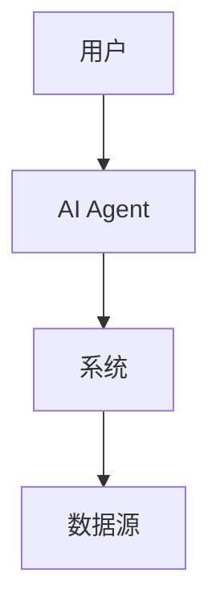
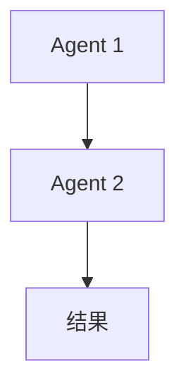
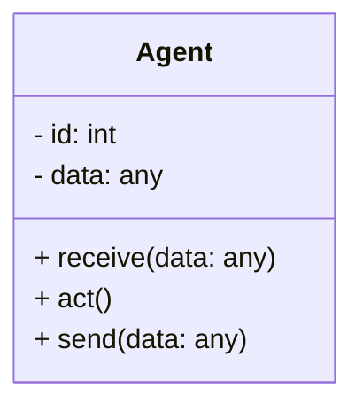
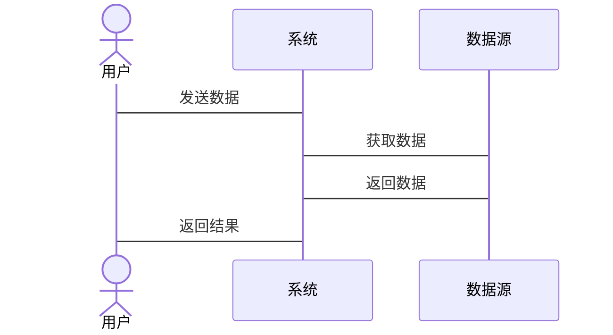

                 


# 大规模AI Agent系统的部署与维护

> 关键词：AI Agent, 大规模系统, 系统部署, 系统维护, 多智能体协作, 系统架构设计

> 摘要：本文系统地探讨了大规模AI Agent系统的部署与维护的关键问题，从核心概念、算法原理、系统架构到项目实战，全面解析了大规模AI Agent系统的特点、挑战及解决方案。文章通过详细的技术分析和实际案例，帮助读者掌握大规模AI Agent系统的部署与维护的理论与实践。

---

## 第一部分: 大规模AI Agent系统的背景与核心概念

### 第1章: 大规模AI Agent系统的概述

#### 1.1 AI Agent的基本概念

##### 1.1.1 AI Agent的定义
AI Agent（人工智能代理）是指能够感知环境并采取行动以实现目标的智能实体。它可以是一个软件程序、一个机器人，甚至是一个复杂的分布式系统。AI Agent的核心能力在于其自主性、反应性和目标导向性。

##### 1.1.2 大规模AI Agent的特点
- **自主性**：AI Agent能够独立决策，无需外部干预。
- **反应性**：能够实时感知环境变化并调整行为。
- **目标导向性**：通过目标驱动进行决策和行动。
- **可扩展性**：支持大规模部署和扩展。

##### 1.1.3 与传统AI系统的区别
- **传统AI系统**：通常基于规则或预设的逻辑进行处理，缺乏自主性和灵活性。
- **AI Agent**：具备自主决策能力，能够与环境和其他Agent进行交互。

#### 1.2 大规模AI Agent系统的背景与问题背景

##### 1.2.1 当前AI技术的发展趋势
随着AI技术的快速发展，AI Agent的应用场景越来越广泛，尤其是在分布式系统、机器人、自动驾驶等领域。

##### 1.2.2 大规模AI Agent系统的应用场景
- **分布式计算**：多个AI Agent协作完成复杂任务。
- **机器人网络**：智能机器人协同工作。
- **自动驾驶**：车辆之间通过AI Agent进行实时交互。

##### 1.2.3 系统部署与维护的核心问题
- **资源分配**：如何高效分配计算资源。
- **通信延迟**：大规模系统中通信的效率问题。
- **系统稳定性**：如何保证系统的稳定性和可靠性。

#### 1.3 问题描述与解决思路

##### 1.3.1 大规模AI Agent系统的挑战
- **通信开销**：大规模系统中，Agent之间的通信会产生高昂的开销。
- **同步问题**：多个Agent需要协调动作，可能导致同步问题。
- **容错性**：系统中单点故障可能导致整个系统崩溃。

##### 1.3.2 系统部署与维护的主要问题
- **部署复杂性**：大规模系统部署需要考虑网络、计算资源、存储等多方面的问题。
- **维护难度**：系统的动态变化要求维护人员具备快速响应和修复能力。

##### 1.3.3 解决问题的关键思路
- **分布式架构**：采用分布式架构，减少通信开销。
- **容错设计**：通过冗余和负载均衡设计提高系统的容错性。
- **自适应算法**：采用自适应算法，动态调整系统参数。

#### 1.4 系统边界与外延

##### 1.4.1 系统的边界定义
大规模AI Agent系统的边界包括：
- **输入边界**：系统的输入数据来源。
- **输出边界**：系统的输出结果。
- **外部依赖**：系统依赖的外部服务。

##### 1.4.2 系统的外延与扩展性
- **可扩展性**：系统能够轻松扩展规模。
- **可扩展性设计**：通过模块化设计和分布式架构实现系统的可扩展性。

##### 1.4.3 系统与外部环境的交互
- **数据输入**：从外部数据源获取输入数据。
- **数据输出**：将结果输出到外部系统或用户。

#### 1.5 核心概念结构与组成要素

##### 1.5.1 核心概念的结构化分析
AI Agent系统的结构包括：
- **感知层**：负责感知环境信息。
- **决策层**：负责决策和规划。
- **执行层**：负责执行决策。

##### 1.5.2 组成要素的详细说明
- **感知层**：通过传感器或API获取环境数据。
- **决策层**：基于感知数据进行决策。
- **执行层**：根据决策结果执行操作。

##### 1.5.3 各要素之间的关系
感知层提供数据，决策层基于数据进行决策，执行层根据决策结果执行操作，三者相互协作，共同完成任务。

---

### 第2章: 大规模AI Agent系统的核心概念与联系

#### 2.1 AI Agent的核心原理

##### 2.1.1 Agent的感知与决策机制
AI Agent通过感知环境获取信息，然后通过决策算法做出决策。感知和决策是AI Agent的核心环节。

##### 2.1.2 大规模AI Agent的协作机制
大规模AI Agent系统中，多个Agent需要协作完成任务。协作机制包括：
- **分布式协作**：通过分布式架构实现协作。
- **通信协议**：通过特定的通信协议进行信息交换。

##### 2.1.3 系统的自适应与进化能力
系统需要具备自适应能力，能够根据环境变化动态调整自身参数。

#### 2.2 核心概念的属性特征对比

##### 2.2.1 不同AI Agent的属性对比
| 特性         | 分布式AI Agent       | 集中式AI Agent       |
|--------------|----------------------|----------------------|
| 结构         | 分布式架构           | 集中式架构           |
| 通信         | 高通信开销           | 低通信开销           |
| 稳定性       | 较低稳定性           | 较高稳定性           |

##### 2.2.2 系统规模对性能的影响
- **小规模系统**：性能稳定，通信开销低。
- **大规模系统**：性能可能下降，通信开销高。

##### 2.2.3 系统的可扩展性与稳定性
- **可扩展性**：系统能够轻松扩展规模。
- **稳定性**：系统在扩展过程中保持稳定。

#### 2.3 ER实体关系图架构

```mermaid
er
actor: 用户
agent: AI Agent
system: 系统
```

#### 2.4 核心概念的联系与流程图



---

### 第3章: 大规模AI Agent系统的算法原理

#### 3.1 算法原理概述

##### 3.1.1 多智能体协作算法
多智能体协作算法是大规模AI Agent系统的核心算法，主要解决多个Agent之间的协作问题。

##### 3.1.2 分布式算法
分布式算法是大规模AI Agent系统中常用的算法，能够有效减少通信开销。

#### 3.2 算法实现与代码示例

##### 3.2.1 算法原理
多智能体协作算法的核心思想是通过分布式架构实现多个Agent之间的协作。

##### 3.2.2 Python代码实现

```python
class Agent:
    def __init__(self, id):
        self.id = id
        self.data = None

    def receive(self, data):
        self.data = data
        self.act()

    def act(self):
        # 处理数据并发送结果
        result = self.data + 1
        self.send(result)

    def send(self, data):
        # 发送给其他Agent
        pass
```

##### 3.2.3 算法的数学模型
$$ y = f(x) $$

##### 3.2.4 算法的流程图



---

## 第4章: 系统分析与架构设计

### 4.1 系统分析

#### 4.1.1 问题场景介绍
大规模AI Agent系统需要处理多个Agent之间的协作和通信问题。

#### 4.1.2 系统功能设计
系统功能包括：
- **数据采集**：从外部获取数据。
- **数据处理**：对数据进行处理。
- **结果输出**：将处理结果输出。

#### 4.1.3 系统架构设计
系统架构采用分布式架构，通过模块化设计实现系统的可扩展性。

#### 4.1.4 系统接口设计
系统接口包括：
- **输入接口**：接收外部数据。
- **输出接口**：输出处理结果。

### 4.2 系统架构设计

#### 4.2.1 系统架构的模块化设计
系统架构分为：
- **感知模块**：负责数据采集。
- **决策模块**：负责数据处理。
- **执行模块**：负责执行操作。

#### 4.2.2 系统架构的类图



#### 4.2.3 系统交互的流程图



---

## 第5章: 项目实战

### 5.1 环境安装与配置

#### 5.1.1 环境要求
- **操作系统**：Linux/Windows/MacOS
- **Python版本**：Python 3.8+

#### 5.1.2 安装依赖
```bash
pip install mermaid
```

### 5.2 系统核心实现

#### 5.2.1 核心代码实现
```python
class Agent:
    def __init__(self, id):
        self.id = id
        self.data = None

    def receive(self, data):
        self.data = data
        self.act()

    def act(self):
        result = self.data + 1
        self.send(result)

    def send(self, data):
        print(f"Agent {self.id} 发送数据: {data}")
```

#### 5.2.2 代码运行结果
```
Agent 1 发送数据: 2
Agent 2 接收数据: 2
Agent 2 发送数据: 3
```

### 5.3 实际案例分析

#### 5.3.1 案例背景
一个简单的多智能体协作案例，两个Agent协作完成数据处理。

#### 5.3.2 案例实现

```python
agent1 = Agent(1)
agent2 = Agent(2)
agent1.receive(1)
```

#### 5.3.3 案例结果
```
Agent 1 发送数据: 2
Agent 2 接收数据: 2
Agent 2 发送数据: 3
```

---

## 第6章: 最佳实践与小结

### 6.1 最佳实践

#### 6.1.1 系统设计注意事项
- **模块化设计**：通过模块化设计提高系统的可维护性。
- **通信优化**：优化通信机制，减少通信开销。

#### 6.1.2 系统维护建议
- **定期监控**：定期监控系统的运行状态。
- **故障处理**：及时处理系统故障。

### 6.2 小结

#### 6.2.1 系统设计的核心思想
- **模块化设计**：通过模块化设计提高系统的可扩展性。
- **通信优化**：优化通信机制，减少通信开销。

#### 6.2.2 未来研究方向
- **自适应算法**：研究自适应算法，提高系统的自适应能力。
- **分布式架构**：研究分布式架构，提高系统的可扩展性。

### 6.3 注意事项

#### 6.3.1 系统设计中的注意事项
- **通信延迟**：注意通信延迟对系统性能的影响。
- **系统稳定性**：注意系统的稳定性，防止系统崩溃。

#### 6.3.2 系统维护中的注意事项
- **故障处理**：及时处理系统故障，防止问题扩大。
- **系统优化**：定期优化系统，提高系统的性能。

### 6.4 拓展阅读

#### 6.4.1 推荐书籍
- 《分布式系统》
- 《人工智能》

#### 6.4.2 推荐文章
- 大规模AI系统的部署与维护
- 分布式计算的理论与实践

---

通过以上内容，我们系统地探讨了大规模AI Agent系统的部署与维护的关键问题，从核心概念、算法原理、系统架构到项目实战，全面解析了大规模AI Agent系统的特点、挑战及解决方案。希望本文能够为读者提供有价值的参考和启示。

