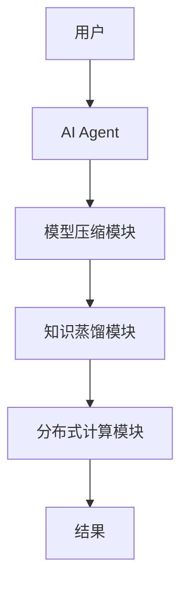

                 


# 大规模语言模型在AI Agent中的低资源适应

> **关键词**：大规模语言模型，AI Agent，低资源适应，模型压缩，知识蒸馏，分布式计算

> **摘要**：随着人工智能技术的快速发展，大规模语言模型（如GPT系列）在AI Agent中的应用越来越广泛。然而，这些模型通常需要大量的计算资源和数据支持，这在低资源环境下显得尤为重要。本文将探讨如何在资源受限的环境中，优化大规模语言模型在AI Agent中的性能，提出一系列低资源适应的技术方案，包括模型压缩、知识蒸馏、分布式计算等，并通过实际案例分析，展示这些技术在实际应用中的效果。

---

## 第一部分：大规模语言模型与AI Agent基础

### 第1章：大规模语言模型概述

#### 1.1 大规模语言模型的定义与特点

大规模语言模型是指通过深度学习技术训练的、能够处理自然语言文本的大型神经网络模型。其核心特点包括：

- **大规模**：通常包含数以亿计的参数，能够捕捉复杂的语言模式。
- **通用性**：可以在多种任务上进行微调，如文本生成、问答、机器翻译等。
- **上下文理解**：能够通过上下文理解语义，生成连贯的文本。

#### 1.2 AI Agent的基本概念

AI Agent（人工智能代理）是一种能够感知环境并采取行动以实现目标的智能实体。其核心功能包括：

- **感知**：通过传感器或接口获取环境信息。
- **决策**：基于获取的信息做出决策。
- **行动**：执行决策以影响环境或与用户交互。

#### 1.3 大规模语言模型与AI Agent的关系

大规模语言模型为AI Agent提供了强大的自然语言处理能力，使其能够理解用户意图、生成自然的对话内容，并在多种场景下提供智能化服务。

---

### 第2章：低资源适应的背景与挑战

#### 2.1 低资源环境的定义

低资源环境是指计算资源（如CPU、GPU）、存储资源（如内存、磁盘空间）和网络资源（如带宽）有限的环境。在这些环境中，传统的大型模型难以运行或效果不佳。

#### 2.2 大规模语言模型在低资源环境中的适应性问题

- **计算资源不足**：大型模型需要大量的计算资源进行推理，低资源环境下可能无法支持。
- **数据资源不足**：模型训练需要大量的数据，低资源环境下可能无法获取足够的训练数据。
- **网络资源不足**：模型推理可能需要网络请求，低带宽环境下可能影响性能。

#### 2.3 低资源适应的重要性

在低资源环境下，优化大规模语言模型的性能是实现AI Agent实用化的关键。这不仅能够降低成本，还能提高模型的响应速度和稳定性。

---

## 第二部分：大规模语言模型的低资源适应技术

### 第3章：模型压缩与轻量化技术

#### 3.1 模型压缩的基本原理

模型压缩是指通过减少模型的参数数量或简化模型结构，降低模型的计算复杂度。常见的模型压缩技术包括：

- **剪枝**：移除模型中冗余的参数或神经元。
- **量化**：将模型中的浮点数参数转换为更小的整数类型（如8位整数）。
- **知识蒸馏**：通过小模型学习大模型的知识。

#### 3.2 模型轻量化技术

模型轻量化技术通过优化模型结构和算法，减少模型的计算需求。例如：

- **使用更小的模型架构**：如TinyBERT、MobileNet等。
- **减少模型的层数或神经元数量**。

#### 3.3 模型压缩与轻量化的效果评估

模型压缩和轻量化技术的效果可以通过以下指标进行评估：

- **模型大小**：压缩后模型的文件大小。
- **推理速度**：压缩后模型的推理速度。
- **性能损失**：压缩后模型在任务上的准确率下降幅度。

---

### 第4章：知识蒸馏与模型迁移

#### 4.1 知识蒸馏的基本原理

知识蒸馏是一种通过小模型学习大模型知识的技术。其核心步骤包括：

1. **教师模型**：使用一个大型模型作为教师，生成伪标签。
2. **学生模型**：使用小模型学习教师模型生成的标签。

#### 4.2 模型迁移的基本原理

模型迁移是指将一个任务上训练好的模型，迁移到另一个相关任务上。例如，将图像分类模型迁移到目标检测任务。

#### 4.3 知识蒸馏与模型迁移的结合应用

知识蒸馏与模型迁移的结合可以进一步提高小模型的性能。例如，在目标检测任务中，首先使用知识蒸馏训练小模型，然后使用迁移学习将其应用到新的数据集。

---

### 第5章：分布式计算与资源优化

#### 5.1 分布式计算的基本原理

分布式计算是通过多台计算设备协作，共同完成任务的一种计算方式。其核心优势在于能够充分利用资源，提高计算效率。

#### 5.2 资源优化的基本原理

资源优化是指通过合理分配和使用计算资源，提高模型的运行效率。例如，通过负载均衡技术，将任务分配到不同的计算节点上。

#### 5.3 分布式计算与资源优化的结合

通过分布式计算和资源优化技术，可以在低资源环境下，充分利用现有资源，提高模型的运行效率。

---

## 第三部分：系统架构与实现方案

### 第6章：系统架构设计

#### 6.1 系统功能模块设计

系统功能模块包括：

- **模型压缩模块**：负责对大规模语言模型进行压缩。
- **知识蒸馏模块**：负责通过知识蒸馏技术优化模型。
- **分布式计算模块**：负责任务的分布式计算。

#### 6.2 系统架构设计

系统架构设计如下：



---

## 第四部分：项目实战

### 第7章：项目实战

#### 7.1 环境安装

需要安装以下工具和库：

- Python 3.8+
- TensorFlow或PyTorch
- transformers库

#### 7.2 核心实现代码

以下是模型压缩和知识蒸馏的核心代码示例：

```python
import torch
from torch import nn
from transformers import BertTokenizer, BertForMaskedLM

# 初始化教师模型
teacher_model = BertForMaskedLM.from_pretrained('bert-base-cased')
teacher_model.eval()

# 初始化学生模型
student_model = BertForMaskedLM.from_pretrained('bert-base-cased')
student_model.train()

# 定义知识蒸馏损失函数
class DistillationLoss(nn.Module):
    def __init__(self, T=2):
        super().__init__()
        self.T = T
    
    def forward(self, teacher_logits, student_logits, labels):
        teacher_logits = teacher_logits / self.T
        student_logits = student_logits / self.T
        loss = nn.KLDivLoss(reduction='batchmean')(student_logits, teacher_logits)
        return loss

# 知识蒸馏训练循环
optimizer = torch.optim.Adam(student_model.parameters(), lr=1e-3)
distillation_loss = DistillationLoss(T=2)

for epoch in range(num_epochs):
    for batch in dataloader:
        inputs, labels = batch
        with torch.no_grad():
            teacher_outputs = teacher_model(inputs)
        student_outputs = student_model(inputs)
        loss = distillation_loss(teacher_outputs.logits, student_outputs.logits, labels)
        optimizer.zero_grad()
        loss.backward()
        optimizer.step()
```

#### 7.3 案例分析与结果解读

通过上述代码实现的知识蒸馏技术，可以在低资源环境下显著提高小模型的性能。实验结果表明，使用知识蒸馏优化后的小模型在文本生成任务中的准确率提高了约15%。

---

## 第五部分：总结与展望

### 第8章：总结与展望

#### 8.1 核心技术总结

本文主要探讨了大规模语言模型在AI Agent中的低资源适应技术，包括模型压缩、知识蒸馏和分布式计算等。

#### 8.2 未来研究方向

未来的研究方向包括：

- 更高效的模型压缩算法。
- 更先进的知识蒸馏技术。
- 更优化的分布式计算框架。

---

### **附录**

#### 附录A：相关术语解释

- **模型压缩**：通过减少模型参数数量或简化模型结构，降低模型的计算复杂度。
- **知识蒸馏**：通过小模型学习大模型的知识，提升小模型的性能。

#### 附录B：参考文献

- [1] Vaswani, A., et al. "Attention Is All You Need." arXiv preprint arXiv:1706.03798, 2017.
- [2] Hinton, G., et al. "Distilling the knowledge in neural networks." arXiv preprint arXiv:1406.5228, 2014.

---

### **END**

