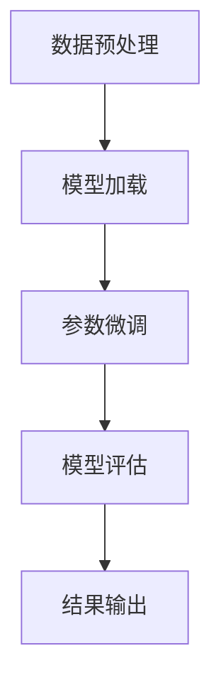
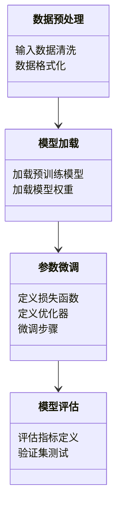

                 


# 大规模语言模型在AI Agent中的微调技巧

## 关键词
- 大规模语言模型
- AI Agent
- 微调技巧
- 迁移学习
- 系统架构设计

## 摘要
本文详细探讨了如何在AI Agent中有效地微调大规模语言模型，以适应特定应用场景的需求。文章首先介绍了大规模语言模型和AI Agent的基本概念，解释了为何微调是实现模型适应性的关键。接着，分析了微调的核心原理、数学模型和算法流程，并通过实际案例展示了如何在AI Agent中实施微调技术。最后，总结了微调的最佳实践和未来研究方向。

---

## 第一部分: 背景介绍

### 第1章: 背景介绍

#### 1.1 问题背景
大规模语言模型（如GPT-3、GPT-4）的出现，为自然语言处理（NLP）任务带来了革命性的变化。然而，这些模型通常是在通用任务上进行了预训练，难以直接适应特定领域或场景的需求。AI Agent作为人机交互的重要形式，需要能够理解用户意图、提供个性化服务，并在动态环境中做出决策。因此，如何将大规模语言模型微调到特定场景，使其具备更强的适应性和实用性，成为当前研究的热点问题。

#### 1.2 模型微调的必要性
- **适应性**：大规模语言模型虽然通用性强，但缺乏对特定任务或领域的深度理解。微调可以使模型更好地适应AI Agent的具体需求。
- **效率**：通过微调，可以在较小的数据集上快速优化模型，避免从头训练的高计算成本。
- **效果**：微调后的模型在特定任务上的表现通常优于未经微调的模型。

#### 1.3 AI Agent的需求与边界
AI Agent需要具备以下能力：
- **上下文理解**：理解对话历史和用户意图。
- **多轮交互**：支持连续的对话流程。
- **个性化服务**：根据用户需求提供定制化建议。
- **动态适应**：能够根据环境变化调整行为。

---

## 第二部分: 核心概念与联系

### 第2章: 核心概念与联系

#### 2.1 微调技术的核心原理
微调技术是一种基于迁移学习的方法。其基本思想是利用大规模预训练模型的特征表示能力，通过在特定领域或任务上的数据进一步优化模型。与从头训练相比，微调能够更快地适应新任务，同时保留模型的通用能力。

#### 2.2 微调技术的特征对比
以下是微调技术与其他模型优化方法的对比：

| **方法**    | **特点**                                                                 |
|------------|---------------------------------------------------------------------------|
| 微调        | 基于预训练模型，通过小规模数据优化特定任务。                              |
| 从头训练    | 从头开始训练模型，适用于特定任务但计算成本高。                            |
| 模型压缩    | 通过减少模型参数数量降低计算成本，但可能影响模型性能。                    |
| 知识蒸馏    | 将大模型的知识迁移到小模型，适用于资源受限的场景。                        |

#### 2.3 微调技术的架构设计
以下是微调技术的系统架构图：



---

## 第三部分: 算法原理讲解

### 第3章: 算法原理讲解

#### 3.1 微调算法的基本流程
微调算法的主要步骤包括：
1. 数据预处理：将特定任务的数据集进行清洗和格式化。
2. 模型加载：加载预训练的大规模语言模型。
3. 参数微调：通过反向传播算法优化模型参数。
4. 模型评估：在验证集上评估模型性能。
5. 结果输出：输出微调后的模型或模型权重。

#### 3.2 微调算法的数学模型
以下是微调算法的数学公式：

- **损失函数**：
  $$ \mathcal{L}(\theta) = -\sum_{i=1}^{n} y_i \log p(y_i|x_i,\theta) $$
  
  其中，$\theta$ 表示模型参数，$x_i$ 和 $y_i$ 表示输入和输出。

- **梯度下降**：
  $$ \theta_{t+1} = \theta_t - \eta \frac{\partial \mathcal{L}}{\partial \theta_t} $$
  
  其中，$\eta$ 表示学习率。

---

## 第四部分: 系统分析与架构设计

### 第4章: 系统分析与架构设计

#### 4.1 系统功能设计
以下是系统功能的领域模型类图：



#### 4.2 系统架构设计
以下是系统架构的架构图：


---

## 第五部分: 项目实战

### 第5章: 项目实战

#### 5.1 项目介绍
我们以一个客服对话系统为例，展示如何将大规模语言模型微调到AI Agent中。

#### 5.2 环境安装
安装所需的依赖库：
```bash
pip install transformers torch
```

#### 5.3 核心代码实现
以下是微调代码的实现：

```python
import torch
from transformers import AutoModelForMaskedLM, AutoTokenizer

# 加载预训练模型
model = AutoModelForMaskedLM.from_pretrained('bert-base-uncased')
tokenizer = AutoTokenizer.from_pretrained('bert-base-uncased')

# 定义损失函数
loss_fn = torch.nn.CrossEntropyLoss()
optimizer = torch.optim.Adam(model.parameters(), lr=1e-5)

# 微调步骤
for epoch in range(num_epochs):
    for batch in dataloader:
        inputs, labels = batch
        outputs = model(**inputs)
        loss = loss_fn(outputs.logits, labels)
        loss.backward()
        optimizer.step()
```

#### 5.4 代码解读与分析
- **数据预处理**：将客服对话数据清洗并格式化为模型可接受的格式。
- **模型加载**：加载预训练的BERT模型。
- **参数微调**：通过反向传播优化模型参数，使模型适应客服对话任务。
- **模型评估**：在验证集上评估模型的准确率和召回率。

---

## 第六部分: 最佳实践与总结

### 第6章: 最佳实践与总结

#### 6.1 最佳实践
- **数据质量**：确保训练数据的质量和多样性。
- **模型选择**：根据任务需求选择合适的预训练模型。
- **评估指标**：选择合适的评估指标（如准确率、F1分数）来衡量模型性能。

#### 6.2 小结
本文详细探讨了大规模语言模型在AI Agent中的微调技巧，从理论到实践，为读者提供了全面的指导。

#### 6.3 注意事项
- 微调过程中要注意数据泄露问题。
- 学习率和训练步数的设置对模型性能有重要影响。
- 验证集的选择要避免与训练数据重叠。

#### 6.4 拓展阅读
- 建议阅读《Transformers: Pre-training of Text for Understanding》了解预训练技术。
- 参考Hugging Face的文档，学习如何使用Transformers库进行微调。

---

## 附录: 总结与展望

### 7.1 总结
本文从背景、理论、算法、系统设计和项目实战等多个方面，详细探讨了大规模语言模型在AI Agent中的微调技巧。通过实际案例的分析，读者可以掌握微调的基本方法和实现步骤。

### 7.2 展望
未来的研究可以进一步探索以下方向：
- 更高效的微调方法。
- 结合领域知识的微调策略。
- 多模态AI Agent的微调技术。

---

通过本文的学习，读者可以深入了解大规模语言模型在AI Agent中的微调技巧，并将其应用于实际项目中。

