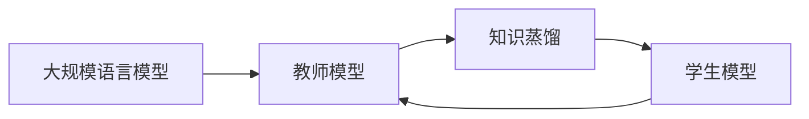
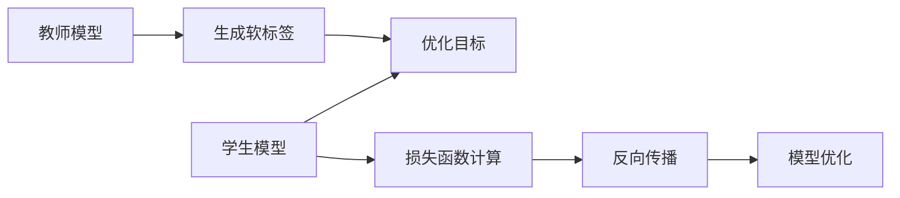
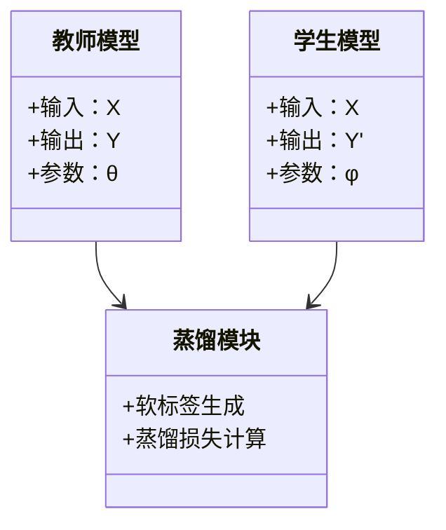
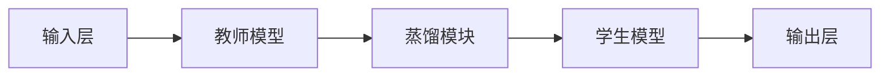
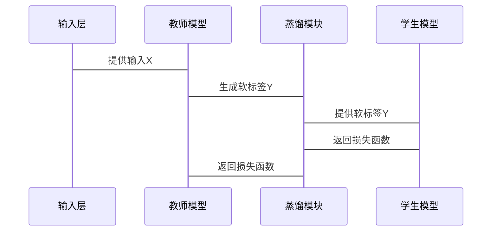

                 


# 大规模语言模型在AI Agent中的蒸馏技术

> 关键词：大规模语言模型，AI Agent，蒸馏技术，知识蒸馏，模型压缩

> 摘要：本文详细探讨了大规模语言模型在AI Agent中的蒸馏技术，从背景、核心概念、算法原理到系统架构设计、项目实战，再到总结与展望，全面分析了蒸馏技术在AI Agent中的应用。通过本文，读者可以深入理解蒸馏技术的核心原理、实现方法及其在实际项目中的应用价值。

---

## 第1章 背景介绍

### 1.1 问题背景与描述

#### 1.1.1 大规模语言模型的发展与挑战
大规模语言模型（如GPT系列、BERT系列）近年来取得了显著进展，但在实际应用中面临资源消耗大、计算成本高等问题。AI Agent需要在资源受限的环境中运行，如何高效地利用大规模语言模型的能力成为关键问题。

#### 1.1.2 AI Agent在实际应用中的需求
AI Agent需要具备实时响应、低延迟、高准确率等特点，特别是在嵌入式设备或边缘计算场景中，如何在资源受限的情况下实现高性能的自然语言处理成为挑战。

#### 1.1.3 蒸馏技术的提出与目标
蒸馏技术通过将大型模型的知识迁移到小型模型，解决了资源受限问题。其目标是通过知识蒸馏和模型压缩，降低模型的计算复杂度，同时保持较高的性能。

### 1.2 问题解决与边界

#### 1.2.1 蒸馏技术的核心问题解决
蒸馏技术的核心问题是将大型模型的知识迁移到小型模型，同时保持性能。这包括如何设计蒸馏损失函数、如何选择蒸馏温度等关键问题。

#### 1.2.2 蒸馏技术的边界与限制
蒸馏技术的边界包括仅适用于模型压缩和知识迁移，不涉及模型的重新训练。其限制包括对教师模型的依赖、蒸馏温度的选择对性能的影响等。

#### 1.2.3 相关概念的外延与内涵
蒸馏技术的外延包括模型剪枝、量化、知识蒸馏等技术，内涵则是通过优化目标函数实现模型压缩。

### 1.3 核心概念结构与组成

#### 1.3.1 大规模语言模型的结构分析
大规模语言模型通常由编码器和解码器组成，采用自注意力机制和前馈网络。

#### 1.3.2 AI Agent的功能模块组成
AI Agent通常包括感知模块、决策模块和执行模块，需要高效地协同工作。

#### 1.3.3 蒸馏技术的实现流程与要素
蒸馏技术包括教师模型输出、学生模型优化、蒸馏损失计算等关键步骤。

---

## 第2章 核心概念与联系

### 2.1 蒸馏技术的核心原理

#### 2.1.1 知识蒸馏的基本概念
知识蒸馏通过教师模型生成软标签，指导学生模型学习，实现知识迁移。

#### 2.1.2 模型压缩的技术原理
模型压缩通过剪枝、量化等方法减少模型参数，降低计算复杂度。

#### 2.1.3 蒸馏与压缩的关系与区别
蒸馏和压缩是互补技术，蒸馏通过知识迁移提升性能，压缩通过减少参数降低资源消耗。

### 2.2 核心概念属性对比

#### 2.2.1 蒸馏技术的属性特征表格

| 特性 | 蒸馏技术 | 模型压缩 |
|------|----------|----------|
| 目标 | 知识迁移 | 减少参数 |
| 方法 | 软标签、蒸馏温度 | 剪枝、量化 |
| 优势 | 保持性能 | 节省资源 |
| 缺点 | 对教师模型依赖 | 性能损失 |

#### 2.2.2 模型压缩的属性特征对比
模型压缩主要通过减少模型参数来降低计算复杂度，但可能导致性能下降。

#### 2.2.3 两者结合的优缺点分析
结合蒸馏和压缩可以实现高效的知识迁移和资源节省，但需要平衡两者的影响。

### 2.3 ER实体关系图



---

## 第3章 算法原理讲解

### 3.1 算法流程概述

#### 3.1.1 教师模型与学生模型的交互流程
教师模型生成软标签，学生模型通过蒸馏损失函数优化。

#### 3.1.2 知识蒸馏的关键步骤
包括软标签生成、蒸馏损失计算、模型优化等步骤。

#### 3.1.3 模型压缩的技术路径
包括剪枝、量化、知识蒸馏等步骤。

### 3.2 算法详细流程图



### 3.3 核心算法代码实现

```python
def distillation_loss(student_logits, teacher_logits, T):
    student_probs = F.softmax(student_logits / T, dim=-1)
    teacher_probs = F.softmax(teacher_logits / T, dim=-1)
    loss = -torch.sum(teacher_probs * torch.log(student_probs))
    return loss
```

### 3.4 数学模型与公式

#### 3.4.1 蒸馏损失函数
$$L = -\sum_{i} T \cdot \log(P_i)$$
其中，$T$为蒸馏温度，$P_i$为学生模型的预测概率。

#### 3.4.2 蒸馏温度调整
$$T = \alpha \cdot T_{\text{max}}$$
其中，$\alpha$为调整系数，$T_{\text{max}}$为最大温度值。

### 3.5 举例说明

#### 3.5.1 简单蒸馏案例
教师模型输出概率为$[0.2, 0.3, 0.5]$，蒸馏温度$T=2$，学生模型应输出接近$[0.2, 0.3, 0.5]$的概率分布。

#### 3.5.2 综合蒸馏案例
结合标签平滑和知识蒸馏，优化学生模型的预测准确性。

---

## 第4章 系统分析与架构设计

### 4.1 问题场景介绍

#### 4.1.1 AI Agent的应用场景
AI Agent广泛应用于智能助手、自动驾驶等领域，需要在资源受限的环境中高效运行。

### 4.2 系统功能设计

#### 4.2.1 领域模型类图



### 4.3 系统架构设计

#### 4.3.1 系统架构图



### 4.4 系统接口设计

#### 4.4.1 教师模型与学生模型的接口
接口定义：教师模型提供软标签，学生模型接收并优化。

### 4.5 系统交互设计

#### 4.5.1 系统交互序列图



---

## 第5章 项目实战

### 5.1 环境安装与配置

#### 5.1.1 环境需求
- Python 3.8+
- PyTorch 1.9+
- transformers库

#### 5.1.2 安装依赖
```bash
pip install torch transformers
```

### 5.2 系统核心实现

#### 5.2.1 蒸馏过程实现

```python
import torch
import torch.nn as nn
from torch.utils.data import Dataset, DataLoader

class StudentModel(nn.Module):
    def __init__(self, vocab_size):
        super().__init__()
        self.embedding = nn.Embedding(vocab_size, 128)
        self.lstm = nn.LSTM(128, 64, batch_first=True)
        self.fc = nn.Linear(64, vocab_size)

    def forward(self, x):
        embed = self.embedding(x)
        out, _ = self.lstm(embed)
        out = self.fc(out[:, -1])
        return out

# 蒸馏过程
def train_distillation(student_model, teacher_model, dataloader, optimizer, scheduler, epochs, T=2):
    student_model.train()
    for epoch in range(epochs):
        for inputs, labels in dataloader:
            inputs = inputs.to(device)
            labels = labels.to(device)
            
            with torch.no_grad():
                teacher_logits = teacher_model(inputs)
                
            student_logits = student_model(inputs)
            loss = distillation_loss(student_logits, teacher_logits, T)
            
            optimizer.zero_grad()
            loss.backward()
            optimizer.step()
            
        scheduler.step()
```

#### 5.2.2 实际案例分析
通过具体案例分析蒸馏技术在实际项目中的应用效果，例如在智能客服系统中的应用。

---

## 第6章 总结与展望

### 6.1 总结与回顾
蒸馏技术通过知识迁移和模型压缩，有效解决了AI Agent在资源受限环境中的应用问题。

### 6.2 最佳实践 tips
- 选择合适的蒸馏温度
- 结合多种压缩技术
- 定期更新教师模型

### 6.3 未来展望
未来的研究方向包括动态蒸馏、自适应蒸馏温度、多模型蒸馏等，进一步提升蒸馏技术的性能和应用范围。

---

通过以上章节的详细分析，读者可以系统地理解大规模语言模型在AI Agent中的蒸馏技术，并能够在实际项目中灵活应用这些技术。

