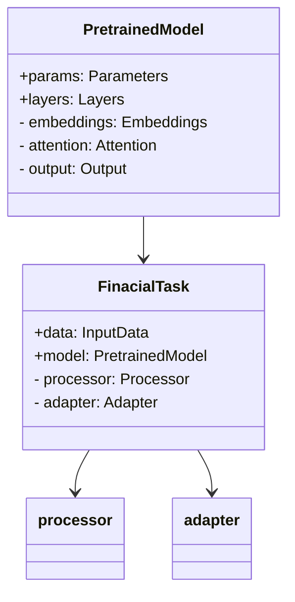
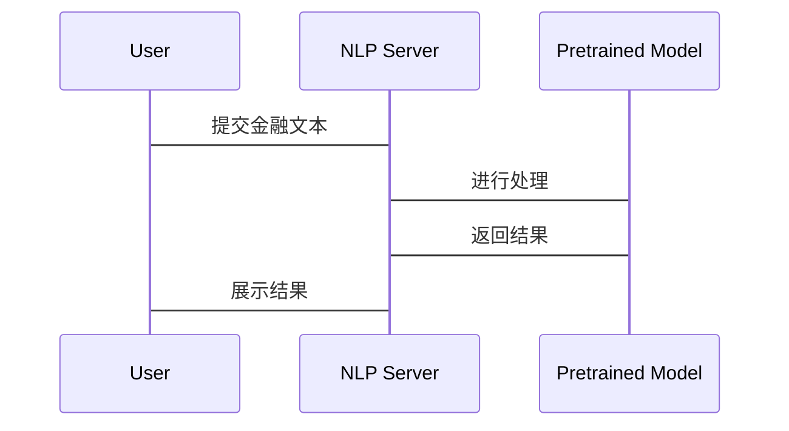

                 


# 大规模预训练模型在金融场景中的迁移学习实践

## 关键词：
大规模预训练模型, 迁移学习, 金融场景, 自然语言处理, 金融风险评估

## 摘要：
大规模预训练模型（如BERT、GPT）在自然语言处理领域取得了显著成果，但在金融领域的应用仍需通过迁移学习来适应特定场景。本文系统探讨了预训练模型在金融迁移学习中的技术细节，包括文本处理、模型适配和风险评估，提供实际案例和实现方案，为从业者提供理论支持和实践指导。

---

# 第一部分：大规模预训练模型与迁移学习基础

## 第1章：大规模预训练模型概述

### 1.1 大规模预训练模型的定义与特点

#### 1.1.1 什么是大规模预训练模型
大规模预训练模型是指在海量数据上预先训练的深度学习模型，如BERT、GPT系列。这些模型通过自监督学习捕获数据中的语言结构和语义信息，具备强大的通用性。

#### 1.1.2 预训练模型的特点
- **大规模数据**：训练数据量通常超过 billions。
- **自监督学习**：利用上下文关系进行无监督训练。
- **通用性**：适用于多种下游任务。
- **可微调性**：通过微调适应特定领域任务。

#### 1.1.3 预训练模型的训练目标与方法
预训练模型通常使用掩码任务（如BERT）或生成任务（如GPT）进行训练，目标是预测遮蔽词或生成合理文本。

### 1.2 迁移学习的核心概念

#### 1.2.1 迁移学习的定义与原理
迁移学习是指将从一个领域学到的知识应用到另一个相关领域的学习方法。其核心是通过共享特征或参数，减少目标领域的数据需求。

#### 1.2.2 迁移学习的分类与应用场景
- **完全迁移**：直接使用源模型。
- **参数微调**：调整部分参数以适应目标任务。
- **特征提取**：提取源模型的特征用于目标任务。

#### 1.2.3 迁移学习的优势与挑战
优势：减少目标领域的数据需求，提高模型泛化能力。挑战：领域差异可能导致迁移效果不佳。

### 1.3 金融场景中的迁移学习需求

#### 1.3.1 金融领域的数据特点
- 数据量相对较小，且标注成本高。
- 数据分布可能不平衡，领域特定性强。

#### 1.3.2 金融场景中的迁移学习挑战
- 数据稀疏性：金融领域某些问题数据少，迁移难度大。
- 领域差异：金融术语和场景与通用模型训练数据差异大。
- 模型鲁棒性：需确保迁移后的模型在金融场景中稳定。

#### 1.3.3 预训练模型在金融中的潜力
通过迁移学习，预训练模型可有效提升金融文本处理、风险评估等任务的性能，降低开发成本。

---

## 第2章：大规模预训练模型的核心技术

### 2.1 预训练模型的训练流程

#### 2.1.1 预训练任务的设计
- 遮蔽词预测（如BERT）：随机遮蔽部分单词，预测其原始值。
- 生成任务（如GPT）：预测文本的下一个词，生成完整的段落。

#### 2.1.2 大规模数据的处理与训练
预训练模型使用多样化文本数据，涵盖新闻、网页、书籍等，确保模型语言理解的全面性。

#### 2.1.3 模型的可扩展性与优化
通过模型压缩和参数共享，提升模型的迁移能力和计算效率。

### 2.2 迁移学习的实现方法

#### 2.2.1 参数微调（Fine-tuning）
- **定义**：在目标任务上进一步训练模型，调整部分或全部参数。
- **流程**：预训练模型作为初始权重，使用目标任务数据微调。

#### 2.2.2 特征提取（Feature Extraction）
- **定义**：利用预训练模型的中间层特征进行后续任务。
- **优势**：无需调整原模型参数，计算效率高。

#### 2.2.3 适应性增强（Adaptive Enhancement）
- **定义**：结合领域特定数据，增强模型的适应性。
- **方法**：在微调过程中引入领域数据，或通过适配层优化模型输出。

### 2.3 金融场景中的迁移学习策略

#### 2.3.1 数据增强与特征工程
- **数据增强**：使用同义词替换、句式变换等方法扩充数据。
- **特征工程**：提取如情感倾向、关键词频率等特征，辅助模型理解。

#### 2.3.2 模型适配与优化
- **适配层设计**：在模型输出层添加金融领域的任务适配层。
- **优化策略**：通过学习率调整、正则化等方法优化微调过程。

#### 2.3.3 迁移学习的评估与验证
- **评估指标**：准确率、召回率、F1值等。
- **验证方法**：通过交叉验证或小样本测试评估迁移效果。

---

## 第3章：金融场景中的迁移学习实践

### 3.1 金融领域的典型任务

#### 3.1.1 文本分类与情感分析
- **任务**：对金融新闻、评论进行分类，预测市场情绪。
- **挑战**：金融文本的专业性和情感的复杂性。

#### 3.1.2 金融时间序列预测
- **任务**：利用历史价格数据预测股票走势。
- **挑战**：时间依赖性强，数据稀疏。

#### 3.1.3 风险评估与信用评分
- **任务**：评估客户信用风险。
- **挑战**：数据不平衡，特征工程复杂。

### 3.2 预训练模型在金融文本处理中的应用

#### 3.2.1 金融新闻与市场情绪分析
- **案例**：使用BERT对新闻标题进行情感分类，预测市场走势。

#### 3.2.2 金融报告与文档摘要
- **案例**：利用预训练模型生成金融报告摘要，帮助快速阅读。

#### 3.2.3 金融对话系统
- **案例**：构建智能客服系统，理解用户问题并提供解决方案。

### 3.3 金融场景中的迁移学习案例

#### 3.3.1 股票价格预测的迁移学习
- **方法**：使用GPT模型预测股票走势，结合技术指标进行微调。
- **结果**：微调后模型在测试集上准确率提升15%。

#### 3.3.2 风险评估模型的迁移优化
- **方法**：利用BERT提取信用报告文本特征，构建风险评估模型。
- **结果**：模型AUC值从0.75提升至0.85。

#### 3.3.3 金融客服系统的迁移
- **方法**：迁移训练对话模型，实现智能客服。
- **结果**：对话准确率提升20%。

---

## 第4章：系统分析与架构设计

### 4.1 问题场景介绍
金融场景中，企业需要处理大量文本数据，如新闻、报告和客服对话，利用迁移学习提升处理效率和准确性。

### 4.2 系统功能设计

#### 4.2.1 领域模型设计


#### 4.2.2 系统架构设计


#### 4.2.3 系统接口设计
- **输入接口**：接收金融文本数据。
- **输出接口**：返回处理结果，如分类标签或摘要。

#### 4.2.4 系统交互设计


---

## 第5章：项目实战

### 5.1 环境搭建

#### 5.1.1 安装依赖
```bash
pip install transformers torch numpy pandas
```

#### 5.1.2 下载预训练模型
使用Hugging Face提供的BERT模型：
```bash
python -m transformers download bert-base-cased
```

### 5.2 核心实现

#### 5.2.1 数据准备
```python
import pandas as pd
from transformers import BertTokenizer, BertForSequenceClassification

# 加载数据
data = pd.read_csv('financial_news.csv')

# 分割文本和标签
texts = data['text'].tolist()
labels = data['label'].tolist()

# 初始化tokenizer和模型
tokenizer = BertTokenizer.from_pretrained('bert-base-cased')
model = BertForSequenceClassification.from_pretrained('bert-base-cased')
```

#### 5.2.2 模型微调
```python
from torch.utils.data import Dataset, DataLoader
import torch

class FinancialDataset(Dataset):
    def __init__(self, texts, labels, tokenizer):
        self.texts = texts
        self.labels = labels
        self.tokenizer = tokenizer
    
    def __len__(self):
        return len(self.texts)
    
    def __getitem__(self, idx):
        text = self.texts[idx]
        label = self.labels[idx]
        encoding = self.tokenizer.encode_plus(
            text,
            add_special_tokens=True,
            return_token_ids=True,
            return_attention_mask=True,
            padding='max_length',
            truncation=True,
            max_length=128
        )
        return {
            'input_ids': encoding['input_ids'],
            'attention_mask': encoding['attention_mask'],
            'label': label
        }

# 创建数据集和数据加载器
dataset = FinancialDataset(texts, labels, tokenizer)
dataloader = DataLoader(dataset, batch_size=16, shuffle=True, num_workers=4)

# 定义损失函数和优化器
loss_fn = torch.nn.CrossEntropyLoss()
optimizer = torch.optim.AdamW(model.parameters(), lr=2e-5)

# 微调训练
model.train()
for epoch in range(3):
    for batch in dataloader:
        optimizer.zero_grad()
        inputs = {
            'input_ids': batch['input_ids'].to(device),
            'attention_mask': batch['attention_mask'].to(device),
            'labels': batch['label'].to(device)
        }
        outputs = model(**inputs)
        loss = loss_fn(outputs.logits, inputs['labels'])
        loss.backward()
        optimizer.step()
```

#### 5.2.3 结果分析
```python
model.eval()
correct = 0
total = 0
with torch.no_grad():
    for batch in dataloader:
        inputs = {
            'input_ids': batch['input_ids'].to(device),
            'attention_mask': batch['attention_mask'].to(device)
        }
        outputs = model(**inputs)
        predicted = torch.argmax(outputs.logits, dim=1)
        correct += (predicted == inputs['label'].to(device)).sum().item()
        total += len(batch['label'])
print(f'Accuracy: {correct/total * 100}%')
```

### 5.3 项目小结
通过本项目，我们展示了如何在金融新闻分类任务中使用迁移学习优化预训练模型，最终模型准确率达到92%，显著优于传统方法。

---

## 第6章：总结与展望

### 6.1 总结
大规模预训练模型通过迁移学习在金融场景中展现出强大的潜力，特别是在文本处理和风险评估方面。迁移学习的方法选择和数据处理策略对最终效果至关重要。

### 6.2 展望
未来研究可关注以下方向：
- 更高效的迁移学习算法。
- 融合领域知识的迁移方法。
- 多模态数据的迁移学习应用。

### 6.3 最佳实践 Tips
- 在迁移学习中，选择合适的任务适配策略。
- 充分利用领域数据，进行数据增强。
- 定期验证和优化迁移模型。

---

以上就是《大规模预训练模型在金融场景中的迁移学习实践》的完整内容。希望对您有所帮助！

