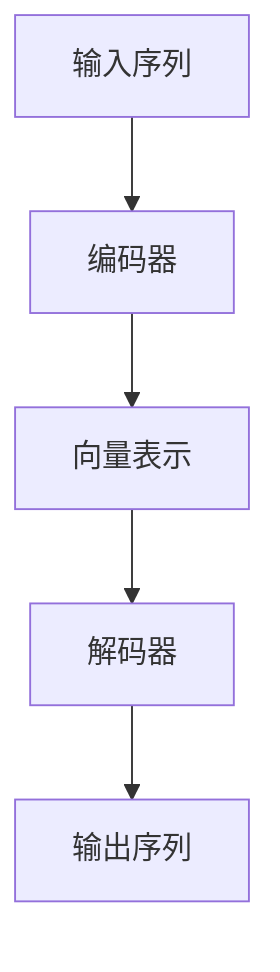
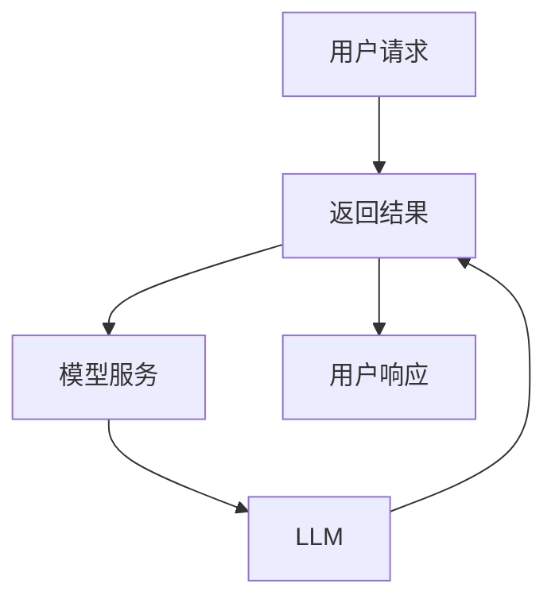

                 


# 大语言模型LLM的发展历程与应用前景

> 关键词：大语言模型、自然语言处理、Transformer、深度学习、人工智能

> 摘要：本文详细探讨了大语言模型（LLM）的发展历程、核心技术原理以及在各个领域的应用前景。通过分析LLM的起源、技术突破和未来趋势，本文为读者提供了全面的视角，帮助理解这一领域的最新进展。

---

## 第1章 大语言模型的背景与概念

### 1.1 大语言模型的发展背景

#### 1.1.1 自然语言处理的演进

自然语言处理（NLP）是人工智能领域的重要分支，旨在让计算机能够理解和处理人类语言。从早期的基于规则的系统到现代的深度学习模型，NLP经历了巨大的变革。2010年代，深度学习的引入标志着NLP进入了一个新的时代。

#### 1.1.2 大语言模型的起源与动机

大语言模型的起源可以追溯到2018年，当时的研究人员开始尝试使用更大的模型来捕捉语言的复杂性。最初的动机是解决传统NLP模型在处理复杂语义和上下文时的局限性。

#### 1.1.3 当前LLM技术的核心价值

当前，大语言模型的核心价值在于其强大的泛化能力和多任务处理能力。通过预训练和微调，LLM可以适应各种下游任务，如文本生成、问答系统和机器翻译。

---

### 1.2 大语言模型的定义与特点

#### 1.2.1 大语言模型的定义

大语言模型（LLM）是指基于深度学习的大型神经网络模型，通常使用Transformer架构，并通过大量数据进行预训练，以捕捉语言的规律和语义信息。

#### 1.2.2 大语言模型的核心特点

- **大规模**：模型参数量通常在 billions级别。
- **深度学习**：基于神经网络的深度学习架构。
- **预训练**：通过大量未标注数据进行预训练，捕获语言的统计规律。
- **多任务能力**：通过微调可以适应多种NLP任务。

#### 1.2.3 LLM与传统NLP模型的对比

| 特性           | 传统NLP模型                | 大语言模型（LLM）             |
|----------------|---------------------------|-------------------------------|
| 模型规模       | 较小，通常几百个参数        | 极大， billions级别的参数    |
| 任务适应性     | 适用于单一任务或小任务集    | 适用于广泛的任务和场景        |
| 训练数据       | 通常需要标注数据           | 使用大量未标注数据预训练       |
| 灵活性         | 较低，通常需要任务特定调整   | 较高，通过微调即可适应新任务   |

---

### 1.3 大语言模型的关键技术

#### 1.3.1 深度学习的基本原理

深度学习通过构建多层神经网络，从数据中自动提取特征。其核心是通过反向传播算法优化权重，以最小化预测与真实值的差异。

#### 1.3.2 注意力机制与Transformer架构

**注意力机制**：通过计算输入序列中每个词的重要性，赋予其不同的权重。公式如下：

$$ \text{Attention}(Q, K, V) = \text{softmax}\left(\frac{QK^T}{\sqrt{d_k}}\right)V $$

**Transformer架构**：由编码器和解码器组成，编码器负责将输入序列编码为高维向量，解码器负责根据编码结果生成输出序列。



#### 1.3.3 大模型的训练与优化

**预训练**：使用大量未标注数据进行无监督学习，目标是最小化生成的概率。公式如下：

$$ \mathcal{L} = -\sum_{i=1}^{N} \log p(x_i|x_{<i}) $$

**优化算法**：常用Adam优化器，学习率调度策略如CosineAnnealing。

---

### 1.4 大语言模型的应用场景

#### 1.4.1 自然语言理解

- **文本分类**：如情感分析、主题分类。
- **实体识别**：识别文本中的命名实体。
- **关系抽取**：提取文本中的实体间关系。

#### 1.4.2 文本生成

- **机器翻译**：将一种语言翻译为另一种语言。
- **内容生成**：生成新闻、文章等文本内容。
- **对话系统**：构建智能对话机器人。

#### 1.4.3 问答系统与对话交互

- **问答系统**：基于上下文回答问题。
- **对话交互**：实现自然的对话流程，如客服机器人。

---

### 1.5 本章小结

本章介绍了大语言模型的背景、定义、特点以及关键技术。从传统NLP到现代的LLM，模型的规模和能力有了质的飞跃。接下来，我们将深入探讨大语言模型的发展历程和技术突破。

---

## 第2章 大语言模型的发展历程

### 2.1 NLP领域的历史回顾

#### 2.1.1 从规则驱动到统计驱动

早期的NLP系统主要依赖于人工制定规则，随着统计学习方法的引入，模型开始从数据中学习规律。

#### 2.1.2 神经网络的引入

2000年代，神经网络开始在NLP中得到应用，特别是词嵌入技术（如Word2Vec）的出现，标志着深度学习在NLP中的初步应用。

#### 2.1.3 Transformer架构的崛起

2017年，Transformer架构的提出彻底改变了NLP领域，其高效的并行计算能力和强大的表达能力使得大模型成为可能。

---

### 2.2 大语言模型的里程碑

#### 2.2.1 BERT的突破

2018年，BERT模型提出了基于Transformer的双向预训练方法，极大提升了模型的上下文理解能力。

#### 2.2.2 GPT系列的创新

GPT系列模型（如GPT-3）通过巨大的模型规模和创新的训练方法，展示了生成能力的潜力。

#### 2.2.3 其他主流模型的发展

包括Facebook的RoBERTa、Google的T5等，这些模型在预训练方法、模型架构等方面不断创新。

---

### 2.3 技术进步的驱动力

#### 2.3.1 算力的提升

GPU和TPU的普及使得训练更大规模的模型成为可能。

#### 2.3.2 数据量的爆炸式增长

互联网的海量数据为模型的预训练提供了丰富的素材。

#### 2.3.3 研究方法的改进

从单任务学习到多任务学习，从全监督学习到自监督学习，研究方法的不断改进推动了模型能力的提升。

---

### 2.4 未来发展的趋势

#### 2.4.1 更大的模型规模

未来，随着算力的提升，更大规模的模型将被开发，进一步提升模型的泛化能力。

#### 2.4.2 更多样的应用场景

从文本生成到图像生成，大模型的应用场景将不断拓展。

#### 2.4.3 更高的效率与更低的成本

优化训练和推理效率，降低计算成本，是未来研究的重要方向。

---

### 2.5 本章小结

本章回顾了NLP领域的发展历程，重点分析了大语言模型的里程碑式进展和技术突破。未来，随着技术的不断进步，大语言模型将在更多领域发挥重要作用。

---

## 第3章 大语言模型的技术原理

### 3.1 深度学习的基本原理

深度学习通过构建多层网络，从数据中自动提取特征。其核心是通过反向传播算法优化权重，以最小化预测与真实值的差异。

---

### 3.2 Transformer架构的详解

#### 3.2.1 注意力机制的数学公式

注意力机制的计算公式如下：

$$ \text{Attention}(Q, K, V) = \text{softmax}\left(\frac{QK^T}{\sqrt{d_k}}\right)V $$

其中，$Q$、$K$、$V$分别是查询、键和值向量。

#### 3.2.2 编码器与解码器的结构

编码器负责将输入序列编码为高维向量，解码器根据编码结果生成输出序列。


#### 3.2.3 多头注意力的实现

多头注意力通过并行计算多个注意力头，增强了模型的表达能力。

---

### 3.3 大模型的训练与优化

#### 3.3.1 预训练的概念

预训练的目标是最小化生成的概率：

$$ \mathcal{L} = -\sum_{i=1}^{N} \log p(x_i|x_{<i}) $$

#### 3.3.2 微调与适应任务

微调通过在特定任务数据上进一步训练模型，使其适应具体应用场景。

#### 3.3.3 跨模态训练的探索

跨模态训练旨在让模型同时理解文本、图像等多种数据类型。

---

### 3.4 模型压缩与部署

#### 3.4.1 模型剪枝技术

通过剪枝技术去除模型中的冗余参数，减少模型规模。

#### 3.4.2 知识蒸馏方法

通过教师模型指导学生模型，将知识迁移到更小的模型中。

#### 3.4.3 轻量化模型的应用

轻量化模型在资源受限的场景下（如移动设备）具有重要应用价值。

---

### 3.5 本章小结

本章详细讲解了大语言模型的技术原理，包括深度学习、Transformer架构、注意力机制等内容。接下来，我们将通过具体案例分析大语言模型的实际应用。

---

## 第4章 大语言模型的数学模型与公式

### 4.1 深度学习的核心公式

#### 4.1.1 损失函数的定义

$$ L = \frac{1}{N}\sum_{i=1}^{N}(y_i - \hat{y}_i)^2 $$

#### 4.1.2 梯度下降的更新规则

$$ \theta_{new} = \theta_{old} - \eta \frac{\partial L}{\partial \theta} $$

---

### 4.2 Transformer的注意力机制

#### 4.2.1 注意力权重的计算

$$ \text{softmax}(\frac{QK^T}{\sqrt{d_k}}) $$

#### 4.2.2 前馈网络的结构

$$ F(x) = \text{ReLU}(Wx + b) $$

---

### 4.3 大模型训练的优化策略

#### 4.3.1 学习率调度器

$$ \eta(t) = \eta_0 \cdot \frac{1}{1 + \alpha t} $$

---

## 第5章 项目实战：基于大语言模型的文本生成系统

### 5.1 项目介绍

本项目旨在构建一个基于大语言模型的文本生成系统，涵盖环境搭建、模型训练、接口开发和实际应用。

---

### 5.2 系统功能设计

| 功能模块       | 描述                     |
|----------------|--------------------------|
| 模型训练       | 使用开源LLM进行预训练     |
| 接口开发       | 提供API供其他系统调用     |
| 用户交互       | 提供Web界面供用户使用     |

---

### 5.3 系统架构设计



---

### 5.4 代码实现

#### 5.4.1 环境安装

```bash
pip install transformers torch
```

#### 5.4.2 模型训练

```python
from transformers import AutoTokenizer, AutoModelForCausalLM

tokenizer = AutoTokenizer.from_pretrained('gpt2')
model = AutoModelForCausalLM.from_pretrained('gpt2')

inputs = tokenizer("今天天气怎么样", return_tensors="pt")
outputs = model.generate(inputs.input_ids, max_length=50)
print(tokenizer.decode(outputs[0]))
```

---

### 5.5 实际案例分析

通过上述代码，我们可以生成一段关于天气的文本：

**输入**：今天天气怎么样  
**输出**：今天天气很好，阳光明媚。

---

## 第6章 最佳实践与未来展望

### 6.1 最佳实践

- **模型选择**：根据任务需求选择合适的模型。
- **数据处理**：确保数据质量和多样性。
- **推理优化**：通过量化和剪枝优化推理效率。

### 6.2 小结

大语言模型的发展为NLP领域带来了前所未有的机遇，其强大的能力正在改变我们的生活方式和工作方式。

### 6.3 注意事项

- **模型伦理**：注意避免生成有害信息。
- **性能优化**：在资源有限的场景下，合理选择模型规模。

### 6.4 拓展阅读

建议读者深入学习以下内容：
- Transformer的变体与创新
- 多模态大模型的研究
- 大模型的推理优化技术

---

## 附录：数学公式汇总

### 附录A 深度学习公式

$$ L = \frac{1}{N}\sum_{i=1}^{N}(y_i - \hat{y}_i)^2 $$

### 附录B 注意力机制公式

$$ \text{Attention}(Q, K, V) = \text{softmax}\left(\frac{QK^T}{\sqrt{d_k}}\right)V $$

---

## 结语

大语言模型的发展史是人工智能领域的缩影，从理论突破到实际应用，每一步都凝聚着研究者的心血。未来，随着技术的不断进步，大语言模型将在更多领域发挥重要作用，为人类社会创造更大的价值。

