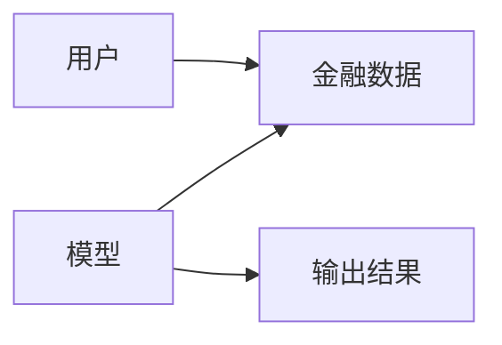
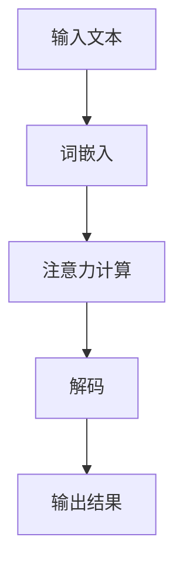

                 


# 大语言模型在金融领域的应用

> 关键词：大语言模型，金融应用，自然语言处理，机器学习，深度学习

> 摘要：本文系统地探讨了大语言模型在金融领域的应用，从背景介绍、核心概念、算法原理到系统设计与项目实战，详细分析了大语言模型如何在金融数据分析、风险评估、投资决策等领域发挥作用。通过理论与实践相结合，本文为读者提供了全面的理解和应用指南。

---

## 目录大纲

### 第一部分：大语言模型在金融领域的应用概述

### 第1章：大语言模型与金融领域的背景介绍

#### 1.1 大语言模型的基本概念
- 1.1.1 大语言模型的定义
- 1.1.2 大语言模型的核心特点
- 1.1.3 大语言模型与传统AI的区别

#### 1.2 大语言模型在金融领域的应用潜力
- 1.2.1 金融领域的核心问题与挑战
- 1.2.2 大语言模型在金融中的应用场景
- 1.2.3 大语言模型对金融行业的影响

#### 1.3 本章小结

---

### 第二部分：大语言模型的核心概念与原理

### 第2章：大语言模型的核心概念与联系

#### 2.1 大语言模型的原理概述
- 2.1.1 预训练与微调的定义
- 2.1.2 大语言模型的训练流程
- 2.1.3 大语言模型的推理机制

#### 2.2 大语言模型的核心要素对比
- 2.2.1 模型参数数量对比
- 2.2.2 训练数据来源对比
- 2.2.3 模型应用场景对比

#### 2.3 大语言模型的ER实体关系图


#### 2.4 本章小结

---

### 第三部分：大语言模型的算法原理与数学模型

### 第3章：大语言模型的算法原理

#### 3.1 大语言模型的训练过程
- 3.1.1 预训练阶段
- 3.1.2 微调阶段
- 3.1.3 推理阶段

#### 3.2 大语言模型的数学模型
- 3.2.1 词嵌入表示
  $$\text{词嵌入} = W_{word} \cdot x$$
- 3.2.2 注意力机制
  $$\text{注意力权重} = \text{softmax}(\frac{QK^T}{\sqrt{d}})$$
- 3.2.3 模型解码
  $$\text{输出} = \text{解码器}(x, y_{<t})$$

#### 3.3 大语言模型的算法流程图


#### 3.4 本章小结

---

### 第四部分：大语言模型在金融系统中的应用

### 第4章：金融系统中的大语言模型应用

#### 4.1 金融场景中的问题分析
- 4.1.1 金融数据分析
- 4.1.2 风险评估与预测
- 4.1.3 投资决策支持

#### 4.2 金融系统的功能设计
- 4.2.1 领域模型设计
  ```mermaid
  classDiagram
  class 用户 {
    <<用户>>
    + 用户ID: string
    + 用户名: string
    + 资产: float
  }
  class 金融数据 {
    <<金融数据>>
    + 股票代码: string
    + 股票名称: string
    + 价格: float
  }
  class 模型 {
    <<模型>>
    + 模型ID: string
    + 模型名称: string
  }
  用户 --> 模型
  金融数据 --> 模型
  ```

#### 4.3 金融系统的架构设计


#### 4.4 金融系统的接口设计
- 4.4.1 输入接口
- 4.4.2 输出接口

#### 4.5 金融系统的交互流程图


#### 4.6 本章小结

---

### 第五部分：项目实战与应用案例

### 第5章：大语言模型在金融领域的项目实战

#### 5.1 项目环境配置
- 5.1.1 硬件配置
- 5.1.2 软件配置
- 5.1.3 数据集准备

#### 5.2 项目核心实现
- 5.2.1 代码实现
  ```python
  import torch
  import torch.nn as nn

  class SimpleModel(nn.Module):
      def __init__(self, vocab_size, embedding_dim, hidden_dim):
          super().__init__()
          self.embedding = nn.Embedding(vocab_size, embedding_dim)
          self.lstm = nn.LSTM(embedding_dim, hidden_dim, batch_first=True)
          self.fc = nn.Linear(hidden_dim, 1)

      def forward(self, x):
          embedded = self.embedding(x)
          output, _ = self.lstm(embedded)
          result = self.fc(output[:, -1, :])
          return result

  model = SimpleModel(vocab_size=10000, embedding_dim=128, hidden_dim=256)
  ```

#### 5.3 代码应用解读与分析
- 5.3.1 代码功能解读
- 5.3.2 代码优化建议

#### 5.4 实际案例分析与详细讲解
- 5.4.1 案例背景介绍
- 5.4.2 案例分析过程
- 5.4.3 案例结果与总结

#### 5.5 本章小结

---

### 第六部分：总结与展望

### 第6章：总结与展望

#### 6.1 本章小结
- 6.1.1 核心内容回顾
- 6.1.2 关键点总结

#### 6.2 最佳实践与注意事项
- 6.2.1 实践建议
- 6.2.2 注意事项

#### 6.3 未来研究方向与发展趋势
- 6.3.1 技术发展趋势
- 6.3.2 应用场景扩展

#### 6.4 扩展阅读推荐
- 6.4.1 推荐书籍
- 6.4.2 推荐论文
- 6.4.3 推荐博客与资源

---

通过以上目录结构，本文将从理论到实践，系统地探讨大语言模型在金融领域的应用，帮助读者全面理解其原理、优势及实际应用场景。

