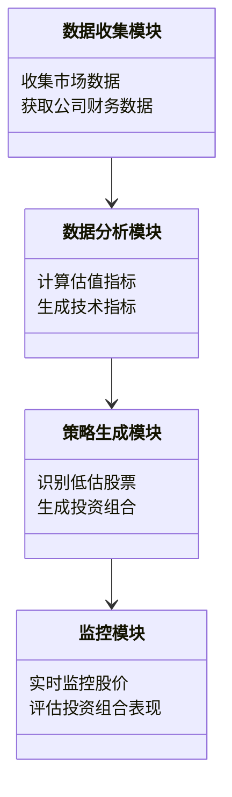
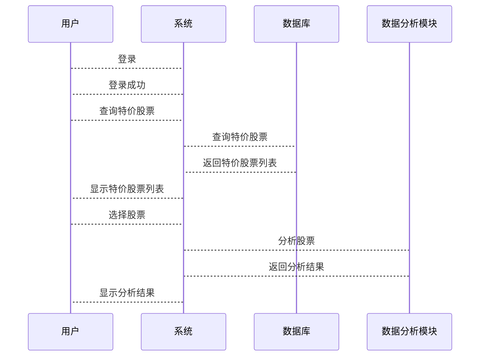

                 


# 如何利用特价股票投资应对全球经济不确定性

## 关键词：特价股票、全球经济不确定性、投资策略、风险管理、技术分析、价值投资、资产配置

## 摘要：
在全球经济不确定性加剧的背景下，特价股票投资成为一种有效的应对策略。本文将系统地分析特价股票的定义、识别方法、投资策略，并结合技术分析和基本面分析，提供一套应对全球经济不确定性的投资方案。通过详细的技术博客风格，本文将引导读者如何利用特价股票优化投资组合，降低风险，实现长期收益。

---

# 第1章: 特价股票投资的背景与概念

## 1.1 全球经济不确定性概述

### 1.1.1 经济波动的周期性分析
全球经济的波动具有周期性，通常包括扩张、衰退、复苏和繁荣阶段。当前经济环境的不确定性主要源于地缘政治冲突、通货膨胀、供应链中断和货币政策变化等因素。这些因素可能导致市场波动加剧，投资者面临更高的不确定性。

### 1.1.2 全球经济不确定性对企业的影响
全球经济不确定性直接影响企业的盈利能力、市场表现和投资价值。企业可能面临需求下降、成本上升和供应链问题，这些都会影响其股价表现。投资者需要识别那些在不确定环境中仍能保持增长潜力的企业，特价股票往往出现在这些企业中。

### 1.1.3 投资者如何应对经济不确定性
投资者在经济不确定性中应采取多元化策略，降低风险，寻找具有长期增长潜力的股票。特价股票因其低估值特性，成为投资者在市场低迷时期的投资选择。

## 1.2 特价股票的定义与特点

### 1.2.1 特价股票的定义
特价股票是指市场价格低于其内在价值的股票。这些股票通常因为市场情绪、短期因素或行业周期而被低估，具有较大的上涨潜力。

### 1.2.2 特价股票的市场特征
- 市盈率和市净率低于行业平均水平。
- 股价波动较大，通常在市场低迷时出现。
- 具有较高的股息率或增长潜力。

### 1.2.3 特价股票与市场波动的关系
特价股票通常在市场下跌时出现，投资者需要识别这些股票并制定长期投资策略。市场波动为投资者提供了以低价买入优质股票的机会。

## 1.3 投资特价股票的重要性

### 1.3.1 特价股票投资的潜在收益
通过识别低估的股票，投资者可以在市场回升时获得超额收益。特价股票的上涨潜力通常高于市场平均水平。

### 1.3.2 特价股票在投资组合中的作用
作为投资组合的一部分，特价股票可以分散风险，平衡收益。在经济不确定性中，特价股票的投资价值更加凸显。

### 1.3.3 特价股票投资的风险与机会
尽管特价股票具有较高的潜在收益，但也伴随着较高的风险。投资者需要具备分析能力和风险承受能力。

---

# 第2章: 投资理论基础

## 2.1 资产配置与投资组合管理

### 2.1.1 资产配置的基本原理
资产配置是将资金分配到不同资产类别中，以平衡风险和收益。合理的资产配置可以降低市场波动对投资组合的影响。

### 2.1.2 投资组合的风险与收益平衡
通过分散投资，投资者可以降低特定资产的风险，同时追求稳定收益。资产配置需要根据市场环境和投资者风险承受能力进行调整。

### 2.1.3 如何通过资产配置应对经济不确定性
在经济不确定性中，投资者应调整资产配置，增加防御性资产的比例，如债券和现金。同时，适当配置具有增长潜力的股票，平衡风险和收益。

## 2.2 价值投资与成长投资

### 2.2.1 价值投资的核心理念
价值投资强调购买低于内在价值的股票，等待市场重新评估其价值。这种方法需要对企业的基本面有深入研究。

### 2.2.2 成长投资的策略与风险
成长投资关注具有高增长潜力的企业，尽管其股价可能高于当前收益，但未来增长可能带来超额收益。这种策略风险较高，但潜在回报也较大。

### 2.2.3 价值投资与成长投资的结合
投资者可以通过结合价值和成长投资策略，优化投资组合。例如，在经济不确定性中选择低估的成长股，平衡风险和收益。

## 2.3 风险管理与投资心理

### 2.3.1 风险管理的基本原则
投资者应设定止损点，分散投资，定期评估和调整投资组合。风险管理是投资成功的关键。

### 2.3.2 投资者的心理偏差与行为偏差
投资者常见的心理偏差包括过度自信、从众心理和损失厌恶。这些偏差可能导致非理性决策，影响投资结果。

### 2.3.3 如何克服投资心理障碍
投资者需要培养纪律性，避免情绪化决策，坚持长期投资策略。通过教育和实践，投资者可以克服心理障碍，提高投资效果。

## 2.4 本章小结
本章介绍了资产配置、价值投资和成长投资的基本理论，强调了风险管理的重要性。投资者应根据市场环境和个人情况，选择合适的策略，应对经济不确定性。

---

# 第3章: 特价股票分析方法

## 3.1 特价股票识别方法

### 3.1.1 市盈率与市净率分析
市盈率（P/E）=股价/每股收益，市净率（P/B）=股价/每股净资产。低估股票通常具有较低的P/E和P/B比率。

### 3.1.2 股价与内在价值的比较
通过DCF模型等方法估算股票的内在价值，比较市场价格与内在价值的差异，识别低估股票。

### 3.1.3 相关指标的综合运用
结合市盈率、市净率、股息率和ROE等指标，综合评估股票的低估程度。

## 3.2 技术分析与基本面分析

### 3.2.1 技术分析的基本方法
技术分析通过分析股价走势，识别趋势和形态。常用方法包括趋势线、移动平均线、RSI指标等。

### 3.2.2 基本面分析的核心指标
基本面分析关注企业的财务状况、盈利能力、成长性和行业地位。常用指标包括净利润、营业收入增长率和资产负债率等。

### 3.2.3 技术分析与基本面分析的结合
结合技术分析和基本面分析，可以更准确地识别低估股票。例如，通过技术分析寻找超跌股票，再通过基本面分析验证其投资价值。

## 3.3 市场情绪与投资

### 3.3.1 市场情绪对股票价格的影响
市场情绪波动可能导致股票价格偏离其内在价值。投资者应关注市场情绪，避免盲目跟风。

### 3.3.2 如何利用市场情绪进行投资
在市场恐慌时，投资者可以寻找被市场情绪低估的股票，进行长期投资。在市场狂热时，应保持谨慎，避免追高。

## 3.4 本章小结
本章介绍了特价股票的识别方法和分析技术，强调了技术分析和基本面分析的结合。投资者应综合运用多种方法，识别低估股票，制定投资策略。

---

# 第4章: 特价股票投资策略

## 4.1 构建投资组合

### 4.1.1 投资组合构建的基本原则
投资者应根据自身风险承受能力和投资目标，选择合适的股票组合。通常包括多个行业和不同规模的股票，以分散风险。

### 4.1.2 特价股票在投资组合中的比例
根据市场环境和投资者风险偏好，特价股票在投资组合中的比例通常为30%至50%。在经济不确定性加剧时，可适当增加比例。

### 4.1.3 投资组合的定期调整
投资者应定期评估投资组合的表现，根据市场变化和企业基本面调整持仓。通常每年调整一次，或在重大市场变化时进行调整。

## 4.2 长期投资策略

### 4.2.1 长期投资的核心理念
长期投资强调持有优质股票，获得企业的长期增长收益。特价股票通常具有较高的长期增长潜力。

### 4.2.2 长期投资的风险管理
长期投资者应设定止损点，避免短期波动对长期投资的影响。同时，应关注企业的长期增长潜力，选择具有竞争优势的企业。

### 4.2.3 长期投资与市场波动
市场波动为长期投资者提供了以低价买入优质股票的机会。长期投资者应坚持投资策略，避免因短期波动而改变决策。

## 4.3 应对市场波动的策略

### 4.3.1 短期市场波动的应对
在市场剧烈波动时，投资者应避免频繁交易，减少交易成本。可以通过调整投资组合的持仓，降低波动对投资组合的影响。

### 4.3.2 中期市场波动的应对
在中期市场波动中，投资者应关注企业的基本面变化，评估其长期投资价值。可以通过增加防御性股票的比例，降低波动风险。

### 4.3.3 长期市场波动的应对
长期投资者应关注企业的长期增长潜力，选择具有竞争优势的企业。市场波动为长期投资者提供了以低价买入股票的机会。

## 4.4 本章小结
本章介绍了构建投资组合和应对市场波动的策略。投资者应根据市场环境和个人情况，制定合适的投资策略，优化投资组合。

---

# 第5章: 特价股票投资系统的架构与实现

## 5.1 系统设计概述

### 5.1.1 问题场景介绍
投资者需要一个高效的投资管理系统，帮助其识别特价股票，制定投资策略，优化投资组合。系统应具备数据收集、分析、策略生成和监控功能。

### 5.1.2 项目介绍
本章将设计一个投资管理系统，结合技术分析和基本面分析，帮助投资者识别特价股票，制定投资策略。系统将提供数据可视化、策略生成和监控功能。

## 5.2 系统功能设计

### 5.2.1 领域模型设计
通过Mermaid图展示系统的领域模型，包括数据收集、分析、策略生成和监控功能。



### 5.2.2 系统架构设计
通过Mermaid图展示系统的架构设计，包括数据源、数据处理层、策略生成层和用户界面层。


### 5.2.3 系统接口设计
系统需要与数据源（如股票数据库和财经网站）进行接口设计，获取实时数据和历史数据。接口设计应考虑数据格式、访问频率和数据更新频率。

### 5.2.4 系统交互设计
通过Mermaid图展示系统的交互流程，包括用户登录、数据查询、策略生成和结果展示。



## 5.3 代码实现与分析

### 5.3.1 环境安装
投资者需要安装Python和相关库（如Pandas、NumPy、Matplotlib和Scikit-learn）。

### 5.3.2 核心代码实现

#### 数据收集模块
```python
import pandas as pd
import requests
from bs4 import BeautifulSoup

def get_stock_data(ticker):
    url = f"https://finance.yahoo.com/quote/{ticker}"
    response = requests.get(url)
    soup = BeautifulSoup(response.text, 'html.parser')
    data = {}
    data['price'] = float(soup.find('div', {'class': 'C(ltr) P(0) font-bold').text)
    data['pe_ratio'] = float(soup.find('div', {'data-reactid': '44'}).text)
    data['pb_ratio'] = float(soup.find('div', {'data-reactid': '45'}).text)
    return data
```

#### 数据分析模块
```python
def calculate_value(ticker):
    data = get_stock_data(ticker)
    intrinsic_value = data['price'] * (1 - data['pe_ratio'] / 100)
    return intrinsic_value
```

#### 策略生成模块
```python
def generate_portfolio(tickers):
    portfolio = []
    for ticker in tickers:
        if calculate_value(ticker) < data['price']:
            portfolio.append(ticker)
    return portfolio
```

### 5.3.3 代码应用解读
通过上述代码，投资者可以自动化收集股票数据，计算内在价值，识别低估股票，生成投资组合。这种方法提高了投资效率，降低了人为错误。

---

# 第6章: 特价股票投资实战案例

## 6.1 案例背景与目标
本案例以某行业为例，分析如何识别特价股票，制定投资策略，优化投资组合。

## 6.2 数据收集与分析

### 6.2.1 数据收集
收集某行业的股票数据，包括市盈率、市净率和股息率等指标。

### 6.2.2 数据分析
通过分析数据，识别低估股票。例如，某股票的市盈率为10，行业平均市盈率为15，说明该股票可能被低估。

## 6.3 投资策略制定

### 6.3.1 策略制定
根据分析结果，选择低估股票，构建投资组合。例如，选择市盈率低于行业平均水平的股票，投资比例为30%。

### 6.3.2 策略优化
根据市场变化和企业基本面，定期调整投资组合。例如，季度末重新评估股票价值，根据变化调整持仓。

## 6.4 投资效果评估

### 6.4.1 投资收益分析
通过比较投资组合的收益与市场指数的收益，评估策略的有效性。例如，投资组合的年化收益为15%，高于市场指数的10%。

### 6.4.2 风险管理评估
通过比较最大回撤和波动率，评估投资组合的风险。例如，投资组合的最大回撤为10%，低于市场指数的15%。

## 6.5 本章小结
本章通过实际案例展示了如何识别特价股票，制定投资策略，优化投资组合。投资者可以参考这种方法，制定适合自己的投资策略。

---

# 第7章: 总结与展望

## 7.1 本章总结
本文系统地分析了如何利用特价股票投资应对全球经济不确定性。通过介绍特价股票的定义、识别方法和投资策略，结合技术分析和基本面分析，帮助投资者优化投资组合，降低风险。

## 7.2 未来展望
随着技术的进步和数据的丰富，特价股票投资将更加智能化和自动化。投资者可以利用人工智能和大数据技术，提高分析效率和准确性。未来的研究方向包括开发更复杂的算法，优化投资策略，应对更复杂的市场环境。

---

# 结语
在全球经济不确定性加剧的背景下，特价股票投资为投资者提供了降低风险、优化收益的机会。通过系统的分析和实践，投资者可以掌握特价股票的投资方法，制定适合自己的投资策略。未来，随着技术的进步，特价股票投资将更加智能化和高效化，为投资者提供更多的机会和挑战。

