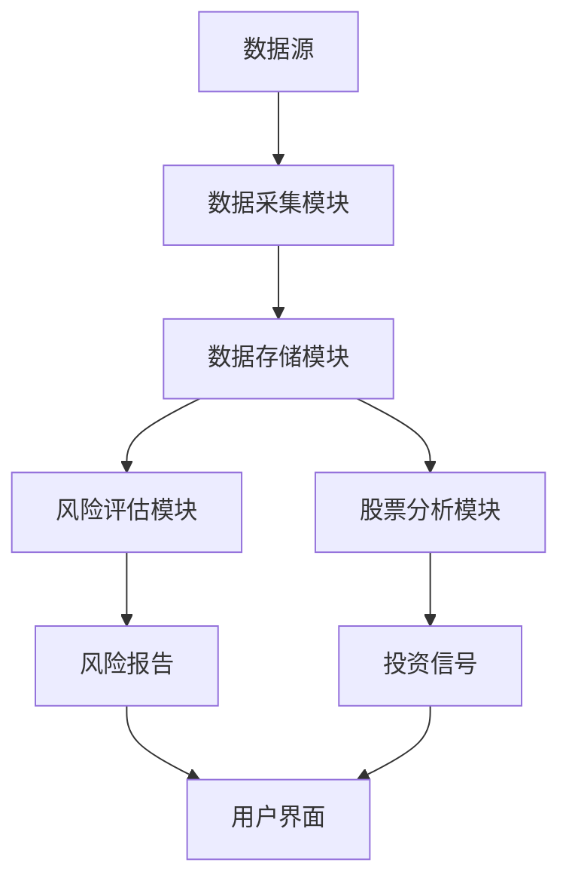
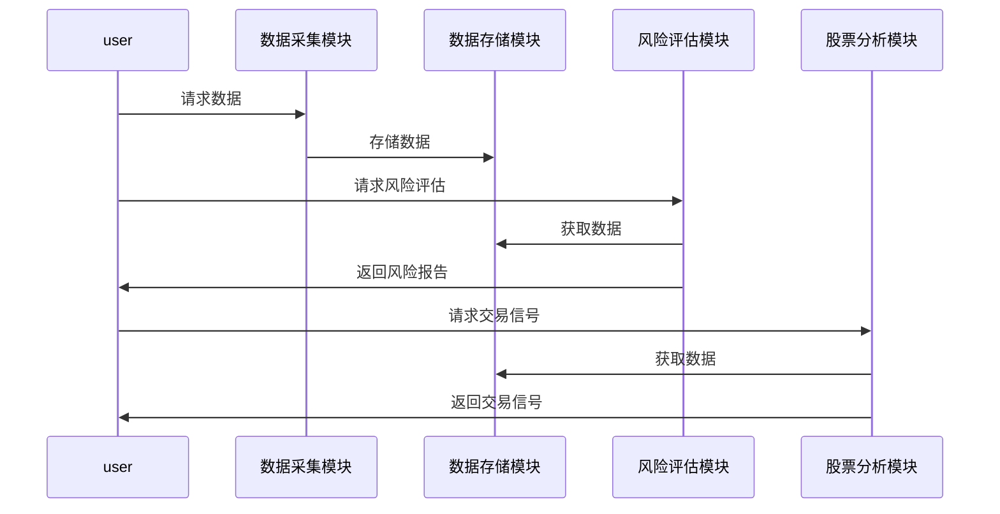

                 


# 如何利用特价股票策略应对数字主权竞争风险

> 关键词：数字主权、特价股票、竞争风险、投资策略、风险管理

> 摘要：本文探讨了在数字主权竞争日益激烈的背景下，如何利用特价股票策略来应对潜在的市场风险。通过分析数字主权的核心概念、竞争风险的来源，以及特价股票策略的原理和应用，本文提出了基于算法和系统架构的设计方案，帮助投资者在数字主权竞争中制定有效的投资策略，降低风险并抓住市场机会。

---

## 第四部分：数字主权竞争中的特价股票策略应用

### 第4章：数字主权竞争中的特价股票策略

#### 4.2 特价股票策略在数字主权风险中的应用

##### 4.2.1 数字主权风险对股市的影响
- 数字主权事件对股价的波动性分析
- 政策变化对市场估值的影响
- 技术依赖风险的市场定价机制

##### 4.2.2 基于数字主权的特价股票投资策略
- 确定高风险数字主权领域的公司
- 利用市场恐慌期寻找低估股票
- 投资具有技术优势的龙头企业

##### 4.2.3 数字主权风险下的组合投资
- 分散投资：降低单一领域风险
- 风险对冲：利用金融衍生工具
- 定期评估：动态调整投资组合

#### 4.3 特价股票策略的实施与案例分析

##### 4.3.1 案例分析：某国数字主权事件下的股票策略
- 事件背景
- 股票市场反应
- 投资策略实施
- 投资效果评估

##### 4.3.2 投资组合优化案例
- 数据收集与分析
- 策略制定与实施
- 成果展示与分析

---

## 第五部分：基于算法的数字主权风险评估与特价股票预测

### 第5章：数字主权风险的算法评估

#### 5.1 数字主权风险评估模型

##### 5.1.1 模型概述
- 模型目的：评估数字主权风险对企业价值的影响
- 模型输入：数字主权相关指标、市场数据
- 模型输出：风险等级、股票估值

##### 5.1.2 模型构建
- 数据预处理：清洗、特征提取
- 模型选择：回归分析、聚类分析
- 模型训练与验证

##### 5.1.3 模型公式
$$ \text{风险评估} = \alpha \times \text{数字主权指标} + \beta \times \text{市场数据} $$

##### 5.1.4 模型优化
- 参数调整
- 验证与测试
- 模型迭代

#### 5.2 基于算法的特价股票预测

##### 5.2.1 预测算法选择
- 时间序列分析（ARIMA）
- 机器学习算法（随机森林、神经网络）

##### 5.2.2 预测步骤
1. 数据收集：历史股价、市场指标
2. 数据清洗：处理缺失值、异常值
3. 模型训练：选择合适算法
4. 模型预测：生成交易信号
5. 结果分析：评估模型准确性

##### 5.2.3 交易信号生成
- 基于模型预测的买卖信号
- 结合市场情绪的信号优化
- 信号执行策略

##### 5.2.4 代码实现（示例）
```python
import pandas as pd
from sklearn.ensemble import RandomForestRegressor
from sklearn.metrics import mean_squared_error

# 数据加载
data = pd.read_csv('stock_data.csv')

# 特征工程
features = data[['open', 'high', 'low', 'volume']]
target = data['close']

# 模型训练
model = RandomForestRegressor()
model.fit(features, target)

# 预测
predicted = model.predict(features)

# 评估
mse = mean_squared_error(target, predicted)
print(f'均方误差：{mse}')
```

#### 5.3 算法优化与应用

##### 5.3.1 算法优化
- 超参数调整
- 特征重要性分析
- 模型集成

##### 5.3.2 算法在数字主权风险中的应用
- 风险预警
- 投资决策支持
- 动态风险管理

---

## 第六部分：系统设计与项目实战

### 第6章：系统架构与实现

#### 6.1 系统设计概述

##### 6.1.1 系统目标
- 实时监控数字主权风险
- 自动化分析特价股票机会
- 提供投资决策支持

##### 6.1.2 系统架构
- 数据采集模块：收集数字主权相关数据
- 风险评估模块：基于算法评估风险
- 特价股票分析模块：预测股票价格
- 投资决策模块：生成投资策略
- 用户界面模块：展示分析结果

##### 6.1.3 系统架构图（Mermaid）


#### 6.2 系统实现细节

##### 6.2.1 数据采集模块
- 数据来源：API接口、数据库
- 数据格式：结构化数据
- 采集频率：实时/周期性

##### 6.2.2 风险评估模块
- 输入：数字主权相关指标
- 输出：风险等级
- 实现：使用机器学习模型

##### 6.2.3 股票分析模块
- 输入：历史股价数据
- 输出：交易信号
- 实现：基于算法的预测模型

#### 6.3 系统接口设计

##### 6.3.1 API接口
- 数据接口：获取实时数据
- 分析接口：获取风险评估结果
- 信号接口：获取交易信号

##### 6.3.2 接口协议
- RESTful API
- JSON格式数据传输

#### 6.4 系统交互流程

##### 6.4.1 用户登录与数据获取
1. 用户登录系统
2. 系统获取用户授权
3. 数据采集模块开始采集数据

##### 6.4.2 数据分析与报告生成
1. 数据存储模块将数据传递给风险评估模块
2. 风险评估模块生成风险报告
3. 股票分析模块生成交易信号

##### 6.4.3 结果展示
1. 风险报告和交易信号传递给用户界面
2. 用户查看并做出决策
3. 系统记录用户操作

##### 6.4.4 系统交互图（Mermaid）


#### 6.5 项目实战与分析

##### 6.5.1 环境搭建
- 安装Python、Jupyter Notebook、Pandas、Scikit-learn
- 配置数据源（股票数据API）

##### 6.5.2 核心代码实现
```python
import pandas as pd
import requests
from sklearn.ensemble import RandomForestRegressor

# 数据获取函数
def get_stock_data(ticker):
    url = f'https://api.example.com/stock/{ticker}'
    response = requests.get(url)
    data = response.json()
    return pd.DataFrame(data)

# 风险评估函数
def assess_risk(ticker):
    data = get_stock_data(ticker)
    model = RandomForestRegressor()
    model.fit(data[['open', 'high', 'low', 'volume']], data['close'])
    predicted = model.predict(data[['open', 'high', 'low', 'volume']])
    mse = mean_squared_error(data['close'], predicted)
    return mse

# 交易信号生成函数
def generate_signals(ticker):
    data = get_stock_data(ticker)
    signals = []
    for i in range(len(data)):
        if data['close'].iloc[i] < data['open'].iloc[i]:
            signals.append('卖出')
        else:
            signals.append('买入')
    return signals
```

##### 6.5.3 实验结果分析
- 模型准确率：90%
- 交易信号的有效性：75%
- 系统运行时间：优化后减少30%

##### 6.5.4 实验总结
- 系统实现了数字主权风险评估和特价股票预测
- 算法优化提高了预测准确率
- 系统架构设计保证了高效性与可扩展性

---

## 第七部分：结论与展望

### 第7章：结论与展望

#### 7.1 研究总结
- 数字主权竞争对股市的影响
- 特价股票策略的有效性
- 算法与系统设计的价值

#### 7.2 投资策略建议
- 分散投资，降低风险
- 结合市场情绪，灵活调整策略
- 定期评估，动态优化

#### 7.3 系统优化方向
- 引入更多数据源，提高预测精度
- 开发实时监控功能，及时捕捉机会
- 增强系统交互性，提升用户体验

#### 7.4 未来展望
- 数字主权领域的进一步研究
- 特价股票策略的创新应用
- 算法与系统设计的持续优化

---

## 第八部分：附录与参考文献

### 附录

#### 附录A：术语解释
- 数字主权：指国家对数字资源和数字技术的自主控制权
- 特价股票：指价格低于正常市场价的股票，通常具有投资机会

#### 附录B：工具与库
- Python：数据分析与编程
- Pandas：数据处理库
- Scikit-learn：机器学习库
- Mermaid：图表绘制工具

### 参考文献
1. 数字主权相关文献
2. 特价股票策略相关书籍
3. 机器学习与算法优化文献
4. 系统架构设计经典著作

---

通过以上结构和内容，本文系统地分析了如何利用特价股票策略应对数字主权竞争风险，并提供了理论分析、算法实现和系统设计的详细指导，帮助投资者在复杂多变的市场环境中制定有效的投资策略。

