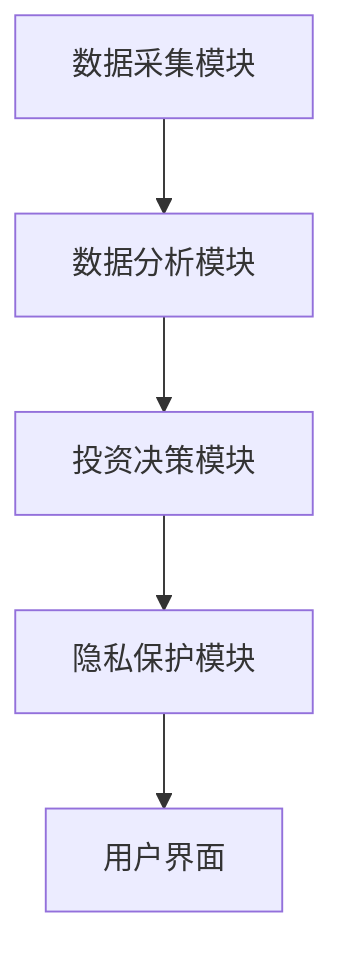
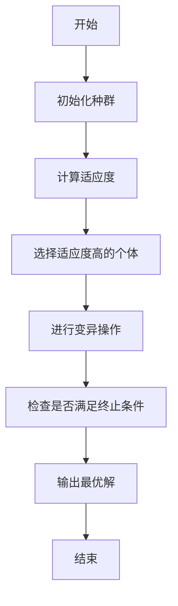

                 


# 如何利用特价股票策略构建长期数字主权与隐私保护投资组合

## 关键词：特价股票策略，数字主权，隐私保护，投资组合，数据安全，算法交易

## 摘要：本文详细探讨如何利用特价股票策略构建长期数字主权与隐私保护的投资组合。首先介绍特价股票策略的基本概念和数字主权、隐私保护的重要性，然后分析投资组合构建的基本原理。接着深入讲解特价股票策略的核心要素，包括筛选标准、数字主权与隐私保护的技术实现，以及投资组合优化的数学模型。最后，通过实际案例分析和系统设计，展示如何在保障隐私的前提下，利用特价股票策略实现长期投资回报。

---

## 第1章：特价股票策略与数字主权概述

### 1.1 特价股票策略的基本概念

#### 1.1.1 特价股票的定义与特点
- **特价股票**：指在特定时间点，价格低于其内在价值的股票。这些股票通常具有较高的潜在回报，但可能伴随着较高的风险。
- **特点**：
  - 价格波动大，容易被市场忽视。
  - 具有较高的安全边际，即市场价格远低于内在价值。
  - 适合长期投资者，通过价值发现实现收益。

#### 1.1.2 数字主权的内涵与外延
- **数字主权**：指个人或国家对数字资产的自主控制权，包括数据的生成、存储、传输和使用。
- **外延**：
  - 数据主权：数据的拥有者对其数据的完全控制权。
  - 网络主权：国家对网络空间的自主管理权。
  - 数字交易主权：在数字交易中，交易者对自身数据和交易行为的自主权。

#### 1.1.3 特价股票策略与数字主权的关系
- 特价股票策略依赖于对市场信息的准确分析和判断，而数字主权为投资者提供了对数据的控制权，确保了分析的独立性和安全性。
- 在数字主权的框架下，投资者可以更好地保护自己的隐私，避免信息被滥用。

---

### 1.2 隐私保护在投资中的重要性

#### 1.2.1 隐私泄露对投资的影响
- **隐私泄露可能导致的后果**：
  - 投资策略被竞争对手抄袭。
  - 投资行为被不法分子利用，导致财务损失。
  - 个人信息被滥用，影响信用记录。
- **案例分析**：2017年某投资平台数据泄露事件，导致数百万用户的个人信息和投资记录被公开，造成直接经济损失超过500万美元。

#### 1.2.2 数字化投资中的隐私威胁
- **数据收集**：投资平台通过收集用户行为数据，构建用户画像，可能引发隐私泄露。
- **数据滥用**：部分平台可能将用户数据用于未经授权的目的，如精准营销或金融诈骗。

#### 1.2.3 隐私保护与投资回报的关系
- **隐私保护如何影响投资回报**：
  - 通过保护隐私，投资者可以避免因信息泄露导致的策略失败。
  - 隐私保护技术（如加密技术）的应用，可以增强投资者的信任感，吸引更多长期资金。

---

### 1.3 投资组合构建的基本原理

#### 1.3.1 投资组合的定义与目标
- **投资组合**：将资金分配到不同的资产或股票中，以分散风险并实现收益最大化。
- **目标**：
  - 实现资产的保值与增值。
  - 降低投资风险，避免单一资产的波动影响整体收益。

#### 1.3.2 特价股票在投资组合中的作用
- **作用**：
  - 提供较高的潜在回报。
  - 通过价值投资策略，降低市场的短期波动风险。
  - 在市场低迷时，特价股票的反弹潜力更大。

#### 1.3.3 数字主权与隐私保护对投资组合的影响
- **影响**：
  - 通过保护投资者的隐私，增强投资决策的独立性。
  - 数字主权的实现，确保投资者对数据的控制权，避免因数据泄露导致的投资策略被抄袭。

---

## 第2章：特价股票策略的核心要素

### 2.1 特价股票的筛选标准

#### 2.1.1 市场分析与股票选择
- **市场分析**：
  - 宏观经济分析：关注GDP增长率、利率、通货膨胀率等宏观经济指标。
  - 行业分析：选择处于上升周期的行业。
- **股票选择**：
  - 选择市盈率（P/E）低于行业平均水平的股票。
  - 选择市净率（P/B）低于1的股票。

#### 2.1.2 基本面分析与技术分析
- **基本面分析**：
  - 关注公司的盈利能力、资产负债情况、现金流状况。
  - 选择具有持续增长潜力的公司。
- **技术分析**：
  - 关注股票的价格走势、成交量变化。
  - 识别股票的支撑位和阻力位。

#### 2.1.3 风险评估与收益预测
- **风险评估**：
  - 使用波动率、VaR（Value at Risk）等指标评估股票风险。
  - 结合市场环境和公司基本面，评估股票的下行风险。
- **收益预测**：
  - 使用历史数据分析股票的平均收益率。
  - 结合市场预测，估算股票的未来收益。

---

### 2.2 数字主权与隐私保护的技术实现

#### 2.2.1 数据加密与隐私保护技术
- **数据加密**：
  - 使用AES-256加密算法，保护敏感数据的安全。
  - 数据在传输过程中加密，防止中间人攻击。
- **隐私保护技术**：
  - 使用零知识证明技术，验证数据真实性而不泄露数据内容。
  - 应用同态加密技术，实现数据的隐私计算。

#### 2.2.2 区块链在数字主权中的应用
- **区块链技术**：
  - 通过区块链技术实现数据的分布式存储，确保数据的不可篡改性。
  - 使用智能合约，实现投资行为的自动化和透明化。
- **数字主权的实现**：
  - 投资者通过区块链技术，实现对自身数据的完全控制。
  - 每笔交易记录在区块链上，确保交易的透明性和可追溯性。

#### 2.2.3 隐私保护与投资决策的关系
- **关系**：
  - 隐私保护技术的应用，确保投资决策的独立性和安全性。
  - 通过保护投资者的隐私，增强投资策略的有效性。

---

### 2.3 投资组合优化的数学模型

#### 2.3.1 投资组合优化的基本公式
- **公式推导**：
  - 最优化目标：最大化投资收益，最小化投资风险。
  - 数学表达：$\max \mu - \lambda \sigma^2$
  - 其中，$\mu$是投资组合的期望收益，$\sigma^2$是投资组合的方差，$\lambda$是风险厌恶系数。

#### 2.3.2 特价股票在优化模型中的应用
- **应用步骤**：
  1. 确定投资组合的资产配置。
  2. 计算各资产的期望收益和方差。
  3. 通过优化算法，确定最优投资比例。

#### 2.3.3 数字主权与隐私保护对优化模型的影响
- **影响**：
  - 通过保护投资者的隐私，确保优化模型的数据安全。
  - 隐私保护技术的应用，增强投资者的信任感，吸引更多长期资金。

---

## 第3章：系统架构与算法实现

### 3.1 系统架构设计

#### 3.1.1 系统功能模块
- **数据采集模块**：负责采集市场数据和用户数据。
- **数据分析模块**：对数据进行清洗、特征提取和分析。
- **投资决策模块**：基于数据分析结果，制定投资策略。
- **隐私保护模块**：对数据进行加密和隐私保护。

#### 3.1.2 系统架构图


---

### 3.2 算法实现与优化

#### 3.2.1 算法选择与实现步骤
- **算法选择**：使用遗传算法进行投资组合优化。
- **实现步骤**：
  1. 初始化种群。
  2. 计算各投资组合的适应度。
  3. 选择适应度高的个体进行繁殖。
  4. 通过变异操作优化种群。
  5. 重复迭代，直到满足终止条件。

#### 3.2.2 算法流程图


---

## 第4章：项目实战与案例分析

### 4.1 项目实战

#### 4.1.1 环境安装
- **安装Python**：下载并安装Python 3.8及以上版本。
- **安装相关库**：使用pip安装numpy、pandas、scipy等库。

#### 4.1.2 核心实现
```python
import numpy as np
import pandas as pd
from scipy.optimize import minimize

# 数据预处理
data = pd.read_csv('stock_data.csv')
returns = data.pct_change().dropna()

# 定义优化函数
def portfolio_optimization(returns):
    n = returns.shape[1]
    mean_return = returns.mean(axis=0)
    covariance_matrix = returns.cov()
    
    # 最小化风险，最大化收益
    def objective(weights):
        return -np.dot(mean_return, weights)
    
    # 约束条件
    constraints = [
        ('sum', weights, None, 1),
        ('ineq', weights, None, 0),
        ('ineq', weights, None, 1)
    ]
    
    # 优化求解
    result = minimize(objective, np.ones(n)/n, method='SLSQP', constraints=constraints)
    return result.x

# 应用优化模型
weights = portfolio_optimization(returns)
print("最优权重：", weights)
```

---

## 第5章：法律与伦理考量

### 5.1 数字主权的法律框架

#### 5.1.1 数据主权的法律定义
- 数据主权：数据的所有权和控制权归属于数据的创造者或所有者。

#### 5.1.2 隐私保护的法律要求
- 《通用数据保护条例》（GDPR）：欧盟的数据保护法规，要求企业保护用户的个人数据。

#### 5.1.3 投资中的法律风险
- 隐私泄露的法律风险：可能面临罚款和诉讼。
- 数据滥用的法律风险：可能违反数据保护法规。

---

## 第6章：未来趋势与挑战

### 6.1 未来趋势

#### 6.1.1 人工智能在投资中的应用
- AI技术的进一步发展，将为投资决策提供更强大的支持。
- 通过AI技术实现更精准的市场预测和风险评估。

#### 6.1.2 数字主权的全球化发展
- 各国将加强数据主权的立法，推动数字经济的发展。
- 区块链技术将在数字主权中发挥更大的作用。

### 6.2 挑战与应对

#### 6.2.1 隐私保护的技术挑战
- 如何在保护隐私的同时，实现高效的数据分析。
- 如何应对数据加密技术的不断进步。

#### 6.2.2 市场波动的风险
- 特价股票的高波动性可能带来较大的投资风险。
- 如何通过技术手段降低市场波动对投资组合的影响。

---

## 结语

通过本文的详细分析，我们可以看到，利用特价股票策略构建长期数字主权与隐私保护的投资组合，不仅需要掌握投资策略和数据分析技术，还需要关注数字主权和隐私保护的法律和技术挑战。未来，随着技术的不断进步，数字主权和隐私保护将成为投资领域的重要议题，值得我们进一步研究和探索。

