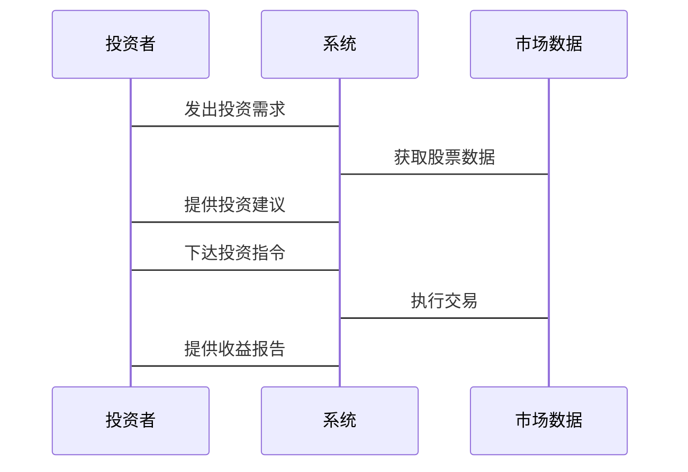

                 


# 如何利用特价股票策略进行全球产业链重构投资

## 关键词：特价股票策略、全球产业链重构、投资策略、系统架构、数学模型

## 摘要：  
本文将详细介绍如何利用特价股票策略在全球产业链重构中进行投资。通过分析特价股票策略的核心概念、数学模型、算法原理、系统架构以及实际案例，本文将为投资者提供一套科学的投资方法，帮助他们在全球产业链重构中抓住投资机会，实现收益最大化。

---

# 第一部分: 特价股票策略与全球产业链重构投资的背景介绍

## 第1章: 特价股票策略与全球产业链重构投资的背景介绍

### 1.1 特价股票策略的定义与特点

#### 1.1.1 什么是特价股票
特价股票是指在特定市场条件下，股票价格远低于其内在价值的股票。这些股票通常被市场低估，具有较大的增值潜力。

#### 1.1.2 特价股票策略的核心要素
- **市场波动性**：利用市场波动性低价买入股票。
- **价值评估**：通过基本面分析确定股票的内在价值。
- **风险控制**：设置止损点以控制投资风险。

#### 1.1.3 特价股票策略的适用场景
- **市场低迷期**：如经济危机或市场恐慌时。
- **行业调整期**：如行业整合或技术革新时。
- **企业困境期**：如企业重组或财务危机时。

### 1.2 全球产业链重构投资的背景

#### 1.2.1 全球化与产业链重构的现状
- 全球化推动了产业链的分工与协作。
- 近年来，地缘政治、贸易摩擦和疫情等事件加速了产业链的重构。

#### 1.2.2 产业链重构的核心驱动力
- **成本优化**：寻找更低的生产成本。
- **风险分散**：减少对单一市场的依赖。
- **技术创新**：通过技术驱动产业链升级。

#### 1.2.3 全球产业链重构对投资的影响
- **投资机会**：新兴市场的崛起和新产业链的形成带来投资机会。
- **风险变化**：产业链重构可能带来新的风险，如供应链中断。

### 1.3 特价股票策略与全球产业链重构投资的结合

#### 1.3.1 特价股票策略在产业链重构中的作用
- **捕捉低估企业**：在产业链重构过程中，部分企业可能被市场低估。
- **投资新兴行业**：通过特价股票策略投资产业链重构中的新兴行业。

#### 1.3.2 产业链重构对特价股票投资机会的影响
- **行业整合**：产业链重构可能导致行业整合，部分企业股票价格被低估。
- **技术驱动**：技术创新驱动的新产业链可能带来新的特价股票投资机会。

#### 1.3.3 特价股票策略与产业链重构投资的协同效应
- **双重收益**：通过特价股票策略投资产业链重构中的企业，既能获得股票增值收益，又能通过产业链重构带来的业务扩展获得额外收益。

---

## 第2章: 特价股票策略与全球产业链重构投资的核心概念

### 2.1 特价股票策略的数学模型与公式

#### 2.1.1 特价股票的价值评估模型
- **市盈率模型**：  
  $$ P/E = \frac{\text{股价}}{\text{每股收益}} $$
- **市净率模型**：  
  $$ P/B = \frac{\text{股价}}{\text{每股净资产}} $$
- **股息率模型**：  
  $$ \text{股息率} = \frac{\text{每股股息}}{\text{股价}} \times 100\% $$

#### 2.1.2 特价股票投资的收益计算公式
- **总收益计算**：  
  $$ \text{总收益} = \text{买入价} \times \text{股数} + \text{股息收入} $$
- **收益率计算**：  
  $$ \text{收益率} = \frac{\text{卖出价} - \text{买入价}}{\text{买入价}} \times 100\% $$

#### 2.1.3 特价股票风险评估的数学模型
- **波动率模型**：  
  $$ \sigma = \sqrt{\sum_{i=1}^{n} (\frac{p_i - \mu}{n})^2} $$  
  其中，$\sigma$ 表示股票价格的波动率，$\mu$ 表示股票价格的平均值，$p_i$ 表示每期股票价格，$n$ 表示样本数量。

### 2.2 全球产业链重构的实体关系图

#### 2.2.1 产业链重构的实体关系图


#### 2.2.2 产业链重构的核心要素分析
| 核心要素 | 描述 |
|----------|------|
| 投资者   | 投资者通过股票市场参与产业链重构。 |
| 企业     | 企业通过重组或技术创新推动产业链重构。 |
| 供应链   | 供应链的优化是产业链重构的重要部分。 |
| 市场     | 市场需求变化驱动产业链重构。 |
| 政策     | 政策环境影响产业链重构的方向和速度。 |

#### 2.2.3 产业链重构与投资的关系图


### 2.3 特价股票策略与产业链重构投资的系统架构

#### 2.3.1 系统架构设计概述
- **系统目标**：通过特价股票策略在全球产业链重构中实现投资收益。
- **系统范围**：覆盖股票筛选、投资决策、风险控制等环节。

#### 2.3.2 系统功能模块划分
| 模块 | 描述 |
|------|------|
| 股票筛选模块 | 根据市盈率、市净率等指标筛选特价股票。 |
| 投资决策模块 | 结合产业链重构趋势，制定投资策略。 |
| 风险控制模块 | 通过波动率模型等工具控制投资风险。 |

#### 2.3.3 系统接口设计与交互流程


---

## 第3章: 特价股票策略与全球产业链重构投资的算法原理

### 3.1 特价股票策略的算法流程

#### 3.1.1 特价股票筛选算法
```python
def screen_penny_stocks():
    import pandas as pd
    data = pd.read_csv('stock_data.csv')
    # 计算市盈率和市净率
    data['P/E'] = data['股价'] / data['每股收益']
    data['P/B'] = data['股价'] / data['每股净资产']
    # 筛选市盈率小于20且市净率小于1的股票
    filtered = data[(data['P/E'] < 20) & (data['P/B'] < 1)]
    return filtered
```

#### 3.1.2 特价股票投资组合优化算法
```python
def optimize_portfolio(stocks):
    import numpy as np
    from scipy.optimize import minimize
    # 定义目标函数（最小化风险）
    def objective(weights):
        return np.dot(weights.T, weights)
    # 定义约束条件
    constraints = [
        ('sum_to_1', {'type': 'eq', 'constraint': lambda w: np.sum(w) - 1}),
    ]
    # 优化权重
    result = minimize(objective, np.ones(len(stocks)) / len(stocks), constraints)
    return result.x
```

#### 3.1.3 特价股票风险控制算法
```python
def risk_control(weights, returns):
    import numpy as np
    # 计算投资组合的波动率
    portfolio_volatility = np.sqrt(np.dot(weights.T, np.dot(returns.cov(), weights)))
    return portfolio_volatility
```

### 3.2 全球产业链重构的算法实现

#### 3.2.1 产业链重构的量化分析算法
```python
def analyze_restructuring(sectors):
    import pandas as pd
    # 分析各行业的重构趋势
    for sector in sectors:
        sector_data = pd.read_csv(f'{sector}_data.csv')
        # 计算行业整合指数
        integration_index = sector_data['市值'].sum() / sector_data['企业数量'].mean()
        print(f"{sector}的整合指数为：{integration_index}")
```

#### 3.2.2 产业链重构的投资机会识别算法
```python
def identify_opportunities():
    import numpy as np
    # 识别高增长行业的投资机会
    growth_sectors = ['科技', '新能源', '医疗']
    opportunity_score = {}
    for sector in growth_sectors:
        data = pd.read_csv(f'{sector}_data.csv')
        # 计算行业增长潜力
        growth_potential = np.mean(data['营收增长率']) * 100
        opportunity_score[sector] = growth_potential
    return opportunity_score
```

#### 3.2.3 产业链重构的动态调整算法
```python
def adjust_portfolio(weights, new_data):
    import numpy as np
    # 根据新数据调整投资组合权重
    new_weights = np.zeros(len(new_data))
    for i in range(len(new_data)):
        new_weights[i] = weights[i] * new_data[i]['权重调整']
    return new_weights
```

### 3.3 特价股票策略与产业链重构投资的协同算法

#### 3.3.1 协同算法的设计思路
- **目标**：通过协同算法，将特价股票策略与产业链重构投资相结合，捕捉产业链重构中的投资机会。

#### 3.3.2 协同算法的实现步骤
1. **筛选特价股票**：使用上述的股票筛选算法，筛选出具有低估特征的股票。
2. **分析产业链重构趋势**：使用产业链重构分析算法，识别具有增长潜力的行业。
3. **优化投资组合**：结合产业链重构趋势，优化投资组合权重，实现投资收益最大化。

#### 3.3.3 协同算法的优化与改进
- **动态调整**：根据市场变化，动态调整投资组合。
- **风险控制**：通过波动率模型，控制投资风险。

---

## 第4章: 特价股票策略与全球产业链重构投资的数学模型与公式

### 4.1 特价股票价值评估模型

#### 4.1.1 市盈率模型
$$ P/E = \frac{\text{股价}}{\text{每股收益}} $$

#### 4.1.2 市净率模型
$$ P/B = \frac{\text{股价}}{\text{每股净资产}} $$

#### 4.1.3 股息率模型
$$ \text{股息率} = \frac{\text{每股股息}}{\text{股价}} \times 100\% $$

### 4.2 产业链重构的数学模型

#### 4.2.1 产业链重构的成本模型
$$ \text{总成本} = \sum_{i=1}^{n} c_i \times q_i $$  
其中，$c_i$ 表示第 $i$ 项的成本，$q_i$ 表示第 $i$ 项的产量。

#### 4.2.2 产业链重构的收益模型
$$ \text{总收益} = \sum_{i=1}^{n} r_i \times q_i $$  
其中，$r_i$ 表示第 $i$ 项的收益，$q_i$ 表示第 $i$ 项的产量。

#### 4.2.3 产业链重构的风险模型
$$ \text{风险} = \sum_{i=1}^{n} \text{风险权重}_i \times \text{风险敞口}_i $$  
其中，$\text{风险权重}_i$ 表示第 $i$ 项的风险权重，$\text{风险敞口}_i$ 表示第 $i$ 项的风险敞口。

### 4.3 特价股票与产业链重构的协同模型

#### 4.3.1 协同模型的构建
- **目标**：通过协同模型，实现特价股票策略与产业链重构投资的协同。

#### 4.3.2 协同模型的参数设置
| 参数 | 描述 |
|------|------|
| 投资组合权重 | 不同资产在投资组合中的权重。 |
| 市场波动率 | 市场波动对投资组合的影响程度。 |
| 产业链整合度 | 产业链整合程度对投资组合的影响。 |

#### 4.3.3 协同模型的应

