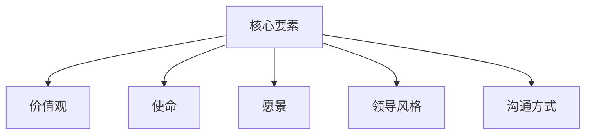
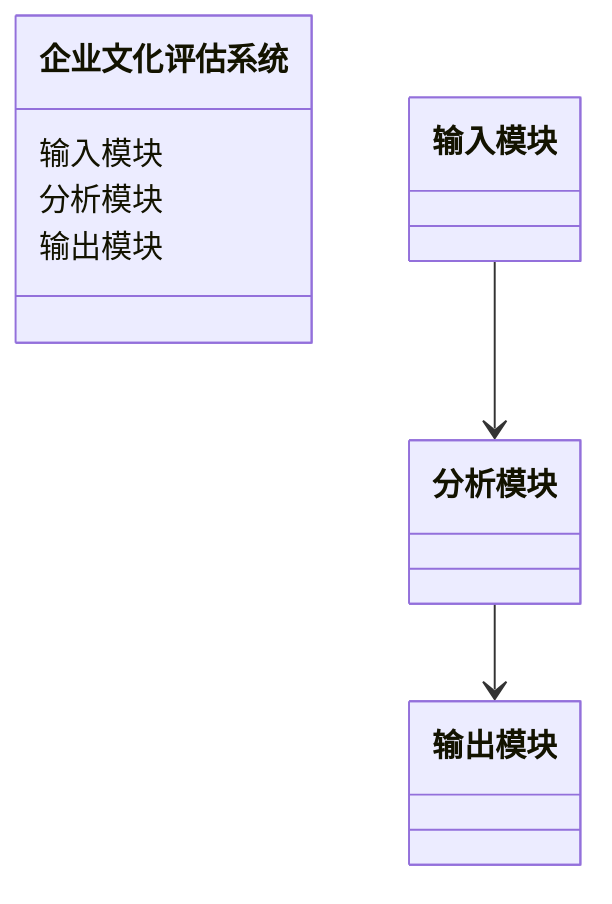

                 


# 如何在估值中考虑企业的文化因素

## 关键词：
企业估值、企业文化、文化因素、估值模型、文化评估、企业价值

## 摘要：
企业文化是影响企业价值的重要因素，但传统估值方法往往忽视了这一点。本文将详细探讨如何在估值中考虑文化因素，包括文化因素对估值的影响、文化评估的方法、文化因素如何融入估值模型，以及通过实际案例和系统工具来量化文化对估值的影响。

---

## 目录大纲：

# 如何在估值中考虑企业的文化因素

## 第1章：引言

### 1.1 为什么企业文化在估值中重要
- 1.1.1 传统估值方法的局限性
- 1.1.2 企业文化对企业价值的影响
- 1.1.3 本书的目标与意义

## 第2章：企业文化与价值的关系

### 2.1 企业文化的核心概念
- 2.1.1 企业文化的定义
- 2.1.2 核心要素对比表
- 2.1.3 企业文化结构图（mermaid）

### 2.2 企业文化与企业绩效
- 2.2.1 文化对企业绩效的影响
- 2.2.2 文化与财务绩效的关系
- 2.2.3 文化对企业价值的影响机制

## 第3章：企业文化因素的估值方法

### 3.1 文化因素的评估维度
- 3.1.1 文化评估维度
- 3.1.2 文化价值计算模型（公式）

### 3.2 文化因素与估值模型的结合
- 3.2.1 DCF模型的调整
- 3.2.2 文化因素对现金流的影响
- 3.2.3 文化价值量化模型（公式）

## 第4章：企业文化评估的系统分析

### 4.1 企业文化评估系统架构
- 4.1.1 系统功能设计（mermaid类图）
- 4.1.2 系统架构设计（mermaid架构图）

### 4.2 数据收集与分析
- 4.2.1 数据收集方法
- 4.2.2 数据分析方法
- 4.2.3 指标体系设计

## 第5章：项目实战

### 5.1 案例分析
- 5.1.1 案例背景
- 5.1.2 实战步骤
- 5.1.3 结果解读

### 5.2 环境安装与代码实现
- 5.2.1 环境安装
- 5.2.2 代码实现
- 5.2.3 代码解读

## 第6章：结论与展望

### 6.1 全文总结
- 6.1.1 核心观点总结
- 6.1.2 实践中的关键点

### 6.2 未来研究方向
- 6.2.1 文化因素的动态变化
- 6.2.2 结合ESG因素的研究

---

## 正文部分：

### 第1章：引言

#### 1.1 为什么企业文化在估值中重要
- **传统估值方法的局限性**：传统方法如DCF模型主要关注财务指标，忽视了文化对企业绩效的影响。
- **企业文化对企业价值的影响**：文化决定了企业的凝聚力、创新能力和执行效率，进而影响长期价值。
- **本书的目标与意义**：通过系统分析，提供在估值中考虑文化因素的方法和工具。

### 第2章：企业文化与价值的关系

#### 2.1 企业文化的核心概念
- **企业文化的定义**：企业的共同价值观、使命和愿景。
- **核心要素对比表**：

| 核心要素 | 描述 |
|----------|------|
| 价值观   | 共同的价值取向 |
| 使命     | 企业的存在意义 |
| 愿景     | 未来目标 |
| 领导风格 | 领导方式 |
| 沟通方式 | 内部交流模式 |

- **企业文化结构图（mermaid）**：


#### 2.2 企业文化与企业绩效
- **文化对企业绩效的影响**：积极的文化提高员工效率和创新性。
- **文化与财务绩效的关系**：良好的文化促进财务表现。
- **文化对企业价值的影响机制**：通过提高效率和创新能力，增强企业的市场竞争力。

### 第3章：企业文化因素的估值方法

#### 3.1 文化因素的评估维度
- **文化评估维度**：凝聚力、创新性、执行力。
- **文化价值计算模型（公式）**：
$$ 文化价值 = \sum (凝聚力 \times 创新性 \times 执行力) $$

#### 3.2 文化因素与估值模型的结合
- **DCF模型的调整**：将文化价值作为调整因子。
- **文化因素对现金流的影响**：文化价值影响未来现金流。
- **文化价值量化模型（公式）**：
$$ 企业价值 = DCF模型结果 + 文化价值 \times 调整系数 $$

### 第4章：企业文化评估的系统分析

#### 4.1 企业文化评估系统架构
- **系统功能设计（mermaid类图）**：


- **系统架构设计（mermaid架构图）**：


#### 4.2 数据收集与分析
- **数据收集方法**：问卷调查、数据分析。
- **数据分析方法**：因子分析、回归分析。
- **指标体系设计**：构建文化评估指标。

### 第5章：项目实战

#### 5.1 案例分析
- **案例背景**：某科技公司。
- **实战步骤**：数据收集、分析、模型构建、结果解读。
- **结果解读**：文化价值对企业价值的影响。

#### 5.2 环境安装与代码实现
- **环境安装**：安装Python、数据分析库。
- **代码实现**：
```python
import pandas as pd
import numpy as np

# 数据预处理
data = pd.read_csv('culture_data.csv')
data = data.dropna()
data['文化价值'] = data['凝聚力'] * data['创新性'] * data['执行力']
# 计算企业价值
DCF_value = 1000000  # 假设DCF模型结果
adjustment_factor = 0.2  # 假设调整系数
cultural_value = data['文化价值'].mean()
adjusted_value = DCF_value + cultural_value * adjustment_factor
print("调整后的企业价值：", adjusted_value)
```

- **代码解读**：计算文化价值并调整企业价值。

### 第6章：结论与展望

#### 6.1 全文总结
- **核心观点总结**：企业文化是影响企业价值的重要因素，需在估值中考虑。
- **实践中的关键点**：选择合适的评估维度，动态调整模型参数。

#### 6.2 未来研究方向
- **文化因素的动态变化**：研究文化因素如何随时间变化影响估值。
- **结合ESG因素的研究**：将文化因素纳入ESG框架，进行更全面的评估。

---

## 结语

通过系统分析和实际案例，本文展示了如何在估值中考虑文化因素。未来的研究将进一步深化文化因素的作用，为企业估值提供更全面的视角。

