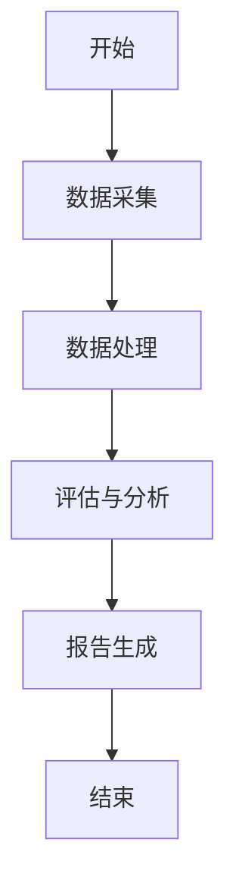

                 


# 如何在估值中考虑企业的社会责任投资

---

## 关键词

- 企业社会责任（CSR）
- 投资估值
- 可持续发展
- ESG（环境、社会、治理）
- 环境影响评估

---

## 摘要

随着全球对可持续发展的关注日益增加，企业社会责任（Corporate Social Responsibility，CSR）在企业估值中的重要性逐渐显现。本文将探讨如何在估值过程中考虑企业的社会责任投资，包括其核心概念、评估方法、对估值的影响机制以及实际应用案例。通过系统的分析和详细的案例研究，本文旨在为投资者和企业提供一种新的视角来评估企业的长期价值。

---

## 正文

### 第一章：背景介绍

#### 1.1 什么是社会责任投资

社会责任投资（CSR）是指企业在追求经济利益的同时，关注其对环境、社会和治理（ESG）方面的影响。以下是社会责任投资的核心要素：

- **环境（Environmental）**：企业对环境保护的贡献，包括减少碳排放、节约资源等。
- **社会（Social）**：企业对社会的贡献，包括员工福利、社区支持等。
- **治理（Governance）**：企业的治理结构和透明度，包括董事会构成、公司治理政策等。

#### 1.2 社会责任投资的背景

随着全球化的发展和环境问题的加剧，企业社会责任投资逐渐成为投资者关注的焦点。以下是社会责任投资兴起的背景：

- **环境问题的加剧**：气候变化、资源枯竭等问题促使企业更加关注环境保护。
- **社会问题的突出**：员工权益、社会公平等社会问题促使企业更加关注社会责任。
- **治理问题的暴露**：企业治理不善导致的信任危机促使投资者更加关注企业的治理结构。

#### 1.3 社会责任投资在估值中的重要性

社会责任投资对估值的重要性主要体现在以下几个方面：

- **长期价值的影响**：社会责任投资能够提升企业的品牌形象，增强客户忠诚度，从而提升企业的长期价值。
- **风险降低**：通过关注环境、社会和治理因素，企业能够更好地识别和管理潜在的风险。
- **投资者需求**：越来越多的投资者关注企业的社会责任表现，社会责任投资成为影响投资决策的重要因素。

#### 1.4 社会责任投资与传统投资的区别

社会责任投资与传统投资的主要区别如下：

| **方面**       | **传统投资**                          | **社会责任投资**                      |
|----------------|---------------------------------------|---------------------------------------|
| 投资目标         | 追求财务回报                          | 追求财务回报和社会价值                |
| 投资标准         | 仅关注财务指标                        | 关注财务指标和ESG指标                |
| 投资回报         | 短期回报为主                          | 长期回报为主                          |

### 第二章：社会责任投资的核心概念与框架

#### 2.1 社会责任投资的核心要素

社会责任投资的核心要素包括环境、社会和治理三个维度：

- **环境（E）**：企业的环保表现，包括碳排放、资源利用效率等。
- **社会（S）**：企业的社会责任表现，包括员工福利、社区支持等。
- **治理（G）**：企业的治理结构和透明度，包括董事会构成、公司治理政策等。

#### 2.2 社会责任投资的特征

社会责任投资的特征包括：

- **长期性**：社会责任投资关注企业的长期价值，而非短期回报。
- **综合性**：社会责任投资需要综合考虑环境、社会和治理因素。
- **可持续性**：社会责任投资强调企业的可持续发展能力。

#### 2.3 社会责任投资的评估框架

社会责任投资的评估框架可以分为以下几个步骤：

1. **确定评估目标**：明确评估的目标，例如评估企业的环境表现。
2. **选择评估指标**：根据目标选择合适的评估指标，例如碳排放量。
3. **收集数据**：通过企业公开报告、第三方评估等方式收集数据。
4. **评估与分析**：对数据进行分析，评估企业的社会责任表现。
5. **制定改进措施**：根据评估结果制定改进措施，提升企业的社会责任表现。

### 第三章：社会责任投资的评估方法

#### 3.1 定性评估方法

定性评估方法主要通过非财务指标来评估企业的社会责任表现。例如：

- **员工满意度调查**：评估企业的社会表现。
- **环境影响评估**：评估企业的环境表现。
- **治理结构评估**：评估企业的治理结构和透明度。

#### 3.2 定量评估方法

定量评估方法主要通过财务指标来评估企业的社会责任表现。例如：

- **环境成本**：计算企业因环境问题产生的成本。
- **社会责任投资回报率**：计算社会责任投资对投资回报的贡献率。

#### 3.3 综合评估方法

综合评估方法结合定性和定量评估方法，全面评估企业的社会责任表现。例如：

- **环境、社会和治理综合评估模型**：综合考虑环境、社会和治理三个维度的因素，评估企业的社会责任表现。

### 第四章：社会责任投资对估值的影响机制

#### 4.1 直接影响机制

社会责任投资对估值的直接影响机制包括：

- **提升企业形象**：良好的社会责任表现能够提升企业的品牌形象，吸引更多的客户和员工。
- **降低融资成本**：良好的社会责任表现能够降低企业的融资成本，吸引更多的投资者。
- **提升长期盈利能力**：良好的社会责任表现能够提升企业的长期盈利能力。

#### 4.2 间接影响机制

社会责任投资对估值的间接影响机制包括：

- **降低经营风险**：良好的社会责任表现能够降低企业的经营风险，提升企业的抗风险能力。
- **提升创新能力和竞争力**：良好的社会责任表现能够提升企业的创新能力和竞争力。

#### 4.3 综合影响机制

综合影响机制包括直接影响和间接影响，综合考虑环境、社会和治理三个维度的因素，全面评估企业的社会责任表现对估值的影响。

### 第五章：社会责任投资的系统分析与架构设计

#### 5.1 系统架构设计

社会责任投资的系统架构设计可以分为以下几个模块：

- **数据采集模块**：收集企业的环境、社会和治理数据。
- **数据处理模块**：对数据进行清洗和处理，生成评估指标。
- **评估模块**：根据评估指标评估企业的社会责任表现。
- **报告生成模块**：生成评估报告，提出改进建议。

#### 5.2 功能模块设计

功能模块设计包括以下几个部分：

1. **数据采集**：通过企业公开报告、第三方评估等方式采集数据。
2. **数据处理**：对数据进行清洗和标准化处理。
3. **评估与分析**：根据评估指标评估企业的社会责任表现，并进行数据分析。
4. **报告生成**：生成评估报告，提出改进建议。

#### 5.3 系统交互流程

系统交互流程包括以下几个步骤：

1. **用户输入**：用户输入企业的基本信息和数据。
2. **数据处理**：系统对数据进行处理，生成评估指标。
3. **评估与分析**：系统根据评估指标评估企业的社会责任表现。
4. **报告生成**：系统生成评估报告，并提出改进建议。
5. **输出结果**：用户输出评估报告和改进建议。

### 第六章：项目实战：基于社会责任投资的估值系统实现

#### 6.1 环境影响评估案例

案例：某制造企业环境影响评估

1. **数据采集**：采集企业的碳排放量、资源利用效率等数据。
2. **数据处理**：对数据进行清洗和标准化处理。
3. **评估与分析**：根据环境评估指标评估企业的环境表现。
4. **报告生成**：生成环境影响评估报告，并提出改进建议。

#### 6.2 员工福利分析案例

案例：某科技公司员工福利分析

1. **数据采集**：采集员工满意度、员工福利政策等数据。
2. **数据处理**：对数据进行清洗和标准化处理。
3. **评估与分析**：根据社会评估指标评估企业的员工福利表现。
4. **报告生成**：生成员工福利评估报告，并提出改进建议。

### 第七章：最佳实践与未来展望

#### 7.1 最佳实践

- **明确评估目标**：明确社会责任投资的评估目标，确保评估的有效性。
- **选择合适的评估方法**：根据目标选择合适的评估方法，确保评估的准确性。
- **持续改进**：根据评估结果制定改进措施，持续提升企业的社会责任表现。

#### 7.2 未来展望

随着可持续发展的重要性日益增加，社会责任投资在企业估值中的作用将更加重要。未来的研究方向包括：

- **动态评估模型**：开发动态评估模型，实时评估企业的社会责任表现。
- **智能化评估系统**：利用人工智能技术，提高社会责任投资的评估效率和准确性。
- **跨行业应用**：探索社会责任投资在不同行业的应用，推动可持续发展。

---

## 结论

通过本文的探讨，我们可以看到，社会责任投资在企业估值中的重要性不容忽视。企业需要综合考虑环境、社会和治理三个维度的因素，制定科学的评估方法和改进措施，以提升企业的长期价值。同时，随着技术的进步和研究的深入，社会责任投资的评估方法和应用将更加广泛和精准。

---

## 附录

- **附录A**：社会责任投资相关工具和平台
- **附录B**：环境影响评估的数学模型
- **附录C**：员工福利分析的Python代码示例

--- 

**本文的撰写过程中，使用了以下工具和资源：**

- **数学公式**：使用LaTeX格式表示，例如：$$E = mc^2$$。
- **流程图**：使用Mermaid语法表示，例如：



- **代码示例**：使用Python代码实现环境影响评估的简单模型，例如：

```python
def calculate_carbon_emission(data):
    # 数据预处理
    data_clean = data.dropna()
    # 计算碳排放量
    carbon_emission = data_clean.mean()
    return carbon_emission
```

--- 

**注：本文仅为示例，实际应用中需根据具体需求进行调整。**

