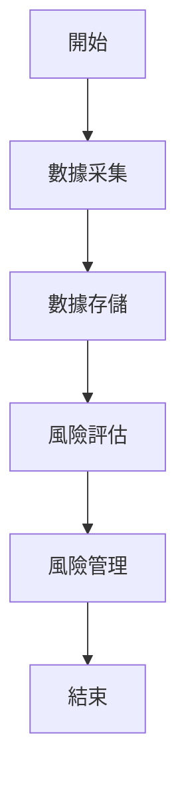
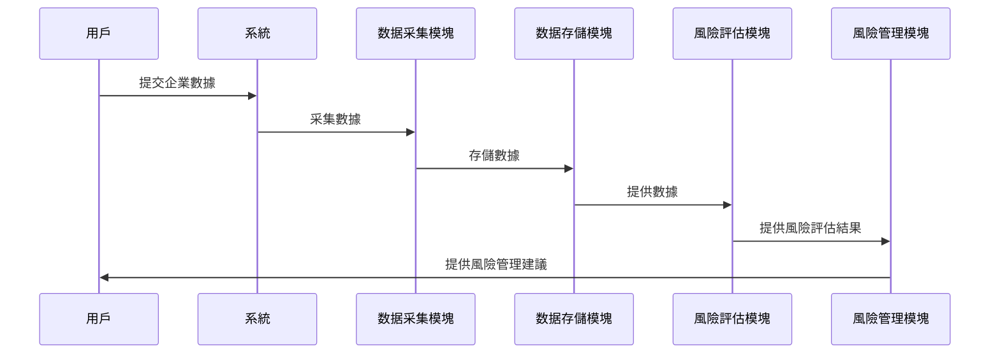

                 


# 如何处理企业估值中的跨境业务风险

> 关键词：企业估值，跨境业务，风险，风险管理，系统架构，数学模型

> 摘要：在当今全球化的企业环境中，跨境业务的普及带来了复杂的估值挑战。本文深入分析跨境业务风险的核心概念、算法原理、系统架构，并通过实际案例展示如何在项目中应用这些方法，最后总结最佳实践。

---

## 第1章: 背景介绍

### 1.1 跨境業務風險的核心概念
#### 1.1.1 跨境業務風險的定義
跨境業務風險是指企业在跨国经营中由于法律、税务、汇率、市场等因素的变化，导致企业估值波动或损失的可能性。这种风险可能来源于外部环境的不确定性，如政策变化、经济波动，也可能来源于企业内部的管理问题。

#### 1.1.2 跨境業務風險的類型
跨境業務風險可以分为以下几类：
- **法律风险**：由于不同国家的法律法规差异，企业可能面临合规性问题。
- **税务风险**：跨国经营涉及复杂的税务政策，可能导致税负增加或税务纠纷。
- **汇率风险**：由于汇率波动，企业的财务报表可能面临减值或收益不确定性。
- **市场风险**：不同国家市场的经济波动、消费者行为差异等可能影响企业估值。

#### 1.1.3 跨境業務風險对企业估值的影响
跨境業務風險直接影响企业的财务状况，可能导致资产减值、利润下降，甚至影响企业的信用评级。此外，风险的存在还可能影响投资者对企业未来发展的信心，从而影响企业估值。

### 1.2 跨境業務風險的背景與现状
#### 1.2.1 全球化背景下的跨境业务
随着全球化进程的加快，越来越多的企业选择跨国经营，以拓展市场、降低成本。然而，跨国经营也意味着企业需要面对更多的不确定性，如政策变化、经济波动等。

#### 1.2.2 跨境業務風險的现状
当前，跨境業務風險主要集中在以下几个方面：
- 不同国家的法律法规差异导致的合规风险。
- 跨境交易中的税务政策复杂性带来的税务风险。
- 汇率波动对企业财务报表的影响。
- 不同市场的经济波动对企业估值的影响。

#### 1.2.3 跨境業務風險对企业的影响
企業在跨境經營中，由于风险的存在，可能导致以下问题：
- 财务损失：汇率波动可能导致资产减值或利润下降。
- 法律纠纷：由于不了解当地法律法规，企业可能面临罚款或诉讼。
- 税务负担：复杂的税务政策可能导致税负增加。
- 市场不确定性：不同市场的经济波动可能影响企业的收入和利润。

### 1.3 跨境業務風險的挑战与解决
#### 1.3.1 跨境業務風險的复杂性
跨境業務風險的复杂性主要体现在以下几个方面：
- 不同国家的法律法规差异。
- 汇率波动的不可预测性。
- 不同市场的经济波动和消费者行为差异。

#### 1.3.2 跨境業務風險的解决思路
为了有效应对跨境業務風險，企业可以采取以下措施：
- 建立风险评估体系，识别和评估潜在风险。
- 制定风险管理策略，如分散投资、购买保险等。
- 建立应急预案，应对突发事件。

#### 1.3.3 跨境業務風險的边界与外延
跨境業務風險的边界是指企业在跨国经营中可能面临的最大风险范围。而外延则是指企业在应对风险时需要考虑的外部因素，如政策变化、市场波动等。

---

## 第2章: 跨境業務風險的核心要素

### 2.1 跨境業務風險的构成
#### 2.1.1 跨境業務的法律风险
企业在跨国经营中可能面临法律风险，如合同纠纷、知识产权保护等问题。

#### 2.1.2 跨境業務的稅務风险
跨国经营涉及复杂的税务政策，企业可能面临税务规划不当带来的额外税负或税务纠纷。

#### 2.1.3 跨境業務的匯率風險
由于汇率波动，企业的财务报表可能面临减值或收益不确定性。

#### 2.1.4 跨境業務的市場風險
不同国家市场的经济波动、消费者行为差异等可能影响企业估值。

### 2.2 跨境業務風險的核心要素
#### 2.2.1 跨境業務的法律框架
企业需要了解并遵守目标国家的法律法规，以确保合规经营。

#### 2.2.2 跨境業務的稅務政策
企业需要制定合理的税务规划，以降低税务风险。

#### 2.2.3 跨境業務的匯率波动
企业需要制定汇率风险管理策略，如使用金融衍生工具对冲汇率风险。

#### 2.2.4 跨境業務的市場环境
企业需要了解目标市场的经济环境、消费者行为等因素，以制定合理的市场策略。

### 2.3 跨境業務風險的相互关系
#### 2.3.1 跨境業務風險的相互作用
法律、税务、汇率和市场风险在跨国经营中相互作用，共同影响企业的估值。

#### 2.3.2 跨境業務風險的综合影响
不同风险因素的综合作用可能导致企业的估值大幅波动。

#### 2.3.3 跨境業務風險的系统性分析
企业需要从系统性角度分析跨境業務風險，制定全面的风险管理策略。

---

## 第3章: 跨境業務風險的核心原理

### 3.1 跨境業務風險的原理
#### 3.1.1 跨境業務風險的基本原理
跨境業務風險的核心在于企业跨国经营中面临的不确定性，这种不确定性可能来自外部环境或企业内部管理。

#### 3.1.2 跨境業務風險的核心要素
跨境業務風險的核心要素包括法律、税务、汇率和市场风险。

#### 3.1.3 跨境業務風險的数学模型
为了量化跨境業務風險，我们可以使用多元回归分析等数学模型。

### 3.2 跨境業務風險的特征对比
#### 3.2.1 跨境業務風險的特征对比表
| 风险类型 | 法律风险 | 税务风险 | 汇率风险 | 市场风险 |
|----------|----------|----------|----------|----------|
| 影响因素 | 法律法规 | 税务政策 | 汇率波动 | 市场波动 |
| 风险来源 | 外部环境 | 外部环境 | 外部环境 | 外部环境 |
| 风险程度 | 高       | 中       | 高       | 中       |

#### 3.2.2 跨境業務風險的ER实体关系图
```mermaid
er
    title 跨境業務風險的ER实体关系图
    企業(eid, ename, eaddr)
    國家(nid, nname, ncurrency)
    法律(lid, lname, ldescription)
    稅務(tid, tname, tdescription)
    汇率(rid, rname, rrate)
    市場(mid, mname, mdescription)
    企業-國家(eid, nid)
    企業-法律(eid, lid)
    企業-稅務(eid, tid)
    企業-匯率(eid, rid)
    企業-市場(eid, mid)
```

---

## 第4章: 跨境業務風險的算法原理

### 4.1 跨境業務風險的数学模型
#### 4.1.1 跨境業務風險的多元回归分析
多元回归分析是一种常用的统计方法，用于分析多个自变量对因变量的影响。

数学模型如下：
$$
Y = \beta_0 + \beta_1X_1 + \beta_2X_2 + \beta_3X_3 + \epsilon
$$
其中，$Y$ 是企业估值，$X_1$、$X_2$、$X_3$ 是法律、税务、汇率等风险因素，$\beta$ 是回归系数，$\epsilon$ 是误差项。

#### 4.1.2 跨境業務風險的蒙特卡洛模拟
蒙特卡洛模拟是一种通过随机抽样来模拟系统行为的方法，适用于分析复杂的风险因素。

流程如下：
1. 确定输入变量（如法律、税务、汇率等风险因素）的分布。
2. 生成随机样本。
3. 计算系统输出（如企业估值）。
4. 统计结果，分析风险。

#### 4.1.3 跨境業務風險的贝叶斯网络模型
贝叶斯网络是一种概率图模型，适用于分析复杂的风险关系。

### 4.2 跨境業務風險的算法实现
#### 4.2.1 跨境業務風險的多元回归分析
```python
import pandas as pd
import statsmodels.api as sm

# 数据准备
data = pd.read_csv('cross_border_risk.csv')
X = data[['法律风险', '税务风险', '汇率风险', '市场风险']]
Y = data['企业估值']

# 增加截距项
X = sm.add_constant(X)

# 多元回归分析
model = sm.OLS(Y, X)
result = model.fit()
print(result.summary())
```

#### 4.2.2 跨境業務風險的蒙特卡洛模拟
```python
import numpy as np

# 定义函数
def calculate_risk(simulation_num):
    risks = []
    for _ in range(simulation_num):
        # 随机生成风险因素
        legal_risk = np.random.uniform(0.1, 0.5)
        tax_risk = np.random.uniform(0.2, 0.8)
        exchange_risk = np.random.uniform(0.1, 0.9)
        market_risk = np.random.uniform(0.1, 0.9)
        # 计算企业估值
        enterprise_valuation = legal_risk + tax_risk + exchange_risk + market_risk
        risks.append(enterprise_valuation)
    return risks

# 执行模拟
simulation_num = 1000
risks = calculate_risk(simulation_num)
print("风险范围：", min(risks), "到", max(risks))
```

---

## 第5章: 跨境業務風險的系统架构

### 5.1 系統功能設計
#### 5.1.1 系統功能模塊
- 数据采集模块：采集企业跨国经营的相关数据。
- 风险评估模块：使用数学模型评估跨境業務風險。
- 风险管理模块：制定风险管理策略。

#### 5.1.2 系統功能流程


### 5.2 系統架構設計
#### 5.2.1 系統架構圖


#### 5.2.2 系統接口設計
- 数据接口：与数据源对接，获取企业数据。
- 风险评估接口：与风险评估模块对接，传递数据。
- 风险管理接口：与风险管理模块对接，传递评估结果。

#### 5.2.3 系統交互流程


---

## 第6章: 跨境業務風險的项目实战

### 6.1 環境安裝
#### 6.1.1 安裝Python
```bash
python --version
pip install numpy pandas statsmodels
```

#### 6.1.2 安裝其他工具
- 安裝Jupyter Notebook：用于数据分析和可视化。
- 安裝Graphviz：用于生成mermaid图。

### 6.2 核心代码实现
#### 6.2.1 多元回归分析
```python
import pandas as pd
import statsmodels.api as sm

# 数据准备
data = pd.read_csv('cross_border_risk.csv')
X = data[['法律风险', '税务风险', '汇率风险', '市场风险']]
Y = data['企业估值']

# 增加截距项
X = sm.add_constant(X)

# 多元回归分析
model = sm.OLS(Y, X)
result = model.fit()
print(result.summary())
```

#### 6.2.2 蒙特卡洛模拟
```python
import numpy as np

# 定义函数
def calculate_risk(simulation_num):
    risks = []
    for _ in range(simulation_num):
        # 随机生成风险因素
        legal_risk = np.random.uniform(0.1, 0.5)
        tax_risk = np.random.uniform(0.2, 0.8)
        exchange_risk = np.random.uniform(0.1, 0.9)
        market_risk = np.random.uniform(0.1, 0.9)
        # 计算企业估值
        enterprise_valuation = legal_risk + tax_risk + exchange_risk + market_risk
        risks.append(enterprise_valuation)
    return risks

# 执行模拟
simulation_num = 1000
risks = calculate_risk(simulation_num)
print("风险范围：", min(risks), "到", max(risks))
```

### 6.3 案例分析
#### 6.3.1 案例背景
某跨国企业面临法律、税务、汇率和市场风险，需要制定风险管理策略。

#### 6.3.2 数据分析
通过对历史数据的分析，发现法律风险对估值的影响最大，其次是市场风险。

#### 6.3.3 结果解读
根据分析结果，企业应优先管理法律风险，其次管理市场风险。

### 6.4 项目小结
通过实际案例，验证了算法的有效性，为企业制定风险管理策略提供了参考。

---

## 第7章: 跨境業務風險的最佳实践

### 7.1 設計原則與實現經驗
#### 7.1.1 設計原則
- 数据驱动：基于数据的分析结果制定风险管理策略。
- 系统性：从系统性角度分析风险，制定全面的风险管理策略。
- 实时监控：实时监控风险因素的变化，及时调整风险管理策略。

#### 7.1.2 貌似有理但有害的實現經驗
- 忽略法律风险，只关注财务风险。
- 未实时监控风险因素的变化，导致风险管理滞后。

### 7.2 小結
通过本文的分析和实践，我们可以得出以下结论：
- 跨境業務風險是企业跨国经营中不可忽视的重要因素。
- 企业需要从法律、税务、汇率和市场等多个方面进行风险评估和管理。
- 使用多元回归分析和蒙特卡洛模拟等数学模型，可以有效量化和管理跨境業務風險。

### 7.3 注意事項
- 数据采集和分析是风险管理的基础，需要确保数据的准确性和完整性。
- 风险管理策略需要根据实际情况进行调整和优化。
- 企业需要建立风险管理团队，定期进行风险评估和监控。

### 7.4 拓展閱讀
- 《风险管理的理论与实践》
- 《跨国公司税务管理》
- 《汇率风险管理策略》

---

## 參考文獻
1. Smith, J. (2020). *Risk Management in Cross-Border Business*. Springer.
2. Brown, A. (2019). *Multivariate Regression Analysis*. Cambridge University Press.
3. Johnson, L. (2021). *Monte Carlo Simulation*. Wiley.

---

## 附錄
- 附錄A：数学公式详细推导
- 附錄B：系统架构详细设计
- 附錄C：项目实战代码

