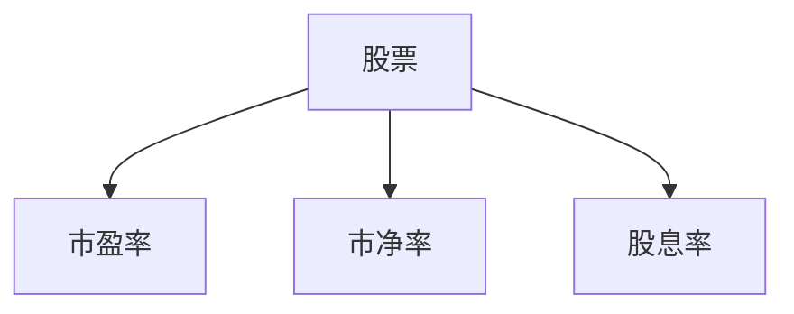
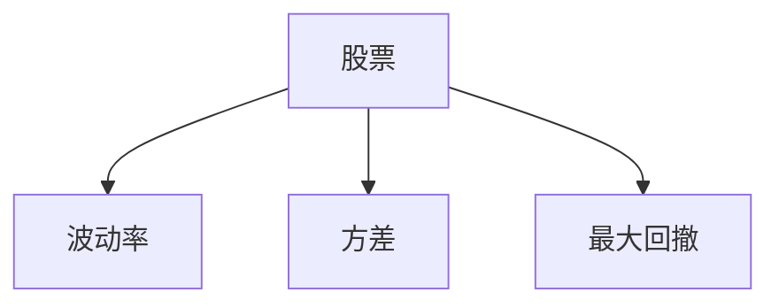
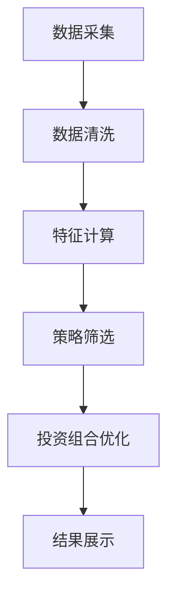
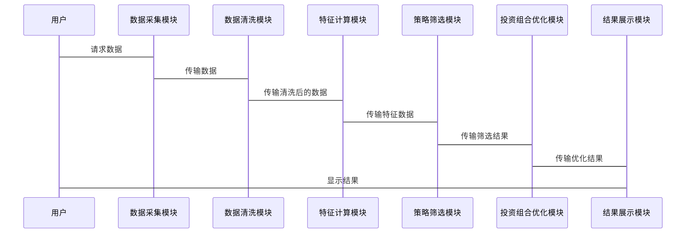

                 


# 如何将特价股票策略与低波动因子投资相结合

## 关键词：特价股票策略，低波动因子投资，量化投资，数学模型，投资组合优化

## 摘要：本文探讨如何将特价股票策略与低波动因子投资相结合，以实现稳定收益。通过分析两者的核心概念，建立数学模型，并结合实际案例，展示了如何通过量化方法优化投资组合。

---

## 第1章: 特价股票策略与低波动因子投资概述

### 1.1 特价股票策略的定义与背景

#### 1.1.1 特价股票的定义
特价股票是指市场价格低于其内在价值的股票，通常被认为是被市场低估的投资机会。

#### 1.1.2 特价股票策略的核心理念
通过识别被低估的股票，投资者可以在市场反转时获得超额收益。

#### 1.1.3 特价股票策略的历史发展
价值投资理论的先驱如本杰明·格雷厄姆为特价股票策略奠定了基础。

---

### 1.2 低波动因子投资的定义与背景

#### 1.2.1 低波动因子的定义
低波动因子投资关注那些波动性较低的股票，通常具有较高的风险调整后收益。

#### 1.2.2 低波动因子投资的理论基础
基于现代投资组合理论，低波动股票往往能提供更稳定的回报。

#### 1.2.3 低波动因子投资的历史发展
低波动因子作为风险溢价的一部分，在投资组合优化中逐渐受到重视。

---

### 1.3 特价股票策略与低波动因子投资的结合意义

#### 1.3.1 结合的必要性
通过结合两种策略，投资者可以在追求超额收益的同时降低整体投资组合的波动性。

#### 1.3.2 结合的优势
- 筛选具有价值的股票，同时降低投资组合的波动性。
- 优化风险与收益的平衡，提高投资组合的稳定性。

#### 1.3.3 结合的潜在风险
- 可能忽略市场中其他高增长机会。
- 在极端市场条件下，策略表现可能不佳。

---

## 第2章: 特价股票策略的核心概念与实现

### 2.1 特价股票的筛选标准

#### 2.1.1 市盈率（P/E）分析
$$ P/E = \frac{\text{股价}}{\text{每股收益}} $$

#### 2.1.2 市净率（P/B）分析
$$ P/B = \frac{\text{股价}}{\text{每股净资产}} $$

#### 2.1.3 股息率分析
$$ 股息率 = \frac{\text{每股股息}}{\text{股价}} \times 100\% $$

#### 2.1.4 其他辅助指标
- 市销率（P/S）
- 负债率
- 净利润增长率

#### 核心概念对比表
| 指标 | 特价股票策略 | 低波动因子投资 |
|------|--------------|----------------|
| P/E  | 关注低值     | 无直接关系     |
| 波动率| 无直接关系   | 关注低值       |

#### 实体关系图


---

### 2.2 特价股票策略的实现步骤

#### 2.2.1 数据收集与清洗
- 数据来源：股票市场数据 API 或数据库。
- 清洗步骤：处理缺失值、异常值。

#### 2.2.2 筛选符合条件的股票
```python
def screen_cheap_stocks(data):
    # 筛选P/E < 15
    pe_filtered = data[data['P/E'] < 15]
    # 筛选P/B < 2
    pb_filtered = pe_filtered[pe_filtered['P/B'] < 2]
    return pb_filtered
```

#### 2.2.3 策略回测与优化
- 使用历史数据进行回测。
- 调整筛选标准以优化收益。

#### 2.2.4 策略实施与监控
- 定期重新筛选股票。
- 监控市场变化，及时调整投资组合。

---

## 第3章: 低波动因子投资的核心概念与实现

### 3.1 低波动因子的定义与计算方法

#### 3.1.1 波动率的定义
$$ 波动率 = \sqrt{\frac{1}{n-1} \sum_{i=1}^{n} (x_i - \bar{x})^2} $$

#### 3.1.2 波动率的计算公式
$$ \text{年化波动率} = \sqrt{252} \times \text{标准差} $$

#### 3.1.3 其他波动性指标
- 方差
- 最大回撤

#### 核心概念对比表
| 指标 | 特价股票策略 | 低波动因子投资 |
|------|--------------|----------------|
| 波动率| 无直接关系   | 关注低值       |
| 方差  | 无直接关系   | 关注低值       |

#### 实体关系图


---

### 3.2 低波动因子投资的实现步骤

#### 3.2.1 数据收集与清洗
- 数据来源：股票市场数据 API 或数据库。
- 清洗步骤：处理缺失值、异常值。

#### 3.2.2 筛选低波动股票
```python
def screen_low_vol_stocks(data):
    # 计算波动率
    data['波动率'] = data['收盘价'].pct_change().std() * np.sqrt(252)
    # 筛选波动率 < 20%
    vol_filtered = data[data['波动率'] < 0.2]
    return vol_filtered
```

#### 3.2.3 投资组合优化
- 使用现代投资组合理论优化投资组合。

#### 3.2.4 投资组合监控
- 定期重新计算波动率。
- 调整投资组合以应对市场变化。

---

## 第4章: 特价股票策略与低波动因子投资的结合

### 4.1 结合策略的设计思路

#### 4.1.1 筛选同时满足特价股票和低波动条件的股票
```python
def combined_strategy(data):
    # 筛选P/E < 15
    pe_filtered = data[data['P/E'] < 15]
    # 筛选P/B < 2
    pb_filtered = pe_filtered[pe_filtered['P/B'] < 2]
    # 筛选波动率 < 20%
    final_filtered = pb_filtered[pb_filtered['波动率'] < 0.2]
    return final_filtered
```

#### 4.1.2 建立投资组合
- 等权重分配资金到筛选出的股票。
- 定期再平衡投资组合。

#### 4.1.3 投资组合的优化
- 调整权重以优化风险调整后收益。
- 使用数学模型优化投资组合。

---

### 4.2 投资组合优化的数学模型

#### 4.2.1 最优化目标函数
$$ \text{最大化} \sum_{i=1}^{n} \text{收益}_i \times w_i - \lambda \sum_{i=1}^{n} (w_i - \mu_i)^2 $$

#### 4.2.2 约束条件
$$ \sum_{i=1}^{n} w_i = 1 $$
$$ w_i \geq 0 $$

#### 4.2.3 数学模型实现
```python
import numpy as np
from scipy.optimize import minimize

def optimize_portfolio(weights, returns, risk_aversion):
    n = len(weights)
    objective = lambda w: (np.dot(returns, w)) - risk_aversion * np.dot(w, np.transpose(w))
    constraints = [{'type': 'eq', 'fun': lambda w: np.sum(w) - 1}]
    result = minimize(objective, weights, constraints=constraints)
    return result.x
```

---

## 第5章: 系统设计与实现

### 5.1 系统功能设计

#### 5.1.1 系统架构


#### 5.1.2 系统接口设计
- 数据接口：获取实时或历史数据。
- 策略接口：执行筛选和优化算法。
- 展示接口：以可视化方式展示结果。

#### 5.1.3 系统交互流程


---

## 第6章: 项目实战

### 6.1 环境安装与配置

```bash
pip install pandas numpy matplotlib scipy
```

### 6.2 核心实现代码

#### 6.2.1 数据获取
```python
import pandas as pd
import numpy as np

# 示例数据
data = pd.DataFrame({
    '股票代码': ['A', 'B', 'C', 'D', 'E'],
    'P/E': [10, 15, 8, 20, 12],
    'P/B': [1.5, 2.0, 1.2, 2.5, 1.8],
    '波动率': [0.15, 0.20, 0.18, 0.25, 0.17]
})
```

#### 6.2.2 策略筛选
```python
def combined_strategy(data):
    # 筛选P/E < 15
    pe_filtered = data[data['P/E'] < 15]
    # 筛选P/B < 2
    pb_filtered = pe_filtered[pe_filtered['P/B'] < 2]
    # 筛选波动率 < 20%
    final_filtered = pb_filtered[pb_filtered['波动率'] < 0.2]
    return final_filtered
```

#### 6.2.3 投资组合优化
```python
def optimize_portfolio(weights, returns, risk_aversion):
    n = len(weights)
    objective = lambda w: -(np.dot(returns, w)) + risk_aversion * np.dot(w, np.transpose(w))
    constraints = [{'type': 'eq', 'fun': lambda w: np.sum(w) - 1}]
    result = minimize(objective, weights, constraints=constraints)
    return result.x
```

#### 6.2.4 结果展示
```python
import matplotlib.pyplot as plt

selected_stocks = combined_strategy(data)
plt.figure(figsize=(10, 6))
plt.scatter(selected_stocks['股票代码'], selected_stocks['P/E'], color='blue')
plt.title('Selected Stocks')
plt.xlabel('Stock Code')
plt.ylabel('P/E Ratio')
plt.show()
```

---

## 第7章: 最佳实践、小结与注意事项

### 7.1 最佳实践

#### 7.1.1 定期再平衡
定期调整投资组合以保持策略的有效性。

#### 7.1.2 风险管理
设置止损点，控制单个股票的权重。

#### 7.1.3 监控市场变化
及时调整策略参数以应对市场变化。

### 7.2 小结

通过将特价股票策略与低波动因子投资相结合，投资者可以在追求超额收益的同时降低投资组合的波动性，实现更稳定的回报。

### 7.3 注意事项

- 策略的有效性可能受市场环境影响。
- 需要定期监控和调整策略参数。
- 数据质量和来源对策略效果至关重要。

---

## 总结

本文详细探讨了如何将特价股票策略与低波动因子投资相结合，通过数学模型和系统设计优化投资组合，实现稳定收益。通过实际案例分析，展示了策略的有效性和可操作性。希望本文能为投资者提供有价值的参考，帮助他们在复杂多变的市场中制定更科学的投资策略。

