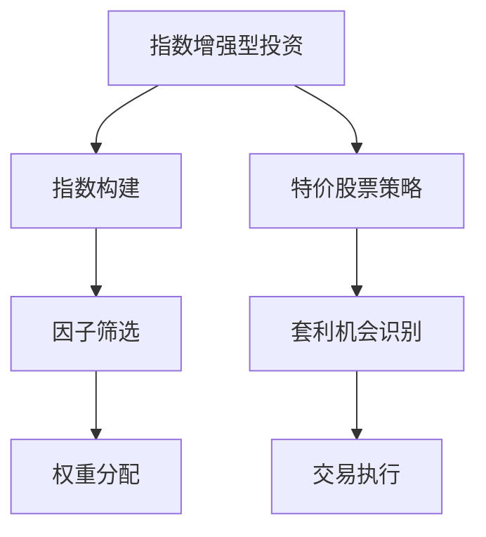
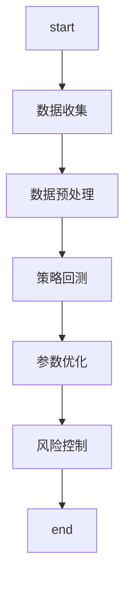

                 


# 如何将特价股票策略融入指数增强型投资

## 关键词：
- 特价股票策略、指数增强型投资、算法交易、套利机会、超额收益

## 摘要：
本文详细探讨了如何将特价股票策略融入指数增强型投资中，通过分析特价股票策略的核心原理和指数增强型投资的数学模型，结合实际案例和代码实现，展示了如何利用特价股票策略提升指数增强型投资的超额收益。文章从背景介绍、核心概念、算法原理、系统架构设计到项目实战，全面解析了两者结合的实现方式，并提供了风险控制和绩效评估的最佳实践。

---

# 第一部分: 特价股票策略与指数增强型投资概述

## 第1章: 特价股票策略与指数增强型投资概述

### 1.1 特价股票策略的定义与特点
#### 1.1.1 特价股票的定义
特价股票策略是一种基于短期价格波动的交易策略，通常利用市场中的套利机会、市场异象或技术分析来捕捉短期收益。其核心在于通过高频交易或事件驱动的方式，在短时间内获利。

#### 1.1.2 特价股票策略的核心特点
| 特点 | 描述 |
|------|------|
| 短期性 | 通常关注短期价格波动，交易周期较短 |
| 套利性 | 利用市场中的价差或异象进行交易 |
| 高频性 | 依赖高频交易技术，快速捕捉机会 |
| 风险性 | 高风险，收益不稳定 |

#### 1.1.3 特价股票策略的分类
- **套利策略**：利用同一资产在不同市场或不同时间的价格差异进行交易。
- **事件驱动策略**：基于公司事件（如并购、重组等）引起的股价波动进行交易。
- **技术分析策略**：通过价格图表和技术指标预测短期价格走势。

### 1.2 指数增强型投资的定义与特点
#### 1.2.1 指数增强型投资的定义
指数增强型投资是一种通过跟踪市场指数并寻求超额收益的投资策略。其核心在于在指数权重的基础上，加入主动管理成分，以获得超越指数的表现。

#### 1.2.2 指数增强型投资的核心特点
| 特点 | 描述 |
|------|------|
| 被动性 | 以指数为基准，减少主动管理的复杂性 |
| 主动性 | 通过主动管理寻求超额收益 |
| 风险可控 | 与指数相关性高，风险相对可控 |
| 成本较低 | 交易成本和管理费用较低 |

#### 1.2.3 指数增强型投资的分类
- **基于因子模型的投资**：利用多个因子（如市值、价值、动量等）构建投资组合。
- **基于机器学习的投资**：利用机器学习算法预测资产收益，优化投资组合。
- **基于统计套利的投资**：通过统计套利方法寻找市场中的定价错误。

### 1.3 特价股票策略与指数增强型投资的结合
#### 1.3.1 两者的结合背景
- 随着市场效率的提高，传统的套利机会减少，但短期价格波动仍存在。
- 指数增强型投资需要通过主动管理寻求超额收益，而特价股票策略提供了短期收益的可能性。

#### 1.3.2 结合的必要性与优势
- **必要性**：指数增强型投资需要不断寻找超额收益的机会，而特价股票策略提供了一种短期收益的来源。
- **优势**：
  - 提升超额收益。
  - 利用短期价格波动降低投资组合的整体风险。
  - 增加投资组合的灵活性。

#### 1.3.3 结合的实现方式
- **短期套利与长期投资结合**：在指数权重的基础上，加入短期套利机会。
- **事件驱动策略与指数增强策略结合**：利用公司事件引发的股价波动，优化投资组合。
- **市场中性策略**：通过市场中性技术，降低市场风险，专注于套利机会。

### 1.4 本章小结
本章介绍了特价股票策略和指数增强型投资的基本概念、特点和分类，分析了两者结合的背景、必要性与优势，并提出了结合的实现方式。

---

# 第二部分: 特价股票策略的核心原理与应用

## 第2章: 特价股票策略的核心原理

### 2.1 特价股票策略的数学模型
#### 2.1.1 市场微观结构分析
市场微观结构分析是理解特价股票策略的基础。它关注市场的买卖双方行为、订单簿、交易成本等微观因素。

#### 2.1.2 市场异象与套利机会
市场异象是指市场定价中的不合理现象，套利机会则是指利用这些异象进行交易获利的可能性。

#### 2.1.3 特价股票策略的数学公式
$$ \text{收益} = \text{买入价} - \text{卖出价} $$

### 2.2 特价股票策略的核心算法
#### 2.2.1 时间序列分析
时间序列分析用于预测未来的价格走势，常用模型包括ARIMA、GARCH等。

#### 2.2.2 均值回归策略
均值回归策略基于价格回归均值的假设，通过买入低估资产、卖出高估资产获利。

#### 2.2.3 动量策略
动量策略基于价格动量效应，即高价资产继续上涨，低价资产继续下跌。

#### 2.2.4 趋势跟踪策略
趋势跟踪策略通过识别价格趋势，顺势交易以获利。

### 2.3 特价股票策略的实现步骤
#### 2.3.1 数据收集与预处理
- 数据来源：股票价格、订单簿、市场深度等。
- 数据清洗：去除异常值、填补缺失值。

#### 2.3.2 策略回测与优化
- 回测：通过历史数据验证策略的有效性。
- 优化：调整参数以最大化收益。

#### 2.3.3 风险控制与收益最大化
- 风险控制：设定止损、止盈点。
- 收益最大化：通过杠杆或组合投资增加收益。

### 2.4 本章小结
本章详细讲解了特价股票策略的核心原理，包括数学模型、算法实现和具体操作步骤。

---

## 第3章: 指数增强型投资的核心原理

### 3.1 指数增强型投资的数学模型
#### 3.1.1 指数构建与权重分配
指数构建是指数增强型投资的基础，通常采用市值加权、等权重等方式。

#### 3.1.2 指数增强的数学公式
$$ \text{超额收益} = \text{实际收益} - \text{指数收益} $$

### 3.2 指数增强型投资的核心算法
#### 3.2.1 基于因子模型的投资策略
因子模型通过多个因子（如市值、价值、动量等）构建投资组合。

#### 3.2.2 基于机器学习的预测模型
机器学习模型（如神经网络、随机森林）用于预测资产收益，优化投资组合。

#### 3.2.3 基于统计套利的投资策略
统计套利策略通过寻找资产间的定价错误，构建对冲组合。

### 3.3 指数增强型投资的实现步骤
#### 3.3.1 数据收集与预处理
- 数据来源：指数成分股、历史收益、因子数据等。
- 数据清洗：去除异常值、填补缺失值。

#### 3.3.2 因子筛选与权重分配
- 因子筛选：选择相关因子，如市值、价值、动量等。
- 权重分配：根据因子得分分配权重。

#### 3.3.3 策略回测与优化
- 回测：通过历史数据验证策略的有效性。
- 优化：调整参数以最大化超额收益。

#### 3.3.4 风险控制与收益最大化
- 风险控制：设定止损、止盈点。
- 收益最大化：通过杠杆或组合投资增加收益。

### 3.4 本章小结
本章详细讲解了指数增强型投资的核心原理，包括数学模型、算法实现和具体操作步骤。

---

## 第4章: 特价股票策略与指数增强型投资的结合

### 4.1 两者的结合背景
#### 4.1.1 市场环境分析
随着市场效率的提高，传统的套利机会减少，但短期价格波动仍存在。

#### 4.1.2 投资者需求分析
投资者希望通过指数增强型投资获得超额收益，而特价股票策略提供了短期收益的可能性。

#### 4.1.3 结合的必要性
指数增强型投资需要不断寻找超额收益的机会，而特价股票策略提供了一种短期收益的来源。

### 4.2 两者的结合方式
#### 4.2.1 短期套利与长期投资的结合
在指数权重的基础上，加入短期套利机会。

#### 4.2.2 事件驱动策略与指数增强策略的结合
利用公司事件引发的股价波动，优化投资组合。

#### 4.2.3 市场中性策略
通过市场中性技术，降低市场风险，专注于套利机会。

### 4.3 结合的具体实现
#### 4.3.1 系统架构设计
使用Mermaid绘制系统架构图，展示如何将特价股票策略融入指数增强型投资。

#### 4.3.2 代码实现
提供Python代码示例，展示如何实现结合策略。

### 4.4 风险控制与绩效评估
#### 4.4.1 风险控制
- 设定止损点。
- 控制仓位大小。

#### 4.4.2 绩效评估
- 计算超额收益。
- 比较不同策略的收益与风险。

### 4.5 本章小结
本章详细讲解了如何将特价股票策略融入指数增强型投资，包括结合方式、实现步骤和风险控制。

---

## 第五部分: 项目实战与总结

## 第5章: 项目实战

### 5.1 环境安装
- 安装Python、Pandas、NumPy、Matplotlib等库。

### 5.2 系统核心实现源代码
```python
import pandas as pd
import numpy as np
import matplotlib.pyplot as plt

# 示例代码：计算特价股票策略的收益
def calculate_profit(prices, buy_signal, sell_signal):
    profit = 0
    for i in range(len(prices)):
        if buy_signal[i]:
            buy_price = prices[i]
        if sell_signal[i]:
            sell_price = prices[i]
            profit += sell_price - buy_price
    return profit

# 示例代码：计算指数增强型投资的超额收益
def calculate_excess_return(index_returns, portfolio_returns):
    excess_return = portfolio_returns - index_returns
    return excess_return.mean()

# 示例代码：结合策略
def combined_strategy(index_data, stock_data):
    # 构建指数增强型投资组合
    index_portfolio = index_data['return'].mean()
    # 加入特价股票策略
    stock_profit = calculate_profit(stock_data['price'], stock_data['buy_signal'], stock_data['sell_signal'])
    # 计算结合策略的超额收益
    excess_return = calculate_excess_return(index_data['return'], index_portfolio + stock_profit)
    return excess_return
```

### 5.3 实际案例分析
#### 5.3.1 案例背景
假设我们有一个包含10只股票的指数，希望通过加入特价股票策略提升超额收益。

#### 5.3.2 数据收集
收集指数成分股的历史价格和相关因子数据。

#### 5.3.3 策略实现
使用Python代码实现结合策略，计算超额收益。

#### 5.3.4 绩效评估
计算策略的年化收益、最大回撤等指标，比较不同策略的绩效。

### 5.4 本章小结
本章通过实际案例展示了如何将特价股票策略融入指数增强型投资，并通过代码实现和绩效评估验证了策略的有效性。

---

## 第六部分: 总结与展望

## 第6章: 总结与展望

### 6.1 总结
本文详细探讨了如何将特价股票策略融入指数增强型投资，通过理论分析和实际案例，展示了如何利用特价股票策略提升指数增强型投资的超额收益。

### 6.2 展望
未来的研究可以进一步探索以下方向：
- 更复杂的套利机会识别算法。
- 更有效的风险控制方法。
- 更多的实证分析和策略优化。

---

## 附录

### 附录A: Python代码实现

```python
# 示例代码：计算特价股票策略的收益
def calculate_profit(prices, buy_signal, sell_signal):
    profit = 0
    position = 0
    for i in range(len(prices)):
        if buy_signal[i]:
            position = 1
        if sell_signal[i]:
            position = 0
            profit += prices[i] - prices[i - 1]
    return profit
```

### 附录B: Mermaid图表

#### 系统架构图


#### 算法流程图


---

通过本文的详细分析和实际案例，读者可以全面理解如何将特价股票策略融入指数增强型投资，并通过代码实现和绩效评估验证策略的有效性。希望本文能为投资领域的专业人士和研究者提供有价值的参考。

